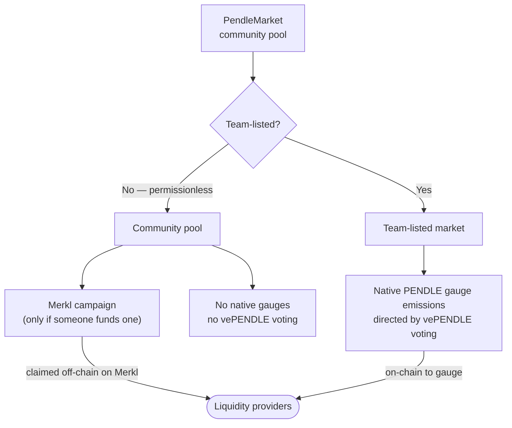
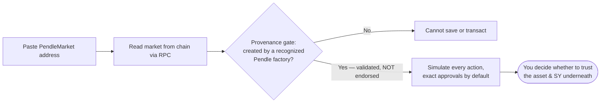

# Community pools & incentives

A **community pool** is a Pendle V2 market that was created permissionlessly — anyone deployed it, without a whitelist, without anyone's approval, and without review by Pendle or by anyone else. These are exactly the markets OpenPendle exists to reach: the ones Pendle's own application does not list. This page explains what "permissionless" really means here, why native PENDLE incentives are off the table for these pools and what replaces them, how OpenPendle treats a community pool it loads, and the risk that runs underneath all of it.

If you have not yet seen how a Pendle market is assembled from a [Standardized Yield (SY)](/concepts/standardized-yield) wrapper, a [Principal Token (PT)](/concepts/principal-tokens), and a [Yield Token (YT)](/concepts/yield-tokens), read [How Pendle works](/concepts/how-pendle-works) first; this page assumes that vocabulary.

## What "permissionless" actually means

Pendle V2 is a permissionless protocol. The contracts that create markets — Pendle's factories and its `PendleCommonPoolDeployHelperV2` at `0x2Ed473F528E5B320f850d17ADfe0e558f0298aA9` — do not ask who is calling or what they are wrapping. Anyone with a wallet and the seed capital can deploy a new market in a single transaction. That openness is the whole point of Pendle's design, and it produces two very different populations of markets.

| | Team-listed markets | Community (permissionless) pools |
| --- | --- | --- |
| Who created it | Curated and deployed by the Pendle team | Anyone, without asking |
| Whitelist / approval | Yes — a gated listing process | None — no whitelist, no approval |
| Reviewed by anyone | Vetted by the Pendle team before listing | **Unreviewed by anyone**, including Pendle |
| Appears in Pendle's official app | Yes | No |
| Native PENDLE gauge emissions | Eligible | **Not eligible** |
| vePENDLE voting | Eligible | **Not eligible** |
| Extra incentives | Native gauges (and possibly Merkl) | **[Merkl](https://merkl.angle.money/) campaigns only, if any** |
| How you reach it | Pendle's app, or OpenPendle by address | **OpenPendle, by pasting the market address** |

Every community pool is still a genuine `PendleMarket` contract with the same on-chain mechanics as any other — it splits an SY into PT and YT, runs the same [AMM](/concepts/liquidity-and-amm), and resolves at a fixed [maturity](/concepts/maturity). What it lacks is any gatekeeping. No one checked the asset. No one checked the SY. No one checked the person who deployed it. "Permissionless" is a statement about access, not about safety — and the two are easy to confuse.

::: info The one-sentence version
A community pool is a permissionlessly-created Pendle market — no whitelist, no approval, and unreviewed by anyone — that OpenPendle can load by address but does not, and cannot, endorse.
:::

## Why community pools cannot use native PENDLE incentives

On Pendle, the headline reward on a listed market is usually **native PENDLE emissions**, directed by **vePENDLE** governance. Understanding why those are unavailable to community pools explains why Merkl exists in the first place.

- **PENDLE** is Pendle's protocol token. **vePENDLE** is the vote-escrowed form you get by locking PENDLE; it grants governance weight, a share of protocol revenue, and — most relevantly here — the right to vote on **gauges**.
- A **gauge** is the mechanism that routes native PENDLE emissions to a specific market's liquidity providers. vePENDLE holders vote each period on how the emission budget is split across gauges, and LPs in a gauge-weighted market earn PENDLE on top of their swap fees.

These native incentives — gauge emissions and vePENDLE voting alike — are **reserved for team-listed markets**. A community pool is not part of that emission system: it has no gauge, it cannot be voted on, and its LPs earn **no native PENDLE** for providing liquidity. This is a deliberate boundary, not a bug. Because anyone can spin up an unreviewed market, letting all of them draw on a shared, governance-directed emission budget would be untenable — so that budget stays with the curated set, and community pools are left to source any extra rewards elsewhere.

"Elsewhere" is Merkl.

## Merkl: how community pools get extra rewards

**[Merkl](https://merkl.angle.money/)** is a third-party incentive-distribution platform. Instead of on-chain gauge emissions decided by governance, Merkl lets *anyone* — a pool's creator, the protocol behind the underlying asset, or an unrelated third party — fund a **campaign** that pays rewards to the addresses providing liquidity or holding eligible positions in a specific market. Distribution is computed off-chain from on-chain activity, and eligible users **claim** their accrued rewards through Merkl's distributor, using OpenPendle's **My positions** page or Merkl's interface.

The mechanics that matter for anyone weighing a community pool:

- **Opt-in and external.** A community pool has a Merkl campaign only if someone chose to fund one. Many community pools have **none**, and there is nothing wrong with a pool that has no incentives — it simply earns swap fees.
- **Not guaranteed and not permanent.** A Merkl campaign is funded for a period and can be topped up, changed, or allowed to lapse at any time. Rewards you see today may not be there next week. Treat Merkl APR as a variable bonus, never as a fixed part of the return.
- **Claimed separately.** Merkl rewards accrue off-chain and are claimed through Merkl's distributor on a schedule Merkl sets — they do not arrive automatically as you trade. OpenPendle can build the direct claim transaction, but never holds or distributes the rewards itself.
- **An SY-level hook exists but is optional.** Some Pendle SY templates can be given an **off-chain reward manager** at deploy time, which enables a `claimOffchainRewards` path for Merkl-style distributions to flow through the SY. Passing `address(0)` for that manager at creation simply disables that path — the SY still functions, it just does not carry the off-chain reward hook. Whether a given community pool's SY has this wired up is a per-market detail to verify, not assume. See [Creating an SY](/create/standardized-yield).

The distinction from native incentives is worth stating plainly: native PENDLE gauge emissions are an *on-chain, governance-directed* reward available only to listed markets, while Merkl is an *off-chain, permissionlessly-funded* reward that is the only extra-incentive route open to a community pool.

::: info Example — the two reward paths (illustrative)
Imagine a listed market whose LPs earn swap fees **plus** a native PENDLE emission of, say, an illustrative 6% APR set by that period's gauge vote. Now imagine a community pool wrapping a similar asset: its LPs earn the same kind of swap fees, but **zero native PENDLE**. If a third party has funded a Merkl campaign on it, they might also earn an illustrative 3% in Merkl rewards, claimed later on Merkl — and if no one funded a campaign, they earn swap fees alone. These percentages are invented to show the *shape* of the difference; they are not live, quoted, or guaranteed figures for any real pool.
:::

## How OpenPendle treats a community pool

OpenPendle is a free, open-source, backend-free interface built specifically to reach these permissionless markets. It is **not affiliated with, endorsed by, or operated by Pendle Finance**, ships no smart contracts of its own, and takes no fee of its own. How it handles a community pool comes down to three commitments.

### It loads any market by address

There is no whitelist on OpenPendle either. You reach a community pool by pasting its **`PendleMarket` contract address** — not the PT, YT, or SY address — into the app, and OpenPendle reads that market straight from the chain through a public RPC. Nothing is curated or filtered by OpenPendle: if a market exists on one of the six supported networks, you can point the interface at it. See [Opening a pool](/guides/opening-a-pool) and [Anatomy of a pool](/concepts/pool-anatomy) for which address to use.

### It provenance-gates, but does not endorse

Before OpenPendle lets you **save** a market or **transact** against it, it runs a **provenance gate**: it verifies that the market was created by a **Pendle factory it recognizes**. Because Pendle's factories are governance-mutable, the *active* factory is resolved live at runtime; the hardcoded factory set is used only for this provenance validation. The check confirms the market genuinely descends from Pendle's deployment machinery — that it is a real Pendle market and not an impostor contract wearing a Pendle market's shape.

That is the entire scope of the check. **Provenance is validation, not endorsement.** It answers "did this come from a Pendle factory?" — never "is this asset safe?", "is this SY honest?", or "is the person who deployed this trustworthy?" A market can pass the provenance gate cleanly and still be built on a malicious, broken, or exotic asset. OpenPendle vouches for *where a market came from*, and for nothing underneath it.

### It defends the transaction, not the asset

The safeguards OpenPendle does provide protect the mechanics of interacting, not the quality of what you are interacting with:

- **Simulate-before-sign.** Every transaction is simulated against the live chain before you sign it, so a call that would revert is caught first.
- **Exact approvals by default.** Token approvals default to the amount an action needs. Unlimited mode is an explicit settings opt-in that leaves a standing allowance and increases exposure.
- **A strict interface surface.** Injected-wallet-only (no WalletConnect or third-party relay), a Content-Security-Policy that blocks JavaScript `eval()`, and self-hosted fonts. Core reads go to the RPC you point at; ancillary ticker, token-resolution, and Merkl calls are listed explicitly in [Architecture](/reference/architecture).

None of these make an unreviewed asset safe. They make the *act of transacting* honest and legible. The gap between "this transaction will do what the interface says" and "this asset is worth interacting with" is exactly where a community pool's risk lives — and only you can close it.

## The risk, stated plainly

::: danger Community pools are unreviewed — you can lose funds
Community pools are permissionless and unreviewed — **anyone can create one, and interacting with them can lose you funds.** OpenPendle validates market provenance but **cannot vouch for the assets or SY contracts underneath.** A factory-valid market can wrap an [SY](/concepts/standardized-yield) that is upgradeable, points at an unknown adapter, or is owned by a stranger — and if the asset beneath it is malicious, broken, or simply fails, the [PT](/concepts/principal-tokens) may **not** redeem at par and an [LP](/concepts/liquidity-and-amm) position can lose value. There is no gauge, no vePENDLE backing, and no guaranteed Merkl reward to cushion that. **Never interact with a community pool unless you trust whoever created it and everything beneath it — the asset, the SY, its adapter, and its owner.** Experimental — use at your own risk. Not affiliated with Pendle Finance.
:::

The [SY page](/concepts/standardized-yield) covers where this risk concentrates in detail — upgradeability, adapters, and the owner — because almost every way a community pool can harm you traces back to the SY and the asset it wraps. Before you transact, inspect those directly; the provenance gate has not, and will not, do it for you. The [Risks & disclosures](/reference/risks) reference collects the full surface in one place.

## Community pools at a glance

| Question | Answer |
| --- | --- |
| Who can create one? | Anyone — no whitelist, no approval, unreviewed by anyone. |
| Is it a real Pendle market? | Yes — the same `PendleMarket` mechanics as a listed market. |
| Does it earn native PENDLE? | No. Gauge emissions and vePENDLE voting are reserved for team-listed markets. |
| How does it get extra rewards? | [Merkl](https://merkl.angle.money/) campaigns only — if someone chooses to fund one. Many have none. |
| How does OpenPendle reach it? | You paste the `PendleMarket` address; it is read from the chain. |
| Does OpenPendle vet it? | No. It validates provenance (came from a Pendle factory) — that is not endorsement. |
| Where is the risk? | In the unreviewed asset and SY underneath — never in the provenance check. |

## See also

- [How Pendle works](/concepts/how-pendle-works) — the PT / YT / SY / market picture these pools are built from.
- [Standardized Yield (SY)](/concepts/standardized-yield) — where a community pool's real risk lives, in depth.
- [Anatomy of a pool](/concepts/pool-anatomy) — the market, PT, YT, and SY addresses, and which one you paste.
- [Liquidity & the AMM](/concepts/liquidity-and-amm) — what an LP position in one of these pools earns and risks.
- [Deploying a market](/create/deploying-a-market) and [Incentives](/create/incentives) — creating a community pool and funding rewards on it.
- [Risks & disclosures](/reference/risks) — read this before you transact.
- [Merkl](https://merkl.angle.money/) — the external platform community pools use for incentives.
