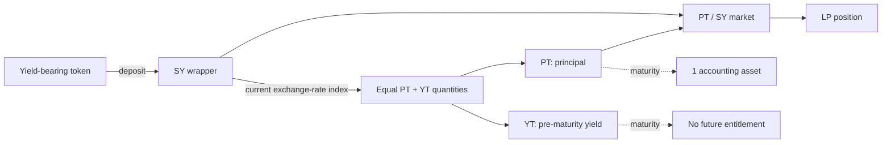

# How Pendle works

Pendle separates a yield-bearing position into two tradeable claims: one on principal and one on yield until a fixed maturity. OpenPendle is an independent frontend to those contracts; it does not change their mechanics.

## The terms that matter

- **Yield-bearing token** — the token held or managed by an SY, such as a staking token, lending receipt, or vault share.
- **Accounting asset** — the unit in which principal is measured. At maturity, one PT redeems for one unit of this asset, often delivered as an amount of the yield-bearing token through the SY.
- **SY (Standardized Yield)** — the EIP-5115 wrapper that exposes a common deposit, redemption, exchange-rate, and reward interface.
- **PT (Principal Token)** — the fixed principal claim, denominated in the accounting asset.
- **YT (Yield Token)** — the pre-maturity claim on yield and rewards attributable to that principal, net of Pendle's protocol fees.
- **Market** — the PT/SY automated market maker for one maturity.

The accounting-asset distinction is important. For an interest-bearing token such as a vault share, one PT may redeem for **one accounting asset worth** of shares, not one whole share. Pendle's [PT documentation](https://docs.pendle.finance/pendle-v2/ProtocolMechanics/YieldTokenization/PT) gives asset-specific examples.

## The full flow

## Stage 1: standardize the yield source

Yield-bearing tokens expose different deposit, redemption, and accounting systems. Pendle wraps each supported source in an **SY**, which reports:

- accepted deposit and redemption tokens;
- an exchange rate into its accounting asset;
- any reward tokens and claim logic;
- a standard interface for Pendle's downstream contracts.

One SY is not necessarily worth one accounting asset, and its raw token amount is not generally equal to one PT plus one YT. The current exchange-rate index converts SY value into equal PT and YT quantities. See [Standardized Yield](/concepts/standardized-yield) and Pendle's [yield-tokenization documentation](https://docs.pendle.finance/pendle-v2-dev/Contracts/YieldTokenization).

## Stage 2: split principal from yield

Before maturity, a quantity of SY can mint **equal quantities of PT and YT** determined by the current index. Holding the same PT and YT amount lets you recombine them into SY before maturity.

- **PT** gives up variable yield in exchange for a known accounting-asset payoff at maturity.
- **YT** receives the associated yield and rewards until maturity, less protocol fees.

Pendle's current fee documentation describes a 5% fee on YT yield and points. Treat the deployed contracts and current [Fees documentation](https://docs.pendle.finance/pendle-v2/ProtocolMechanics/Mechanisms/Fees) as authoritative because protocol rules can change.

## Stage 3: trade PT and YT

Each Pendle market holds **PT and SY** reserves. The curve is designed for PT's time-dependent relationship to par rather than for two unrelated spot assets.

- Buying PT below its maturity value creates a fixed accounting-asset return when held to maturity.
- Buying YT gives leveraged exposure to realized yield because the YT costs less than the full principal it references.
- YT trades are routed through the PT/SY market even though YT is not a standing reserve.
- LP tokens represent a pro-rata share of the market's current PT and SY reserves.

The pool's reserve mix changes with trades; it does not automatically turn into PT merely because time passes. See [Liquidity & the AMM](/concepts/liquidity-and-amm).

## Stage 4: settle at maturity

At maturity:

- **PT** becomes redeemable for one accounting-asset unit per token through the market's supported output path.
- **YT** has no remaining future-yield entitlement, though already-accrued unclaimed amounts can still be claimable.
- **Swaps and new liquidity stop.** PT redemption and LP removal remain available.

Maturity does not make the accounting asset, yield-bearing token, or SY risk-free. If the underlying protocol or exchange rate fails, the economic value of redemption can be impaired. See [Maturity & redemption](/concepts/maturity).

## Fixed yield versus long yield

| | PT | YT |
| --- | --- | --- |
| Claim | Principal in accounting-asset units | Yield and rewards until maturity, net of fees |
| Position | Fixed yield when held to maturity | Long realized yield |
| Primary risk | Asset/SY failure and early-exit price | Yield underperformance, fees, and terminal value of zero |
| At maturity | Redeemable at par in accounting-asset terms | No future value; claim accrued amounts |

The market's **implied APY** annualizes PT's current discount to its maturity value. For PT, it is the rate locked at execution if the position is held to maturity and redemption works. For YT, it is a useful hurdle rate, but realized profitability also depends on fees, rewards, entry price, timing, and exit price.

## Three different rates

Pendle interfaces often show several rates that answer different questions:

- **Underlying APY** estimates what the yield-bearing source is currently earning.
- **Implied APY** is derived from PT's current price and time to maturity.
- **Long-yield APY** estimates a YT outcome under assumptions about future underlying yield, rewards, fees, and price.

Only the PT execution-time implied APY describes a fixed maturity return, and only in accounting-asset terms under successful settlement. Underlying and long-yield APYs remain variable estimates.

## Price relationships

PT and YT are complementary economic claims on the same accounting-asset principal. In a frictionless abstraction:

$$
\text{PT value} + \text{YT value} \approx \text{accounting-asset value}
$$

The approximation is affected by swap fees, YT protocol fees, rewards and points, liquidity, routing, and the exact time at which values are measured. It should not be confused with raw token quantities: the SY exchange-rate index determines how much matching PT and YT an SY amount mints.

The AMM records its current implied-rate state. OpenPendle uses that live state for headline implied APY and obtains action-specific quotes for the requested size. Pendle's TWAP oracle serves a different purpose: time-weighted valuation for external integrations.

## Simple example

Suppose one PT represents one USDC of accounting-asset principal at maturity and trades one year before maturity for 0.95 USDC.

- Buying one PT costs 0.95 USDC.
- Successful maturity redemption returns one accounting-asset unit.
- The period return is `1 / 0.95 - 1 ≈ 5.3%` before gas or conversion costs.

The matching YT represents the yield and rewards associated with that principal until maturity. Its result is the net value collected plus any sale proceeds, minus its purchase cost. The convenient intuition that PT price plus YT price equals the accounting-asset value is an economic parity before fees and trading frictions; it is not the statement that one raw SY token always mints one PT and one YT.

If the same accounting asset were represented by an appreciating share token, the redemption output could be fewer than one whole share. The relevant promise would still be one accounting-asset unit, delivered through that share at its live conversion rate.

## Where OpenPendle fits

OpenPendle discovers both Pendle-listed and Community markets, validates factory provenance, displays market state, and prepares supported actions. It does not review the asset or SY. Its Looping directory can model many PT/Morpho pairs, while execution is restricted to exact reviewed and currently enabled markets.

::: warning Verify the asset behind the rate
A fixed number in an unsafe accounting asset is still unsafe. Before acting, inspect the market trust panel and read [Community pools](/concepts/community-pools) and [Risks & disclosures](/reference/risks).
:::

## Next

- [Principal Tokens](/concepts/principal-tokens)
- [Yield Tokens](/concepts/yield-tokens)
- [Standardized Yield](/concepts/standardized-yield)
- [Anatomy of a pool](/concepts/pool-anatomy)
