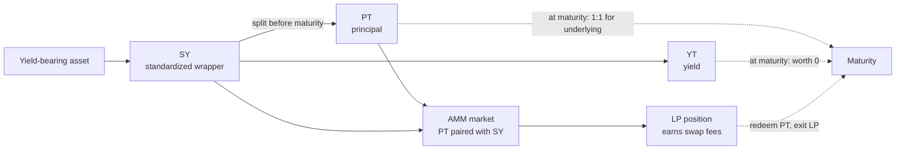

# How Pendle works

This page is a first-principles primer. It assumes no prior knowledge of Pendle and defines each term the first time it appears. If you have used Pendle before, you can skip ahead to any of the deeper concept pages linked throughout, or jump straight to [browsing a pool](/guides/opening-a-pool).

OpenPendle is a frontend for Pendle V2. It does not change how Pendle works — it reads the same on-chain contracts everyone else uses. So to use OpenPendle well, it helps to understand the protocol underneath. That is what this page covers.

::: info Not affiliated with Pendle
OpenPendle is an independent, open-source interface. It is not affiliated with, endorsed by, or operated by Pendle Finance. This page describes Pendle V2's public, on-chain mechanics.
:::

## The one-sentence version

Pendle takes an asset that earns yield, and splits it into two separate tokens — one representing the **principal** and one representing the **future yield** — so each can be priced, traded, and held independently until a fixed end date.

Everything below is an unpacking of that sentence.

## Why split yield from principal?

Start with a **yield-bearing asset**: any token whose balance or value grows over time because something underneath it is earning a return. Common examples are a liquid-staking token, a lending-market deposit receipt, or a vault share. Holding one such token bundles two very different things together:

- the **principal** — the value you put in, which you expect to keep, and
- the **yield** — the variable, uncertain return that accrues on top over time.

Bundled together, you cannot act on them separately. You cannot lock in a known return without also keeping full exposure to a fluctuating rate, and you cannot take a pure view on the rate without also tying up the principal.

Pendle separates the two. Once they are separate tokens, a market can price each one on its own — and that single move is what makes fixed yield, leveraged yield exposure, and a yield-trading market all possible from the same starting asset.

## The full flow, end to end

Here is the whole lifecycle in one picture: a yield-bearing asset is standardized, split, traded and pooled, and finally resolved at a fixed **maturity** date.

The rest of this page walks through each stage of that diagram in order.

## Stage 1 — SY: one standard wrapper

Yield-bearing assets come in many shapes. Some rebase, some accrue value in an exchange rate, some pay separate reward tokens, and each exposes a different set of functions. Pendle does not want to special-case every one of them, so the first step is to wrap the asset in a uniform interface.

That wrapper is **SY (Standardized Yield)**, defined by the [EIP-5115](https://eips.ethereum.org/EIPS/eip-5115) token standard. SY is a common interface over many different yield sources: every downstream contract — the split, the market, the pricing oracle — talks to SY and does not need to know the specifics of the asset inside.

You rarely interact with SY directly. It is plumbing. But it is the foundation everything else is built on, so it has its own page.

→ [Standardized Yield (SY)](/concepts/standardized-yield)

## Stage 2 — PT and YT: principal and yield, split apart

Every Pendle market has a fixed **maturity** — a date, set when the market is created, at which the position resolves. At any time *before* maturity, SY can be split into two tokens:

- **PT (Principal Token)** represents the principal. It redeems **1:1 for the underlying at maturity**. Before maturity it trades at a discount to that redemption value, and buying it below par and holding to maturity locks in a **fixed yield** — a known return, fixed at the moment you buy.
- **YT (Yield Token)** represents the yield. It holds the right to *all* the yield the underlying accrues, from now until maturity. It is a variable, long-yield position: its value tracks how much yield actually accrues, and because all of that yield has been paid out by the end, **YT trends to zero at maturity**.

The two are two halves of the same whole. Splitting is reversible and exact:

- **Mint:** `SY → PT + YT`. One unit of SY produces matching amounts of PT and YT.
- **Redeem:** `PT + YT → SY`. Holding both halves, you can recombine them back into SY.

Both directions work **1:1 at any time before maturity**. You are never locked in by the split itself — only by the individual leg you choose to hold.

→ [Principal Tokens (PT)](/concepts/principal-tokens) · [Yield Tokens (YT)](/concepts/yield-tokens)

## Stage 3 — the AMM: a market for PT

Splitting produces the tokens; a market lets people trade them. Each Pendle market has a built-in **AMM** (automated market maker) that **pairs PT with SY**. The curve is concentrated near the path PT takes toward par as maturity approaches, which keeps liquidity capital-efficient for this specific kind of price behaviour.

That single PT ↔ SY market is enough to give both legs a price:

- To take a **fixed-yield** position, you buy PT (paying with SY or the underlying) below par.
- To take a **long-yield** position, you buy YT. YT trades against the same pool via Pendle's router, which routes the trade through the PT/SY market.

Anyone can also become a **liquidity provider (LP)** by depositing into the market. LPs earn a share of the **swap fees** paid by traders, plus any external incentives running on the pool. In return they carry AMM risk — including impermanent loss — and exposure to PT's price relative to SY.

→ [Liquidity &amp; the AMM](/concepts/liquidity-and-amm)

## Stage 4 — maturity: everything resolves

Maturity is the date the whole structure was built around. When a market reaches it:

- **PT** becomes redeemable **1:1 for the underlying**. The discount you may have bought it at has now closed — that closing *is* the fixed yield.
- **YT** stops accruing and is worth nothing further. All the yield it was entitled to has already been paid out over the term.
- The **market stops trading**. There is no more price discovery once the outcome is fixed.

Maturity does not force you to act at the exact moment it arrives. Afterward you can still redeem PT for the underlying and exit an LP position — those actions remain available through OpenPendle after the date has passed.

→ [Maturity &amp; redemption](/concepts/maturity)

## Two ways to take a position

Once principal and yield are separate tokens, two opposite views on the same asset become available. This is the core distinction to internalize.

| | Fixed yield | Long yield |
| --- | --- | --- |
| **You hold** | PT | YT |
| **Your view** | "I want a known return, locked in now" | "I think yield will run higher than the market expects" |
| **How it pays** | Buy PT below par; it converges to par by maturity | Collect the actual yield the underlying accrues until maturity |
| **At maturity** | PT redeems 1:1 for the underlying | YT has paid out its yield and is worth 0 |
| **Rate risk** | None after purchase — the return is fixed | Full — you keep variable-rate exposure |

The price that ties these together is the market's **implied APY**: the fixed yield implied by the current PT price. A higher implied APY means PT is cheaper relative to par (better for a fixed-yield buyer); it is also the bar that realized yield must clear for a YT position to come out ahead.

::: tip Fixed vs. long, in one line
Buy **PT** to *remove* rate uncertainty (fix your yield). Buy **YT** to *take on* rate uncertainty (bet yield runs hot). They are the two halves of the same split.
:::

## A worked example

::: info Example — illustrative numbers only
The figures below are made up to build intuition. They are not live quotes and not a prediction of any real market's return.

Suppose a market wraps a yield-bearing asset worth **1.00** unit of its underlying, with maturity **one year** away.

**The fixed-yield path (PT).** PT trades at a discount to par — say **0.95**. You buy 1 PT for 0.95. At maturity PT redeems 1:1 for the underlying, so you receive **1.00**. Your return is `1.00 / 0.95 − 1 ≈ 5.3%`, locked in the moment you bought, regardless of what the underlying's yield rate did over the year. That implied fixed rate is roughly the market's **implied APY**.

**The long-yield path (YT).** The other half of the split, YT, costs the remainder — about **0.05** — and entitles you to every bit of yield the underlying accrues for the year. If realized yield comes in *above* the ~5.3% the market implied, YT can return more than that 0.05 cost. If yield comes in *below* it, YT returns less, and it is worth **0** at maturity once all yield has been paid out.

The two prices add up: `PT (0.95) + YT (0.05) = 1.00`, the value of the SY they were split from. That is the same `PT + YT → SY` relationship from Stage 2, seen through prices.
:::

## Where OpenPendle fits

OpenPendle is a way to *use* the flow above on **community pools** — Pendle V2 markets that were created permissionlessly and that Pendle's own app does not list. On any such market you can mint and redeem, buy PT or YT, and add or remove liquidity, all before maturity; and redeem PT for the underlying at or after maturity.

::: warning Community pools are unreviewed
A community pool is a permissionlessly-created market — no whitelist, no approval, and unreviewed by anyone. OpenPendle checks that a market was created by a Pendle factory it recognizes (validation of *provenance*), but it **cannot vouch for the asset or the SY contract underneath**. A factory-valid market can still wrap a broken, exotic, or malicious asset.

Community pools are permissionless and unreviewed — anyone can create one, and interacting with them can lose you funds. Experimental — use at your own risk.
:::

→ [Community pools &amp; incentives](/concepts/community-pools) · [Risks &amp; disclosures](/reference/risks)

## Next

- [Standardized Yield (SY)](/concepts/standardized-yield) — the uniform wrapper (Stage 1), in depth.
- [Principal Tokens (PT)](/concepts/principal-tokens) — how fixed yield is priced and locked in.
- [Yield Tokens (YT)](/concepts/yield-tokens) — the long-yield leg and how it decays to zero.
- [Liquidity &amp; the AMM](/concepts/liquidity-and-amm) — the PT/SY market and what LPs earn and risk.
- [Maturity &amp; redemption](/concepts/maturity) — what happens at the end, step by step.
- [Anatomy of a pool](/concepts/pool-anatomy) — the market, PT, YT, and SY addresses that make up one pool.
