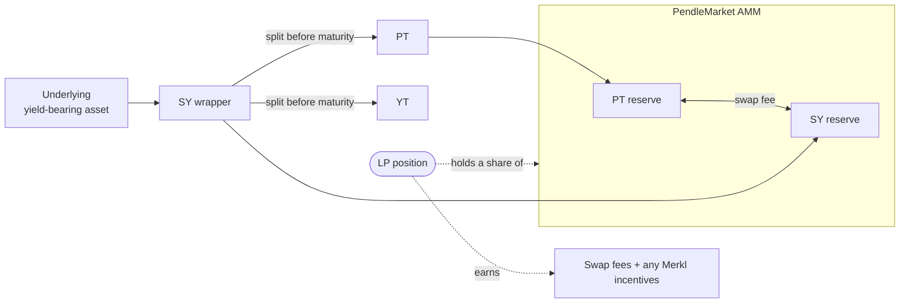

# Liquidity & the AMM

Every Pendle market has an automated market maker (AMM) — an on-chain pool that lets people swap in and out of the [Principal Token (PT)](/concepts/principal-tokens) without needing a matching counterparty. This page explains what that pool contains, how its design keeps capital efficient, what a liquidity-provider (LP) position holds and earns, and the specific risks — time decay, impermanent loss, and PT-vs-underlying exposure — of holding one.

If you have not yet met PT, [Standardized Yield (SY)](/concepts/standardized-yield), or the [Yield Token (YT)](/concepts/yield-tokens), read those pages first; this one assumes them.

## What the pool pairs

An AMM is a smart contract holding a reserve of two assets and quoting a price to swap between them from those reserves — no order book, no counterparty to find. Pendle's AMM pairs exactly two tokens:

- **PT** — the principal half of the market, which redeems 1:1 for the underlying asset at maturity.
- **SY** — the [Standardized Yield](/concepts/standardized-yield) wrapper of the same underlying yield-bearing asset. SY is the numéraire of the pool: prices, fees, and balances are all denominated in it.

The pool does **not** hold YT. YT trades against SY through the same market contract by a mint-and-sell / buy-and-redeem routing (the [Router](/reference/networks-and-contracts) mints PT+YT from SY, then sells the PT into the pool, and the reverse), but the standing liquidity reserve is PT and SY only. That is the pair an LP deposits into and the pair they get back.

::: info Which address is the pool?
A "pool" or "market" is the on-chain `PendleMarket` contract. Its address — **not** the PT, YT, or SY address — is what you paste into OpenPendle to load a market. See [Anatomy of a pool](/concepts/pool-anatomy).
:::

## Concentrated around the PT-to-par curve

A generic constant-product AMM (the `x * y = k` design used by a plain Uniswap V2 pool) spreads liquidity across every price from zero to infinity. That is wasteful here, because a PT's price is *bounded and predictable*: it trades below par and converges to par (1:1 with the underlying) as maturity approaches. It will never be worth two underlying, and — absent default — it will not fall to nothing.

Pendle's AMM exploits that. It concentrates the reserves in the narrow price band where a PT actually trades and follows a curve tuned to the way PT approaches par over time. The result is **capital efficiency**: far more of the deposited value sits at usable prices, so the same liquidity produces deeper markets and tighter quotes than a naive constant-product pool would. The curve also shifts as the market ages, tracking par as maturity nears.

One consequence matters for LPs: because the pool is built around PT-near-par, swaps stay low-slippage as long as the market's [implied APY](/concepts/how-pendle-works) — the fixed yield implied by the current PT price — moves gradually. Large, fast repricings still move the pool.

## What an LP position holds

When you add liquidity you deposit into the pool and receive **LP tokens** representing your pro-rata share of it. Your LP tokens are a claim on the pool's *current* PT-and-SY reserves — not on a fixed basket of what you put in. As people trade, the mix shifts:

| Market phase | Reserve drifts toward | Because |
| --- | --- | --- |
| Early (well before maturity) | more balanced PT / SY | PT trades at a discount; both sides see flow |
| Approaching maturity | more PT | PT converges to par, so the pool holds more of it as SY is swapped out |
| At maturity | effectively all PT | PT now equals the underlying 1:1 |

So an LP is always holding a blend of PT and SY that moves over the market's life. Redeeming your LP tokens returns whatever the pool's reserves are at that moment — split between PT and SY (see [Exiting](#exiting-at-or-after-maturity) below).

## What an LP position earns

An LP position has two possible income streams:

1. **Swap fees.** Every swap through the market pays a fee, denominated in SY. Pendle takes a **reserve cut** of that fee — the market's `reserveFeePercent`, currently **80%** — to the Pendle treasury, and the **remaining ~20% accrues to LPs pro-rata**. The fee itself is set by Pendle's protocol parameters (subject to Pendle's swap-fee cap) and enforced by Pendle's contracts — OpenPendle adds no fee of its own. LP fee income scales with trading volume, so it is uneven: busy repricings earn more than quiet stretches.
2. **Merkl incentives (if any).** Community pools are **not** eligible for native PENDLE gauge emissions or vePENDLE voting — those are reserved for Pendle-team-listed markets. Any extra rewards on a community pool instead come from a [Merkl](https://merkl.angle.money/) campaign that a pool's creator or a third party chooses to fund. Merkl rewards are claimed separately (typically on Merkl's own interface), are not guaranteed, and can stop at any time. Many community pools have none. See [Community pools & incentives](/concepts/community-pools).

There is also a passive tailwind that is easy to miss: the SY sitting in the pool is a *yield-bearing* wrapper, and the PT accretes toward par as time passes. Both effects lift the underlying value of the reserves an LP is holding, independent of trading fees.

::: warning Fee income is not the whole return
An LP's realized return is fees **plus** any Merkl rewards **plus** the change in the underlying value of the PT/SY reserves you end up holding — and that last term can be negative. Fee APR quoted anywhere is one component, not a promise of total return. Always reason about the full position, not the fee line alone.
:::

## Time-decay behavior

A Pendle LP position is intrinsically *time-aware*, which distinguishes it from an LP position in a constant-product pool that has no expiry.

- **The pool's composition trends toward PT.** As shown above, as the market ages the reserve shifts to hold proportionally more PT, because PT is converging to par and SY is the side being traded out.
- **The pricing curve tracks par.** The AMM's curve is time-dependent and re-centres on par as maturity approaches, which is why quotes for a given implied APY stay tight late in a market's life.
- **The yield component decays elsewhere.** YT — not held by the pool — trends to zero at maturity. That is the mirror image of PT accreting to par, and it is why the LP's PT-heavy end state still equals the underlying value it represents.

Net effect: a Pendle LP position held to maturity tends to *converge* rather than diverge. This is the opposite of the classic "impermanent loss grows without bound" intuition, and it is central to why the pair is chosen the way it is.

## Impermanent loss for a PT / SY pair

**Impermanent loss (IL)** is the shortfall an LP suffers versus simply holding the two deposited assets, caused by the AMM rebalancing the reserves as prices move. It is "impermanent" because it can shrink or vanish if prices return to where you entered — and becomes permanent the moment you withdraw.

For a PT/SY pool the IL profile is unusually benign, for two structural reasons:

- **PT and SY track the same underlying.** They are two views of one asset — its principal and its wrapped-yield form — not two independent tokens. Their prices move together far more than, say, ETH and a stablecoin do, so the divergence that drives IL is comparatively small.
- **The divergence is bounded and mean-reverting toward maturity.** PT's price is pinned to par at maturity. Any gap between PT and its par value closes as the market ages, which pulls an LP's position back toward its principal value rather than away from it.

That does **not** make IL zero. If the market's implied APY swings sharply — a fast repricing of PT — the pool rebalances and an LP who exits mid-swing can realize a loss versus having simply held their original PT and SY. The comfort is that if you hold through to maturity, the position converges toward the underlying value it represents and IL largely resolves itself. Exiting early forecloses that convergence.

::: danger This is a community-pool position — it can lose you money
Community pools are permissionless and unreviewed — anyone can create one, and interacting with them can lose you funds. **OpenPendle validates market provenance but cannot vouch for the assets or SY contracts underneath.** A factory-valid market can still wrap a malicious, broken, or exotic asset — and if the underlying asset fails, the PT may **not** redeem at par, breaking the convergence this page describes. An LP is exposed to that underlying, to AMM/impermanent-loss risk, and to PT-vs-SY price risk simultaneously. Experimental — use at your own risk. Not affiliated with Pendle Finance.
:::

## Exiting at or after maturity

You can add or remove liquidity through OpenPendle at any point in a market's life; removal is not gated on maturity.

**Removing before maturity** returns your pro-rata share of the pool's current reserves — a mix of PT and SY. You can then hold, redeem PT+YT back to SY, or swap either leg. What you get back reflects the pool's composition and price *at that moment*, so any impermanent loss present is realized on exit.

**At maturity** the market stops trading:

- **PT** becomes redeemable 1:1 for the underlying.
- **YT** stops accruing and is worth nothing further.
- No further swap fees accrue, because no swaps happen.

Crucially, maturity does not lock your capital in the pool. You can still remove liquidity **after** maturity through OpenPendle; because the reserve is now essentially all PT (which equals the underlying), removing and redeeming returns close to the underlying value your LP share represents. There is no penalty for exiting after maturity rather than at the instant of it — the position has simply stopped changing. See [Maturity & redemption](/concepts/maturity) for the full end-of-life mechanics.

::: tip No rush at maturity
A matured LP position is no longer earning fees and no longer moving in value, but it is not decaying either. You can remove liquidity and redeem the PT whenever it is convenient — the underlying value waits for you.
:::

## A worked example of LP return components

::: info Example — illustrative numbers only
These figures are made up to show how the pieces add up. They are **not** live, quoted, or guaranteed, and no real pool, asset, or APY is implied.

Suppose you provide liquidity worth **10,000 units** of an underlying asset to a community PT/SY pool with **six months** left to maturity, and you hold to maturity. Over that period, imagine:

| Return component | Illustrative contribution | Where it comes from |
| --- | --- | --- |
| Swap fees (LP share) | +2.0% | Your pro-rata share of the **LP portion (~20%, after Pendle's reserve cut)** of swap fees, in SY |
| SY-native yield on the pooled SY | +1.5% | The SY wrapper is yield-bearing; that yield accrues to the reserves |
| PT accretion toward par | +1.0% | PT was bought into the pool below par and converges to par by maturity |
| Merkl incentives | +0.5% | A Merkl campaign happened to be funded on this pool (often there is none: +0%) |
| Impermanent loss realized at exit | −0.4% | Implied APY moved during the period, so the pool rebalanced away from a pure hold |
| **Illustrative net** | **≈ +4.6%** | Sum of the above over six months |

Read the shape, not the numbers: the return is a **sum of parts**, some positive (fees, SY yield, PT accretion, any Merkl rewards) and at least one that can be negative (impermanent loss). Change the assumptions — lower volume, no Merkl campaign, a sharp implied-APY swing, or a fault in the underlying — and the net can be much lower or negative. The convergence toward par only holds if the PT actually redeems at par, which depends entirely on the unreviewed asset underneath.
:::

## See also

- [How Pendle works](/concepts/how-pendle-works) — the full PT / YT / SY / market picture from first principles.
- [Standardized Yield (SY)](/concepts/standardized-yield) and [Principal Tokens (PT)](/concepts/principal-tokens) — the two assets the pool pairs.
- [Maturity & redemption](/concepts/maturity) — what happens at expiry and how to exit afterward.
- [Community pools & incentives](/concepts/community-pools) — why these pools use Merkl instead of native gauges, and why they are unreviewed.
- [Providing liquidity](/guides/providing-liquidity) — the step-by-step guide to adding and removing an LP position in OpenPendle.
- [Risks & disclosures](/reference/risks) — the full risk surface before you transact.
