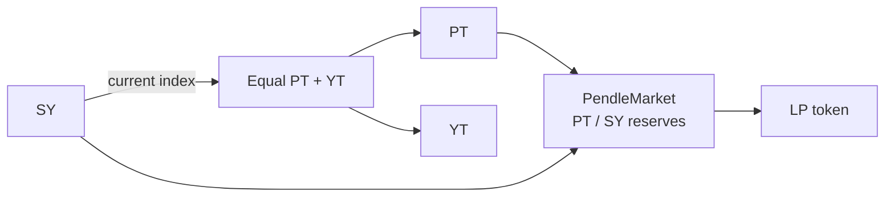

# Liquidity & the AMM

A Pendle market is an automated market maker (AMM) for one maturity. Its standing reserves are **PT and SY**, and LP tokens represent a pro-rata share of those reserves.

## What the pool contains

- **PT** is the principal claim, denominated in the SY's accounting asset and redeemable at maturity.
- **SY** is the Standardized Yield wrapper over the yield-bearing source.

YT is not a standing reserve. Pendle's router can still buy or sell YT by combining mint/redeem operations with PT/SY trades.

The reserve mix changes when users trade or add/remove liquidity. It does not automatically become “all PT” as time passes.

## Why the curve is time-dependent

PT has a fixed maturity value in accounting-asset terms. Before maturity, it trades at a discount that reflects the market's implied rate and remaining time.

Pendle's AMM uses a curve designed for this relationship rather than a generic constant-product curve spanning every possible spot price. Liquidity is concentrated around a range of implied rates, improving capital efficiency but creating a finite tradeable range. Large trades or sharp rate changes can still produce slippage or reach a range boundary.

OpenPendle displays current implied APY from the market's live `lastLnImpliedRate`. Pendle's separate TWAP oracle is primarily for integrations that need time-weighted PT, YT, or LP values.

## What an LP position earns

An LP's return can contain several components:

1. **PT accretion.** The PT reserve approaches its accounting-asset maturity value if settlement remains sound.
2. **SY yield and native rewards.** The SY reserve continues following its own exchange rate and reward logic before maturity.
3. **Swap fees.** Pendle divides each swap fee between LPs and protocol recipients. Current Pendle documentation describes 20% of swap fees going to LPs, while the deployed market configuration controls the live reserve share.
4. **PENDLE incentives.** Eligible whitelisted markets can receive PENDLE under Pendle's current incentive model.
5. **External rewards.** A separate campaign, including a supported Merkl campaign, may reward eligible positions.

See Pendle's current [Fees](https://docs.pendle.finance/pendle-v2/ProtocolMechanics/Mechanisms/Fees) and [Incentives](https://docs.pendle.finance/pendle-v2/ProtocolMechanics/Mechanisms/Incentives) documentation. Do not treat an estimated fee or reward APR as a guaranteed total return.

## Reserve mix and impermanent loss

LP tokens claim the pool's **current** PT and SY balances, not the exact basket originally deposited. Trades move that mix.

Because PT and SY reference the same accounting system, their relationship is usually tighter than a pair of unrelated assets. At maturity, PT reaches its accounting-asset settlement value while SY is valued through its exchange rate. This reduces the classic open-ended divergence of unrelated-token AMMs, assuming both legs remain sound.

It does not eliminate risk:

- exiting before maturity can realize a loss relative to holding the original PT and SY;
- a sharp implied-rate move can materially rebalance the reserves;
- low liquidity can create large price impact;
- a failing accounting asset, yield-bearing token, or SY can impair both sides;
- reward estimates can fall or disappear.

“No impermanent loss at maturity” is an economic statement under sound settlement assumptions, not a guarantee that the underlying asset or SY cannot fail.

## Adding and removing liquidity

**Before maturity**, OpenPendle can prepare supported add- and remove-liquidity transactions. Adding uses PT and SY, directly or through router conversions, and returns LP tokens. Removing burns LP tokens for the corresponding reserve share.

**At and after maturity**, the market no longer accepts swaps or new liquidity. LP removal remains available. The output is settled from the pool's PT and SY components: matured PT can be redeemed and SY can be converted through its accepted output path.

Pendle's current fee rules redirect yield and points generated by matured, unredeemed PT and LP positions to protocol fee recipients. Redemption has no stated protocol redemption fee, but gas and any output conversion still matter. Review and settle matured positions promptly rather than assuming waiting is economically neutral.

::: warning LP inherits the full asset stack
Factory provenance does not validate the accounting asset, yield-bearing token, SY owner, adapter, or upgradeability. Read [Community pools](/concepts/community-pools) and [Risks & disclosures](/reference/risks) before providing liquidity.
:::

## See also

- [Providing liquidity](/guides/providing-liquidity)
- [Maturity & redemption](/concepts/maturity)
- [Anatomy of a pool](/concepts/pool-anatomy)
