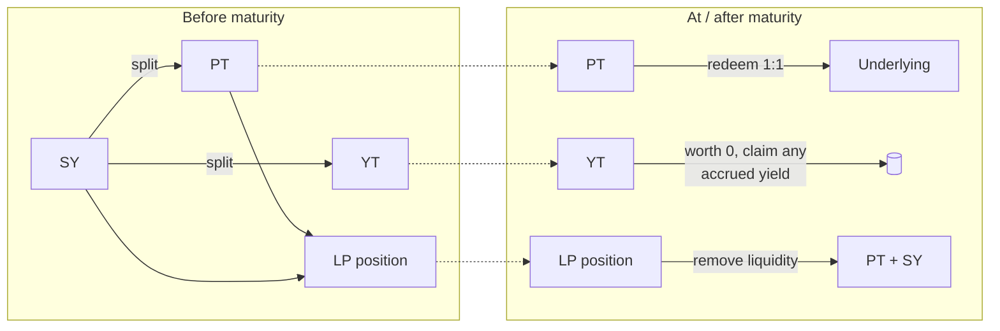

# Maturity & redemption

Every Pendle market is built around a single fixed date: its **maturity** (also called expiry). Maturity is the moment the whole structure resolves — the discount on the principal token closes, the yield token finishes paying out, and the market stops trading. This page explains what maturity is, exactly what each token becomes when it arrives, how you get your value out afterward, and what "rolling" into a later maturity means.

It is a first-principles page and defines each term the first time it appears. If the vocabulary here is new, start with [How Pendle works](/concepts/how-pendle-works); this page goes deeper on the final stage of that lifecycle.

::: info Not affiliated with Pendle
OpenPendle is an independent, open-source interface to Pendle V2. It does not change how maturity works — the behaviour described here is Pendle's public, on-chain mechanics, the same for every frontend. OpenPendle simply lets you carry out the post-maturity actions on [community pools](/concepts/community-pools).
:::

## What maturity is

When a Pendle market is created, a maturity timestamp is fixed into it and never changes. It is a property of the market, not of your position — everyone in the same market shares the same maturity.

Recall the split at the heart of Pendle. A yield-bearing asset is wrapped as **SY (Standardized Yield)**, and before maturity SY divides into two tokens:

- **PT (Principal Token)** — the principal. It is written to redeem **1:1 for the underlying at maturity**.
- **YT (Yield Token)** — the yield. It holds the right to all the yield the underlying accrues **up to maturity**, and no further.

Maturity is the date those two promises come due. Everything about a Pendle position — the discount PT trades at, the yield YT collects, the shape of the AMM curve — is defined relative to this one timestamp. Before it, principal and yield are still resolving. At it, they are settled.

::: info The term is fixed; your holding period is not
Maturity fixes when the *market* resolves. It does not lock you in for the whole term. Before maturity you can enter or exit any leg at will — buy or sell [PT](/concepts/principal-tokens), buy or sell [YT](/concepts/yield-tokens), mint, redeem, or move [liquidity](/concepts/liquidity-and-amm) in and out. What maturity fixes is the *outcome* of whichever leg you are still holding when the date arrives.
:::

## What happens at maturity

At the maturity timestamp, three things become true at once.

| Token / position | State at maturity |
| --- | --- |
| **PT** | Redeemable **1:1 for the underlying**. The discount has fully closed — that closing *is* the fixed yield you locked in. |
| **YT** | Worth **0** going forward. Every unit of yield it was entitled to has been paid out over the term; there is nothing left to accrue. |
| **The market (AMM)** | **Stops trading.** With the outcome fixed, there is no more price discovery, so swaps against the pool end. |

Each of these deserves a closer look.

### PT converges to par

Before maturity, PT trades **below par** — below the value of the underlying it will redeem for. That discount is not a defect; it is the mechanism. Buying PT below par and holding to maturity earns you the gap between what you paid and the 1:1 redemption value, and that gap is a **fixed yield** — a known return, fixed at the moment you bought, regardless of what the underlying's rate did afterward.

As maturity approaches, the market price of PT climbs toward par, and at maturity it reaches it: **PT now equals one unit of the underlying**. The "implied APY" — the fixed yield implied by the PT price — has, by construction, been fully earned. Nothing further happens to PT after this point except that you may redeem it whenever you choose.

### YT decays to zero

YT is the mirror image. It is a **long-yield** position: it pays you the actual yield the underlying accrues, streamed over the life of the market. Because all of that yield has been distributed by the end of the term, YT has nothing left to deliver at maturity — its forward value is **0**.

This is expected behaviour, not a loss event in itself. A YT holder's return is the yield collected along the way (plus or minus what they paid for the YT), not any residual value at the end. See [Yield Tokens](/concepts/yield-tokens) for how that accrual works and how a YT position comes out ahead or behind.

::: warning Claim YT's accrued yield before it is worthless to trade
YT stops being tradable once the market matures, and its forward value is 0. Any yield a YT accrued but that you have not yet claimed is still yours to redeem — but you should claim it. Do not assume a matured YT can still be sold; by design it cannot.
:::

### The market stops trading

An AMM exists to discover a price between two assets. Once PT's value is pinned to the underlying and YT's is pinned to zero, there is nothing left to discover, so the pool no longer accepts swaps. You cannot buy or sell PT or YT *through the market* after maturity.

What you **can** still do is settle: redeem PT for the underlying, and exit a liquidity position. Those are redemption actions, not trades, and they remain available indefinitely — read on.

## Redemption after maturity

Nothing forces you to act the instant maturity passes. The redemption paths below stay open afterward, and OpenPendle exposes them on any [community pool](/concepts/community-pools) whose provenance it has validated.

### Redeeming PT for the underlying

This is the headline post-maturity action. At or after maturity, **PT redeems 1:1 for the underlying** — no swap, no slippage, no dependence on pool liquidity. You are exchanging a matured claim for the thing it was always a claim on.

Because it is a redemption rather than a trade, it does not go through the AMM and is unaffected by the market having stopped. It is available on OpenPendle wherever you can act on the market. There is no deadline: an unredeemed PT simply sits at par until you get to it.

::: info Underlying vs. SY on redemption
Under the hood, redeeming PT settles into the market's **SY**, and SY can then unwrap to the underlying yield-bearing token it represents. In practice a frontend can present this as a single "PT → underlying" step. The value you end up with is one unit of underlying per PT, minus Pendle's own protocol fees where they apply. What the "underlying" concretely is depends on the market — see [Anatomy of a pool](/concepts/pool-anatomy).
:::

### Exiting a liquidity position

If you were a **liquidity provider (LP)** in the market, your LP tokens represent a share of the pool's PT and SY. Removing liquidity after maturity returns that share to you as its components: **PT + SY**.

From there:

- the **SY** portion can unwrap to the underlying, and
- the **PT** portion is now a matured PT, which you redeem 1:1 for the underlying exactly as above.

So an LP exit after maturity is a two-part settlement — take out `PT + SY`, then convert each part to the underlying. You continue to hold whatever swap fees the position earned while the market was live; maturity does not claw those back. Note that an LP's final composition depends on the pool's state at maturity and still carries the AMM and PT-vs-SY exposures described in [Liquidity & the AMM](/concepts/liquidity-and-amm).

### Redeeming PT + YT together (before maturity only)

For completeness: the reversible `PT + YT → SY` **redeem** — recombining both halves of the split back into SY 1:1 — is a *before-maturity* action. After maturity you would not use it, because the two halves are no longer symmetric: YT is worth 0, and PT is better redeemed directly for the underlying at par. Mint and this paired redeem are covered in [Minting & redeeming](/guides/minting-redeeming).

## What each token is worth, summarized

| You hold at maturity | What it is now | How you realize it |
| --- | --- | --- |
| **PT** | One unit of the underlying (par) | Redeem PT → underlying, 1:1, any time after maturity |
| **YT** | 0 going forward | Claim any yield that accrued but was not yet collected; nothing further |
| **LP position** | A share of `PT + SY` | Remove liquidity → `PT + SY`, then convert each to the underlying |

::: info Example — illustrative numbers only
The figures below are invented to build intuition. They are not live quotes and not a prediction of any real market.

Suppose you bought **1 PT** for **0.95** units of the underlying, one year before maturity, in a market where 1 SY corresponds to 1 unit of underlying.

**At maturity, holding PT.** PT now redeems 1:1, so you redeem your 1 PT for **1.00** unit of underlying (before any protocol fee). Your return is `1.00 / 0.95 − 1 ≈ 5.3%`, exactly the fixed rate you locked in at purchase — independent of what the underlying's yield actually did during the year.

**At maturity, holding the other half (YT).** The YT you would have received from the same split cost about **0.05** and paid out the real yield over the year. At maturity it is worth **0**; the YT holder's result is whatever yield they collected along the way relative to that 0.05 cost — not any end value.

**At maturity, holding an LP position.** You remove liquidity and receive, say, some **PT** and some **SY**. You redeem the PT 1:1 for underlying and unwrap the SY to underlying, and you keep the swap fees the position earned while it was live. The exact split of PT vs. SY depends on where the pool sat at maturity.
:::

## Rolling into a new maturity

A Pendle market has a finite life: once it matures, that specific market is done. To keep a fixed-yield or long-yield position going, you do not extend the old market — you **roll** into a newer one with a later maturity.

The idea is straightforward:

1. **Settle the matured position.** Redeem PT for the underlying, and/or exit an LP position to `PT + SY` and convert to the underlying, as above.
2. **Choose a market with a later maturity.** This is a *different* market contract — a different pool address, its own PT/YT/SY, its own maturity, and its own live price and implied APY.
3. **Re-enter** on the new market: buy PT for fixed yield, buy YT for long yield, or provide liquidity — the same actions, at whatever rate the new market offers.

Rolling is not a single button or an automatic feature; it is simply doing the redemption on the old market and a fresh entry on the new one. Each roll is priced independently — the fixed rate you get on the next term is set by that market when you enter it, not carried over from the last one.

::: tip A later maturity is a new pool, not a renewal
There is no "extend" on a Pendle market. If you want continued exposure, find or [create](/create/deploying-a-market) a market with a later maturity and enter it as a new position. On OpenPendle you paste that market's own address to open it — the address of the `PendleMarket` contract, not the PT, YT, or SY address.
:::

::: warning Community pools are permissionless and unreviewed
OpenPendle validates that a market was created by a Pendle factory it recognizes — this is validation of *provenance*, not endorsement. It **cannot vouch for the asset or the SY contract underneath**, and it applies to a later-maturity market you roll into exactly as much as the one you are leaving. A factory-valid market can still wrap a broken, exotic, or malicious asset, and its post-maturity redemption is only as sound as that asset.

Community pools are permissionless and unreviewed — anyone can create one, and interacting with them can lose you funds. Experimental — use at your own risk. OpenPendle is not affiliated with Pendle Finance and takes no fee of its own; Pendle's own protocol fees still apply.
:::

## Next

- [Principal Tokens (PT)](/concepts/principal-tokens) — how the discount is priced and why it closes to par at maturity.
- [Yield Tokens (YT)](/concepts/yield-tokens) — the long-yield leg and why it decays to zero.
- [Liquidity & the AMM](/concepts/liquidity-and-amm) — what an LP holds and what removing liquidity returns.
- [Minting & redeeming](/guides/minting-redeeming) — the before-maturity `SY ↔ PT + YT` actions, step by step.
- [Anatomy of a pool](/concepts/pool-anatomy) — the market, PT, YT, and SY addresses behind one pool.
- [Deploying a market](/create/deploying-a-market) — create a fresh market with the maturity you want to roll into.
