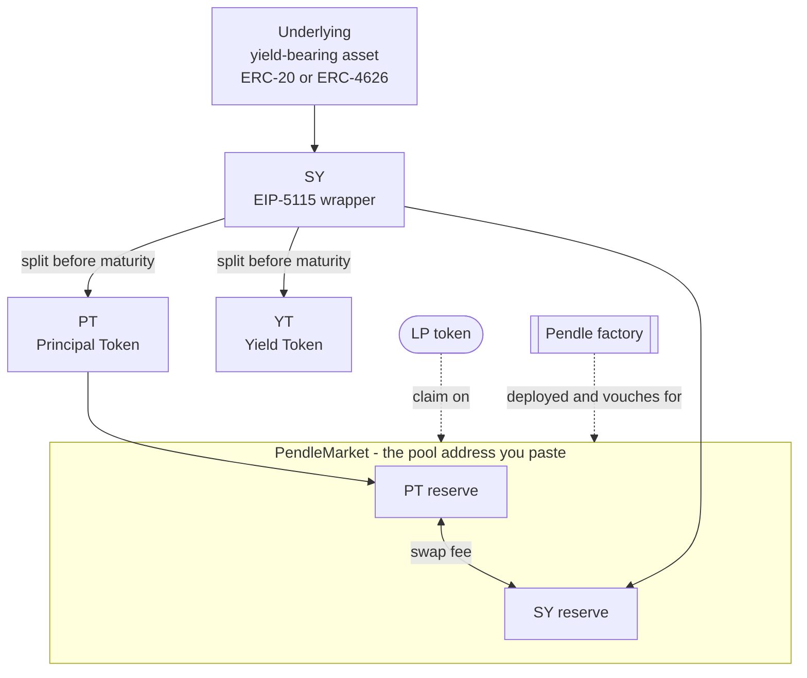
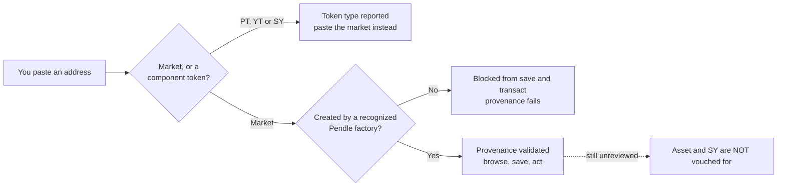

# Anatomy of a Pendle pool

The word "pool" gets used loosely. On Pendle it has a precise, on-chain meaning, and getting that meaning right is the difference between loading the market you intended and pasting the wrong address. This page dissects a single Pendle pool: the one contract that *is* the pool, the three token contracts that hang off it, the data the pool exposes, how OpenPendle verifies a pool's origin before letting you act on it, and the trust that a factory check does — and does not — establish.

If you have not yet met [Standardized Yield (SY)](/concepts/standardized-yield), the [Principal Token (PT)](/concepts/principal-tokens), the [Yield Token (YT)](/concepts/yield-tokens), or the [AMM](/concepts/liquidity-and-amm), read those pages first. This one assembles them into a whole and assumes each individually.

## A pool is one contract: `PendleMarket`

A "pool" — the app also calls it a **market** — is a single deployed smart contract of type `PendleMarket`. That contract *is* the pool. It holds the AMM reserves, quotes swaps, mints and burns liquidity, records the maturity date, and knows which token contracts it belongs to. Everything you do on a pool — swap, add liquidity, remove liquidity — is a call that ultimately touches this one address (routed through Pendle's [Router V4](/reference/networks-and-contracts), `0x888888888889758F76e7103c6CbF23ABbF58F946`).

A **community pool** is simply a `PendleMarket` that someone deployed permissionlessly — no whitelist, no approval, and unreviewed by anyone. It is the same contract type Pendle's own app uses; the only difference is that Pendle's app does not list it. OpenPendle exists to let you use these markets. See [Community pools & incentives](/concepts/community-pools).

## The four contracts that make a pool

A pool is not one token — it is a small constellation of contracts that reference each other. One `PendleMarket` is wired to exactly one PT, one YT, and one SY, all sharing a single maturity and a single underlying yield-bearing asset.

Read the diagram from the top down:

- The **underlying** is the yield-bearing asset the whole structure is built on — a staked token, a lending receipt, a vault share. Pendle wraps it as **[SY](/concepts/standardized-yield)**, a uniform [EIP-5115](https://eips.ethereum.org/EIPS/eip-5115) interface, so every downstream contract talks to one standard regardless of the asset inside.
- Before maturity, SY splits into **[PT](/concepts/principal-tokens)** (the principal, redeemable 1:1 for the underlying at maturity) and **[YT](/concepts/yield-tokens)** (the right to all the yield until maturity). `PT + YT` mint from SY and redeem back to SY 1:1 at any time before maturity.
- The **`PendleMarket`** is the AMM. Its standing reserve is **PT and SY** — not YT. Depositing into it makes you a liquidity provider and issues you **LP tokens**, a pro-rata claim on those reserves. (YT is not pooled; it is traded against SY by routing through the same market. See [Liquidity & the AMM](/concepts/liquidity-and-amm).)
- The **factory** is the contract that deployed the market. It is not part of the pool's balance, but it is part of the pool's *identity*: the market records which factory created it, and that provenance is what OpenPendle checks.

Five contracts are therefore in play for one pool — underlying, SY, PT, YT, market — plus the factory that stamped it. Only one of those five is the address you hand to OpenPendle.

## Paste the market address — not PT, YT, or SY

This is the single most important operational fact on this page.

::: info Which address is the pool?
The pool is the `PendleMarket` contract. Its address — **not** the PT address, **not** the YT address, **not** the SY address — is what opens a market. Pasting a PT or YT can open Token actions and resolve a matching pool; an SY alone cannot identify one maturity.
:::

The confusion is natural, because a single pool exposes four related addresses (market, PT, YT, SY) and a block explorer or a third-party dashboard may surface any of them. Only the `PendleMarket` address loads the pool directly; PT and YT lead to Token actions, and SY cannot select one maturity.

### Pasting a component is detected and routed

You do not have to memorize which of the four addresses is correct, because OpenPendle checks. When you paste a **PT or YT**, it offers Token actions, resolves the PT/YT/SY set, and looks for the associated pool. When you paste an **SY**, OpenPendle reports the type but cannot pick one pool because a single SY can back multiple maturities.

This detection is a convenience, not a trust signal. Recognizing a PT or resolving its pool does not mean the market behind it is safe.

::: tip Where to find the market address
If you have a PT or YT, paste it on the home page and open Token actions; OpenPendle may resolve one or more matching pools. If you only have an SY, find a PT, YT, or `PendleMarket` for the intended maturity on a block explorer or in the pool's metadata. Once a pool is open, you can [remember](/guides/saved-pools) its market address for next time.
:::

## What data a pool exposes

OpenPendle has [no request-time application backend or transaction relay](/reference/architecture), so core pool data is read live from the chain — from the `PendleMarket` and the contracts it points to — over a public RPC, batched through `Multicall3` (`0xcA11bde05977b3631167028862bE2a173976CA11`). Explore's inventory is a static snapshot generated from factory events; Pendle's market API adds optional listed-market metadata and helps with the separate PT/YT pool lookup, with public Blockscout indexes as a fallback where available. The pool itself remains self-describing. The main fields:

| Data | Read from | What it tells you |
| --- | --- | --- |
| **Component addresses** | The market | The PT, YT, and SY this market is wired to. |
| **Maturity** | The market / PT | The fixed date the pool resolves — after it, PT redeems 1:1, YT is worth 0, trading stops. See [Maturity & redemption](/concepts/maturity). |
| **Reserves** | The market | The PT and SY balances in the AMM — the depth backing a swap and what an LP share is a claim on. |
| **Implied APY** | Derived from the PT price | The fixed yield implied by the current PT price — see [How Pendle works](/concepts/how-pendle-works). |
| **Underlying / SY details** | The SY | The wrapped asset, its decimals, and what tokens the SY accepts in and out. |
| **Factory provenance** | The market | Which factory deployed the market — the field OpenPendle validates (below). |

Two notes on this data:

- **Implied APY is derived, not stored.** No contract holds an "APY" field. It is computed from the current PT price against par and the time left to maturity, and it moves as PT trades. Treat any figure as a live reading, never a promise.
- **Prices come from a TWAP oracle.** Pendle's `PendlePYLpOracle` (`0x5542be50420E88dd7D5B4a3D488FA6ED82F6DAc2`) provides time-weighted average prices for PT, YT, and LP. A freshly deployed market starts with oracle cardinality 1; quoting and trading through OpenPendle do not require the oracle to be expanded, but other protocols that want to price the pool via TWAP do. See [Initializing the oracle](/create/price-oracle).

## Provenance: how OpenPendle validates a pool

Anyone can deploy a contract and *call* it a Pendle market. OpenPendle will not let you save or transact against a market until it has verified that the market was in fact created by a **Pendle factory it recognizes**. This is the **provenance gate**.

How the check works, and why it is built the way it is:

- **The factory set is hardcoded, for validation only.** OpenPendle ships a known set of Pendle factory addresses and uses it solely to answer one question: *did a recognized factory deploy this market?* It is a provenance test, not an endorsement list.
- **The active factory is resolved live.** Pendle's factories are **governance-mutable** — governance can change which factory is current. So OpenPendle resolves the active factory at runtime against the chain rather than trusting a frozen value; the hardcoded set is used only to validate provenance, never to decide where a new deploy is routed.
- **Factory lineage differs by chain.** Not every network has the full history of factory versions. The lineage present today: Ethereum, BSC, and Arbitrum carry v1 + V3 + V4 + V5 + V6; Base and Plasma carry V5 + V6; Monad is V6 only. The authoritative live per-chain list is on the app's [Protocol Status & Contracts](https://openpendle.com/#/status) page, which you can verify against [`pendle-finance/pendle-core-v2-public`](https://github.com/pendle-finance/pendle-core-v2-public).

::: warning Validation is not endorsement
Passing the provenance gate proves only that a market descends from a genuine Pendle factory. It says **nothing** about whether the asset or SY underneath is sound. OpenPendle validates market provenance but cannot vouch for the assets or SY contracts underneath. A factory-valid market can still wrap a broken, exotic, or malicious asset.
:::

## The trust surface of a pool

A factory-valid market narrows what you have to trust, but it does not eliminate it. When you interact with a pool, you are extending trust to several distinct things. Know each one.

| You are trusting | Why it matters | What provenance covers |
| --- | --- | --- |
| **The Pendle factory & contracts** | The market, AMM, and PT/YT split logic are Pendle's audited V2 contracts. | ✅ Validated — the market descends from a recognized factory. |
| **The underlying asset** | If the underlying fails, PT may **not** redeem at par and the whole structure breaks. | ❌ Not covered — unreviewed. |
| **The SY contract** | SY wraps the asset; a faulty or hostile SY can break deposits, redemption, or accounting. | ❌ Not covered — unreviewed. |
| **The SY owner / upgradeability** | Some SYs are upgradeable proxies; whoever controls them can change SY behavior. | ❌ Not covered — see below. |

### The SY owner and upgradeability

The SY is the contract closest to the money, and it is the one most worth scrutinizing. Two facts about how community-pool SYs are typically owned:

- **Wizard-deployed SYs default to Pendle governance.** An SY deployed through OpenPendle's create flow (via `PendleCommonSYFactory`, `0x466CeD3b33045Ea986B2f306C8D0aA8067961CF8`) has, by default, its ownership assigned to Pendle's governance proxy (`0x2aD631F72fB16d91c4953A7f4260A97C2fE2f31e`). The owner can hold privileged roles over the SY's configuration.
- **Adapter SYs are upgradeable proxies under Pendle's ProxyAdmin.** The "one-click adapter SY" variant is a `TransparentUpgradeableProxy` whose admin is Pendle's `ProxyAdmin` (`0xA28c08f165116587D4F3E708743B4dEe155c5E64`), i.e. Pendle governance. An upgradeable proxy means the implementation *can* be changed by its admin — a power that lives with governance rather than the pool's creator in the default case.

The point is not that Pendle governance is hostile — it is that "upgradeable" and "owned" are real properties of the trust surface, and a community pool's SY may have been deployed with a **non-default** owner or a custom adapter. Always check who owns and can upgrade the SY of a pool you intend to fund. The [Protocol Status & Contracts](https://openpendle.com/#/status) page and a block explorer are your tools here.

::: danger A factory-valid pool can still lose you money
Community pools are permissionless and unreviewed — anyone can create one, and interacting with them can lose you funds. **OpenPendle validates market provenance but cannot vouch for the assets or SY contracts underneath.** If the underlying asset fails, the PT may not redeem at par; if the SY is faulty or hostile, deposits and redemption can break. Provenance protects you from a fake *market*, not from a bad *asset*. Experimental — use at your own risk. Not affiliated with Pendle Finance.
:::

## A worked example: dissecting one pool

::: info Example — illustrative addresses and numbers only
The addresses and figures below are invented to show the *shape* of a pool's anatomy. They are not a real pool, asset, or APY, and pasting them will not load anything.

Imagine a community market with these four contracts, all sharing one maturity:

| Role | Illustrative address | Do you paste it? |
| --- | --- | --- |
| **`PendleMarket` (the pool)** | `0xMARKET…` | ✅ Yes — this is the pool |
| PT | `0xPT…` | ❌ No — detected & reported as a PT |
| YT | `0xYT…` | ❌ No — detected & reported as a YT |
| SY | `0xSY…` | ❌ No — detected & reported as an SY |

You paste `0xMARKET…`. OpenPendle confirms it is a `PendleMarket`, checks that a recognized Pendle factory on the active chain deployed it (provenance passes), then reads the pool live: maturity **~6 months out**, reserves of roughly **60% PT / 40% SY**, an implied APY of about **7%**, and an SY wrapping the underlying whose owner resolves to Pendle's governance proxy.

Now suppose you had instead pasted `0xPT…`. OpenPendle would detect a PT and report it — *this is a component of a pool, not the pool; paste the `PendleMarket` address* — and you would go find `0xMARKET…`. At no point are the illustrative 7% or the 60/40 split a guarantee; they are live readings that move with every trade.
:::

## See also

- [How Pendle works](/concepts/how-pendle-works) — the full PT / YT / SY / market flow from first principles.
- [Standardized Yield (SY)](/concepts/standardized-yield) · [Principal Tokens (PT)](/concepts/principal-tokens) · [Yield Tokens (YT)](/concepts/yield-tokens) — the three token contracts a market is wired to.
- [Liquidity & the AMM](/concepts/liquidity-and-amm) — what the market's PT/SY reserves are and what an LP share holds.
- [Community pools & incentives](/concepts/community-pools) — what "permissionless and unreviewed" means, and why these pools use Merkl.
- [Opening a pool](/guides/opening-a-pool) — the step-by-step guide to pasting a market address in OpenPendle.
- [Networks & contracts](/reference/networks-and-contracts) — the shared and per-chain addresses, including the factories provenance is checked against.
- [Risks & disclosures](/reference/risks) — the complete trust and risk surface before you transact.
