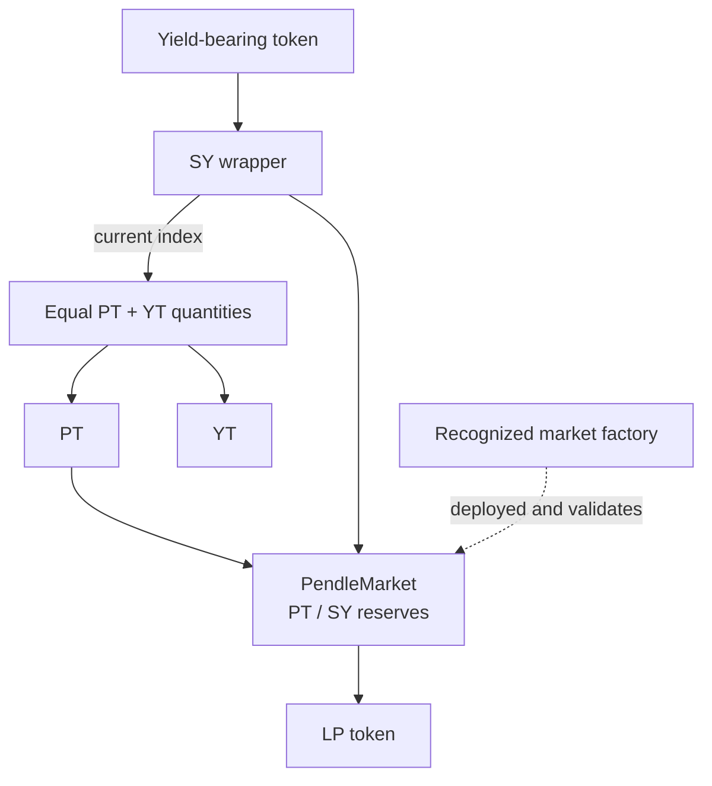
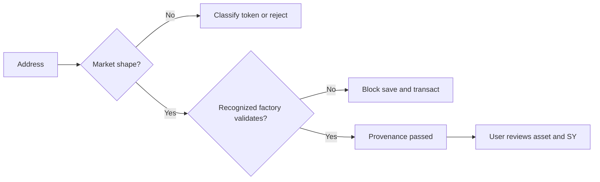

# Anatomy of a Pendle pool

In OpenPendle, a **pool** or **market** is one `PendleMarket` contract for one PT/YT maturity. It holds the PT/SY AMM reserves and issues LP tokens.

## The contracts involved

- **Yield-bearing token** — the token or position the SY holds or manages.
- **SY** — the Standardized Yield wrapper. It reports an accounting asset, exchange rate, accepted inputs and outputs, and reward behavior.
- **PT** — the principal claim, denominated in the accounting asset and redeemable at maturity.
- **YT** — the associated pre-maturity yield and reward claim, net of Pendle fees.
- **PendleMarket** — the PT/SY AMM for one maturity.
- **LP token** — a pro-rata claim on the market's current PT and SY reserves.
- **Factory** — the Pendle deployment contract whose `isValidMarket` registry OpenPendle uses for provenance.

The factory is not part of the reserve balance and does not endorse the asset. It establishes the market's deployment lineage.

## Which address to open

The `PendleMarket` address opens a market directly. OpenPendle also handles related tokens:

- Pasting **PT or YT** opens Token actions and attempts to resolve associated markets.
- Pasting **SY** identifies the wrapper but cannot select one market because several maturities can share it.

Address classification is a routing convenience, not a trust signal. A market must still pass provenance validation before it can be saved or used for a transaction.

## What OpenPendle reads

Core market state comes from the active chain through the selected RPC. Important fields include:

| Field | Meaning |
| --- | --- |
| **PT, YT, SY addresses** | The token set attached to the market. |
| **Expiry** | The timestamp after which swaps and new liquidity stop and PT can settle. |
| **PT and SY reserves** | The current AMM balances and the assets backing LP shares. |
| **Last implied rate** | The market state used to derive current implied APY and PT price. |
| **SY exchange rate** | Converts SY units into accounting-asset value. |
| **Factory validation** | Which recognized market factory returns `isValidMarket(market) = true`. |

OpenPendle derives its headline implied APY from current market state, not from the TWAP oracle. `PendlePYLpOracle` provides time-weighted PT, YT, and LP values for integrations. A market can trade before its observation cardinality is raised for longer external TWAP windows.

Explore uses a generated factory-event snapshot for inventory and Pendle's catalog for listing/display enrichment. Opening an address still performs live reads and provenance validation.

## Provenance validation

OpenPendle does not trust a market's self-description. It calls `isValidMarket` across the recognized factory generations for the active chain. A positive result identifies the factory lineage; no positive result blocks save and transaction actions.

Factory configuration differs by network and changes over time. OpenPendle bundles the recognized validation lineage with each release. [Protocol Status](https://openpendle.com/#/status) separately reads the deployment helper's active wiring; [Networks & contracts](/reference/networks-and-contracts) explains both sources.

## The remaining trust surface

| You still trust | Why it matters |
| --- | --- |
| **Accounting asset** | PT's maturity value is denominated in it. |
| **Yield-bearing token and protocol** | Failure can impair SY exchange rate and redemption. |
| **SY implementation** | Deposit, redeem, accounting, and reward behavior live here. |
| **Owner, proxy admin, and adapter** | Privileged parties may be able to change behavior. |
| **Liquidity and market state** | A genuine market can still offer poor execution or an unattractive rate. |

OpenPendle's trust panel surfaces available details, but it does not turn them into a safety score.

::: warning Factory-valid does not mean safe
Verify the asset, SY controls, maturity, and exit path yourself. See [Standardized Yield](/concepts/standardized-yield), [Community pools](/concepts/community-pools), and [Risks & disclosures](/reference/risks).
:::

## See also

- [Opening a pool](/guides/opening-a-pool)
- [Liquidity & the AMM](/concepts/liquidity-and-amm)
- [Networks & contracts](/reference/networks-and-contracts)
