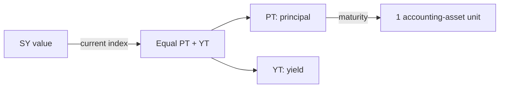

# Principal Tokens (PT)

A **Principal Token (PT)** is the principal claim in a Pendle yield split. At maturity, one PT redeems for one unit of the SY's **accounting asset**, normally delivered through an accepted SY output token.

Buying PT below that maturity value and holding it to settlement creates a fixed accounting-asset return.

## Where PT comes from

Before maturity, an SY amount is converted at its current exchange-rate index into **equal quantities of PT and YT**. PT holds the principal claim; YT holds the associated pre-maturity yield and rewards.

Equal PT and YT quantities can recombine into SY before maturity. One raw SY token does not generally equal one PT plus one YT because the SY exchange rate determines the minted quantities. See Pendle's [yield-tokenization documentation](https://docs.pendle.finance/pendle-v2-dev/Contracts/YieldTokenization).

## Accounting asset versus yield-bearing token

PT's 1:1 maturity statement refers to the **accounting asset**, not necessarily one raw yield-bearing token.

For example, if an SY wraps an interest-bearing share whose value rises against ETH, one PT can represent one ETH worth of that share at maturity rather than one whole share. Check the accounting asset shown by the market and read Pendle's [PT documentation](https://docs.pendle.finance/pendle-v2/ProtocolMechanics/YieldTokenization/PT) for the distinction.

## How the discount becomes fixed yield

Let `P` be the price of one PT in accounting-asset units and `T` the remaining fraction of a year. Ignoring gas and conversion costs:

$$
\text{period return} = \frac{1}{P} - 1
$$

$$
\text{implied APY} = \left(\frac{1}{P}\right)^{1/T} - 1
$$

If a PT with 180 days remaining costs `0.96` accounting-asset units:

- its maturity value is `1.00`;
- its 180-day return is `1 / 0.96 - 1 ≈ 4.17%`;
- annualized, that is roughly `8.6%` implied APY.

The execution-time rate becomes the buyer's fixed maturity return in accounting-asset terms, provided they hold to maturity and settlement works. It is not a protocol promise that the accounting asset will retain its value.

## Before maturity

PT trades against SY in the Pendle market. Its price responds to the market's implied rate, remaining time, liquidity, and demand.

- If implied rates rise, PT generally needs a larger discount and its price falls.
- If implied rates fall, PT generally moves closer to par.
- Time reduces the remaining discount as maturity approaches, assuming sound settlement.

Selling early realizes the current market price, not the fixed maturity outcome. Slippage and rate moves can produce a loss even when holding the same PT to maturity would have settled at par.

OpenPendle derives displayed implied APY from current market state and obtains a bounded quote for the requested trade. It simulates the prepared transaction before requesting a signature, but state can still change before mining.

## At maturity

PT settlement no longer depends on an AMM swap. The PT is redeemed through the SY into a supported output representing its accounting-asset value.

Pendle's current [Fees documentation](https://docs.pendle.finance/pendle-v2/ProtocolMechanics/Mechanisms/Fees) states that maturity redemption has no protocol redemption fee. Gas and any additional output conversion still apply. Post-maturity yield and points from unredeemed PT are redirected under Pendle's current rules, so waiting is not economically neutral.

## Risks

- **Accounting-asset risk.** A fixed return in an impaired asset is still impaired.
- **SY and underlying-protocol risk.** Redemption can fail or lose value if the wrapper or yield source breaks.
- **Early-exit risk.** The market price can be below the purchase price before maturity.
- **Liquidity risk.** Thin reserves increase slippage and may prevent an attractive early exit.
- **Control risk.** Upgradeable SYs, adapters, and privileged owners can change the trust surface.

::: warning Fixed does not mean risk-free
OpenPendle validates market provenance, not redemption quality. Review [Community pools](/concepts/community-pools) and [Risks & disclosures](/reference/risks) before buying PT.
:::

## See also

- [Buying PT](/guides/buying-pt)
- [Maturity & redemption](/concepts/maturity)
- [Yield Tokens](/concepts/yield-tokens)
- [Standardized Yield](/concepts/standardized-yield)
