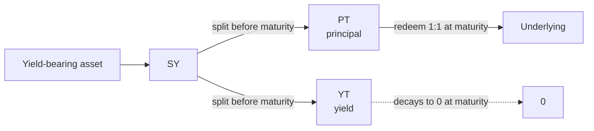
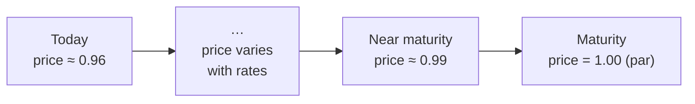

# Principal Tokens (PT)

A **Principal Token (PT)** is the fixed-income half of a Pendle position. It represents the *principal* of a yield-bearing asset with its future yield stripped away, and it redeems **1:1 for the underlying at maturity**. Buy PT below par, hold it to the maturity date, and you lock in a **fixed yield** that is fully known at the moment you buy.

This page explains where PT comes from, how a discount becomes a fixed APY, how PT behaves before and at maturity, the risks that remain, and when a PT position fits what you are trying to do.

If you have not yet read how Pendle splits an asset apart, start with [How Pendle works](/concepts/how-pendle-works) and [Standardized Yield (SY)](/concepts/standardized-yield); this page assumes only those two.

## Where PT comes from

Pendle V2 takes a yield-bearing asset — a staked token, a lending receipt, a vault share — and wraps it in a **Standardized Yield (SY)** token, a uniform [EIP-5115](/concepts/standardized-yield) interface over the yield source. Until a fixed **maturity** date, that SY can be split into two tokens:

- **PT (Principal Token)** — the principal, redeemable 1:1 for the underlying **at maturity**.
- **[YT (Yield Token)](/concepts/yield-tokens)** — the right to all the yield the underlying accrues **until** maturity.

The split is conservative and reversible. `PT + YT` mint from SY, and `PT + YT` redeem back to SY **1:1 at any time before maturity** — this is the [mint / redeem](/guides/minting-redeeming) action on a market. So one unit of SY always equals one PT plus one YT. PT carries the principal you get back; YT carries the yield you would otherwise have earned along the way.

Because PT no longer carries the yield, the market prices it **below** the value of the underlying — it trades at a **discount to par**. That discount is the entire source of PT's return.

## The discount is the yield

"Par" is the value of one PT in underlying terms **at maturity**: exactly 1. Before maturity, PT trades below 1 (denominated in the underlying) because you must wait to redeem it and you receive no yield in the meantime. The gap between today's price and par is a fixed amount of upside you capture simply by holding to maturity.

- Pay less than par now.
- Redeem at par (1:1 for the underlying) at maturity.
- The difference, annualized, is your **fixed yield** — set at the price you paid and unaffected by what the underlying's yield does afterward.

This is why a PT position is often called *fixed yield* or *fixed rate*: once the trade is done, the maturity payoff in underlying terms is known. The variable yield of the underlying has been sold off to whoever holds the [YT](/concepts/yield-tokens).

::: info Terminology
The fixed yield implied by the current PT price is called the **implied APY** (sometimes "fixed APY"). It is not a promised rate the protocol pays — it is arithmetic derived from `price → par` over the time to maturity. When you buy PT, the implied APY at that moment becomes *your* locked rate to maturity.
:::

## Worked example

::: info Example — illustrative numbers only
These figures are made up to show the mechanics. They are **not** live quotes, not a specific asset, and not a rate anyone guarantees.

Suppose a PT matures in **180 days** and currently trades at **0.9600** units of the underlying per PT (a 4% discount to par).

**Step 1 — the discount.** At maturity each PT redeems for **1.0000**. Buying at `0.9600` and redeeming at `1.0000`:

$$\frac{1.0000}{0.9600} - 1 = 4.17\%\ \text{over the 180-day period.}$$

**Step 2 — annualize it (implied APY).** Compounding that period return to a full year:

$$\left(\frac{1}{0.9600}\right)^{365/180} - 1 \approx 8.6\%\ \text{implied APY.}$$

**Step 3 — the amount at maturity.** Put **10,000** units of the underlying to work at `0.9600` each:

| | Amount |
|---|---|
| PT bought (`10,000 ÷ 0.9600`) | ≈ **10,416.67 PT** |
| Redeemed 1:1 at maturity | ≈ **10,416.67** underlying |
| Fixed gain over 180 days | ≈ **416.67** (≈ 4.17%) |

You knew all three numbers the instant you bought. Whether the underlying's variable yield ran hot or cold over those 180 days changes nothing about this payoff — that variability now belongs to the [YT](/concepts/yield-tokens) holder.
:::

A lower PT price means a *deeper* discount and a *higher* implied APY; a price closer to par means a lower fixed rate. Longer time to maturity spreads the same discount over more time, which lowers the annualized rate for a given price.

## Price before maturity vs. at maturity

PT has two distinct price regimes, and conflating them is the most common source of confusion.

**At maturity, PT is worth exactly par.** It becomes redeemable 1:1 for the underlying, the market stops trading, and there is no more uncertainty about its underlying-denominated value. See [Maturity & redemption](/concepts/maturity).

**Before maturity, the secondary price varies.** PT trades in an [AMM that pairs PT against SY](/concepts/liquidity-and-amm), and its market price moves with supply and demand — which is to say, with the market's *implied APY* for that maturity. If prevailing fixed rates rise, existing PT reprices **down** (a bigger discount is needed to offer the higher rate); if fixed rates fall, PT reprices **up** toward par. Time also pulls PT toward par mechanically: as maturity nears, the remaining discount shrinks because there is less time left to compensate for.

The result is a price that drifts toward par as maturity approaches, but not in a straight, guaranteed line — it wobbles with rates along the way.

::: tip
Two ways to realize PT's return: **hold to maturity** and redeem 1:1 for the underlying (the fixed rate you locked in), or **sell early** on the secondary market at whatever the current price is (which may be more or less than your locked path implies, depending on how rates moved). Only holding to maturity delivers the fixed outcome.
:::

Pendle prices PT, YT, and LP using a TWAP oracle, `PendlePYLpOracle` at `0x5542be50420E88dd7D5B4a3D488FA6ED82F6DAc2`. OpenPendle quotes live as you type and **simulates every transaction before you sign**, so the price you see is the price the chain will execute at that block.

## Risks

Fixed yield is not risk-free. A PT position removes yield-*rate* uncertainty but leaves several exposures intact.

::: warning PT is still exposed to the underlying
PT redeems 1:1 for the **underlying**, whatever that turns out to be worth. If the underlying asset or its [SY](/concepts/standardized-yield) contract is compromised, de-pegs, gets exploited, or is exotic/broken, "par" itself can be impaired — you can receive your principal back in an asset that has lost value, or fail to redeem at all. A fixed rate on a bad asset is still a bad position.
:::

- **Pre-maturity price moves.** If you sell before maturity, you are exposed to interest-rate moves and AMM liquidity. Rising fixed rates push PT's secondary price down; you could sell for less than you paid even though holding to maturity would still have paid the discount.
- **Time value / opportunity cost.** Your rate is locked. If variable yields on the underlying spike well above your fixed rate after you buy, a [YT](/concepts/yield-tokens) or plain SY holder would have done better over that window.
- **Redemption timing.** PT only redeems for the underlying **at or after maturity**. Before then, exiting means selling into the AMM at the prevailing price.
- **Provenance is not endorsement.** OpenPendle's [provenance gate](/reference/architecture) verifies a market was created by a Pendle factory it recognizes — it **validates provenance, not the asset or SY underneath**. [Community pools](/concepts/community-pools) are permissionless and **unreviewed by anyone**.

::: danger
Community pools are permissionless and unreviewed — anyone can create one, and interacting with them can lose you funds. OpenPendle validates market provenance but cannot vouch for the assets or SY contracts underneath. Experimental — use at your own risk. Not affiliated with Pendle Finance.
:::

See [Risks & disclosures](/reference/risks) for the full picture.

## When PT suits you

A PT position tends to fit when:

- **You want a known, fixed return** on a yield-bearing asset over a defined horizon, and you are content to forgo any upside if the underlying's variable yield runs higher.
- **You have a view that fixed rates will fall** (or you simply want to lock today's rate before it drops) — buying PT fixes your rate now.
- **You plan to hold to maturity.** The fixed outcome is a maturity outcome; selling early re-introduces price risk.
- **You already trust the specific asset and SY** the pool wraps. PT's safety is only ever as good as its underlying.

It fits less well if you want *exposure* to rising variable yield (that is [YT](/concepts/yield-tokens)), if you need to exit at an unknown early date, or if you are unsure about the asset underneath. To take a PT position through OpenPendle, you [swap a token into PT](/guides/buying-pt) on a market; to unwind, you either sell PT back or, at maturity, [redeem it for the underlying](/concepts/maturity).

## See also

- [How Pendle works](/concepts/how-pendle-works) — the full PT / YT / SY picture.
- [Yield Tokens (YT)](/concepts/yield-tokens) — the variable-yield counterpart to PT.
- [Standardized Yield (SY)](/concepts/standardized-yield) — the wrapper PT is split from.
- [Maturity & redemption](/concepts/maturity) — what happens at par, and how to redeem.
- [Buying PT (fixed yield)](/guides/buying-pt) — take a PT position step by step.
- [Liquidity & the AMM](/concepts/liquidity-and-amm) — how PT is priced before maturity.
