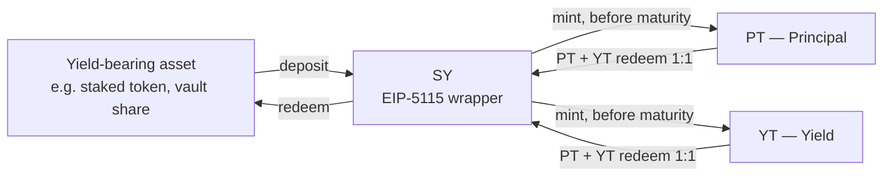

# Standardized Yield (SY)

Standardized Yield, or **SY**, is the foundation every Pendle V2 market is built on. It is a token wrapper that takes one specific yield-bearing asset — a staked token, a lending receipt, a vault share — and presents it through a single, uniform interface that the rest of Pendle knows how to talk to. This page explains what SY is, why Pendle needs it, how deposits and redemptions work, and — most importantly — why the SY contract is where the real risk of a pool lives.

If you have not yet seen the bigger picture of how Pendle splits an asset into principal and yield, start with [How Pendle works](/concepts/how-pendle-works) and come back here.

## Why SY exists

Yield-bearing assets are all different under the hood. A staked-ETH token rebases or grows in exchange rate; a lending-market receipt tracks an ever-increasing balance; an [ERC-4626](https://eips.ethereum.org/EIPS/eip-4626) vault share redeems for a growing amount of an underlying token. Each accrues yield in its own way, exposes its own functions, and reports its balances on its own terms.

Pendle's core machinery — the tokens that split principal from yield, the automated market maker, the oracle — cannot be rebuilt for every one of those assets. It needs one shape to build against. **SY is that shape.** It is defined by **[EIP-5115: Standardized Yield](https://eips.ethereum.org/EIPS/eip-5115)**, a token standard (co-authored by Pendle) that wraps an arbitrary yield source behind a common set of functions: deposit an accepted token to receive SY shares, redeem SY shares back for an accepted token, read an exchange rate, and enumerate the tokens the wrapper accepts on the way in and out.

Because every SY looks the same from the outside, everything downstream of it — the [Principal Token](/concepts/principal-tokens), the [Yield Token](/concepts/yield-tokens), the [AMM](/concepts/liquidity-and-amm), the pricing oracle — is written once and works for any asset that has been wrapped. SY is the adapter layer that makes a permissionless protocol possible: wrap a new asset in an SY, and the whole Pendle stack can operate on it without a single line of new code.

::: info The one-sentence version
SY is a uniform ERC-20 interface (EIP-5115) placed over a single yield-bearing asset, so that Pendle's principal/yield split and AMM can treat every asset identically.
:::

## Where SY sits in a market

Every Pendle market has exactly one SY at its base. Before a fixed **maturity** date, the SY can be split into a **Principal Token (PT)** and a **Yield Token (YT)**; those two together always reconstitute the SY, and can be minted from it or redeemed back into it one-for-one at any time before maturity. The AMM inside a market pairs PT against SY — not against the raw underlying asset — precisely because SY is the standardized, predictable side of that pair.

So an asset flows **into** an SY by deposit, and value flows **out** of the Pendle system either by redeeming SY back to the asset, or — at maturity — by redeeming PT for the underlying. The SY is the hinge the whole market turns on.

## Deposit and redeem

The two operations that define an SY are `deposit` and `redeem`.

- **`deposit`** takes one of the SY's accepted input tokens and mints SY shares to you. The number of shares reflects the asset's current exchange rate, so one SY share is a claim on a growing amount of the underlying as yield accrues.
- **`redeem`** burns SY shares and returns one of the accepted output tokens.

In normal use through OpenPendle you rarely call `deposit` or `redeem` in isolation. They sit underneath the higher-level actions on a market — minting PT + YT, buying PT or YT, adding liquidity — which route through Pendle's [Router](/reference/networks-and-contracts) and use the SY internally. When you mint PT + YT from the raw underlying asset, for instance, the Router deposits the asset into the SY and then splits the resulting SY for you, in a single transaction. Every such action is simulated against the live chain before you sign, and any token approval it needs is scoped to the exact amount (see [Minting & redeeming](/guides/minting-redeeming)).

### Accepted tokens: `getTokensIn` and `getTokensOut`

An SY does not necessarily accept the underlying asset itself. EIP-5115 lets a wrapper declare a list of tokens it will take on deposit and a list it will return on redeem, and the two lists need not match. The standard exposes them as:

- **`getTokensIn()`** — the tokens the SY accepts on `deposit`.
- **`getTokensOut()`** — the tokens the SY returns on `redeem`.

These lists are what OpenPendle reads to decide which tokens you can use for an action, and which you can exit into. When you create a market, they are also what determines the **seed token**: the asset you supply to bootstrap the pool must be something the SY's input list accepts. If that input list includes native ETH — signalled by the wrapper listing `address(0)` among its inputs — a deploy can send ETH directly as value with no approval; otherwise the exact seed amount is approved first (see [Deploying the market](/create/deploying-a-market)).

::: info Example — reading the token lists (illustrative)
Suppose an SY wraps a vault share `vASSET`. It might declare `getTokensIn()` as `[vASSET, ASSET]` — you can deposit either the vault share or the raw underlying, which it will wrap for you — and `getTokensOut()` as `[vASSET]`, meaning redemptions return the vault share only. The exact tokens are always the SY's own choice; these values are illustrative, not a live configuration. Always confirm the real lists for the specific SY you are looking at.
:::

## Rewards, at a high level

Some yield-bearing assets pay more than a rising exchange rate — they also emit separate reward tokens (governance tokens, third-party incentives). EIP-5115 accounts for this by letting an SY expose the reward tokens it accrues and letting holders claim their share. Pendle's AMM and yield contracts hold SY on your behalf, and Pendle's design forwards those accrued rewards back to the positions entitled to them, so that value is not stranded inside the wrapper.

Community pools created through Pendle are **not** eligible for native PENDLE gauge emissions or vePENDLE voting — those are reserved for team-listed markets. Extra rewards on a community pool instead come from off-chain **[Merkl](https://merkl.angle.money/)** campaigns. Some SY templates are built to plug into this: an upgradeable SY can be given an off-chain reward manager at deploy time, which enables a `claimOffchainRewards` path for Merkl-style distributions. Passing `address(0)` for that manager simply disables that path — the SY still works, it just does not carry the off-chain reward hook. Reward mechanics differ from asset to asset; treat the specifics of any given SY as something to verify, not assume. See [Community pools & incentives](/concepts/community-pools).

## SY is where the real risk lives

This is the most important part of the page. OpenPendle's provenance gate confirms that a market was created by a Pendle factory it recognizes before it lets you save or transact against it. That check is about **where the market came from — its provenance — not whether it is safe.** A perfectly factory-valid market can still be built on an SY that wraps a malicious, broken, or simply exotic asset. Almost every way a community pool can harm you traces back to the SY and the asset beneath it. Three properties deserve your direct attention.

### 1. Upgradeability

Some SY templates deploy a plain, immutable wrapper. Others — the adapter and no-redeem/no-deposit variants — deploy as **`TransparentUpgradeableProxy`** contracts, meaning the code behind the SY address can be replaced with different code later. For SYs created through Pendle's wizard, the admin of that proxy is **Pendle's ProxyAdmin at `0xA28c08f165116587D4F3E708743B4dEe155c5E64`**, which is controlled by Pendle governance. That is a meaningful trust assumption: the behaviour of an upgradeable SY is only as fixed as its upgrade authority chooses to keep it. An SY encountered in the wild may sit behind a different, unknown admin entirely.

### 2. Adapters

An **adapter** is a separate contract that teaches an SY how to talk to a specific yield source. Pendle's adapter SY templates deploy only the SY shell; the adapter — an `IStandardizedYieldAdapter` implementation whose `PIVOT_TOKEN` must line up with the wrapped asset (the yield token for the ERC-20 variant, or `vault.asset()` for the ERC-4626 variants) — is a per-asset contract the factory does **not** deploy. An adapter can also be absent at first: deploying with the adapter set to `address(0)` yields a plain 1:1 wrapper whose owner can later call `setAdapter` to point it at real logic. In other words, an SY's actual behaviour can depend on a contract that was supplied separately, or swapped in afterwards. You have to look at what the adapter is, not just that an SY exists.

### 3. The owner

An SY has an **owner**, and that owner holds privileged control — over the adapter, over upgrade-related actions on upgradeable variants, and over other administrative levers. SYs deployed through Pendle's wizard default their owner to **Pendle's governance proxy at `0x2aD631F72fB16d91c4953A7f4260A97C2fE2f31e`**. When a market is created via `PendleCommonPoolDeployHelperV2`, the caller receives the LP and YT, but **SY ownership goes to the SY's owner** — by default that governance proxy, not the deployer. An SY you find on-chain, however, may be owned by anyone. Who the owner is, and what they can do, is part of the asset's risk.

::: danger Provenance is not endorsement
[Community pools are permissionless and unreviewed](/concepts/community-pools) — anyone can create one, and interacting with them can lose you funds. OpenPendle validates market provenance but **cannot vouch for the assets or SY contracts underneath**. A factory-valid market can wrap an upgradeable SY, an unknown adapter, or an asset controlled by a stranger. Before you transact, inspect the SY and the asset yourself, and never interact with a pool unless you trust whoever created it and everything beneath it. Experimental — use at your own risk.
:::

## What SY can and cannot wrap

When an SY is created through Pendle's permissionless **`PendleCommonSYFactory`** (deployed at `0x466CeD3b33045Ea986B2f306C8D0aA8067961CF8`, the same address on all six supported networks), the templates it offers wrap a **standard ERC-20 or ERC-4626 asset**. Two important constraints follow from how SY accounting works:

| Constraint | Reason |
| --- | --- |
| **No native-ETH SY template** | The wrapper templates take an ERC-20 or ERC-4626 token. Native ETH can still *seed* a pool when the underlying SY already lists it as an input, but there is no template that wraps ETH itself. |
| **Fee-on-transfer tokens are blocked** | A token that skims a fee on every transfer breaks SY's share accounting and the liquidity-seeding math. |
| **Rebasing tokens are blocked** | A token whose balances change out from under the contract breaks redemption. |

These rules govern SYs made through the factory. They do not, and cannot, guarantee anything about an arbitrary SY that already exists on-chain — which is why the risk section above matters regardless of how an SY was born. If you are creating one, [Creating an SY](/create/standardized-yield) walks through the templates and their parameters in full.

## SY in one place

| Question | Answer |
| --- | --- |
| What is it? | An [EIP-5115](https://eips.ethereum.org/EIPS/eip-5115) wrapper — a uniform interface over one yield-bearing asset. |
| Why does it exist? | So Pendle's principal/yield split, AMM, and oracle can operate on any asset without custom code. |
| How do you get in and out? | `deposit` an accepted token for SY shares; `redeem` shares for an accepted token. |
| Which tokens are accepted? | Whatever the SY declares via `getTokensIn()` (deposit) and `getTokensOut()` (redeem). |
| Where is the risk? | In the SY and the asset under it — upgradeability, adapter, owner — never in the provenance check. |
| Can OpenPendle vouch for it? | No. It validates provenance only. Not affiliated with Pendle Finance. |

## See also

- [How Pendle works](/concepts/how-pendle-works) — the full picture SY fits into.
- [Principal Tokens (PT)](/concepts/principal-tokens) and [Yield Tokens (YT)](/concepts/yield-tokens) — what SY splits into.
- [Anatomy of a pool](/concepts/pool-anatomy) — the SY, PT, YT, and market addresses side by side.
- [Community pools & incentives](/concepts/community-pools) — why these markets are unreviewed.
- [Creating an SY](/create/standardized-yield) — the factory templates, adapters, and owner in practice.
- [Risks & disclosures](/reference/risks) — read before you transact.
