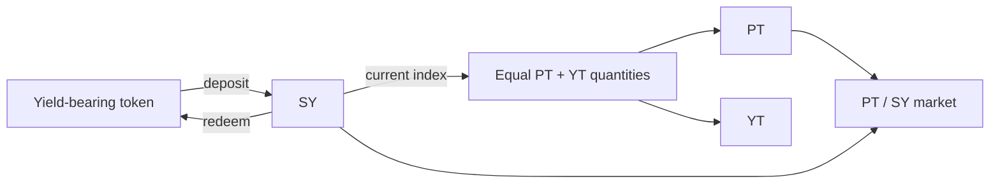

# Standardized Yield (SY)

**Standardized Yield (SY)** is the EIP-5115 wrapper at the base of a Pendle yield market. It presents different yield-bearing sources through one interface for deposits, redemptions, exchange-rate accounting, and rewards.

## Why SY exists

A staking token, lending receipt, and vault share can all accrue value differently. Pendle's PT/YT contracts and AMM need one consistent interface rather than custom logic for every source.

An SY reports:

- tokens accepted for deposit and redemption;
- an exchange rate into an **accounting asset**;
- the yield-bearing token or position it holds;
- reward tokens and claim behavior;
- standard preview and execution functions.

See Pendle's [Standardized Yield documentation](https://docs.pendle.finance/pendle-v2-dev/Contracts/StandardizedYield) and [EIP-5115](https://eips.ethereum.org/EIPS/eip-5115).

## Yield-bearing token and accounting asset

These terms are related but not interchangeable:

- The **yield-bearing token** is what the SY holds or manages.
- The **accounting asset** is the reference unit against which the SY exchange rate and PT principal are measured.

For an appreciating share token, one SY can become worth more accounting-asset units over time. That does not mean its raw token balance grows, and the exchange rate can also fall if the underlying system loses value.

## Where SY sits in a market

Before maturity, SY value can mint equal PT and YT quantities at the current index, and matching PT and YT can recombine into SY. One raw SY token is not generally equal to one PT plus one YT.

The market pairs PT with SY because SY is the standardized side of the position. YT trades route through the same market using mint/redeem and PT/SY operations.

## Deposit and redeem

EIP-5115 exposes two token lists:

- `getTokensIn()` returns accepted deposit tokens.
- `getTokensOut()` returns accepted redemption tokens.

The lists can differ. An SY might accept both a base token and a vault share while returning only the share. Always inspect the actual lists for the market you are using.

OpenPendle's higher-level actions use these routes internally. For example, minting from an accepted input can deposit into SY and then mint PT/YT in one router transaction. Quotes and simulations are estimates against current state; they do not guarantee unchanged execution conditions.

## Exchange-rate accounting

The SY exchange rate converts SY raw units into accounting-asset units:

$$
\text{asset value} = \text{SY amount} \times \text{exchange rate}
$$

Decimals and scaling vary by token. OpenPendle reads the SY's metadata and exchange rate rather than assuming a 1:1 wrapper.

Pendle's preview functions are intended for off-chain estimation and can be best-effort for unusual integrations. The final bounded transaction and wallet prompt remain the authoritative action.

## Rewards

An SY can expose rewards produced by its underlying protocol. Pendle then accounts for those rewards across YT and LP positions according to the relevant contracts.

Keep these streams separate:

- **SY-native yield and rewards** originate in the underlying protocol.
- **PENDLE incentives** depend on live whitelisting and Pendle's current incentive model.
- **External campaigns** use separate distributors; OpenPendle supports eligible Merkl claims on Positions.

See [Community pools & incentives](/concepts/community-pools) for the current distinction.

## The main SY risks

### Upgradeability

Some SYs are immutable implementations; others are proxies whose implementation can change. Identify the proxy admin and do not assume a familiar address implies immutable behavior.

### Adapters

Adapter-based SYs delegate part of their deposit/redemption behavior to another contract. An owner may be able to set or replace that adapter. Review both contracts and the pivot/accounting relationship.

### Owner and privileged roles

Ownership can control configuration, adapters, reward managers, or other administrative functions. Wizard defaults are not proof that an SY found in the wild uses those defaults.

### Underlying protocol

The SY cannot make a broken vault, lending market, staking system, or bridge safe. Exchange-rate loss, paused redemptions, and asset de-pegs flow through to PT, YT, and LP positions.

## Creating an SY through OpenPendle

OpenPendle supports a defined subset of PendleCommonSYFactory templates for ERC-20 and ERC-4626 inputs. The create UI probes token behavior and blocks assets it identifies or suspects are fee-on-transfer or rebasing, because those behaviors can break simple share accounting.

That screening belongs to OpenPendle's create flow. The factory itself should not be treated as enforcing compatibility, and an inconclusive browser/RPC probe is not an audit. Custom or pre-existing SYs can have entirely different behavior.

Native coin can be an accepted input for an existing SY, but OpenPendle's factory templates wrap token contracts rather than creating a native-coin asset contract. See [Creating an SY](/create/standardized-yield) for supported templates and current controls.

::: warning SY is the core asset trust boundary
A factory-valid market can still use an unsafe SY. Verify its accounting asset, outputs, implementation, owner, adapter, and underlying protocol. See [Community pools](/concepts/community-pools) and [Risks & disclosures](/reference/risks).
:::

## See also

- [Anatomy of a pool](/concepts/pool-anatomy)
- [Principal Tokens](/concepts/principal-tokens)
- [Creating an SY](/create/standardized-yield)
