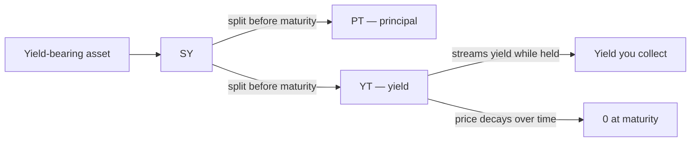

# Yield Tokens (YT)

A **Yield Token (YT)** is the right to **all the yield** a yield-bearing asset produces, from now until a fixed **maturity** date. When Pendle splits an asset into its principal and its yield, YT is the yield half. Holding YT is a **long-yield** position: you are betting that the asset will earn more yield, over the remaining time, than the market currently prices in.

This page assumes no prior Pendle knowledge. If terms like SY or PT are new, start with [How Pendle works](/concepts/how-pendle-works); YT is the natural counterpart to the [Principal Token (PT)](/concepts/principal-tokens), and the two are best understood together.

## Where YT comes from

Pendle V2 begins with a yield-bearing asset — a staked token, a lending receipt, a vault share — and wraps it in a **Standardized Yield (SY)** token, a uniform interface over many yield sources (see [Standardized Yield](/concepts/standardized-yield)). Before maturity, that SY can be **split** into two tokens:

- **PT (Principal Token)** — the principal, redeemable 1:1 for the underlying **at maturity**.
- **YT (Yield Token)** — the yield, entitling its holder to everything the underlying earns **until maturity**.

The two are joined by a single identity that governs everything below: `PT + YT = SY`.

You can **mint** one PT and one YT out of one unit of SY, and **redeem** a `PT + YT` pair back into SY, at any time before maturity, always 1:1. PT is the "keep my principal, lock a fixed rate" side; YT is the "keep only the yield, trade the variable rate" side. When you buy YT on its own, you are buying just the yield leg — someone else holds the matching PT.

## What YT actually pays you

While you hold YT, it does two things at once:

1. **It accrues yield.** Every unit of underlying yield the asset produces over the period accrues to YT holders, claimable as it streams in (Pendle's own protocol **YT interest fee** is taken on this yield by Pendle's contracts, not by OpenPendle). This is real, ongoing cash flow.
2. **It decays.** A YT is a claim on *future* yield only. As time passes, there is less future left, so each YT is a claim on a shrinking window. Its market price trends down over the life of the market and reaches **zero at maturity**, when there is no more yield left to claim.

So the total return on a YT position is the **yield you collect while you hold it**, set against the **price you paid** for that decaying claim. YT is not a "number goes up" asset; it is a stream of yield bought up front at a price.

::: info YT vs. PT at a glance
| | **PT (Principal Token)** | **YT (Yield Token)** |
| --- | --- | --- |
| You own | the principal | the yield |
| Position | short yield / fixed rate | long yield / variable rate |
| Price path to maturity | rises toward par | decays toward **0** |
| Pays out | 1:1 for underlying **at** maturity | yield **continuously**, until maturity |
| You profit when | you hold to maturity (fixed yield locked at purchase) | realized yield **beats** the implied yield you paid |
| Worth at maturity | = underlying | = **0** |
:::

## Implied yield: the price you are paying

Because PT and YT are split from the same SY, their prices are linked. The current PT price implies a fixed yield for the period — Pendle calls it the **Implied APY** (the fixed yield implied by the PT price). YT is priced as the mirror image: buying YT is effectively **paying that implied yield up front** in exchange for whatever yield actually shows up.

That gives YT a clean mental model:

- The **implied yield** is the market's forecast — the rate you pay when you buy YT.
- The **realized yield** is what the underlying actually earns over your holding period.
- Your YT position is **profitable when realized yield exceeds the implied yield you paid**, and a **loss when it falls short**.

Buying YT is therefore a directional view: *"I think this asset will yield more than the market currently expects."* Buying [PT](/concepts/principal-tokens) is the opposite view, or simply a preference for certainty.

## A worked example

::: info Example — illustrative figures only
The numbers below are made up to show the mechanics. They are **not** live rates, quotes, or guarantees for any real pool.

Suppose a market on some yield-bearing asset has **60 days** to maturity, and the current PT price implies a fixed yield of about **10% APY**. You buy **YT** for that asset — you are paying roughly a 10% implied yield for the next 60 days of that asset's yield.

**Scenario A — realized yield beats implied.** Over those 60 days the underlying actually earns at about **16% APY**. You collect that streamed yield as it accrues. Because you effectively paid for 10% and received 16%, you come out **ahead** — your YT return outpaces the cost baked into its price. The extra ~6% (annualized), on the notional your YT controls, is your profit.

**Scenario B — realized yield falls short.** Instead the asset yields only about **6% APY** over the period. You paid for 10% and received 6%, so you are **behind** — the yield you collected does not cover the decay in the YT's price. You take a **loss** on the position.

**At maturity, either way, each YT is worth 0.** The position's outcome is settled entirely by the yield you collected along the way versus what you paid.
:::

## Breakeven intuition

The single most useful number for a YT buyer is **breakeven**: the level of realized yield at which the yield you collect exactly offsets the price you paid (and the YT's decay to zero).

- **Realized yield = implied yield you paid → roughly break even.** The yield you stream in matches the cost embedded in the YT price.
- **Realized yield > implied → profit.** Every unit of yield above the implied rate is upside.
- **Realized yield < implied → loss.** Every unit below leaves you unable to recover what you paid for the decaying claim.

Time works against you mechanically — the YT is decaying toward zero the whole time — but the yield stream is what you are being paid to bear that decay. A helpful framing: **YT wins if the asset earns its keep faster than the market assumed; it loses if the asset underdelivers.** The closer maturity gets, the smaller the remaining yield window, so a given view has less and less time left to play out.

::: tip You do not have to hold to maturity
YT is tradable while the market is open. If your view plays out early — realized yield has already run hot, or the implied yield has repriced upward — you can **sell the YT back for SY** on the AMM and lock in the result, rather than riding it all the way to zero at maturity. Quotes update live as you type, and every trade [simulates before you sign](/reference/architecture).
:::

## The flow

Read it as: the asset becomes SY; SY splits into PT and YT; while you hold YT it pays out the underlying yield, and its own price grinds down to nothing by maturity. Your result is the yield collected minus the price paid.

## Risks

::: warning YT can lose money, and always ends at zero
- **It can underperform.** If the asset's **realized yield comes in below the implied yield you paid**, the yield you collect will not cover what you spent on the YT, and you take a loss. YT is a leveraged, directional bet on a *rate* — it is not a savings position.
- **It decays to zero.** A YT is worth **nothing at maturity** by construction. If you hold to the end, the entire return has to come from yield collected along the way; there is no residual value to recover. Ignoring the streamed yield and just watching the price will always look like a loss.
- **Time is against you.** As maturity nears, the remaining yield window shrinks, so a slow-to-materialize view has less room to pay off.
- **Underlying-yield risk.** YT's payoff depends on the real yield of the asset underneath. If that asset's yield collapses, is paused, or the asset itself breaks, the yield you were counting on may never arrive.
:::

::: danger Community pools are unreviewed
OpenPendle loads **permissionless, community-created** markets — anyone can deploy one, and none are vetted by Pendle or by OpenPendle. OpenPendle validates a market's **provenance** (that it came from a Pendle factory it recognizes) but **cannot vouch for the SY contract or the asset underneath** it. A factory-valid market can still wrap a malicious, broken, or exotic asset whose "yield" is fake or unclaimable — which is exactly the input a YT position depends on. Read the trust panel on each pool, and never buy YT on a market unless you trust who created it and what it wraps. Not affiliated with Pendle Finance. See [Community pools](/concepts/community-pools) and [Risks & disclosures](/reference/risks).
:::

## When YT suits you

YT is the right tool when:

- You have a **specific view that an asset will out-yield the market's forecast** over a defined period, and you want concentrated exposure to that view.
- You want **yield exposure without tying up full principal** — a given amount buys claim on the yield of a much larger notional, so YT is a capital-efficient (and correspondingly higher-variance) way to be long yield.
- You expect **rising or volatile rates** on the underlying and want to be positioned for them before the market reprices.
- You want to **hedge** a fixed-rate or principal position elsewhere by holding the offsetting yield leg.

YT is the **wrong** tool when you want your principal back with certainty, or a predictable fixed return — that is what [PT](/concepts/principal-tokens) is for — or when you would rather earn swap fees across the whole market via a [liquidity position](/concepts/liquidity-and-amm). If you are unsure which side you want, you are probably better served by PT or by staying out.

## See also

- [How Pendle works](/concepts/how-pendle-works) — yield tokenization from first principles.
- [Principal Tokens (PT)](/concepts/principal-tokens) — the fixed-yield counterpart to YT.
- [Standardized Yield (SY)](/concepts/standardized-yield) — the wrapper YT is split from.
- [Maturity & redemption](/concepts/maturity) — what happens at the end, when YT reaches zero.
- [Buying YT (yield exposure)](/guides/buying-yt) — how to take a YT position in OpenPendle.
- [Risks & disclosures](/reference/risks) — please read before you transact.
