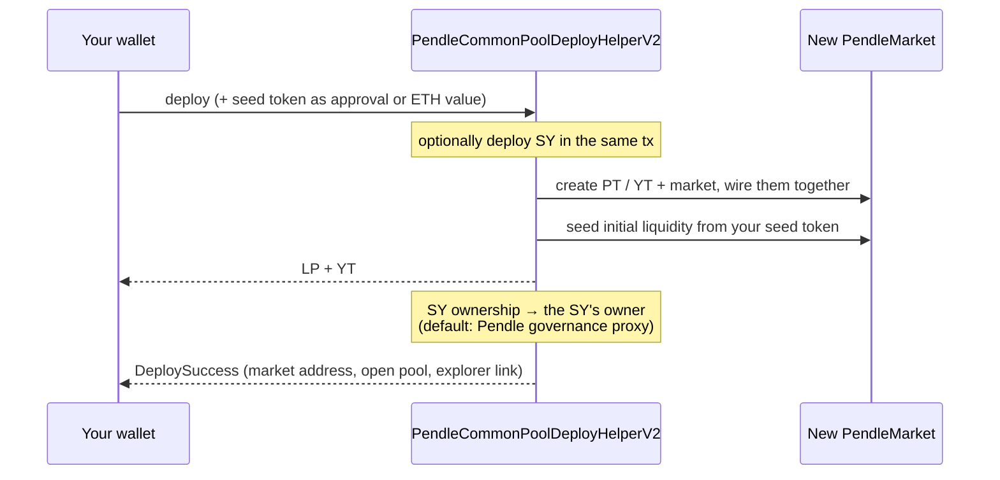

# Deploying the market

Deploying the market is the step that turns a [Standardized Yield (SY)](/concepts/standardized-yield) token into a live, tradable Pendle V2 pool. It is a single on-chain transaction, routed through Pendle's `PendleCommonPoolDeployHelperV2`, that creates the market and its yield contracts, seeds the pool's first liquidity, and hands you the resulting positions. This page walks through exactly what that transaction does, what token you seed it with, who ends up holding what afterward, and what the confirmation screen reports back.

This is the second half of the create flow. If you have not read [Create overview](/create/overview) for the two-piece picture — SY first, then the market — start there. If you still need an SY for your asset, [Creating a Standardized Yield](/create/standardized-yield) covers that; you can also deploy the SY and the market **together in the same transaction**, described below.

::: danger Deploying a market is a real, irreversible on-chain action
A deploy creates **real contracts** and moves **real value** into the pool as seed liquidity. There is no undo and no draft. You are calling a permissionless protocol directly — nobody reviews the market, the SY, or the asset first. Deploy only against an asset and SY you understand and have verified. Community pools are permissionless and unreviewed. Experimental — use at your own risk. Not affiliated with Pendle Finance.
:::

## One transaction: `PendleCommonPoolDeployHelperV2`

A Pendle market does not stand alone. It is wired to a PT, a YT, and an SY, all sharing one maturity and one underlying asset (see [Anatomy of a pool](/concepts/pool-anatomy)). Wiring those pieces together, creating the AMM, and putting the first liquidity into it would be several separate calls if you did it by hand. OpenPendle collapses the whole thing into **one transaction** by calling Pendle's deploy helper:

| Contract | Address (identical on all 6 networks) | Role in the deploy |
| --- | --- | --- |
| `PendleCommonPoolDeployHelperV2` | `0x2Ed473F528E5B320f850d17ADfe0e558f0298aA9` | Deploys the pool — optionally the SY and the market together — and seeds initial liquidity in a single call. |

Because the address is the same on every supported network, the same helper handles a deploy on Ethereum, BNB Smart Chain, Monad, Base, Plasma, or Arbitrum. Which network the transaction actually lands on is the [active network](/reference/networks-and-contracts) — a UI and `localStorage` choice — so confirm you are on the chain you intend before you sign.

::: info OpenPendle ships no contracts of its own
The helper, the factories, and every other contract a deploy touches are **Pendle's** deployed contracts. OpenPendle calls them with hand-written ABIs; it adds no contracts and takes no fee of its own. Pendle's own protocol fees still apply. OpenPendle is a gift to Pendle's community.
:::

### SY-only, or SY + market together

There are two shapes the deploy can take, depending on whether the SY already exists:

- **You already have an SY** for your asset and maturity → the helper deploys just the market on top of it.
- **You need an SY too** → the helper can deploy the SY *and* the market in the same transaction, so the pool exists after one signature rather than two.

Either way the outcome is the same live pool. Deploying the SY and market together is convenient, but note the ownership consequence in [Who receives what](#who-receives-what): a wizard-deployed SY defaults its owner to Pendle's governance proxy.

## What the deploy transaction does

Read the single call as three things happening atomically — if any part reverts, the whole transaction reverts and nothing is created:

1. **Create and wire the contracts.** The market's PT and YT (the yield contracts) are created and wired to the SY, all under one maturity.
2. **Seed initial liquidity.** The pool cannot open empty — an AMM with no reserves cannot quote or fill a swap. The helper seeds the first liquidity from the token you supply, so the pool is tradable the moment the transaction confirms.
3. **Distribute the positions.** You, the caller, receive the **LP and YT**; SY ownership goes to the SY's owner. See [Who receives what](#who-receives-what).

Every OpenPendle transaction is **simulated against the live chain before you sign**, and a deploy is no exception. The simulation is where a bad seed token, a broken SY, or an insufficient balance surfaces *before* you commit — not after.

## The seed token rule

Seeding is where most of the deploy's care goes, because it is where value leaves your wallet. The rule is simple to state and worth getting exactly right.

> **The seed token is whatever the SY accepts.** An SY publishes the set of tokens it takes in. You seed the pool with one of them.

Which token that is depends entirely on the SY you are building on — OpenPendle does not choose it for you. What *does* change mechanically is **how** the seed amount is delivered, and that splits into two cases.

### Case 1 — native ETH (the SY lists `address(0)`)

If the SY lists `address(0)` among its accepted inputs, it accepts **native ETH**. In that case the deploy sends the seed as `msg.value` — ETH travels **with the transaction itself**, so:

- There is **no approval step**. Native ETH is not an ERC-20 and cannot be `approve`d; it rides along as the transaction's value.
- You sign **one** transaction, not an approval followed by a deploy.

Native ETH is only ever a valid seed when the SY explicitly lists `address(0)`. It is a property of the SY, not of the network — even on the chains whose gas token is ETH, an SY that does not list `address(0)` will not take native ETH as seed.

### Case 2 — any ERC-20 the SY accepts (exact approval first)

If the seed token is an ERC-20 (anything other than native ETH), the pool contract must be allowed to pull it. OpenPendle uses an **exact-amount approval**: you approve **precisely the seed amount**, never an unlimited allowance. This typically means:

- One **approval** transaction for the exact seed amount, then
- The **deploy** transaction that seeds the pool.

Exact approvals are a deliberate safety default across OpenPendle — an approval that matches the amount you are actually committing cannot be drained beyond it later.

::: info There is no native-ETH SY — only native-ETH seeding
Native ETH can *seed* a pool, but there is **no native-ETH SY template**. SY templates wrap an ERC-20 or ERC-4626 asset. Native ETH enters the picture only when the SY you are building on happens to accept `address(0)` as one of its inputs. Creating the SY itself is covered in [Creating a Standardized Yield](/create/standardized-yield).
:::

::: warning Certain token behaviors break seeding
The create flow **blocks fee-on-transfer tokens** (they break SY accounting and liquidity seeding) and **rebasing tokens** (they break redemption). If your asset does either, it cannot be used — and this is enforced at SY creation, so a well-formed SY should not present a seed token that behaves this way. Still, verify what you are seeding: the seed leaves your wallet and there is no undo.
:::

### Seed token at a glance

| Seed token | Approval needed? | How it is delivered | When it applies |
| --- | --- | --- | --- |
| **Native ETH** | None | Sent as `msg.value` with the deploy | The SY lists `address(0)` among its inputs |
| **An ERC-20 the SY accepts** | Yes — **exact** seed amount | Approved, then pulled by the deploy | The SY does not accept native ETH (or you choose an ERC-20 input) |

## Who receives what

The deploy produces three kinds of position, and they do not all go to the same place. This is the single most important thing to understand before you sign — you keep the tradable positions, but you do **not** get ownership of the SY by default.

| Output | Goes to | What it is |
| --- | --- | --- |
| **LP** | **You** (the caller) | Your share of the pool's seeded liquidity — a claim on the PT/SY reserves that earns swap fees. See [Providing liquidity](/guides/providing-liquidity). |
| **YT** | **You** (the caller) | The [Yield Token](/concepts/yield-tokens) minted when seeding splits SY into PT + YT — a long-yield position that trends to 0 at maturity. |
| **SY ownership** | The **SY's owner** | The owner (privileged) role over the SY contract — **not** the SY tokens or your liquidity. |

The distinction that trips people up: **you receive the market positions (LP + YT), but ownership of the SY contract goes to the SY's owner, not to you.**

::: warning Ownership of the SY defaults to Pendle governance
When the SY was deployed through OpenPendle's wizard, its owner defaults to **Pendle's governance proxy** (`0x2aD631F72fB16d91c4953A7f4260A97C2fE2f31e`). Deploying the SY and market together therefore does **not** make you the SY owner. If you require a different owner — or you are building on a pre-existing SY with a custom owner — establish who controls the SY *before* you seed a pool with it. The SY is the contract closest to the money; [Anatomy of a pool](/concepts/pool-anatomy) covers why the SY owner matters to the pool's trust surface.
:::

## The `DeploySuccess` card

When the transaction confirms, OpenPendle shows a **`DeploySuccess`** card. It is your handoff from "creating" to "using," and it surfaces three things:

- **The new market address** — the `PendleMarket` contract you just deployed. This is the address you paste to load the pool, the one you [save](/guides/saved-pools), and the one you share — **not** the PT, YT, or SY address.
- **An "Open the pool" action** — loads the new market live in OpenPendle so you can immediately view it, [remember it](/guides/saved-pools), and trade or [add liquidity](/guides/providing-liquidity).
- **A block-explorer link** — opens the deploy transaction (or the market) on the active network's explorer, so you can verify the contracts on-chain.

::: tip Capture the market address now
Because OpenPendle has no backend and no account, nothing about your new pool is stored anywhere unless you save it. Use **"Open the pool"** and then **[remember the pool](/guides/saved-pools)** right away — the saved-pools registry lives in your browser's `localStorage` under `openpendle.pools.v1`, and you can export or share it later. Do not close the tab assuming the address is recorded for you.
:::

## After the deploy: two things to know

The market is live and tradable the instant the transaction confirms. Two follow-up matters are worth understanding, and both are optional.

### The price oracle starts at cardinality 1

A freshly deployed market starts with its TWAP oracle at **cardinality 1**. Trading, adding liquidity, and quoting **through OpenPendle work immediately** and do **not** require the oracle to be expanded. A one-time `increaseObservationsCardinalityNext` bump is what lets **other** protocols price your pool via TWAP — lending markets that take the PT as collateral, external dashboards, and the like. A one-click step is planned; for now you can call it from a block explorer, and it is **safe to skip** if nothing external needs to price the pool. Full detail in [Initializing the price oracle](/create/price-oracle).

### Incentives come from Merkl, not native gauges

A community pool is **not eligible** for native PENDLE gauge emissions or vePENDLE voting — those are reserved for team-listed markets. To reward LPs on a pool you deploy, run a [Merkl](https://merkl.angle.money/) campaign; rewards then accrue outside the native gauge system. See [Incentivizing your pool](/create/incentives).

## Worked example

::: info Example — illustrative only, not a live deploy
The tokens, amounts, and addresses below are invented to show the *shape* of a deploy. They are not a real pool or asset, and none of the figures are guaranteed or live.

**Scenario A — ERC-20 seed.** You are deploying a market on an existing SY that wraps a yield-bearing ERC-20 and accepts that same ERC-20 as an input. You choose to seed with roughly **10,000 units** of it.

1. OpenPendle simulates the deploy against the live chain — it passes.
2. Because the seed is an ERC-20, you first sign an **exact approval** for ~10,000 units (not unlimited).
3. You sign the **deploy**. The helper creates the PT/YT and market, seeds the pool, and returns **LP + YT** to your wallet. Because you deployed on an **existing** SY, its ownership is unchanged — it stays with whoever already owns that SY. (Only a *wizard-deployed* SY defaults to Pendle's governance proxy.)
4. The `DeploySuccess` card shows `0xMARKET…`, an **Open the pool** button, and an explorer link. You open the pool and remember it.

**Scenario B — native ETH seed.** The SY you are building on lists `address(0)` among its inputs, so it accepts native ETH. You seed with about **3 ETH**.

1. Simulation passes.
2. **No approval** — native ETH cannot be approved.
3. You sign **one** deploy transaction with ~3 ETH as its value (`msg.value`). You receive **LP + YT**; SY ownership goes to the SY's owner.
4. The `DeploySuccess` card appears with the new market address, the open action, and the explorer link.

The ~10,000 units, ~3 ETH, and any resulting pool balance are illustrative placeholders — real seed amounts and pool composition are yours to choose and will differ.
:::

## See also

- [Create overview](/create/overview) — the two-piece picture: SY first, then this deploy.
- [Creating a Standardized Yield](/create/standardized-yield) — deploy the SY this market is built on (optionally in the same transaction).
- [Initializing the price oracle](/create/price-oracle) — the optional cardinality bump that lets other protocols price your pool.
- [Incentivizing your pool](/create/incentives) — why community pools use Merkl instead of native PENDLE gauges.
- [Anatomy of a pool](/concepts/pool-anatomy) — the market, PT, YT, and SY a deploy wires together, and who owns the SY.
- [Providing liquidity](/guides/providing-liquidity) — what your LP position is and how to add to or exit it.
- [Saved pools](/guides/saved-pools) — remember the market address the `DeploySuccess` card gives you.
- [Networks & contracts](/reference/networks-and-contracts) — the active network a deploy lands on, and the shared addresses it uses.
- [Risks & disclosures](/reference/risks) — the full trust and risk surface before you deploy or transact.
