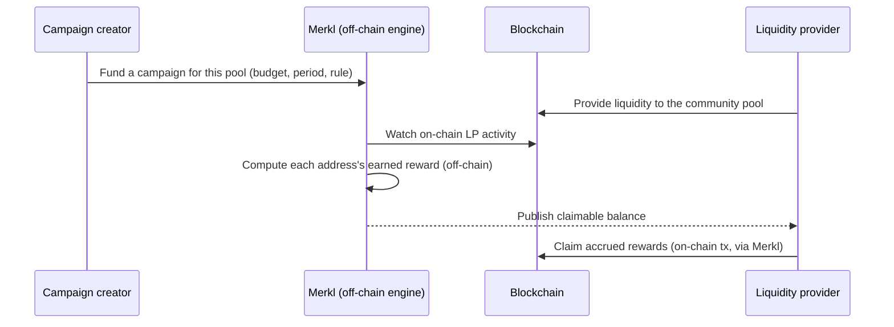

# Incentivizing with Merkl

A [community pool](/concepts/community-pools) is a Pendle V2 market that anyone deployed permissionlessly — the kind Pendle's own application does not list, and the kind OpenPendle exists to reach. Because these markets sit outside Pendle's curated set, they are **not eligible for the incentives that reward listed markets**: no native PENDLE gauge emissions, and no vePENDLE voting. If you have created a community pool and want to reward the people who provide liquidity to it, the route open to you is **[Merkl](https://merkl.angle.money/)**.

This page explains why native incentives are off the table for a community pool, how Merkl works at the level a pool creator and a liquidity provider each need, how those rewards reach [LPs](/concepts/liquidity-and-amm), the one place Pendle's `SY` contract can be wired to carry Merkl-style rewards, what OpenPendle surfaces about Merkl today and what is planned, and the honest limits on all of it.

This is a **Create** page. It assumes you already know what [PT](/concepts/principal-tokens), [YT](/concepts/yield-tokens), and [SY](/concepts/standardized-yield) are and how a Pendle market is assembled — if not, start with [How Pendle works](/concepts/how-pendle-works). OpenPendle is **not affiliated with, endorsed by, or operated by Pendle Finance**, and Merkl is a separate third party that OpenPendle neither runs nor speaks for.

## Why a community pool can't use native incentives

On Pendle, the headline reward on a listed market is usually **native PENDLE emissions**, routed to a market's liquidity providers by a **gauge** and directed each period by **vePENDLE** voting. That system is a shared, governance-controlled emission budget — and it is **reserved for markets the Pendle team has listed**.

A community pool is not part of it. It has no gauge, it cannot be voted on, and its LPs earn **no native PENDLE** for providing liquidity. This is a deliberate boundary: because anyone can spin up an unreviewed market, letting every one of them draw on a shared emission budget would be untenable, so that budget stays with the curated set. The full reasoning lives in [Community pools & incentives](/concepts/community-pools#why-community-pools-cannot-use-native-pendle-incentives); the practical consequence for a pool creator is simple.

| | Team-listed markets | Community pools |
| --- | --- | --- |
| Native PENDLE gauge emissions | Eligible | **Not eligible** |
| vePENDLE voting | Eligible | **Not eligible** |
| Extra-incentive route | Native gauges (and possibly Merkl) | **[Merkl](https://merkl.angle.money/) only** |
| Who funds the extra rewards | Pendle's emission budget, via governance | **Whoever chooses to** — you, the asset's protocol, or a third party |

If you want your community pool to offer more than swap fees, Merkl is the mechanism. Nothing forces you to: a pool with no incentives is perfectly normal — it simply earns [swap fees](/guides/providing-liquidity#where-the-return-comes-from) for its LPs.

## How Merkl works, at a high level

**[Merkl](https://merkl.angle.money/)** is a third-party incentive-distribution platform. It replaces the on-chain, governance-directed gauge with a model that is **permissionlessly funded off-chain and claimed on-chain**. Two halves make it work.

**Off-chain: the campaign.** Someone — a **campaign creator** — funds a **campaign** targeting a specific market and deposits a reward budget. The campaign specifies what it is rewarding (for a Pendle pool, providing liquidity), over what period, and by what rule. Merkl then watches the chain and, off-chain, computes how much each eligible address has earned based on its **on-chain activity** — how much liquidity it supplied and for how long. No emission is streaming on-chain the way a gauge streams PENDLE; the accounting happens in Merkl's engine and is published as a set of claimable balances, refreshed on Merkl's schedule.

**On-chain: the claim.** Accrued rewards do **not** arrive in an LP's wallet automatically as they provide liquidity. Eligible users **claim** their accumulated balance on-chain — a transaction, typically made through **Merkl's own interface** — which is when the reward tokens actually move. An address can let rewards build up and claim periodically; claiming is a normal signed transaction subject to gas on that chain.

The essential contrast with native incentives: a **gauge** is an *on-chain, governance-directed* stream available only to listed markets, while **Merkl** is an *off-chain-computed, permissionlessly-funded* distribution that is the only extra-incentive route open to a community pool. One is voted into existence by vePENDLE; the other is paid for by whoever decides the pool deserves rewards.

## How liquidity providers benefit

For someone providing liquidity to your pool, a Merkl campaign is a **bonus on top of the position's existing return**, not a change to how the position works. An [LP](/guides/providing-liquidity) already earns swap fees (in SY) plus the passive drift of the pooled PT and SY; a funded Merkl campaign adds a third stream, paid in whatever token the campaign creator chose.

What an LP should understand about that stream:

- **It is claimed separately, on Merkl.** Merkl rewards accrue off-chain and are claimed through Merkl on the schedule Merkl sets. They are **not** distributed by OpenPendle, and they do not land in the wallet automatically while trading. See [where an LP's return comes from](/guides/providing-liquidity#where-the-return-comes-from).
- **It is opt-in and not guaranteed.** A pool has a campaign only if someone funded one. **Many community pools have none.** A pool without incentives is not defective — it earns fees alone.
- **It is not permanent.** A campaign is funded for a period and can be topped up, altered, or allowed to lapse at any time. Rewards visible today may be gone next week. Treat any Merkl APR as a **variable bonus**, never as a fixed part of the return.
- **The reward token carries its own risk.** Rewards are paid in whatever token the campaign uses, which may differ from the pool's assets and has its own price and liquidity profile.

::: info Example — the reward stack (illustrative)
These numbers are invented to show the *shape* of an LP's return, not to quote any real pool. Suppose an LP in a community PT/SY pool earns, over some period, an illustrative **2%** from swap fees and **1.5%** from the pooled SY's native yield and PT accretion. If a third party has funded a Merkl campaign, they might **also** accrue an illustrative **0.5%** in Merkl rewards — claimed later, on Merkl, in the campaign's reward token. If no campaign is funded, that last line is simply **0%**, and the position still earns the rest. Read the composition, not the figures: Merkl is the top slice, and it is the one slice that can vanish without notice.
:::

## The SY-level hook for off-chain rewards

There is one place in Pendle's plumbing where Merkl-style distributions connect to the market itself: the **SY's off-chain reward manager**. This matters at *creation* time, because it is set when the SY is deployed and is not something OpenPendle can add afterward.

When you create an upgradeable or adapter SY through Pendle's `PendleCommonSYFactory` (`0x466CeD3b33045Ea986B2f306C8D0aA8067961CF8`), the constructor takes `constructorParams = (token, offchainRewardManager)`:

- Passing a real **`offchainRewardManager`** address wires up the SY's `claimOffchainRewards` path, through which Merkl-style off-chain rewards can flow via the SY.
- Passing **`address(0)`** is accepted and simply **disables `claimOffchainRewards`** — the SY still functions in every other respect; it just does not carry the off-chain reward hook.

::: info This is a per-market detail, not a default
Whether a given community pool's SY has an off-chain reward manager set is a property of **how that specific SY was deployed** — verify it, don't assume it. A campaign creator can also run a Merkl campaign that pays LPs directly, without relying on this SY path at all. The hook is one route for off-chain rewards, not a prerequisite for having any. For the full template and parameter picture, see [Creating an SY](/create/standardized-yield).
:::

Because this manager is fixed in the SY's constructor, decide it **before** you deploy. If you already know a campaign will route rewards through the SY, set a real manager; if you are unsure, `address(0)` keeps the SY simple and loses nothing you cannot arrange another way. The rest of the create flow — [deploying the market](/create/deploying-a-market) and the optional [oracle initialization](/create/price-oracle) — is unaffected by this choice.

## Running a campaign on your pool

OpenPendle does **not** create or fund Merkl campaigns — it ships no contracts of its own, takes no fee of its own, and is not affiliated with Merkl or Pendle. Funding a campaign happens on **[Merkl](https://merkl.angle.money/)**, on Merkl's terms. At a high level a pool creator who wants to incentivize LPs:

1. **Deploys the pool** through OpenPendle in the usual way — see [Deploying the market](/create/deploying-a-market). A community pool is a real `PendleMarket`; its address is what any incentive program targets.
2. **Decides the SY reward path** at SY-creation time, per the section above — set an `offchainRewardManager` if rewards should route through the SY, or `address(0)` if not.
3. **Sets up the campaign on Merkl**, targeting the market and depositing a reward budget over a chosen period. The specifics — supported chains, reward rules, budgets, and fees — are Merkl's, and are documented on Merkl, not here.
4. **Tells your LPs where to claim.** Because rewards are claimed on Merkl rather than inside OpenPendle today, point liquidity providers to Merkl so they know a campaign exists and how to claim it.

Everything an LP does *in* OpenPendle — [adding and removing liquidity](/guides/providing-liquidity) — routes through Pendle's **Router V4** at `0x888888888889758F76e7103c6CbF23ABbF58F946`, exactly as it would without a campaign. The campaign changes what an LP *earns*, not how they interact with the pool.

## What OpenPendle surfaces today

OpenPendle stays deliberately thin here, in keeping with its backend-free design: it has **no indexer and no backend**, and Merkl's campaign accounting lives entirely off-chain on Merkl's own infrastructure. So OpenPendle does not — and by architecture cannot without help — compute Merkl APRs or reward balances itself.

What it does today is **surface the Merkl nudge**: it makes clear that community pools use Merkl rather than native gauges for extra rewards, and points you toward [Merkl](https://merkl.angle.money/) as the place campaigns are funded and claimed. It does not, at present, display live campaign details or let you claim rewards from inside the app.

::: tip Planned, not shipped
Richer Merkl support — displaying a pool's active campaign and letting LPs claim from inside OpenPendle — is **planned for a later release**, alongside other one-click steps such as the [oracle cardinality bump](/create/price-oracle). Until it ships, treat Merkl as an **external step**: check for and claim campaigns on [Merkl](https://merkl.angle.money/) directly. Do not wait for an in-app claim button before claiming rewards you have earned.
:::

This mirrors how OpenPendle handles anything that lives off-chain or beyond a single Pendle contract call: it reads what it can straight from the chain via public RPC and points you to the authoritative external source for the rest, rather than standing up a backend to intermediate it. See [How OpenPendle works](/reference/architecture) for the reasoning behind that posture.

## The limits, stated plainly

::: warning Merkl rewards are a variable bonus you claim elsewhere — and they cushion nothing
Merkl rewards on a community pool are **third-party-funded, off-chain-computed, not guaranteed, and can stop at any time** — many pools have none at all. They are **claimed separately on [Merkl](https://merkl.angle.money/)**, not inside OpenPendle, and OpenPendle does not distribute, quote, or vouch for them. Crucially, no Merkl campaign changes the pool's underlying risk: there is **no gauge, no vePENDLE backing, and no guaranteed reward** to cushion a loss. If the unreviewed asset beneath the pool is malicious, broken, or simply fails, the [PT](/concepts/principal-tokens) may **not** redeem at par and an [LP](/concepts/liquidity-and-amm) position can lose value — a Merkl bonus does not offset that. **OpenPendle validates market provenance but cannot vouch for the assets or SY contracts underneath.** Community pools are permissionless and unreviewed — anyone can create one, and interacting with them can lose you funds. Experimental — use at your own risk. Not affiliated with Pendle Finance.
:::

Merkl is genuinely useful — it is how a community pool can compete for liquidity without access to native emissions. But it is a **bonus layered on top of a position whose base risk is unchanged**, paid by whoever chose to fund it, for as long as they choose to. Reason about the pool on its own merits first — the asset, the [SY](/concepts/standardized-yield), and the mechanics of [providing liquidity](/guides/providing-liquidity) — and treat any incentive as the top, most disposable slice of the return.

## Incentives at a glance

| Question | Answer |
| --- | --- |
| Can a community pool earn native PENDLE? | No — gauge emissions and vePENDLE voting are reserved for team-listed markets. |
| What replaces native incentives? | [Merkl](https://merkl.angle.money/) campaigns — off-chain-funded, on-chain-claimed. |
| Who funds a campaign? | Anyone who chooses to — the pool creator, the asset's protocol, or a third party. |
| Is a campaign guaranteed or permanent? | No. Many pools have none, and a funded one can lapse at any time. |
| How do LPs receive rewards? | They **claim** on-chain, typically on Merkl's interface — not automatically, not in OpenPendle. |
| What is the SY hook? | An `offchainRewardManager` set at SY creation enables `claimOffchainRewards`; `address(0)` disables it. |
| What does OpenPendle show today? | It surfaces the Merkl nudge and links out; richer campaign display and in-app claiming are planned. |
| Does OpenPendle take a cut? | No — it takes no fee of its own and is not affiliated with Merkl or Pendle. |

## See also

- [Community pools & incentives](/concepts/community-pools) — why native incentives are reserved for listed markets, in full.
- [Providing liquidity](/guides/providing-liquidity) — what an LP position earns, including how Merkl fits the return.
- [Creating an SY](/create/standardized-yield) — the `offchainRewardManager` parameter and the SY templates that carry it.
- [Deploying the market](/create/deploying-a-market) — creating the community pool a campaign would target.
- [Initializing the oracle](/create/price-oracle) — the other optional, planned one-click step in the create flow.
- [Risks & disclosures](/reference/risks) — the full risk surface before you transact.
- [Merkl](https://merkl.angle.money/) — the external platform where campaigns are funded and rewards are claimed.
