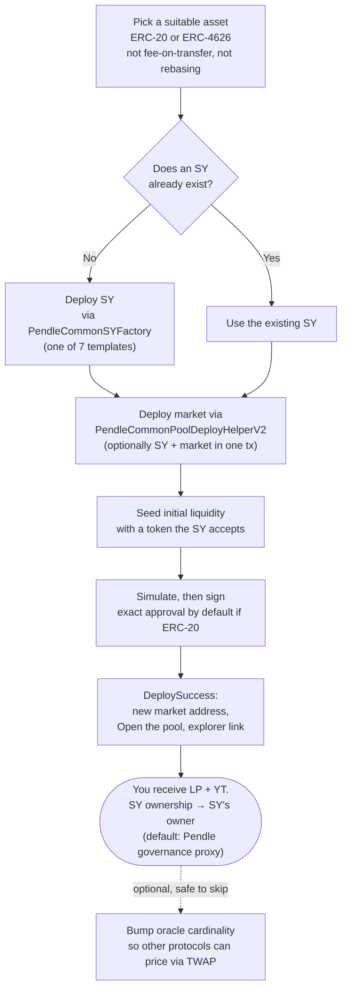

# Creating a pool: overview

OpenPendle can deploy a brand-new Pendle V2 market from your own wallet — permissionlessly, on any of the six supported networks. Nobody grants you permission and nobody reviews the result: you call Pendle's public deployment contracts directly, and a real market comes into existence at the end of the transaction. This page is the map of that process. It explains why creation is permissionless, the two pieces every market is built from, what you need in hand before you start, the single most important warning to internalize first, the end-to-end flow at a glance, and exactly what lands in your wallet when it succeeds. Each stage links to its own detailed page.

This is a create page, not a concept page. It assumes you already know what a Pendle market is and how [SY](/concepts/standardized-yield), [PT](/concepts/principal-tokens), and [YT](/concepts/yield-tokens) relate. If any of that is unfamiliar, read [How Pendle works](/concepts/how-pendle-works) and [Anatomy of a pool](/concepts/pool-anatomy) first — the rest of this section builds on that vocabulary.

::: danger This is an advanced, irreversible action — read this first
Creating a pool deploys **real contracts** and seeds **real liquidity** on a **permissionless protocol**. There is **no undo, no admin to reverse it, and no support desk.** Once the transaction confirms, the market exists on-chain forever, your seed capital is committed to it, and any mistake — a wrong asset, a fee-on-transfer token that slips through, a malformed template, a bad price at seeding — is yours to live with. The market you create is, by definition, a [community pool](/concepts/community-pools): unreviewed by anyone, including Pendle. OpenPendle simulates and validates provenance, but it **cannot** make a bad asset safe or a mistaken deploy reversible. Do not create a pool unless you fully understand the asset you are wrapping, the [SY](/concepts/standardized-yield) template you are choosing, and the consequences of seeding liquidity at the price you set. Experimental — use at your own risk. Not affiliated with Pendle Finance.
:::

## Creation is permissionless

Pendle V2 is a permissionless protocol. The contracts that create markets — Pendle's factories and its deployment helper, `PendleCommonPoolDeployHelperV2` at `0x2Ed473F528E5B320f850d17ADfe0e558f0298aA9` — do not ask who is calling or what asset is being wrapped. Anyone with a wallet, a suitable asset, and seed capital can deploy a new market. There is no whitelist to join, no application to file, and no approval to wait for.

That openness is the entire reason OpenPendle exists. Pendle's own application lists a curated set of markets; every market it does **not** list is one you can still create and use here. But permissionless creation cuts both ways, and the trade is worth stating plainly:

- **No gatekeeper means no safety net.** Nobody vets the asset, the SY, or you. The provenance gate that protects users of an *existing* pool only confirms a market descends from a genuine Pendle factory — it is a statement about *origin*, not *quality*. When you create a pool, you are the one whose judgment stands in for the review that no one else will perform. See [Community pools & incentives](/concepts/community-pools).
- **No native incentives.** A community pool cannot draw native PENDLE gauge emissions or vePENDLE votes; those are reserved for team-listed markets. Extra rewards, if any, come through [Merkl](https://merkl.angle.money/). See [Incentives](/create/incentives).
- **OpenPendle ships no contracts of its own.** It calls Pendle's deployed factories and helper with hand-written ABIs, and takes **no fee of its own** — Pendle's own protocol fees still apply. Creation is Pendle's mechanism; OpenPendle is only the interface that drives it.

## The two pieces: an SY, then the market

Every Pendle market is built on a **[Standardized Yield (SY)](/concepts/standardized-yield)** token — an [EIP-5115](https://eips.ethereum.org/EIPS/eip-5115) wrapper that gives a yield-bearing asset a uniform interface. A market splits that SY into [PT](/concepts/principal-tokens) and [YT](/concepts/yield-tokens) and runs the [AMM](/concepts/liquidity-and-amm) that trades PT against SY. So creating a pool is always two logical steps, in this order:

1. **An SY must exist for your asset.** Either one already exists, or you deploy one from Pendle's permissionless `PendleCommonSYFactory` (`0x466CeD3b33045Ea986B2f306C8D0aA8067961CF8`). The SY is what everything downstream is built on.
2. **The market is deployed on top of that SY.** This creates the PT and YT (yield) contracts, creates the `PendleMarket`, and seeds its initial liquidity.

These two steps have their own dedicated pages — [Creating an SY](/create/standardized-yield) and [Deploying a market](/create/deploying-a-market) — because each has real depth (template choice, adapters, ownership, the seed token, oracle state). The rest of this page is the orientation that ties them together.

::: info You do not always deploy both
If a suitable SY for your asset already exists, you skip straight to deploying the market against it. Only when no SY exists — the common case for a genuinely new asset — do you deploy one first. OpenPendle can do either.
:::

### One transaction can do both

You are not forced to send two separate transactions. Pendle's `PendleCommonPoolDeployHelperV2` (`0x2Ed473F528E5B320f850d17ADfe0e558f0298aA9`) can deploy the **SY and the market together in a single transaction** — it optionally creates the SY, then creates the yield contracts and market, then seeds liquidity, all atomically. Either the whole thing succeeds or none of it does. The [Deploying a market](/create/deploying-a-market) page covers when to bundle the SY in versus deploy it separately first.

## Prerequisites

Three things need to be true before you begin. None is optional.

| Prerequisite | Why it matters | Where to check |
| --- | --- | --- |
| **A suitable asset** | The SY templates wrap an **ERC-20** or **ERC-4626** token. There is **no native-ETH SY template**, **fee-on-transfer tokens are blocked** (they break SY accounting and liquidity seeding), and **rebasing tokens are blocked** (they break redemption). Your asset must be a plain, standards-conformant token. | [Creating an SY](/create/standardized-yield) |
| **Gas on the target chain** | The deploy is a transaction on one specific network. You need the chain's native coin to pay for it — ETH on Ethereum, Base, and Arbitrum; BNB, MON, or XPL on BNB Smart Chain, Monad, and Plasma. The **active network** (localStorage key `openpendle.chain`, default Arbitrum) decides which chain the deploy is sent to. | [Networks & contracts](/reference/networks-and-contracts) |
| **Understanding of what you are doing** | You are seeding a live, unreviewed market that anyone can then trade against. You must understand the asset, the SY template you pick, the seed amount and the price it implies, and the fact that all of it is irreversible. There is no one to correct a mistake after the fact. | This page and the [Risks](/reference/risks) reference |

You also need an **injected wallet connected on the target chain**. OpenPendle is injected-only — MetaMask, Rabby, Brave, or any injected EIP-6963 provider, with no WalletConnect and no third-party relay. If the wallet is on a different chain, a wrong-network banner offers a one-click switch. See [Connecting a wallet](/guides/connecting-a-wallet) and [Browsing & networks](/guides/browsing).

::: warning Confirm the network before you deploy
A market lives on exactly one chain, and the deploy is sent to whatever the active network is at the moment you sign. Deploying to the wrong chain is not reversible — you would have to create a second market on the correct chain and abandon the first, having spent gas and seed capital on both. Check the active network, and check that your wallet is on it, before you start.
:::

## The end-to-end flow at a glance

From choosing an asset to holding your new position, the full path looks like this. The bracketed steps are optional — the SY deploy is skipped if one already exists, and the oracle bump is a post-deploy nicety, not a requirement.

Read the flow left of the fork as *establishing the SY*, the middle as *the single deploy transaction*, and the right as *what you receive and the optional follow-up*. Only two of these stages require you to sign: approving the seed token (skipped when you seed with the chain's native coin) and the deploy itself. Everything before signing — the quote and the simulation — is read-only.

### Every deploy is simulated before you sign

As with every action in OpenPendle, the deploy transaction is **simulated against the live chain before you sign it**. A call that would revert is caught first, so you are not left having paid gas for a failed deploy because of a bad parameter. Approvals for the seed token default to the **exact amount** you are committing. Unlimited approval requires an explicit transaction-setting opt-in and leaves greater standing exposure. Neither safeguard makes an unreviewed asset safe; they make the *act of deploying* honest and legible. See [How OpenPendle works](/reference/architecture).

## What you will receive

When the deploy transaction confirms, three things happen to ownership, and it is important to know which pieces are yours.

- **You receive the LP position.** Seeding the market issues you **LP tokens** — a pro-rata claim on the market's initial PT/SY reserves. You are the pool's first liquidity provider. LP positions earn swap fees (and any [Merkl](https://merkl.angle.money/) rewards) and carry AMM / impermanent-loss risk plus PT-vs-SY exposure. See [Liquidity & the AMM](/concepts/liquidity-and-amm).
- **You receive the YT.** Seeding also delivers the **[YT](/concepts/yield-tokens)** created for the market to your wallet — the long-yield leg, holding the right to the underlying's yield until maturity and trending to zero as maturity approaches.
- **SY ownership goes to the SY's owner.** You do **not** receive control of the SY. Ownership goes to whoever the SY's owner is — for an SY deployed through the wizard, that defaults to **Pendle's governance proxy** (`0x2aD631F72fB16d91c4953A7f4260A97C2fE2f31e`), not to you. Deploying a market is not the same as owning the machinery underneath it.

::: info Example — what lands in your wallet (illustrative)
These figures are invented to show the *shape* of the outcome, not a real deploy. Suppose you seed a new market with an illustrative **10,000** units of the asset the SY accepts, at a price that implies roughly a 60% PT / 40% SY split. When the transaction confirms, you would hold a new **LP** position representing your share of that seeded liquidity, plus the market's **YT** in your wallet. The SY that was created (or reused) is owned by Pendle's governance proxy, not by you. The exact LP and YT amounts depend on the asset's decimals, the seed size, and the initial price — the 10,000 and 60/40 here are illustrative only, never a live or guaranteed figure.
:::

After it confirms, the **DeploySuccess** card shows the **new market address**, an **"Open the pool"** action that loads the market live so you can trade and save it, and a **block-explorer link**. Opening the pool runs it through the normal [provenance gate](/reference/architecture) — which your fresh, factory-deployed market passes — and lets you [remember it](/guides/saved-pools) so you can return to manage the position and redeem at maturity.

### One optional follow-up: the price oracle

A freshly deployed market starts with a TWAP oracle cardinality of **1**. A one-time cardinality bump (`increaseObservationsCardinalityNext` on the market) lets **other** protocols price your pool via TWAP — lending markets that take the PT as collateral, dashboards, and the like. It is **not required** to trade, add liquidity, or quote through OpenPendle; those work immediately. A one-click step is planned; for now, if you need it, call the function from a block explorer. It is safe to skip. See [Initializing the price oracle](/create/price-oracle).

## Where to go next

Each stage of creation has a page that goes deep on its specifics and its risks.

| Stage | Page | What it covers |
| --- | --- | --- |
| **1. The SY** | [Creating an SY](/create/standardized-yield) | The 7 factory templates (basic, with-adapter, no-redeem/no-deposit), ERC-20 vs ERC-4626 assets, adapters, off-chain reward managers, ownership, and the blocked-token rules. |
| **2. The market** | [Deploying a market](/create/deploying-a-market) | The single deploy transaction, bundling the SY, choosing and approving the seed token, native-ETH seeding, and reading the DeploySuccess card. |
| **Optional** | [Initializing the price oracle](/create/price-oracle) | The cardinality bump, who needs it, and why it is safe to skip. |
| **Rewards** | [Incentives](/create/incentives) | Why community pools use Merkl instead of native gauges, and how to fund a campaign. |

## See also

- [Creating an SY](/create/standardized-yield) — step one: the SY template your market is built on.
- [Deploying a market](/create/deploying-a-market) — step two: the single transaction that creates and seeds the pool.
- [Community pools & incentives](/concepts/community-pools) — what "permissionless and unreviewed" means for the market you create.
- [Anatomy of a pool](/concepts/pool-anatomy) — the market, PT, YT, and SY contracts and how they wire together.
- [Networks & contracts](/reference/networks-and-contracts) — the shared factories and per-chain addresses a deploy uses.
- [Saved pools & privacy](/guides/saved-pools) — remember the market you just created so you can return to it.
- [Risks & disclosures](/reference/risks) — please read before you create or transact.
