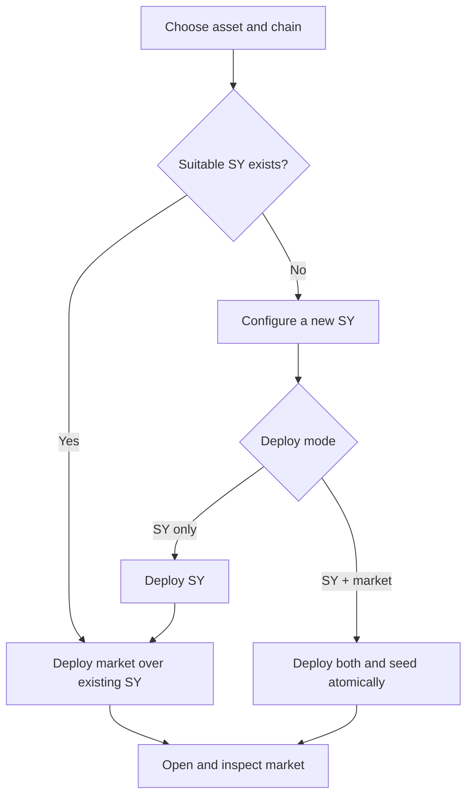

# Creating a pool: overview

OpenPendle can call Pendle's permissionless factories from your wallet to deploy an SY, a market, or both. The resulting contracts and seed liquidity are real and irreversible.

::: danger Advanced, irreversible action
No OpenPendle or Pendle review happens before a permissionless deployment. Verify the asset, template, owner, maturity, pricing band, fee, network, and seed amount yourself. Simulation can catch a call that would revert under current state; it cannot make a bad design safe.
:::

## The two pieces

Every Pendle market is built on a [Standardized Yield (SY)](/concepts/how-pendle-works#stage-1-standardize-the-yield-source):

1. **SY:** a Pendle-compatible wrapper for the yield-bearing asset.
2. **Market:** PT, YT, and the PT/SY AMM for one maturity, created and initially seeded through Pendle's deployment helper.

If a suitable SY already exists, start directly with [Deploying the market](/create/deploying-a-market). Otherwise use [Creating an SY](/create/standardized-yield). The SY wizard can deploy the new SY and its first market atomically in one transaction.

OpenPendle ships no smart contracts of its own. These flows invoke Pendle's deployed `PendleCommonSYFactory` and `PendleCommonPoolDeployHelperV2`.

## Before you start

You need:

- a standard ERC-20 or ERC-4626 asset suitable for the selected SY template;
- gas on the target chain;
- seed capital for a new market;
- an injected wallet on the correct chain; and
- an independent understanding of the asset and configuration.

The wizard screens for fee-on-transfer and common rebasing behavior. Suspected unsafe tokens are blocked. An inconclusive unseeded SY-only screen can require an explicit override; that override is not a safety certification.

## Choose the flow

### Market over an existing SY

The `/create` flow reads the SY's accepted input tokens. You choose a seed token and amount, configure maturity, rate band, launch APY, and fee, then approve and deploy.

If the existing SY lists `address(0)`, native-coin seeding is available and needs no ERC-20 approval. Otherwise the seed token is an ERC-20 or the SY itself.

### New SY only

The `/create-sy` flow deploys the selected template through Pendle's common SY factory. No seed approval is needed. The result can be passed into the market wizard later.

### New SY and market together

The combined wizard deploys the SY, PT/YT, and market and seeds liquidity in one atomic transaction. It always seeds with the selected ERC-20 or ERC-4626 asset; the helper wrappers used by this path are not payable, so **native seeding is not available in the combined flow**.

## SY ownership

The wizard offers two owner choices:

| Choice | Effect |
| --- | --- |
| **Pendle governance** (default) | The Pendle governance proxy owns the SY. This avoids giving the deployer unilateral pause/adapter control. |
| **Keep ownership** (advanced) | The connected wallet owns the SY and can use privileged functions such as pause and, for adapter templates, `setAdapter`. Markets built on it show a non-Pendle-owner warning. |

Upgradeable templates also depend on Pendle's ProxyAdmin, regardless of which SY owner you choose. Ownership is a trust decision, not a reward or LP position.

## Approval and signing

For an ERC-20 seed, OpenPendle defaults to an exact approval for the seed amount; Unlimited is a separate transaction-setting opt-in. After approval, OpenPendle simulates the final call again before asking the wallet to send it.

The configured OpenPendle RPC handles reads and simulation. The injected wallet broadcasts through its own provider, so verify the chain in the wallet prompt.

## What you receive

- **SY-only:** the new SY address and a link into the market wizard.
- **Market deployment:** the new market address, LP position, and YT returned by Pendle's helper.
- **Combined deployment:** both SY and market addresses plus the seeded LP/YT position.

SY contract ownership goes to the owner selected in the wizard; it is not the same thing as holding SY tokens, LP, or YT.

After confirmation, open the market and save it locally. A newly deployed market may not appear in Explore until a later complete catalog refresh.

## Optional follow-ups

- **Oracle observations:** raise `increaseObservationsCardinalityNext` only if an external protocol needs a TWAP. Trading and liquidity work without it. See [Initializing the price oracle](/create/price-oracle).
- **Incentives:** deployment does not automatically enroll a pool in Pendle's current AIM program. OpenPendle does not create external incentive campaigns. See [Incentives](/create/incentives).

## Detailed steps

| Stage | Reference |
| --- | --- |
| Select and configure an SY | [Creating an SY](/create/standardized-yield) |
| Configure, seed, and deploy a market | [Deploying the market](/create/deploying-a-market) |
| Enable an external TWAP consumer | [Initializing the price oracle](/create/price-oracle) |
| Understand AIM, external campaigns, and Merkl claims | [Incentives](/create/incentives) |

Read [Risks & disclosures](/reference/risks) before deploying or funding a community market.
