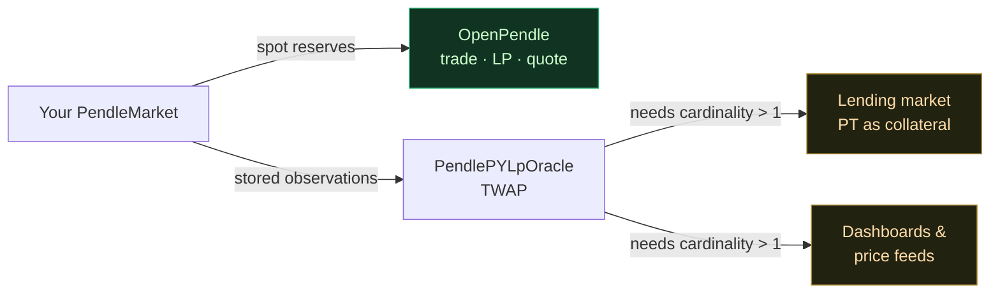

# Initializing the price oracle

When [deploying the market](/create/deploying-a-market) finishes, you hold LP and YT, the pool trades, and quotes update live in OpenPendle. There is one more on-chain switch you *can* throw, and it is the first thing a newly deployed market does **not** have set up for you: its price oracle. This page explains what that oracle is, why a fresh market starts with it effectively switched off, the single transaction that turns it on, who actually needs it (and who does not), and why skipping it is a perfectly safe default.

The short version: a brand-new market starts with a **TWAP oracle cardinality of 1**. A one-time **`increaseObservationsCardinalityNext`** call expands it so that **other** protocols can price your pool. It is **not** required to trade, add liquidity, or quote through OpenPendle. A one-click step is planned; for now you call it from a block explorer if you need it. It is safe to skip.

## What the oracle is

Every Pendle market exposes its prices two different ways, and it is worth keeping them straight because only one of them depends on the step described here.

- The **spot quote** is what OpenPendle shows you as you type. It is read live from the market's current reserves and updates on every keystroke. It exists the instant the market is deployed and needs no setup.
- The **TWAP oracle** is a *time-weighted average price*. Instead of the price right now, it reports an average of the PT / YT / LP price over a window (say, the last 30 minutes), smoothed across a series of stored observations. Pendle serves these averages through a shared oracle contract, **`PendlePYLpOracle`** (`0x5542be50420E88dd7D5B4a3D488FA6ED82F6DAc2`), which is deployed identically on all six supported networks.

A time-weighted average is deliberately sluggish. That is the point: a TWAP is far harder to push around with a single large trade than a spot price is, which is exactly the property a lending market wants before it will lend against a token. The trade-off is that the market has to *store* a history of observations to compute the average — and storing that history is what a fresh market has not been told to do yet.

::: info Spot vs. TWAP at a glance
| | Spot quote | TWAP oracle |
| --- | --- | --- |
| Reports | The price right now | An average over a time window |
| Source | Market reserves, read live | `PendlePYLpOracle`, from stored observations |
| Available at deploy? | Yes, immediately | Needs cardinality expanded first |
| Who reads it | OpenPendle's quote box | **Other** protocols pricing your pool |
| Reacts to one big trade | Instantly | Slowly (that is the safety feature) |
:::

## Why a fresh market starts at cardinality 1

"Cardinality" is the number of price observations the market keeps room to store. A market at **cardinality 1** keeps room for exactly one — it records the latest observation and overwrites it every time, so there is no history to average across. A TWAP needs at least two points spread out in time, and in practice many more, to produce a meaningful window. So while a cardinality-1 market technically has an oracle, that oracle cannot yet return a useful time-weighted price over any real window.

Pendle deploys markets this way on purpose. Growing the observation buffer costs storage — and therefore gas — and most of that cost is paid by whoever expands it. Rather than charge every deployer for a feature many pools never need, Pendle starts the buffer at its minimum and lets whoever *does* need the TWAP pay to grow it. For a community pool created through OpenPendle, that "whoever" is you, the deployer — but only if the pool is going to be consumed by something that reads the TWAP.

## The one-time bump: `increaseObservationsCardinalityNext`

Expanding the buffer is a single call, made directly on the `PendleMarket` contract you just deployed:

```
increaseObservationsCardinalityNext(uint16 cardinalityNext)
```

You pass the target number of observations you want the market to be able to store. The market allocates the additional storage slots; from then on it records observations into the larger ring buffer as trades happen, and once enough time-spread observations have accumulated, `PendlePYLpOracle` can return a TWAP over your chosen window.

A few properties worth knowing before you call it:

- **It is a one-time setup, not a recurring chore.** You raise the cardinality once. You do not need to call it again for normal operation.
- **It only ever grows.** The call raises the target cardinality; it cannot shrink an already-larger buffer. Calling it with a value at or below the current cardinality does nothing.
- **The buffer fills over time, not instantly.** Allocating slots is immediate; *populating* them with observations happens as the market trades. A larger window becomes queryable only once enough observations spaced across that window exist. A pool with very little trading activity fills its buffer slowly.
- **Anyone can call it.** It is a permissionless function on the market. It is normally the deployer who does it, but it is not gated to the deployer.

::: tip Sizing the buffer
The cardinality you need is driven by the **length of the TWAP window** a downstream protocol wants and how frequently the pool trades — a longer window over a thinly traded pool needs room for more observations. If a specific lending market or integrator is going to consume your pool, follow the cardinality *they* ask for. If you are expanding pre-emptively without a known consumer, a modest bump is enough to make the oracle usable; you can always raise it again later, since the value only grows.
:::

## Who needs this — and who does not

This is the part that determines whether you should bother. The oracle bump matters for **external** consumers of your pool, not for using the pool yourself.



**You do not need the bump to use the pool through OpenPendle.** Trading token ↔ PT, trading token ↔ YT, minting, redeeming, adding and removing liquidity, and the live quotes that update as you type all read the market's spot state directly. None of them touch the TWAP oracle. Everything OpenPendle does on a market works at cardinality 1, the moment the market is deployed.

**You do need the bump if you want other protocols to price your pool via TWAP.** The clearest example is a **lending market that takes the PT as collateral**: to value that collateral safely it reads a manipulation-resistant TWAP, and it cannot get one from a cardinality-1 market. The same applies to **dashboards, analytics, and third-party price feeds** that source a time-weighted PT / YT / LP price. If your pool is meant to plug into that wider ecosystem, expanding the buffer is the prerequisite that makes your pool legible to it.

::: info When to do it
| Your situation | Do you need the oracle bump? |
| --- | --- |
| Trading, LPing, or quoting through OpenPendle | No — works at cardinality 1 |
| Getting a lending market to accept your PT as collateral | Yes |
| Feeding a dashboard / analytics / external price feed a TWAP | Yes |
| Just deployed and exploring, no external consumer yet | No — safe to skip; revisit if one appears |
:::

## How to do it, for now

A **one-click oracle-initialization step is planned** for a future OpenPendle release, so that expanding the buffer becomes part of the guided create flow like the deploy itself. Until that ships, OpenPendle does not send this call for you — and because it is a plain, permissionless function on a public contract, you can make it yourself from any block explorer:

1. Open the **`PendleMarket`** address for the pool you just deployed on a block explorer for the [active network](/reference/networks-and-contracts). The `DeploySuccess` card gives you both the market address and a direct block-explorer link.
2. Go to the contract's **Write** tab and connect the same wallet you deployed from (any [injected wallet](/guides/connecting-a-wallet) the explorer supports).
3. Call **`increaseObservationsCardinalityNext`** with your target cardinality, and confirm the transaction.

Because this call goes to the market contract directly rather than through OpenPendle, it is **not** wrapped in OpenPendle's [simulate-before-sign flow](/reference/architecture) — you are transacting on the explorer's terms. Read the function and confirm you are on the intended market and network before you sign.

::: warning You are leaving the guided flow
Calling `increaseObservationsCardinalityNext` from a block explorer means OpenPendle's provenance gate, simulation, and approval-mode safeguards are not in the loop for this one transaction. Double-check the contract address is the `PendleMarket` you deployed and that your wallet is on the right network. Community pools are permissionless and unreviewed, and any on-chain action can lose you funds. Experimental — use at your own risk. OpenPendle is not affiliated with Pendle Finance.
:::

## It is safe to skip

Leaving the oracle at cardinality 1 does not break anything and does not put your pool or your funds at risk. The market trades, accrues fees, splits and redeems PT/YT, and can be added to and removed from immediately — all of that is independent of the TWAP buffer. Skipping the bump only means external protocols cannot yet source a time-weighted price from your pool, and because the call **only ever grows** the buffer, nothing is lost by deferring it: you (or anyone) can expand the cardinality later, the day an actual consumer needs it.

In other words, treat this as an *enable-when-needed* step, not a deploy checklist item. If and when a lending market, dashboard, or feed is going to price your pool, come back and expand the buffer. Otherwise there is no reason to spend the gas.

::: info The oracle bump does not change the pool's safety
Expanding the observation buffer is about *external legibility*, not soundness. It does nothing to review or vouch for the asset or SY underneath your market. OpenPendle validates market provenance but cannot vouch for the assets or SY contracts beneath it, and a TWAP-enabled pool is exactly as unreviewed as one at cardinality 1. See [Risks & disclosures](/reference/risks).
:::

## Next

- [Deploying the market](/create/deploying-a-market) — the step that produced the market you are now (optionally) initializing, and the `DeploySuccess` card with its address and explorer link.
- [Incentivizing with Merkl](/create/incentives) — attract liquidity to the pool you deployed, since community pools are not eligible for native PENDLE gauge emissions.
- [Anatomy of a pool](/concepts/pool-anatomy) — where the `PendleMarket`, its component tokens, and the `PendlePYLpOracle` fit together, and why you paste the market address.
- [Community pools & incentives](/concepts/community-pools) — what "permissionless and unreviewed" means for a market you create.
- [Networks & contracts](/reference/networks-and-contracts) — the shared and per-chain addresses, including the block explorers you would use for the oracle call.
- [Risks & disclosures](/reference/risks) — the full trust and risk surface before you deploy or transact.
