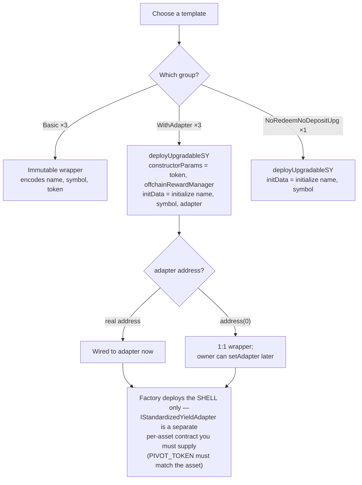

# Creating an SY

Every Pendle market sits on top of exactly one **[Standardized Yield (SY)](/concepts/standardized-yield)** token — the [EIP-5115](https://eips.ethereum.org/EIPS/eip-5115) wrapper that gives Pendle's principal/yield split and AMM a single, uniform shape to build against. Before you can deploy a market for an asset that has never been listed on Pendle, that asset needs an SY. This page walks through how OpenPendle creates one: the factory it calls, the seven templates that factory exposes, the parameters each template takes, which tokens are blocked and why, and the ownership and adapter details that decide who ultimately controls the SY.

This is the practical, hands-on companion to the concept page. If you have not yet read [what an SY is and why its risk matters](/concepts/standardized-yield), read that first — everything below assumes it.

::: warning You are creating an unreviewed contract
An SY you deploy through OpenPendle is a live, permissionless Pendle contract. No one reviews it. A market built on it becomes a [community pool](/concepts/community-pools) — permissionless and unreviewed — and anyone who interacts with it can lose funds. OpenPendle validates the *provenance* of the factory it calls; it cannot vouch for the asset you wrap or how you configure the SY. Experimental — use at your own risk. Not affiliated with Pendle Finance.
:::

## The factory

OpenPendle mints SYs by calling Pendle's permissionless SY factory, **`PendleCommonSYFactory`**, deployed at the same address on all six supported networks:

`0x466CeD3b33045Ea986B2f306C8D0aA8067961CF8`

The factory ships **no code of OpenPendle's own** — like everything in the app, OpenPendle simply calls Pendle's deployed contract with a hand-written ABI. Every deploy is [simulated against the live chain before you sign](/reference/architecture), and any token approval defaults to the exact amount. Users can explicitly select Unlimited in transaction settings, accepting the added standing exposure.

The factory holds a set of **seven registered templates**. A template is a pre-registered SY implementation the factory knows how to deploy; picking one is how you tell the factory what kind of wrapper you want. The seven break down as:

| Group | Count | What it is |
| --- | --- | --- |
| **Basic** | 3 | Plain, immutable wrappers. The template encodes `(name, symbol, token)`. |
| **WithAdapter** | 3 | Upgradeable wrappers driven by a separate per-asset [adapter](/concepts/glossary) contract. |
| **NoRedeemNoDepositUpg** | 1 | An upgradeable wrapper with deposit and redeem paths disabled. |

The three basic templates are immutable once deployed. The four remaining templates (the three WithAdapter and the single NoRedeemNoDepositUpg) deploy as upgradeable proxies — a distinction that matters a great deal for trust, and one this page returns to under [Ownership and upgradeability](#ownership-and-upgradeability).

## What an SY can and cannot wrap

Whichever template you pick, the factory wraps a **standard ERC-20 or ERC-4626 asset**. Two hard constraints follow from how SY accounting works, and both are enforced — you cannot create an SY that violates them:

| Constraint | Reason |
| --- | --- |
| **ERC-20 or ERC-4626 only — no native-ETH SY template** | Every template takes an ERC-20 token or an [ERC-4626](https://eips.ethereum.org/EIPS/eip-4626) vault share. There is no template that wraps native ETH. (Native ETH can still *seed* a pool later, but only when the SY already lists it as an input — see [Deploying the market](/create/deploying-a-market).) |
| **Fee-on-transfer tokens are blocked** | A token that skims a fee on every transfer makes the amount received differ from the amount sent, which breaks SY's share accounting and the liquidity-seeding math a market relies on. |
| **Rebasing tokens are blocked** | A token whose balances change out from under the contract — growing or shrinking without a transfer — breaks redemption, because the SY can no longer reconcile shares against a stable balance. |

::: info Rebasing assets are not excluded from Pendle
Many rebasing yield sources *are* on Pendle — they are simply wrapped in a fixed-balance form first (a staked wrapper, a vault share) so the SY sees a stable balance. The block above is on handing the SY a *raw rebasing token directly*. If the asset you want already has a non-rebasing ERC-20 or ERC-4626 wrapper, point the SY at that wrapper instead.
:::

## Basic templates: `(name, symbol, token)`

The three basic templates are the simplest path. They produce a plain, immutable SY that wraps a single asset. For a plain **ERC-20** the SY is a straightforward **1:1** wrapper (one SY share equals one token); for an **ERC-4626** vault the SY wraps vault shares and its value tracks the vault's exchange rate (`convertToAssets`), which is generally **not** 1:1 with the underlying asset. Each basic template encodes exactly three things:

- **`name`** — the SY token's ERC-20 name.
- **`symbol`** — the SY token's ERC-20 symbol.
- **`token`** — the address of the asset being wrapped.

There is no adapter, no upgrade proxy, and nothing to configure afterward. Once deployed, the contract's behaviour is fixed. For a well-behaved ERC-20 or ERC-4626 asset that needs no special deposit/redeem logic, a basic template is the least complex and the least trust-laden choice.

## Adapter and upgradeable templates: `deployUpgradableSY`

The four upgradeable templates — the three **WithAdapter** and the one **NoRedeemNoDepositUpg** — are deployed through the factory's `deployUpgradableSY` path. Instead of baking the configuration into the template, this path takes two byte arrays:

- **`constructorParams`** — passed to the implementation's constructor.
- **`initData`** — the ABI-encoded call to the proxy's `initialize` function, run once at deploy time.

### `constructorParams`

For the upgradeable templates, `constructorParams` encodes:

```
(token, offchainRewardManager)
```

- **`token`** — the asset being wrapped (ERC-20 or the ERC-4626 vault).
- **`offchainRewardManager`** — the address that enables the SY's `claimOffchainRewards` path, used to route [Merkl](https://merkl.angle.money/)-style off-chain rewards through the SY. **`address(0)` is accepted here**, and passing it simply *disables* `claimOffchainRewards` — the SY still works, it just carries no off-chain reward hook. See [Incentivizing with Merkl](/create/incentives) and [Community pools & incentives](/concepts/community-pools).

### `initData`

`initData` is the encoded `initialize` call, and its shape depends on which template you chose:

| Template group | `initData` is | Notes |
| --- | --- | --- |
| **WithAdapter** (3) | `initialize(name, symbol, adapter)` | `adapter` may be `address(0)` — see below. |
| **NoRedeemNoDepositUpg** (1) | `initialize(name, symbol)` | No adapter argument. |

::: danger Empty `initData` reverts
`initData` is not optional on the upgradeable path. Passing empty `initData` **reverts** the deploy — the proxy must be initialized in the same transaction that creates it, or the whole thing fails. OpenPendle builds this call for you; the point to remember is that an upgradeable SY is never left uninitialized.
:::

### The `adapter` argument, and `address(0)`

For the three WithAdapter templates, the third `initialize` argument is the **adapter** — the contract that teaches the SY how to deposit into and redeem from a specific yield source. You have two choices:

- **Pass a real adapter address.** The SY is wired to that adapter's logic from the moment it deploys.
- **Pass `address(0)`.** This is accepted, and it produces a **plain 1:1 wrapper** whose owner can later call **`setAdapter`** to point it at real logic. In effect you deploy the shell now and attach behaviour later.

That second option is convenient, but it is also a live trust surface: an SY that is a harmless 1:1 wrapper today can become something else the moment its owner calls `setAdapter`. Treat the current adapter as a fact to verify per-SY, never assume.

## The adapter caveat: the factory does not deploy it

This is the single most important operational detail on the page. When OpenPendle offers a **"one-click adapter SY,"** the factory deploys **only the SY shell**. The adapter contract itself — an **`IStandardizedYieldAdapter`** implementation — is a **separate, per-asset contract that the factory does *not* deploy.** You (or someone) must deploy the adapter independently and pass its address, or attach it afterward with `setAdapter`.

An adapter is not interchangeable across assets. Its **`PIVOT_TOKEN` must line up exactly with the wrapped asset**:

| Variant | `PIVOT_TOKEN` must equal |
| --- | --- |
| **ERC-20 adapter SY** | the SY's `yieldToken` |
| **ERC-4626 adapter SY** | the vault's `asset()` |

If the adapter's `PIVOT_TOKEN` does not match, the adapter is wired to the wrong asset and the SY will not behave correctly. Because the factory cannot supply this contract, a "one-click adapter SY" is genuinely a *two-part* job: deploy the shell through OpenPendle, and provide a correct, matching adapter yourself.



## Ownership and upgradeability

Who controls a freshly created SY depends on how it was made, and the defaults are deliberately conservative.

### Owner defaults to Pendle governance

An SY has an **owner** with privileged control — over the adapter (`setAdapter` on the WithAdapter variants), over administrative levers, and, on upgradeable variants, over upgrade-related actions. SYs deployed through OpenPendle's wizard **default their owner to Pendle's governance proxy**:

`0x2aD631F72fB16d91c4953A7f4260A97C2fE2f31e`

Note the consequence when you deploy a market and SY together through [`PendleCommonPoolDeployHelperV2`](/create/deploying-a-market): the **caller receives the LP and YT**, but **SY ownership goes to the SY's owner** — by default that governance proxy, *not* you the deployer. Creating the market does not make you the owner of its SY.

### Adapter/upgradeable SYs are admin-ed by Pendle's ProxyAdmin

The upgradeable templates (WithAdapter and NoRedeemNoDepositUpg) deploy as **`TransparentUpgradeableProxy`** contracts — the code behind the SY address can be replaced later. For SYs created through the wizard, the **admin of that proxy is Pendle's ProxyAdmin**:

`0xA28c08f165116587D4F3E708743B4dEe155c5E64`

which is controlled by Pendle governance. This is a real trust assumption: an upgradeable SY's behaviour is only as fixed as its upgrade authority chooses to keep it. The basic templates avoid this entirely — they are immutable and have no upgrade admin.

| Template group | Immutable? | Proxy admin | Default owner |
| --- | --- | --- | --- |
| **Basic** (3) | Yes | — (no proxy) | Pendle governance proxy `0x2aD631…f31e` |
| **WithAdapter** (3) | No — `TransparentUpgradeableProxy` | Pendle ProxyAdmin `0xA28c08…5E64` | Pendle governance proxy `0x2aD631…f31e` |
| **NoRedeemNoDepositUpg** (1) | No — `TransparentUpgradeableProxy` | Pendle ProxyAdmin `0xA28c08…5E64` | Pendle governance proxy `0x2aD631…f31e` |

::: info These defaults describe SYs *you* create here
The owner and admin above apply to an SY minted through OpenPendle's wizard. An SY you *encounter* on-chain — under a pool someone else built — may sit behind a different, unknown owner and a different, unknown admin entirely. That is exactly why the [SY risk section](/concepts/standardized-yield#sy-is-where-the-real-risk-lives) tells you to inspect the specific SY, not trust the general case.
:::

## Choosing a template

There is no universally "right" template — it depends on the asset and how much configurability you want:

| If your asset is… | Consider | Because |
| --- | --- | --- |
| A well-behaved ERC-20 or ERC-4626 that needs no custom deposit/redeem logic | A **basic** template | Immutable, no adapter, least trust surface. |
| A yield source that needs specific deposit/redeem logic, or that you want to keep upgradeable | A **WithAdapter** template | Pluggable adapter and an upgrade path — at the cost of an upgrade admin and a separately-deployed adapter. |
| A wrapper that should not support deposits or redemptions | **NoRedeemNoDepositUpg** | Those paths are disabled by design. |

Two reminders that apply no matter which you pick:

- **Fee-on-transfer and rebasing tokens are blocked** — wrap them in a fixed-balance form first, or pick a different asset.
- **A WithAdapter SY is not finished until a correct, `PIVOT_TOKEN`-matching adapter exists.** The factory will not deploy it for you.

## After the SY exists

Creating the SY is one step. With an SY in hand — or created in the same transaction — you can:

- **Deploy a market on it.** [`PendleCommonPoolDeployHelperV2`](/create/deploying-a-market) can create the SY and the market together in a single transaction, seed initial liquidity, and hand you the LP and YT (SY ownership stays with the SY's owner). See [Deploying the market](/create/deploying-a-market).
- **Initialize the price oracle** if other protocols need to price the pool over TWAP — optional, and not required to trade through OpenPendle. See [Initializing the oracle](/create/price-oracle).
- **Wire up incentives** through Merkl, since community pools are not eligible for native PENDLE gauge emissions. See [Incentivizing with Merkl](/create/incentives).

::: danger Before anyone transacts against your pool
[Community pools are permissionless and unreviewed](/concepts/community-pools) — anyone can create one, and interacting with them can lose funds. OpenPendle validates market provenance but **cannot vouch for the asset or the SY contract underneath**. A factory-valid SY can still wrap a broken or exotic asset, sit behind an upgrade admin, or depend on an adapter that was supplied separately. Inspect the SY and its asset yourself, and treat this as experimental. Not affiliated with Pendle Finance. OpenPendle takes no fee of its own.
:::

## See also

- [Creating pools — overview](/create/overview) — the full create flow, start to finish.
- [Deploying the market](/create/deploying-a-market) — turning an SY into a tradable pool in one transaction.
- [Standardized Yield (SY)](/concepts/standardized-yield) — what an SY is and why its risk matters.
- [Initializing the oracle](/create/price-oracle) and [Incentivizing with Merkl](/create/incentives) — the optional finishing steps.
- [Community pools & incentives](/concepts/community-pools) — why these markets are unreviewed.
- [Networks & contracts](/reference/networks-and-contracts) — the addresses above, per chain.
- [Risks & disclosures](/reference/risks) — read before you transact.
