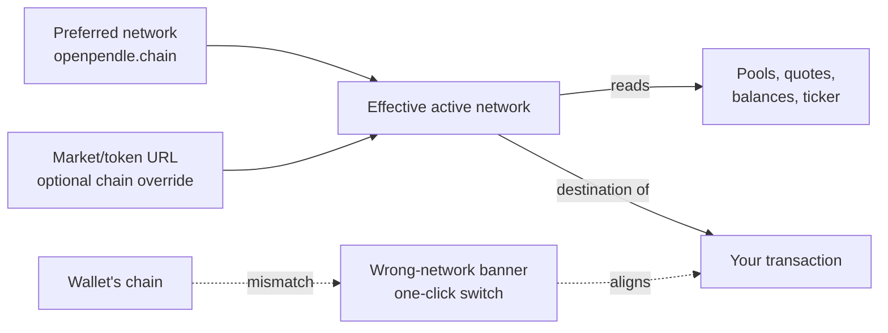

# Browsing & networks

OpenPendle is usable before you ever connect a wallet. Every price, maturity, and pool state you see is a **read** from a public RPC endpoint — so you can pick a chain, open a market, and study its trust panel with no wallet, no account, and no sign-up. This page covers the parts of the app that shape that read-only experience: the **active-network selector**, the six supported chains, browsing without connecting, the per-chain **custom RPC** setting, and the **light/dark theme** toggle.

If the terms `PT`, `YT`, and `SY` are new, start with [How Pendle works](/concepts/how-pendle-works) — this page assumes you already know them and focuses on the interface.

::: info Nothing here requires a wallet
With no wallet connected, choosing a network, browsing pools, reading trust panels, changing your RPC endpoint, and switching themes are all local, read-only actions. If a wallet is already connected, an explicit network selection also asks it to switch to the selected chain; rejecting that request does not interrupt browsing. You only need a wallet to **transact**, which is covered in [Connecting a wallet](/guides/connecting-a-wallet).
:::

## The active network

At the top of the app is a **network selector**. It sets a single value — the **active network** — that governs the entire session in two ways:

1. **What the app reads.** Pool lists, quotes, balances, maturities, and the header stats ticker are all fetched from the active network's RPC. Change the network and everything the app shows is re-fetched on the new chain.
2. **Where a transaction or signed order belongs.** On-chain actions are submitted to the active network, and a PT limit order is signed for that network's Limit Router domain. The active network — not your wallet's current chain — decides the destination. (If the two disagree, OpenPendle shows a switch prompt; see [Browsing without connecting](#browsing-without-connecting).)

The selector stores a preferred network under the localStorage key `openpendle.chain`. It defaults to **Arbitrum**, is remembered between visits, and is synchronised across generic pages in open tabs. A chain-explicit market or token URL (`?chain=<id>`) overrides that preference only in its own tab. This keeps shared deep links deterministic and lets two tabs inspect markets on different networks without changing each other.

When a wallet is connected, clicking the selector also requests a wallet switch to the same chain. The app changes its read network immediately; if the wallet rejects or cannot switch, read-only browsing remains on the selected chain and the wrong-network banner stays visible until the mismatch is resolved.

The selector is temporarily locked while an approval, transaction, or limit-order signature flow is in progress. This keeps the active chain, transaction status, order domain, and block-explorer link attached to the intended network.

::: warning A market lives on exactly one chain
A `PendleMarket` address exists on the single chain it was deployed to. If the active network does not match the chain a market lives on, that market will not load, or a pasted address will resolve to nothing. When you open a pool from a shared address or an `?import=` link, make sure the active network matches the chain it was created on. See [Opening a pool](/guides/opening-a-pool).
:::

## The six networks

OpenPendle supports six chains. Pendle's core contracts are deployed on each, and OpenPendle reads and writes to them through Pendle's own contracts — it ships no contracts of its own.

| Network | Chain ID | Native token |
| --- | --- | --- |
| Ethereum | `1` | ETH |
| BNB Smart Chain | `56` | BNB |
| Monad | `143` | MON |
| Base | `8453` | ETH |
| Plasma | `9745` | XPL |
| Arbitrum | `42161` | ETH |

The **native token** is the chain's gas asset — what you pay transaction fees in on that chain. It is also, on some chains, an asset a pool can accept directly. Note that ETH is the native token on three of these chains (Ethereum, Base, Arbitrum), so "ETH" alone is not enough to identify which chain you are on; the chain ID is the unambiguous identifier.

### What is and isn't the same across chains

Some Pendle contracts share **one address on all six chains**, deployed to the same address everywhere. Pendle's **Router V4** at `0x888888888889758F76e7103c6CbF23ABbF58F946` handles immediate AMM trades, liquidity operations, and exits. The separate **Limit Router** at `0x000000000000c9B3E2C3Ec88B1B4c0cD853f4321` validates, fills, and cancels supported PT limit orders. Others in this always-identical set include `PendleCommonPoolDeployHelperV2` at `0x2Ed473F528E5B320f850d17ADfe0e558f0298aA9`, the `PendleCommonSYFactory` at `0x466CeD3b33045Ea986B2f306C8D0aA8067961CF8`, and `Multicall3` at `0xcA11bde05977b3631167028862bE2a173976CA11`.

Other contracts are **chain-specific**: the `PENDLE` token, `RouterStatic`, the treasury, the governance multisig, the wrapped-native token, and — importantly — the market and yield-contract **factories**. Because these differ per chain (and because Pendle's factories are governance-mutable), OpenPendle resolves the live per-chain values at runtime rather than hardcoding them. The full, live per-chain contract list is on the app's [Protocol Status & Contracts](https://openpendle.com/#/status) page, and can be verified against [Networks & contracts](/reference/networks-and-contracts).

One consequence worth knowing: not every chain has the same history of Pendle markets. The factory **lineage** differs — Ethereum, BSC, and Arbitrum carry the full v1 + V3 + V4 + V5 + V6 lineage; Base and Plasma carry V5 + V6; Monad is V6 only. Older markets can only exist on chains whose lineage includes the factory that made them.

::: info Provenance is checked per chain
Before you can save or transact against a market, OpenPendle verifies it was created by a Pendle factory it recognises on the active chain. This is **validation, not endorsement** — it confirms a Pendle factory minted the market, not that the asset inside is safe. Community pools are permissionless and unreviewed. See [Community pools & incentives](/concepts/community-pools).
:::

## Browsing without connecting

Because reads go through RPC and not through your wallet, the entire discovery flow works with no wallet connected:

- **Pick a network** and let the app read the chain.
- **Browse Explore** to search the factory-indexed universe across all supported networks and filter Pendle-listed vs community markets.
- **Open Yield alerts** to inspect qualified 24-hour PT implied-APY movers. This is a page, not a notification subscription.
- **Open Looping** to match Pendle PT collateral with Morpho markets, model leverage, and inspect the read-only transaction outline. Execution remains disabled.
- **Open a market** by pasting its address (or following a shared `?import=` link) and read its trust panel — the underlying asset, the SY contract, the maturity, and the implied APY.
- **Save pools** to your browser's local registry for later.

You only connect a wallet at the point you decide to act. This is deliberate: it means you can evaluate a permissionless, unreviewed market fully before exposing an address to it.

### The wrong-network banner

When you do connect a wallet, its selected chain may differ from OpenPendle's active network. If so, a **wrong-network banner** appears offering a one-click switch to align your wallet with the active network, so any transaction lands on the intended chain. Crucially, browsing continues to work either way — the mismatch only matters when you sign, because reads never touch the wallet. For the full connection model (injected-only, no WalletConnect, desktop vs. mobile), see [Connecting a wallet](/guides/connecting-a-wallet).

## Custom RPC endpoints

Every chain ships with **keyless public RPC defaults** — no API key, nothing to configure. To stay resilient, OpenPendle wraps each chain's default endpoints in a viem `fallback()` transport: if the primary endpoint is rate-limiting or down, the app automatically rolls over to a backup. For most people this is invisible and requires no attention.

You can, however, **override the RPC per chain**. In **RPC settings**, each network has its own field; the endpoint you enter is stored locally under the key `openpendle.rpc.<chainId>` (for example, `openpendle.rpc.42161` for Arbitrum). When set and valid, your override **replaces the default list for that chain**; if the field is empty or invalid, the app falls back to the keyless public defaults.

**Saving an RPC override reloads the app.** The transport is built once at startup, so applying a change restarts the app to rebuild it against the new endpoint. This is expected behaviour, not an error.

### Why you might set one

- **Rate limits.** Heavy browsing — many pools, frequent refreshes — can trip a public endpoint's limits. A private or paid endpoint you control removes that ceiling.
- **Reliability or latency.** A geographically closer or higher-tier node can load quotes and balances faster and fail less often.
- **Privacy and control.** RPC endpoints are the only blockchain requests OpenPendle makes. Pointing a chain at an endpoint you trust means those reads go where you choose.
- **A specific node.** You may want to read from a particular archive node, a self-hosted node, or a fork for testing.

::: info Illustrative example
Suppose public reads on Arbitrum start returning throttling errors while you are comparing several pools. You open **RPC settings**, paste your own Arbitrum endpoint into the Arbitrum field, and save. The app reloads and now routes all Arbitrum reads and transaction submission through your endpoint. Ethereum, Base, and the other chains are untouched — each override is independent, keyed by its own chain ID. (Endpoint and behaviour shown for illustration only.)
:::

::: tip Overrides are local and per-chain
An override affects only the one chain whose ID it is keyed to, and it never leaves your browser. It is stored in localStorage like the rest of your settings, so clearing site data removes it and the chain reverts to its keyless defaults. For historical reasons, Arbitrum also honours the legacy un-suffixed key `openpendle.rpc` if the newer `openpendle.rpc.42161` is unset.
:::

### What the RPC does — and does not — change

Overriding the RPC changes **where reads and transactions are sent**. It does not change **what** is read: contract addresses, the provenance gate, and simulation logic are unaffected. It also cannot make an unsafe market safe — the endpoint is just a window onto the same chain. For the outbound-request model in full, see [How OpenPendle works](/reference/architecture).

::: warning A malicious RPC can mislead you
An RPC endpoint answers the app's read queries, so a hostile or misconfigured endpoint could return misleading data (wrong balances, stale prices) or drop your requests. Only point a chain at an endpoint you trust. OpenPendle's protections — simulate-before-sign and exact approvals by default — still apply, but they operate against whatever chain view the endpoint provides. Explicitly opting into unlimited approval increases standing exposure. Community pools are permissionless and unreviewed, and interacting with them can lose you funds; see [Risks & disclosures](/reference/risks).
:::

## Light and dark theme

A **theme toggle** in the header switches the interface between **dark** (the default) and **light**. Your choice persists in localStorage (key `op.theme`) and applies across the whole app, including connected-wallet dialogs. The setting is purely cosmetic — it changes no on-chain behaviour, no network, and no contract interaction — and, like every other preference here, it is stored only in your browser.

## Everything stays in your browser

The network you pick, per-chain RPC overrides, theme, and saved pools are all held in your browser's local storage. OpenPendle operates no user database or account system. The app downloads its same-origin factory-market snapshot and makes direct requests to the blockchain RPCs you choose; DefiLlama/CoinGecko for the header ticker; Pendle's APIs for Explore enrichment, PT/YT pool lookup, Yield-alert data, and limit-order support, books, generation, placement, and maker-order reads; where available Blockscout for pool lookup; Merkl when a connected user opens **My positions**; and Cloudflare Web Analytics for page-view and performance metrics. Merkl receives the wallet address and chain ID needed for the rewards lookup. Pendle receives the maker address and signed payload when you place a limit order. These calls do not upload your saved-pool registry or settings. Clearing site data resets those preferences to their defaults (Arbitrum, keyless RPC, dark theme, no saved pools). To move saved pools between browsers or devices, see [Saved pools & privacy](/guides/saved-pools).

::: info OpenPendle is a permissionless frontend
OpenPendle validates market provenance but cannot vouch for the assets or SY contracts underneath. Experimental — use at your own risk. Not affiliated with Pendle Finance, and it takes no fee of its own.
:::

## Next

- [Connecting a wallet](/guides/connecting-a-wallet) — injected-only connection, and the wrong-network switch.
- [Opening a pool](/guides/opening-a-pool) — the provenance gate and the trust panel, step by step.
- [Yield alerts](/guides/yield-alerts) — read-only PT fixed-yield movers with no notifications.
- [PT looping](/guides/looping) — exact market matching, leverage modeling, and the current preview boundary.
- [PT limit orders](/guides/limit-orders) — market-level support, signing, fills, and cancellation.
- [Networks & contracts](/reference/networks-and-contracts) — the full per-chain address list.
- [How OpenPendle works](/reference/architecture) — the static, RPC-first architecture and ancillary-service disclosure.
- [Saved pools & privacy](/guides/saved-pools) — moving your client-side registry between devices.
- [Risks & disclosures](/reference/risks) — please read before you transact.
