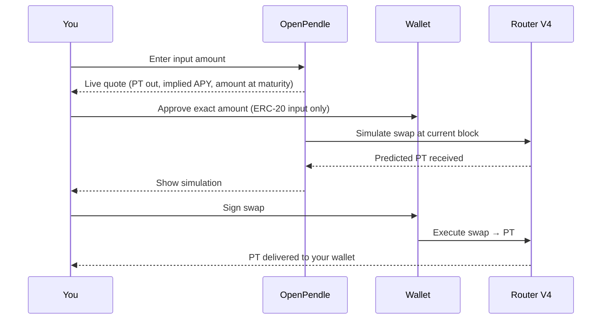

# Buying PT (fixed yield)

Buying **PT** swaps a token you hold into a market's [Principal Token](/concepts/principal-tokens) — the fixed-income leg of a Pendle position. You pay below par now and, if you hold to maturity, redeem **1:1 for the underlying**, locking in a fixed yield that is fully known at the moment you sign. This guide walks the swap-to-PT flow end to end in OpenPendle: choosing the action, entering an amount, reading the quote, approving the exact spend, reviewing the simulation, signing, and then what you hold and how you redeem when the market matures.

This is a guide, not a concept page. It assumes you already know what PT is and why a discount becomes a fixed rate. If that is new, read [Principal Tokens (PT)](/concepts/principal-tokens) first — it derives the fixed-yield mechanic from first principles. Here we focus only on *where to click and what each field means*.

::: warning Community pools are unreviewed — read the trust panel first
Buying PT locks your capital into whatever asset the market wraps until you sell or redeem. OpenPendle's [provenance gate](/reference/architecture) verifies a market was created by a Pendle factory it recognizes — it **validates provenance, not the asset or SY contract underneath**. A provenance-valid [community pool](/concepts/community-pools) can still wrap a broken, malicious, or exotic asset, and "par" is only ever worth whatever that underlying turns out to be worth. Experimental — use at your own risk. Read [Risks & disclosures](/reference/risks) and the pool's trust panel before you sign. Not affiliated with Pendle Finance.
:::

## Before you start

Three things need to be in place before the swap-to-PT action is available.

- **The right market is open.** A Pendle market is an on-chain `PendleMarket` contract; its address is what you load into OpenPendle — not the PT, YT, or SY address. See [Opening a pool](/guides/opening-a-pool) for how to load one and pass the provenance gate.
- **You are on the market's chain.** The **active network** (localStorage key `openpendle.chain`, default Arbitrum) determines what the app reads and where your transaction is sent. A market address lives on exactly one of the six supported chains; the active network must match it. See [Browsing & networks](/guides/browsing).
- **An injected wallet is connected on that chain.** OpenPendle is injected-only — MetaMask, Rabby, Brave, or any injected EIP-6963 provider, with no WalletConnect. If your wallet is on a different chain, a wrong-network banner offers a one-click switch. See [Connecting a wallet](/guides/connecting-a-wallet).

You also need the input token you intend to spend. A swap-to-PT accepts a token the market's route can price into PT — commonly the underlying asset or its [SY](/concepts/standardized-yield). The quote panel shows which inputs are available for the open market.

::: info Check maturity before you commit
PT's fixed outcome is a *maturity* outcome. Read the market's maturity date on its trust panel first. The further away it is, the longer your capital is committed to reach the 1:1 redemption; the closer it is, the smaller the remaining discount. A market that has already matured no longer trades — you would redeem PT there, not buy it. See [Maturity & redemption](/concepts/maturity).
:::

## Step 1 — Choose the swap-to-PT action

On the open market, select the action that swaps a token **into PT** — the fixed-yield position. A market exposes several actions, and choosing the right one matters:

| Action | What you get | When to use it |
| --- | --- | --- |
| **Swap → PT** | A fixed-yield [PT](/concepts/principal-tokens) position | You want a known return to maturity — this guide |
| **Swap → YT** | A variable [yield-exposure](/concepts/yield-tokens) position | You want exposure to the underlying's yield instead |
| **Mint** | `PT + YT` together from SY or the underlying | You want both legs at once — see [Minting & redeeming](/guides/minting-redeeming) |
| **Add liquidity** | An [LP](/concepts/liquidity-and-amm) position | You want swap fees and any Merkl incentives, not a fixed rate |

Buying PT is a single swap. Under the hood the router prices your input token into PT along the [PT/SY AMM curve](/concepts/liquidity-and-amm); you do not need to mint or hold SY yourself — the route handles it and delivers PT to your wallet.

## Step 2 — Enter an amount

Enter how much of your input token you want to spend. As you type, OpenPendle **quotes live** — it reads the current market state from the chain and recomputes the output at each keystroke, so the numbers below always reflect the amount in the field.

A few practical notes:

- **Denominate in the input token.** The amount is what you *spend*; the quote tells you how much PT you *receive*.
- **Size affects the rate.** The AMM is concentrated near the PT-to-par curve, but a larger buy still moves the price along it — bigger orders tend to receive a marginally worse average price (more slippage) than small ones. The quote reflects your specific size.
- **Leave gas headroom.** On chains where the input token is the native coin (ETH on Ethereum, Base, and Arbitrum; BNB, MON, XPL elsewhere), keep enough native balance for the transaction fee.

## Step 3 — Read the quote

The quote is the heart of this action. Before you commit anything, it tells you the complete shape of the trade. Read every line.

| Quote field | What it means for your PT buy |
| --- | --- |
| **PT received** | How many PT units this input buys at the current price. |
| **Fixed yield / implied APY** | The annualized fixed rate implied by the current PT price — the return you lock in if you **hold to maturity**. Sometimes labelled "fixed APY". |
| **Amount at maturity** | What your PT redeems for at maturity: PT units × 1 = that many units of the **underlying** (par), the fixed payoff you are buying. |
| **Maturity date** | When PT becomes redeemable 1:1 and the market stops trading. |
| **Price / discount to par** | The per-PT price below 1 — the discount that *is* your yield. |

::: info "Implied APY" is arithmetic, not a promise
The implied APY is derived from `price → par` over the time remaining to maturity. It is **not** a rate the protocol pays you or guarantees — it is the fixed return baked into the discount at the price you see. When you sign, the implied APY at that block becomes *your* locked rate to maturity. See the [PT concept page](/concepts/principal-tokens) for the derivation.
:::

The whole point of a PT buy is that the maturity payoff in underlying terms is knowable in advance. If you hold to maturity, the "amount at maturity" line is what you receive — regardless of whether the underlying's variable yield ran hot or cold in between. That variability now belongs to whoever holds the [YT](/concepts/yield-tokens).

## Step 4 — Approve the exact amount

If your input token is an ERC-20, the router needs an allowance to move it. OpenPendle requests an **exact-amount** approval — scoped to precisely the amount you are spending on this trade. It does **not** request an unlimited allowance.

- The spender is Pendle's **Router V4** at `0x888888888889758F76e7103c6CbF23ABbF58F946` (the same address on all six chains) — the contract that executes all Pendle trades, liquidity, and exits.
- You will typically sign **two** transactions: first the approval, then the swap. This is normal ERC-20 behaviour.
- If your input is the chain's **native coin** (e.g. ETH), there is no ERC-20 approval — native value is sent with the swap itself, so you sign only once.

::: tip Exact approvals are a deliberate safety choice
Because each approval covers only this trade's amount, no lingering unlimited allowance sits on the router afterward. The trade-off is one approval per spend rather than a one-time blanket grant. See [How OpenPendle works](/reference/architecture) for the reasoning.
:::

## Step 5 — Review the simulation

Before you sign the swap, OpenPendle **simulates it against the live chain** at the current block and shows the predicted result. Treat this as your last check.

Confirm the simulated outcome matches the quote you read in Step 3:

- The **PT you will receive** is what you expected.
- The **implied APY / fixed yield** is the rate you want to lock in.
- The **amount at maturity** is the payoff you are buying.
- The token spent, the spender, and the network are all correct.

::: danger Simulation shows the expected result — it is not a guarantee
A simulation is executed at one block; the actual execution happens at another, and the chain can move in between. It also cannot make an unsafe asset safe — it predicts the transaction's effect, nothing about the quality of the underlying. Community pools are permissionless and unreviewed; interacting with them can lose you funds. Only sign after you have read the trust panel and understand the asset. See [Risks & disclosures](/reference/risks).
:::

## Step 6 — Sign

Sign the swap in your wallet. Once it confirms on-chain, the router delivers **PT** to your address and the market state updates. Your fixed rate is now locked at the price that executed.

The full sequence, from typing an amount to holding PT:

OpenPendle adds **no fee of its own**. Pendle's own protocol fees still apply and are enforced by Pendle's contracts — they are already reflected in the quote and simulation you reviewed.

## What you hold afterward

After the swap you hold **PT** for that specific market in your wallet — an ERC-20 token like any other. What it does from here:

- **It is a claim on the underlying at par.** At maturity each PT redeems 1:1 for the underlying. Until then it sits at a discount that shrinks as maturity approaches.
- **Its secondary price moves before maturity.** PT trades in the [PT/SY AMM](/concepts/liquidity-and-amm), and its market price varies with the prevailing implied APY: if fixed rates rise, existing PT reprices *down* (a deeper discount is needed to offer the higher rate); if fixed rates fall, PT reprices *up* toward par. Time also pulls it toward par mechanically. Only **holding to maturity** delivers the fixed outcome you locked in — selling early realizes whatever the current price is, which may be more or less.
- **You can consider the pool worth tracking.** Use **Remember this pool** to save the market to your browser (localStorage key `openpendle.pools.v1`) so it is easy to return to at maturity. It is entirely client-side. See [Saved pools & privacy](/guides/saved-pools).

## Redeeming at maturity

Buying PT is only half the round trip; the fixed yield is realized when you redeem. Nothing forces you to act at the exact maturity timestamp — redemption stays available afterward.

At maturity, three things become true for the market: **PT** becomes redeemable **1:1 for the underlying**, **YT** is worth nothing further, and the **market stops trading** (no more swaps against the pool). To collect your principal plus the fixed gain:

1. Return to the market in OpenPendle (open its address, or reopen it from [Saved Pools](/guides/saved-pools)).
2. Choose **Redeem PT for the underlying**. This is a redemption, not a trade — it works at or after maturity even though the AMM has stopped.
3. As with any action, OpenPendle quotes it and **simulates before signing**. Approvals use your configured mode—exact by default, or unlimited only if you explicitly opted in; sign to receive the underlying.

Two nuances worth knowing:

- **Before maturity, PT does not redeem for the underlying** through the market — your only exit early is selling PT into the AMM at the current price, or recombining `PT + YT` back into SY if you also hold the matching YT (the [mint / redeem](/guides/minting-redeeming) action, available any time before maturity).
- **After maturity there is no rush and no decay on PT** — it holds par value and can be redeemed whenever you choose. See [Maturity & redemption](/concepts/maturity) for the full settlement picture.

## An illustrative example

::: info Example — illustrative numbers only
These figures are invented to show the mechanics. They are **not** a live quote, not a specific asset, and not a rate anyone guarantees.

Suppose you open a market whose PT matures in **180 days** and currently prices at **0.9600** units of the underlying per PT — a 4% discount to par. You decide to spend **10,000** units of the underlying.

**Step 3, the quote, would read roughly:**

| Quote field | Illustrative value |
| --- | --- |
| PT received (`10,000 ÷ 0.9600`) | ≈ **10,416.67 PT** |
| Implied APY (fixed yield) | ≈ **8.6%** |
| Amount at maturity (PT × 1) | ≈ **10,416.67** underlying |
| Fixed gain over 180 days | ≈ **416.67** (≈ 4.17%) |

The implied APY comes from annualizing the period discount: `(1 ÷ 0.9600) ^ (365 ÷ 180) − 1 ≈ 8.6%`.

**Step 4** — you approve exactly `10,000` of the input token to the router (skipped if the input is the native coin).

**Step 5** — the simulation confirms ≈ `10,416.67 PT` out at this block; you check it matches.

**Step 6** — you sign. You now hold ≈ `10,416.67 PT`.

**At maturity** — you redeem, receiving ≈ `10,416.67` units of the underlying: your `10,000` back plus a fixed `≈ 416.67` gain. You knew all of this the instant you signed. What the underlying's variable yield did over those 180 days changed nothing about this payoff — that belonged to the [YT](/concepts/yield-tokens) holder.
:::

A lower PT price means a *deeper* discount and a *higher* implied APY; a price nearer par means a lower fixed rate. A longer time to maturity spreads the same discount over more time, lowering the annualized rate for a given price.

## Common questions

- **Do I need to hold SY first?** No. The swap-to-PT route prices your input token into PT for you and delivers PT to your wallet. Holding SY yourself is only relevant if you want to [mint `PT + YT`](/guides/minting-redeeming) directly.
- **Can I exit before maturity?** Yes — sell PT back into the AMM at the current price, which re-introduces the price risk you avoided by holding. Only holding to maturity delivers the fixed outcome.
- **Is the fixed yield risk-free?** No. It removes yield-*rate* uncertainty but leaves the asset itself, pre-maturity price moves, and SY/provenance risk intact. See the [PT concept page](/concepts/principal-tokens) and [Risks & disclosures](/reference/risks).
- **Where do Pendle's fees go?** They are Pendle's, enforced by Pendle's contracts and already in your quote. OpenPendle takes no fee of its own.

## See also

- [Principal Tokens (PT)](/concepts/principal-tokens) — what PT is and why a discount is a fixed yield, from first principles.
- [Maturity & redemption](/concepts/maturity) — what happens at par and how redemption works after maturity.
- [Opening a pool](/guides/opening-a-pool) — loading a market and passing the provenance gate.
- [Buying YT (yield exposure)](/guides/buying-yt) — the variable-yield counterpart to this action.
- [Minting & redeeming](/guides/minting-redeeming) — splitting SY into `PT + YT` and recombining before maturity.
- [Risks & disclosures](/reference/risks) — please read before you transact.
