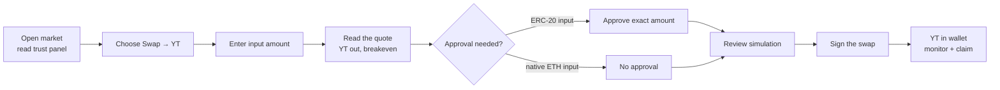

# Buying YT (yield exposure)

Buying **YT** takes a **long-yield** position on a market: you pay up front for a decaying claim on all the yield the underlying asset produces until [maturity](/concepts/maturity), and you profit if that asset's realized yield beats the yield the market currently prices in. This guide walks the OpenPendle flow end to end — choosing the swap-to-YT action, reading the quote, approving the exact amount, reviewing the simulation, signing, then monitoring the position and closing it out as YT trends to zero at maturity.

This is a guide, not a primer. If YT itself is new to you — what it pays, why its price decays, what "implied" versus "realized" yield mean — read [Yield Tokens (YT)](/concepts/yield-tokens) first; the mechanics there are assumed throughout this page. You should also already be able to [connect a wallet](/guides/connecting-a-wallet) and [open a pool](/guides/opening-a-pool), since both come before the first step below.

::: warning YT can underperform, and always ends at zero
A YT position is a directional bet on a *rate*. If the underlying's **realized yield comes in below the implied yield you paid**, the yield you collect will not cover what you spent on the YT, and you lose money. And a YT is worth **nothing at maturity** by construction — the entire return has to come from yield collected along the way. On top of that, OpenPendle loads **permissionless, community-created** markets that no one has vetted: it validates a market's *provenance* (that a Pendle factory it recognizes created it) but **cannot vouch for the SY contract or the asset underneath** — which is exactly the yield source a YT position depends on. Never buy YT on a market unless you trust who created it and what it wraps. Not affiliated with Pendle Finance. See [Yield Tokens](/concepts/yield-tokens), [Community pools](/concepts/community-pools), and [Risks & disclosures](/reference/risks).
:::

## Before you start

The order that keeps you safe is: **read, then transact.** Because community pools are unreviewed, do your vetting while no wallet is even connected.

- **Open the market and check its trust panel.** Paste the [`PendleMarket`](/concepts/pool-anatomy) address, let OpenPendle run the [provenance gate](/guides/opening-a-pool), and read what the market wraps — the underlying asset, the SY, the maturity date, the current implied APY. All of this reads from the chain with no wallet. See [Opening a pool](/guides/opening-a-pool).
- **Confirm the network.** A market address exists on exactly one chain. Make sure OpenPendle's **active network** (the header selector, stored under `openpendle.chain`) is the chain the market lives on before you go to sign.
- **Connect only when you are ready to transact.** OpenPendle is injected-only — a browser-extension wallet on desktop, or a wallet's in-app browser on mobile. See [Connecting a wallet](/guides/connecting-a-wallet). If your wallet's chain differs from the active network, use the wrong-network banner's one-click switch first.
- **Know your view.** Buying YT only makes sense if you have a reason to think the asset will out-yield the implied rate over the remaining term. If you want your principal back with certainty, you want [PT](/guides/buying-pt), not YT.

## The transaction flow at a glance

Every step below quotes **live as you type**, **simulates against the live chain before you sign**, and uses **exact-amount approvals** rather than unlimited allowances — the same guarantees that apply to every action in OpenPendle (see [How OpenPendle works](/reference/architecture)).

## Step 1 — Choose the swap-to-YT action

On an open market, OpenPendle offers the standard set of Pendle actions: [mint and redeem](/guides/minting-redeeming), swap token ↔ [PT](/guides/buying-pt), swap token ↔ **YT**, and [add or remove liquidity](/guides/providing-liquidity). To take yield exposure, pick the action that **swaps an input token into YT**.

Under the hood this routes through Pendle's **Router V4** at `0x888888888889758F76e7103c6CbF23ABbF58F946` — the single contract that handles all trades, liquidity, and exits, identical on all six supported chains. OpenPendle ships no contracts of its own; it calls Pendle's deployed router with hand-written ABIs.

Then choose your **input token**. The router can take a range of inputs and zap them into YT for you — commonly the market's SY, or a token the SY accepts and can wrap. What is offered depends on the specific SY; select whichever input you actually hold. If the input is an ERC-20, a one-time approval is required (Step 3); if the SY accepts **native ETH** and you pay in ETH, no approval is needed and the value is sent with the transaction.

::: info YT is a leveraged claim, not a 1:1 buy
Because a small amount of capital buys a claim on the yield of a much larger notional, the YT figure the quote returns will typically be **much larger** than the token amount you put in. That is expected: YT is a capital-efficient, higher-variance way to be long yield, not a token you buy one-for-one. See [Yield Tokens](/concepts/yield-tokens) for why.
:::

## Step 2 — Read the quote (yield exposure and breakeven)

As you type an input amount, OpenPendle fetches a live quote from the router and prices the pool through Pendle's TWAP oracle, `PendlePYLpOracle` at `0x5542be50420E88dd7D5B4a3D488FA6ED82F6DAc2`. Read it carefully before going further — the quote is where a YT decision is actually made.

The quote tells you, for your input:

| Field | What it means for a YT buyer |
| --- | --- |
| **YT you receive** | The quantity of yield claim you are buying — the notional whose yield now streams to you until maturity. |
| **Implied yield / breakeven** | The fixed yield currently baked into the price. You are effectively **paying this rate up front**; it is the level realized yield must beat for the position to profit. |
| **Price impact / slippage** | How much your own trade moves the pool. Thin community pools can move sharply — a large order can worsen your entry materially. |
| **Time to maturity** | How long your view has to play out. The window only shrinks; a slow-to-materialize view has less room as maturity nears. |
| **Minimum received / slippage tolerance** | The floor of YT you will accept given price movement between quote and execution. |

The single most important number is **breakeven** — the realized yield at which the yield you collect exactly offsets the price you paid and the YT's decay to zero:

- **Realized yield = implied (breakeven) → roughly break even.**
- **Realized yield > implied → profit.** Every unit of yield above breakeven is upside.
- **Realized yield < implied → loss.** Every unit below leaves you unable to recover what you paid for a claim that ends at zero.

So the trade only makes sense if you believe the asset will **out-yield the breakeven rate** over the time remaining. If the breakeven is higher than any yield you think the asset can plausibly sustain, that is the market telling you YT is expensive here — do not force the trade.

Set your **slippage tolerance** deliberately. It protects you if the pool moves between quoting and execution, but too tight a tolerance may cause the simulation or transaction to revert on a moving pool, and too loose a one accepts a worse fill. Quotes refresh as the pool and your input change, so treat the number on screen as current only for the moment you read it.

## Step 3 — Approve the exact amount

If your input token is an ERC-20 and the router does not already have sufficient allowance, OpenPendle prompts an **approval** for the router to move your tokens.

- The approval is **exact-amount** — scoped to the input amount for this swap, never an unlimited allowance. This is a deliberate safety property of OpenPendle: you are not leaving a standing permission behind.
- It is a **separate transaction** from the swap. You sign the approval first, then the swap in Step 5.
- If you increase the input after approving, a fresh exact-amount approval for the larger amount may be required.
- If you are paying in **native ETH** (only when the SY lists ETH among its inputs), there is **no approval** — the ETH travels with the swap as transaction value.

Your wallet shows its own prompt for the approval; confirm it there. OpenPendle never sees your keys or seed phrase, only the address and signatures you authorize.

## Step 4 — Review the simulation

Before you sign the swap itself, OpenPendle **simulates the transaction against the live chain** and shows you the expected result. This is the "simulate-before-sign" guarantee that applies to every OpenPendle action — a dry run against current state, not an estimate.

Read the simulated outcome and confirm it matches the quote:

- The **YT amount** you expect to receive lands within your slippage tolerance.
- The transaction **does not revert**. A revert here usually means the pool moved past your slippage tolerance, liquidity is thin, allowance is insufficient, or the input is unsuitable — adjust the amount, refresh the quote, or loosen tolerance slightly and re-simulate.
- The input token and amount are what you intended.

If anything looks off, stop and re-check rather than signing through it. The simulation is the last cheap place to catch a mistake.

::: tip A green simulation is not a safety endorsement
The simulation confirms the *mechanics* of your swap will execute as shown against the current chain state. It says **nothing** about whether the market's underlying asset or SY is honest, solvent, or will keep producing the yield your YT is a claim on. A factory-valid market can still wrap a broken or malicious asset whose "yield" never arrives. Provenance and simulation are safety rails on the *transaction*; they are not judgments on the *asset*. See [Community pools](/concepts/community-pools).
:::

## Step 5 — Sign

With the simulation reviewed, sign the swap in your wallet. The router pulls your approved input (or the ETH value), routes it into the market's PT/SY AMM, and delivers **YT** to your address. When it confirms, the YT is in your wallet and its yield begins accruing to you.

From this point you hold a live yield-exposure position on that market until you close it or it reaches maturity.

## An illustrative example

::: info Example — illustrative figures only
The numbers below are invented to show the mechanics. They are **not** live rates, quotes, or guarantees for any real pool.

A market on some yield-bearing asset has **60 days** to maturity, and its current implied APY is about **10%** — so buying YT means paying roughly a 10% rate up front for the next 60 days of that asset's yield. You choose **Swap → YT**, enter your input, and the quote shows the YT you would receive plus a **breakeven around 10% APY**. The simulation confirms the fill, you approve the exact input amount, and you sign.

**Scenario A — realized yield beats breakeven.** Over the 60 days the underlying actually earns about **16% APY**. You collect that streamed yield as it accrues. You paid for ~10% and received ~16%, so you come out **ahead** — the roughly 6% (annualized) above breakeven, on the notional your YT controls, is your profit.

**Scenario B — realized yield falls short.** Instead the asset yields only about **6% APY**. You paid for ~10% and received ~6%, so you are **behind**: the yield you streamed in does not cover the YT's decay to zero, and you take a **loss**.

**At maturity, either way, each YT is worth 0.** The outcome is settled entirely by the yield you collected along the way versus what you paid — never by any residual token value.
:::

## Monitoring the position

While you hold YT, two things happen at once, and you should watch both:

1. **It accrues yield.** The underlying's yield streams to you as YT interest, claimable as it comes in. Pendle's own protocol **YT interest fee** is taken on this yield by Pendle's contracts — not by OpenPendle, which charges no fee of its own.
2. **Its price decays.** A YT is a claim on *future* yield only, so its market price trends down over the life of the market and reaches **zero at maturity**. Watching the price alone will always look like a loss; the yield you collect is what you are being paid to bear that decay.

Open the market in OpenPendle to check the live implied APY, the time remaining, and the claimable yield on your position. Because your return is *yield collected minus price paid*, judge the position on the **whole picture** — accrued and claimed yield set against your entry cost — not on the YT's quoted price in isolation.

::: tip You do not have to hold to maturity
YT is tradable for as long as the market is open. If your view has already played out — realized yield has run hot, or the implied yield has repriced upward so the market now agrees with you — you can **swap the YT back into SY** (or an output token) on the AMM to lock in the result rather than riding it all the way to zero. That exit is another token ↔ YT swap: same live quote, same exact-amount approval on the YT, same simulate-before-sign. Conversely, if your thesis has broken, exiting early caps the loss instead of letting the position decay to nothing.
:::

## At maturity: claiming and redeeming

At maturity the market **stops trading**, [PT](/concepts/principal-tokens) becomes redeemable 1:1 for the underlying, and **YT reaches zero** — there is no more future yield for it to represent. What remains to do with a YT position is to **collect what it earned**:

- **Claim accrued yield.** Any yield your YT accrued and you had not yet claimed is still claimable through the router after maturity. This is the substance of a matured YT's value — the streamed yield, now fully realized. A matured YT token itself carries no further value.
- **Nothing to redeem *for* — the value was the yield.** Unlike PT, a YT is not redeemed for principal at maturity; its worth was always the yield it paid while live. Claim any outstanding yield and you are done. (If you also happen to hold the matching PT, you can redeem that separately for the underlying — see [Minting & redeeming](/guides/minting-redeeming) and [Maturity & redemption](/concepts/maturity).)

Even after maturity these claims run against Pendle's contracts on-chain, so they remain available whenever you get to them; the market simply no longer quotes trades. As always, the claim transaction quotes, simulates, and requires only exact-amount approvals.

## Risk note

::: danger Read before you buy YT
- **YT can underperform.** It is a directional, leveraged bet on a *rate*. If the underlying's **realized yield comes in below the implied (breakeven) yield you paid**, the yield you collect will not cover what you spent, and you take a loss. YT is not a savings position.
- **It always ends at zero.** A YT is worth **nothing at maturity** by construction. Your entire return must come from yield collected along the way; there is no residual to recover, and time works against you as the yield window shrinks.
- **Underlying-yield risk.** YT's payoff depends on the *real* yield of the asset underneath. If that yield collapses, is paused, or the asset itself breaks, the yield you were counting on may never arrive — and OpenPendle **validates market provenance but cannot vouch for the assets or SY contracts underneath**.
- **Community pools are permissionless and unreviewed.** Anyone can create one, and interacting with them can lose you funds. A factory-valid market can still wrap a malicious or broken asset. Read the trust panel, and never transact on a market unless you trust who created it and what it wraps.
- **Thin-pool execution.** Community pools can be shallow; a large order can move the price against you and worsen your fill. Watch price impact in the quote and set slippage deliberately.

Experimental — use at your own risk. Not affiliated with Pendle Finance. OpenPendle is a gift to Pendle's community and takes no fee of its own (Pendle's own protocol fees still apply). Security contact: [x.com/ggmxbt](https://x.com/ggmxbt) (see `/.well-known/security.txt`). Full risk disclosure: [Risks & disclosures](/reference/risks).
:::

## Next

- [Yield Tokens (YT)](/concepts/yield-tokens) — the concept: implied vs realized yield, breakeven, decay to zero.
- [Buying PT (fixed yield)](/guides/buying-pt) — the fixed-rate counterpart if you want principal certainty instead.
- [Minting & redeeming](/guides/minting-redeeming) — split SY into PT + YT yourself, or redeem the pair.
- [Maturity & redemption](/concepts/maturity) — what happens at the end, when YT reaches zero.
- [Opening a pool](/guides/opening-a-pool) — the provenance gate and trust panel, before you transact.
- [Risks & disclosures](/reference/risks) — please read before you buy YT.
