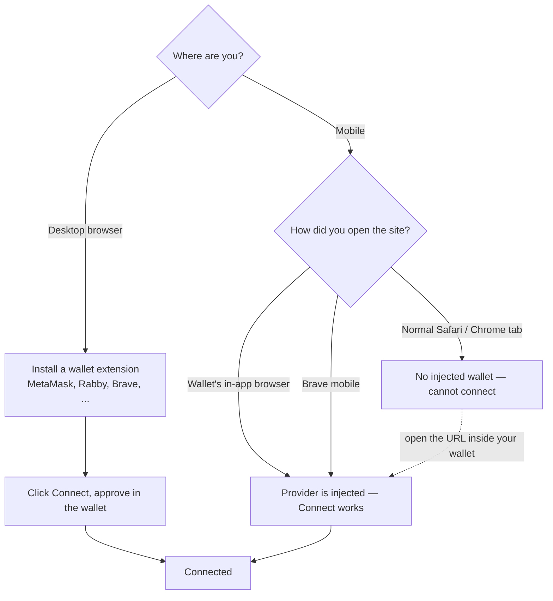

# Connecting a wallet

OpenPendle connects to your wallet in the most direct way possible: it talks to a wallet that is **injected into the page by a browser extension or in-app browser**, and nothing else. There is no WalletConnect, no QR code, no relay server, and no account to create. This page explains that model, which wallets work, how connecting differs on desktop and mobile, why WalletConnect is deliberately absent, the connect steps themselves, and the wrong-network banner that keeps your transactions on the right chain.

You do not need to read this before browsing. Reading a pool, switching networks, and inspecting what a market wraps all work with no wallet at all — see [Browsing & networks](/guides/browsing). You connect a wallet only when you are ready to sign a transaction.

::: warning Connecting is not the risky part — signing is
Connecting a wallet only shares your public address and lets the site request signatures; it moves no funds on its own. The risk begins when you approve a transaction against a **community pool** — a permissionless market anyone can create, that no one has vetted. OpenPendle validates a market's *provenance* (that a Pendle factory it recognizes created it); it does **not** and cannot vouch for the asset or the SY contract underneath. Read [Risks & disclosures](/reference/risks) before you sign anything. Not affiliated with Pendle Finance.
:::

## The injected-only model

OpenPendle is **injected-only**. It connects directly to a wallet that has injected an Ethereum provider into the page — the object a browser extension like MetaMask or Rabby, or a wallet's own in-app browser, exposes to the sites you visit. When you click connect, OpenPendle asks that in-page provider to unlock and share your address; the wallet shows its own approval prompt; and from then on every signature request goes straight to the wallet software running on your device.

Nothing sits between the page and your wallet. There is:

- **No WalletConnect** and no other pairing protocol.
- **No relay, bridge, or backend** — OpenPendle has no server of its own to route through (see [How OpenPendle works](/reference/architecture)).
- **No account, login, email, or tracking.** Your address is the only identity. It appears in normal RPC reads/signatures and, when you open **My positions**, in the disclosed Merkl rewards lookup; OpenPendle does not send it to an account or analytics service.

This follows directly from OpenPendle's architecture. The whole app is static files that read the chain over public RPC and hold their state in your browser, so it can run from any static host or from IPFS with no server rewrites. A wallet-connection method that required a relay server would break that property; an injected provider needs no server, so it is the only method OpenPendle ships.

### Supported wallets

OpenPendle works with any wallet that injects a standard Ethereum provider. In practice that includes:

| Wallet | Desktop | Mobile |
| --- | --- | --- |
| MetaMask | Browser extension | In-app dApp browser |
| Rabby | Browser extension | In-app dApp browser |
| Brave Wallet | Built into Brave desktop | Built into Brave mobile |
| Any injected EIP-6963 provider | Extension | In-app browser |

The list is not a whitelist. OpenPendle discovers wallets through **[EIP-6963](https://eips.ethereum.org/EIPS/eip-6963)**, the multi-wallet discovery standard, so any conforming wallet that announces itself to the page can connect — including several extensions installed side by side, each surfaced separately rather than fighting over a single global object. MetaMask, Rabby, and Brave are simply the ones most people reach for.

## Desktop vs mobile

The connection method depends on where the injected provider comes from, which differs between desktop and mobile.

### Desktop

On desktop, install the wallet's **browser extension**, unlock it, then use OpenPendle's connect control. The extension injects its provider into every page, so the site can see it immediately. If you have more than one wallet extension installed, EIP-6963 lets OpenPendle list each one so you can choose which to connect.

### Mobile

On mobile, a normal browser tab (Safari, Chrome, Firefox) has **no injected wallet**, so OpenPendle has nothing to connect to. To transact on a phone you must open the site inside a context that injects a provider:

- **A wallet's in-app dApp browser.** MetaMask, Rabby, and most mobile wallets ship a built-in browser. Open that browser inside the wallet app and navigate to `openpendle.com`; the wallet injects its provider into that browser, and connecting works as it does on desktop.
- **Brave mobile.** Brave has a wallet built into the browser itself, so opening `openpendle.com` in Brave on your phone exposes an injected provider without a separate app.

A convenient way to get there is to copy the pool or market URL and paste it into your wallet's in-app browser, or use the wallet's "open dApp / browser" entry and type the address. Because OpenPendle uses `HashRouter` URLs of the form `openpendle.com/#/...`, the full link — including a specific pool or a `?import=` share link — survives being pasted into an in-app browser intact.

::: tip For mobile users
If you are on a phone and the connect button does nothing, you are almost certainly in a normal browser tab, which has no wallet to connect to. **Open OpenPendle inside your wallet's in-app browser** (MetaMask, Rabby, …) or use **Brave mobile**. This is the expected behaviour, not a bug — a standard mobile browser simply has no injected provider for a WalletConnect-free site to reach. You can still browse pools in a normal tab; you just cannot sign from one.
:::

## Why there is no WalletConnect

Leaving out WalletConnect is a deliberate design choice, not an omission. WalletConnect pairs a website with a mobile wallet by routing encrypted messages through relay servers. That works well and many dApps rely on it — but it introduces a third party into the connection, and it depends on infrastructure OpenPendle does not run and cannot guarantee will stay available.

OpenPendle optimises instead for a **minimal, self-contained, censorship-resistant** trust surface, consistent with the rest of the app:

- **No third party in the connection.** Injected wallets keep the link between page and wallet entirely on your device. There is no relay that could log metadata, go offline, or be blocked.
- **Nothing external to depend on.** OpenPendle is meant to run unchanged from IPFS or any static host. A relay dependency would undercut that; an injected provider needs no server at all.
- **A tighter wallet path.** The app's Content-Security-Policy restricts executable code to `script-src 'self' 'wasm-unsafe-eval'`, and fonts are self-hosted. OpenPendle still makes the direct data requests disclosed under [Architecture](/reference/architecture): your RPC, DefiLlama/CoinGecko for the ticker, Pendle's market API and, where available, Blockscout for PT/YT pool lookup, and Merkl on **My positions**. None is a wallet relay; adding WalletConnect would create a separate service in the signing/session path.

The trade-off is the mobile flow above: without WalletConnect, connecting on a phone means using a wallet's in-app browser or Brave mobile rather than pairing a separate wallet app to a normal tab. For a backend-free, self-hostable interface, that is the intended balance.

## Connecting, step by step

1. **Browse first, wallet-less.** Pick the network you want in the header, open a market, and read its trust panel — all without connecting. See [Browsing & networks](/guides/browsing) and [Opening a pool](/guides/opening-a-pool).
2. **Make sure a provider is available.** On desktop, install and unlock a wallet extension. On mobile, open the site inside your wallet's in-app browser or in Brave mobile (see above).
3. **Start the connection.** Use OpenPendle's connect control in the header. If several wallets are installed, pick the one you want from the list OpenPendle surfaces via EIP-6963.
4. **Approve in the wallet.** Your wallet shows its own prompt asking to share your address with the site. Approve it. OpenPendle never sees your keys or seed phrase — only the public address you approve.
5. **Check the network.** Confirm your wallet's chain matches the **active network** you are viewing. If it does not, use the wrong-network banner's one-click switch, described next.

Once connected, the actions on a market become available. Every one of them **quotes live as you type** and **simulates against the live chain before you sign**. Approvals default to the exact amount; Unlimited is an explicit, higher-exposure transaction-setting opt-in. See [Opening a pool](/guides/opening-a-pool) for what you can do next, and [Buying PT](/guides/buying-pt) for the most common first action.

## Browsing works without a wallet

It is worth stating plainly: **connecting is optional for reading.** OpenPendle reads everything it displays straight from the chain over public RPC, so with no wallet connected you can still:

- Switch between all six supported networks.
- Open any market by pasting its address and run the provenance gate.
- Read the trust panel — the underlying asset, the SY, the maturity, the implied APY.
- Browse and manage your [saved pools](/guides/saved-pools), which live in your browser, not in any account.

You connect only at the point of transacting. This means you can vet a pool completely before your wallet is ever involved — the recommended order, given that community pools are unreviewed.

## The wrong-network banner and one-click switch

OpenPendle has one **active network** at a time. It normally comes from the preferred UI choice stored under `openpendle.chain` (default **Arbitrum**); a chain-explicit market or token link can override it for that tab. The active network determines which chain the app reads from and where a transaction will be sent. Your connected wallet also has its own selected chain, and the two can disagree — for example, the app is set to Arbitrum but your wallet is still on Ethereum from an earlier session.

When they differ, OpenPendle shows a **wrong-network banner** with a **one-click switch**. Clicking it asks your wallet to change to the active network (a standard `wallet_switchEthereumChain` request that your wallet must confirm), so your transaction lands on the chain you are actually viewing rather than being sent to the wrong one.

An explicit selection in the desktop or mobile network menu performs the same synchronization: it changes OpenPendle's read network and asks an already-connected wallet to switch. If the request is rejected, the app keeps the selected read network and leaves the banner available for retry.

::: info The banner does not block reading
Even while the banner is showing, **browsing still works** — reads go through the app's RPC for the active network regardless of what chain your wallet is on. The mismatch only matters when you go to sign, because a transaction is dispatched through your wallet on *its* current chain. The one-click switch simply lines the wallet up with the app before you transact.
:::

There are two ways to resolve a mismatch, and either is fine:

- **Switch the wallet to the app's network** — click the banner's switch button; recommended, since it keeps the network you deliberately chose.
- **Switch the app to the wallet's network** — change the active network in the header instead, if you actually meant to be on the chain your wallet is set to.

Remember that **a market address exists on exactly one chain.** If you opened a specific pool, keep the active network on that pool's chain and bring the wallet to match — not the other way around — or the pool will not be there to transact against. See [Networks & contracts](/reference/networks-and-contracts) for the full list of supported chains and their IDs.

## Troubleshooting

| Symptom | Likely cause | What to do |
| --- | --- | --- |
| Connect button does nothing on mobile | You are in a normal Safari/Chrome tab with no injected wallet | Open the site in your wallet's in-app browser or in Brave mobile |
| No wallet appears in the connect list on desktop | Extension not installed, locked, or the page loaded before it | Unlock the extension and reload; confirm it is enabled for the site |
| Looking for a WalletConnect / QR option | OpenPendle is injected-only by design | Use an injected wallet; on mobile use an in-app browser (see above) |
| A "wrong network" banner keeps showing | Your wallet's chain differs from the active network | Click the one-click switch, or change the active network to match |
| Transaction targets the wrong chain | You signed while the wallet and active network disagreed | Switch the wallet to the active network first, then retry |

Your keys and seed phrase never touch OpenPendle in any of these cases — the wallet holds them, and the site only ever receives the address you approve and the signatures you authorise. If you believe you have found a security issue, the contact is [x.com/ggmxbt](https://x.com/ggmxbt) (see `/.well-known/security.txt`).

## See also

- [Browsing & networks](/guides/browsing) — read pools and pick the active network without connecting.
- [Opening a pool](/guides/opening-a-pool) — the provenance gate and trust panel, before you transact.
- [Networks & contracts](/reference/networks-and-contracts) — the six supported chains and their IDs.
- [Buying PT](/guides/buying-pt) — the most common first action once connected.
- [How OpenPendle works](/reference/architecture) — why the app is backend-free and injected-only.
- [Risks & disclosures](/reference/risks) — please read before you sign anything.
