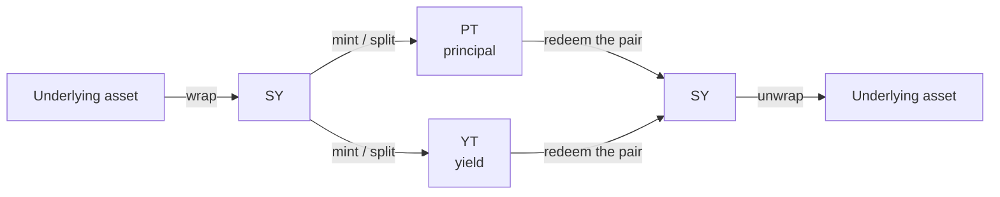

# Minting & redeeming

**Minting** splits one token into two: you deposit [SY](/concepts/standardized-yield) (or the underlying asset) into a market and receive a matched pair of [PT](/concepts/principal-tokens) and [YT](/concepts/yield-tokens). **Redeeming** does the reverse: you hand back a `PT + YT` pair and get SY (or the underlying) out. The two are exact inverses, both settle **1:1**, and both are available on any market **at any time before [maturity](/concepts/maturity)**.

This is the plumbing beneath every other Pendle action. A swap into PT is really "mint the pair, then sell the YT" bundled into one route; a swap into YT is the mirror of that. Doing the split yourself with mint/redeem is the low-level primitive — useful in a handful of specific situations, and worth understanding even when you never reach for it directly.

This page assumes you already know what PT, YT, and SY are. If not, read [How Pendle works](/concepts/how-pendle-works) first. Here we cover what mint and redeem do on-chain, when they beat a swap, the approvals and simulation OpenPendle runs before you sign, and the special case of redeeming PT for the underlying once a market has matured.

::: warning Community pools are unreviewed
Minting and redeeming touch the same market contract as every other action, so the same caution applies. OpenPendle validates a market's **provenance** — that a Pendle factory it recognizes created it — but it does **not** and cannot vouch for the asset or the [SY](/concepts/standardized-yield) contract underneath. [Community pools](/concepts/community-pools) are permissionless and unreviewed — anyone can create one, and interacting with them can lose you funds. Read [Risks & disclosures](/reference/risks) before you sign. Not affiliated with Pendle Finance.
:::

## The identity: `PT + YT = SY`

Everything on this page follows from one equation. Before maturity, Pendle treats one unit of SY as being made of exactly one PT plus one YT:

$$1\ \text{SY} \;=\; 1\ \text{PT} \;+\; 1\ \text{YT}$$

PT carries the **principal** you get back at maturity; YT carries the **yield** the underlying accrues along the way. Neither half alone is worth a whole SY — but together they always are. That is why the split is fully reversible with no price impact: you are not trading anything against a curve, you are just packing and unpacking a fixed relationship.

- **Mint** = take SY apart into its two halves. One SY in, one PT and one YT out.
- **Redeem** = put the two halves back together. One PT and one YT in, one SY out.

Because the ratio is fixed, minting and redeeming are **not priced by the AMM** and carry **no slippage** — the only variables are gas and Pendle's own protocol fees where they apply. Contrast this with a [swap](/guides/buying-pt), which moves PT against SY along the [AMM curve](/concepts/liquidity-and-amm) and therefore has price impact.

## What "or the underlying" means

You can mint from **SY** directly, or from the **underlying asset** the SY wraps. Minting from the underlying is a convenience: Pendle's [Router V4](/reference/networks-and-contracts) (`0x888888888889758F76e7103c6CbF23ABbF58F946`) wraps your underlying into SY and splits it into PT + YT in a single transaction, so you never have to hold the intermediate SY yourself. Redeeming works the same way in reverse — you can take the output as SY, or have the router unwrap it back to the underlying for you.

Which input a market accepts is a property of its [SY](/concepts/standardized-yield). Most SYs accept the underlying yield-bearing asset (and sometimes several related tokens); the OpenPendle mint panel quotes against whatever inputs the SY exposes. Note there is **no native-ETH SY template** in Pendle's common factory, so on the ETH-native chains an SY wraps a *wrapped* or vault form of ETH rather than raw ETH — check what the [pool anatomy](/concepts/pool-anatomy) shows the SY actually takes.

::: info SY is a wrapper, not a separate risk-free layer
Wrapping the underlying into SY does not add or remove risk — SY is a [standardized interface](/concepts/standardized-yield) over the same yield source. Minting from the underlying vs. from SY reaches the identical PT + YT position; the choice is purely about which token you happen to be holding.
:::

## When to mint/redeem instead of swap

For most positions, you should **not** mint or redeem manually — you should [swap](/guides/buying-pt). Swapping into PT or YT gives you a clean single-sided position in one transaction, priced through the AMM. Minting hands you *both* legs at once, which is rarely what you want if you only came for one.

Reach for mint/redeem in these cases:

| Situation | Why mint/redeem fits |
| --- | --- |
| **You want both PT and YT** in equal amounts | Minting gives you the matched pair directly, with no AMM price impact — cheaper and cleaner than buying each leg separately. |
| **You already hold a matched `PT + YT` pair** and want back to SY / the underlying | Redeeming the pair settles 1:1 with no slippage, rather than selling each leg into the curve. |
| **The AMM is thin or the swap's price impact is large** | Minting to get PT, then holding, avoids the swap's slippage entirely for the PT leg — though you are then left holding the YT to deal with. |
| **You are seeding or unwinding a full position** and want the raw legs | Mint/redeem is the primitive that liquidity provision and swaps are built on; sometimes you want the primitive itself. |
| **After maturity** | The pair no longer trades. Redeeming is how you settle — and PT alone [redeems for the underlying](#redeeming-pt-at-maturity) once matured (covered below). |

The mental model: a **swap** changes your *net exposure* (you end up longer PT or longer YT); a **mint/redeem** changes your *token form* (you hold the same combined value, packaged differently). If you want to be long fixed yield, [buy PT](/guides/buying-pt). If you want to be long variable yield, [buy YT](/guides/buying-yt). If you genuinely want the balanced pair, mint it.

::: tip Minting then selling one leg = a swap
Buying PT through OpenPendle already does this for you under the hood: the router mints the pair and sells the YT into the pool in one atomic transaction, leaving you with PT. You almost never need to replicate that by hand — it is simpler and usually cheaper to let the [swap route](/guides/buying-pt) do it. Mint manually when you actually want to keep *both* halves.
:::

## Minting, step by step

The flow in OpenPendle mirrors every other action on a market: pick the network, open the pool, connect, then quote and sign.

1. **Open the market and pass the provenance gate.** Paste the `PendleMarket` address, let OpenPendle confirm a recognized [Pendle factory](/reference/architecture) created it, and read the trust panel. See [Opening a pool](/guides/opening-a-pool).
2. **Connect an injected wallet** on the market's chain. Reads work wallet-less, but minting is a transaction, so you need a connected wallet on the right network — see [Connecting a wallet](/guides/connecting-a-wallet) and clear any wrong-network banner.
3. **Choose the Mint action and your input token.** Select SY or, more commonly, the underlying the SY accepts. The quote updates **live as you type** — enter an input amount and OpenPendle shows the PT and YT you will receive.
4. **Approve the input.** If the input token needs an allowance for the [router](/reference/networks-and-contracts), OpenPendle uses your configured approval mode: the exact amount by default, or unlimited only after an explicit settings opt-in. Confirm it in your wallet. (If the input is native ETH on a chain where the SY accepts it, there is no approval — the amount is sent as `msg.value`.)
5. **Review the simulation and sign.** Before the transaction is offered for signing, OpenPendle **simulates it against the live chain** at the current block, so the PT + YT you see is what the mint will actually produce. Sign, and the pair lands in your wallet.

Because the split is 1:1 and un-priced by the AMM, the amounts you receive move only with the SY's own exchange rate to the underlying, not with pool liquidity. There is nothing to set a slippage tolerance against on the split itself.

## Redeeming, step by step

Redeeming before maturity requires you to hold **both** legs — one PT and one YT for each unit of SY you want back. OpenPendle will quote the pair you can redeem from your balances.

1. **Open the market and connect**, exactly as for minting.
2. **Choose the Redeem action.** OpenPendle reads your PT and YT balances and lets you redeem up to the matched amount you hold. Redeeming needs equal parts PT and YT; any unmatched excess of one leg stays in your wallet (unmatched PT can instead be [sold](/guides/buying-pt), and unmatched YT [sold](/guides/buying-yt), through the AMM).
3. **Pick the output** — SY, or have the router unwrap to the underlying.
4. **Approve the inputs.** Redeeming spends your PT and YT, so the router may need an approval for each. The default is exactly what the transaction consumes; an explicit Unlimited setting leaves standing allowances instead.
5. **Simulate and sign.** As always, the transaction is simulated at the live block before you sign, and the output settles 1:1 (net of any Pendle protocol fee on the redemption path and gas).

::: info Redeem needs the pair; a single leg is a swap, not a redeem
If you hold only PT, or only YT, you cannot "redeem" back to SY before maturity — there is nothing to recombine. Exiting a single leg early means **selling it into the AMM** at the prevailing price: [sell PT](/guides/buying-pt) or [sell YT](/guides/buying-yt). Redemption is specifically for a balanced `PT + YT` pair. (The one exception is PT on its own **at maturity** — see below.)
:::

## Approvals and simulation

Two OpenPendle guarantees apply to every mint and redeem, and they are worth stating explicitly because they shape what your wallet will ask you to confirm.

- **Exact by default; unlimited by explicit opt-in.** When an input token (or a leg you are redeeming) needs an ERC-20 allowance for [Router V4](/reference/networks-and-contracts) `0x888888888889758F76e7103c6CbF23ABbF58F946`, OpenPendle defaults to the amount the transaction spends. Increasing the amount may therefore require another approval. Selecting Unlimited in transaction settings instead leaves a maximum standing allowance until revoked and increases exposure. Native ETH inputs (where the SY accepts them) skip approval entirely and are passed as `msg.value`.
- **Simulate before sign.** Every transaction is **simulated against the live chain** at the current block before OpenPendle offers it for signing. If the split or the redemption would revert — a stale allowance, an SY that rejects the input, a fee-on-transfer or rebasing token the SY cannot handle — the simulation surfaces it *before* you spend gas on a failed transaction, rather than after.

Neither of these is a Pendle feature; they are how OpenPendle constructs and dispatches the call. OpenPendle ships **no contracts of its own** — it calls Pendle's deployed [Router V4](/reference/networks-and-contracts) with hand-written ABIs and takes **no fee of its own**. Pendle's own protocol fees (for example the YT interest fee taken on yield) still apply and are charged by Pendle's contracts.

## Redeeming PT at maturity

Before maturity, PT and YT are two halves of a whole and you need both to reconstitute SY. **At or after maturity, that changes.**

At the [maturity](/concepts/maturity) timestamp, three things become true at once: PT becomes redeemable **1:1 for the underlying**, YT is worth **0** (all its yield has been paid out), and the market **stops trading**. Because YT is now worthless and there is nothing left to recombine, PT no longer needs a matching YT to settle — a matured **PT redeems for the underlying on its own**.

| | Before maturity | At / after maturity |
| --- | --- | --- |
| **Redeem SY / underlying** | Requires a matched `PT + YT` pair, 1:1 | — |
| **Redeem PT alone** | Not possible (must sell into the AMM) | **Yes** — PT redeems 1:1 for the underlying |
| **YT** | Holds the right to remaining yield | Worth 0; nothing left to claim |
| **The AMM** | Trades PT ↔ SY | Stopped; no swaps |

So the post-maturity exit is simple: open the matured market in OpenPendle, choose the redeem action for your PT, and settle it 1:1 for the underlying — no YT required, no swap, no rush. There is no deadline; matured PT can be redeemed whenever you get to it. If you happen to still hold matching YT, it simply contributes nothing.

::: info Example — illustrative numbers only
These figures are invented to show the mechanics; they are not a live quote, not a specific asset, and not a guaranteed rate.

Suppose you minted a position and hold **10,000 PT** in a market that has just passed maturity.

- Each PT now redeems for **1.0000** unit of the underlying.
- Redeeming settles **10,000 PT → ≈ 10,000** underlying, in a single transaction, with no YT needed and no AMM price impact.
- Any YT you also hold is worth **0** and can be ignored.

Whatever the underlying's variable yield did over the term does not change this settlement — that variability belonged to the YT holder along the way. What you get back is your principal at par, in the underlying asset.
:::

::: warning "Par" is only as good as the underlying
PT redeems 1:1 for the **underlying**, whatever that turns out to be worth. If the underlying asset or its [SY](/concepts/standardized-yield) is compromised, de-pegs, or is exotic/broken, par itself can be impaired — you can receive your principal in an asset that has lost value, or fail to redeem at all. Maturity settles the *Pendle* mechanics cleanly; it does not make a bad underlying good. This risk is highest on unreviewed [community pools](/concepts/community-pools).
:::

For the full account of what maturity does to each token and how "rolling" into a later maturity works, see [Maturity & redemption](/concepts/maturity).

## Fee-on-transfer and rebasing tokens

Two categories of token do not work as SY inputs, by Pendle's design and OpenPendle's factory rules: **fee-on-transfer** tokens (which skim a cut on each transfer and break SY accounting) and **rebasing** tokens (whose balances change out from under the SY and break redemption). Pendle's common SY factory **blocks** both when a market is created, so you generally will not encounter them on a well-formed community pool. If a malformed SY still misbehaves, the [simulate-before-sign](#approvals-and-simulation) step is your backstop — a mint or redeem that would break will typically revert in simulation before you spend gas. See [Creating an SY](/create/standardized-yield) for the constraints on what can be wrapped in the first place.

## Summary

- `PT + YT = SY`. **Mint** splits SY (or the underlying) into the pair; **redeem** recombines the pair back to SY (or the underlying). Both are **1:1** and available **any time before maturity**.
- Mint/redeem is **un-priced by the AMM** — no slippage, only gas and any Pendle protocol fee. A [swap](/guides/buying-pt) is priced by the AMM and has price impact.
- **Swap** to change your net exposure (long PT or long YT); **mint/redeem** to change token form while holding the same combined value. Want just one leg? [Buy PT](/guides/buying-pt) or [buy YT](/guides/buying-yt) instead of minting both.
- OpenPendle **simulates every transaction** before you sign and defaults approvals to the **exact amount**; Unlimited is an explicit, higher-exposure opt-in. Calls go through Pendle's [Router V4](/reference/networks-and-contracts) `0x888888888889758F76e7103c6CbF23ABbF58F946`, with no OpenPendle contracts or fee.
- **At maturity**, PT redeems **1:1 for the underlying on its own** (YT is worth 0, the market stops trading). No pair, no swap, no deadline.

## See also

- [How Pendle works](/concepts/how-pendle-works) — the full PT / YT / SY split this page operates on.
- [Principal Tokens (PT)](/concepts/principal-tokens) — the fixed-yield leg you mint.
- [Yield Tokens (YT)](/concepts/yield-tokens) — the variable-yield leg you mint alongside it.
- [Maturity & redemption](/concepts/maturity) — what maturity does, and redeeming PT for the underlying afterward.
- [Buying PT (fixed yield)](/guides/buying-pt) — take just the PT leg via a swap.
- [Buying YT (yield exposure)](/guides/buying-yt) — take just the YT leg via a swap.
- [Risks & disclosures](/reference/risks) — please read before you sign anything.
