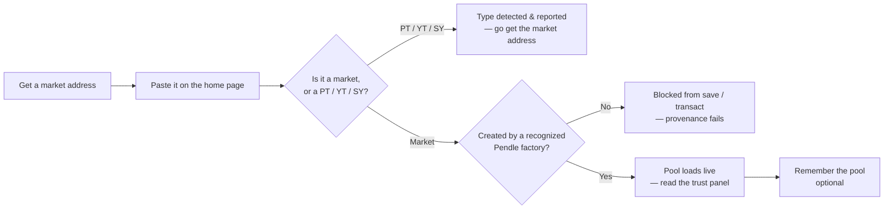

# Opening a pool & the trust panel

Every session in OpenPendle starts the same way: you open a market. Because community pools are not listed anywhere central, there is no catalogue to browse — you reach a pool by pasting its address, and OpenPendle loads it live from the chain. This guide covers the whole entry path: where to get a market address, what happens when you paste one, how OpenPendle screens it at the **provenance gate**, what the pool view loads, and — the part that actually protects your funds — how to read the **trust panel** before you decide a pool is worth transacting on.

This is a guide, not a concept primer. It assumes you already know what [PT](/concepts/principal-tokens), [YT](/concepts/yield-tokens), and [SY](/concepts/standardized-yield) are; if any of those are new, read [How Pendle works](/concepts/how-pendle-works) first and come back. Everything here is about *doing* — no wallet required until you actually transact.

::: warning Loadable is not the same as safe
OpenPendle will only ever load and let you act on a market whose **provenance** it can verify — that a Pendle factory it recognizes created it. That check says nothing about whether the **asset or the SY underneath** is sound. A pool that opens cleanly, passes the gate, and renders a full trust panel can still wrap a broken, exotic, or outright malicious asset. Community pools are permissionless and unreviewed — anyone can create one, and interacting with them can lose you funds. Read the trust panel below before you commit anything, and read [Risks & disclosures](/reference/risks) before you sign. Not affiliated with Pendle Finance.
:::

## The entry flow at a glance

Two gates sit between an address and a live pool. The first checks *what kind of address* you pasted — a market, or one of its component tokens. The second checks *where the market came from*. Only after both pass does the pool view render, and even then the work is not done: the trust panel is yours to read.

## 1. Find a market address

A Pendle **pool** — the app also calls it a **market** — is a single on-chain `PendleMarket` contract. Its address is the one thing you paste into OpenPendle. It is **not** the PT address, **not** the YT address, and **not** the SY address; those are components reachable *from* the market once it loads, not entry points of their own. For why that distinction exists, see [Anatomy of a pool](/concepts/pool-anatomy).

Because community pools are unlisted, you will almost always arrive with an address from one of these sources:

- **The pool's creator.** Whoever deployed the market typically shares its address — in a Discord announcement, an X post, a project's docs, or a Telegram channel. Creators sometimes share the **PLP address** (the pool's LP token) or link to the market on a block explorer; treat any of these as a lead to the underlying `PendleMarket`.
- **A block explorer.** If you know the asset and maturity, you can locate the `PendleMarket` on the chain's explorer and copy its address directly.
- **A `?import=` share link.** Another user can send you a link that encodes one or more pools. Opening it offers to import them into your [saved pools](/guides/saved-pools) — no manual pasting needed.
- **Your own saved pools.** Anything you previously remembered appears on the home page preview and in full on the [Saved Pools](/guides/saved-pools) page. This is the fastest path back to a pool you have already vetted.

::: tip Ask for the *market* address specifically
When you ask a creator for a pool, ask for the **market address** (the `PendleMarket`), not "the pool token" or "the PT". A single pool exposes four related addresses — market, PT, YT, SY — and three of them are the wrong thing to paste. Naming the market up front saves a round trip. If you do end up with the wrong one, OpenPendle tells you which one you pasted (next section).
:::

### Make sure the address matches the active network

A given market address exists on exactly **one** chain. OpenPendle reads from a single **active network** at a time — a UI and `localStorage` choice (key `openpendle.chain`, default **Arbitrum**) set from the network selector in the header. If you paste an Arbitrum market while the app is pointed at Base, it will not resolve. Set the active network to the chain the market lives on **before** you paste. Browsing is wallet-less, so you can do this with nothing connected. See [Browsing & networks](/guides/browsing) for the network selector and per-chain RPC settings.

→ [Anatomy of a pool](/concepts/pool-anatomy) · [Browsing & networks](/guides/browsing)

## 2. Paste the address — and what happens if it is the wrong one

Paste the address into the open-a-market field on the home page. OpenPendle immediately inspects the address on-chain and asks the first question: **is this a `PendleMarket`, or is it a PT, YT, or SY?**

You do not have to memorize which of the four addresses is correct, because OpenPendle checks for you. If you paste a **PT, YT, or SY** by mistake, it **detects the token type and reports it back to you** — telling you the address is a *component* of a pool, not the pool itself — rather than silently failing or loading a broken screen. The message points you at the fix: go find the `PendleMarket` address for that same asset and maturity, and paste that instead.

This detection is a convenience, not a trust signal. Recognizing that an address is a PT does not say anything about whether the pool behind it is safe — it only means you pasted the wrong one of the four addresses.

::: info Example — pasting a component by mistake (illustrative)
The addresses below are invented to show the *shape* of the flow. They are not a real pool and pasting them loads nothing.

Suppose a creator's Discord message contains two addresses, and you paste the PT one, `0xPT…`, first. OpenPendle inspects it, recognizes a Principal Token, and reports: *this is a component of a pool, not the pool — paste the `PendleMarket` address*. You go back, find the market address `0xMARKET…` for the same maturity, paste that, and the pool loads. The PT, YT, and SY are all reachable from the loaded pool afterward — you never needed to enter them directly.
:::

→ [Anatomy of a pool](/concepts/pool-anatomy) — the four addresses of one pool, in depth.

## 3. The provenance gate

Once OpenPendle confirms the address is a `PendleMarket`, it runs the **provenance gate**. Anyone can deploy a contract and *call* it a Pendle market; the gate answers a narrower question: **was this market actually created by a Pendle factory that OpenPendle recognizes?** Until that check passes, you cannot save or transact against the market.

How the check is built, and why:

- **The factory set is hardcoded, for validation only.** OpenPendle ships with a known set of Pendle factory addresses and uses it to answer exactly one thing — *did a recognized factory deploy this market?* It is a provenance test, not a curated list of "good" pools.
- **The active factory is resolved live.** Pendle's factories are **governance-mutable**: governance can change which factory is current. So OpenPendle resolves the active factory at runtime against the chain rather than trusting a frozen value. The hardcoded set is used only to validate the provenance of an existing market, never to decide where anything new is routed.
- **Factory lineage differs by chain.** Not every network carries the full history of factory versions. Ethereum, BSC, and Arbitrum carry `v1 + V3 + V4 + V5 + V6`; Base and Plasma carry `V5 + V6`; Monad is `V6` only. The authoritative live per-chain list is on the app's [Protocol Status & Contracts](https://openpendle.com/#/status) page, which you can verify against [`pendle-finance/pendle-core-v2-public`](https://github.com/pendle-finance/pendle-core-v2-public).

::: warning Provenance is validation, not endorsement
Passing the gate proves only that the market descends from a genuine Pendle factory. It says **nothing** about whether the asset or SY underneath is sound. OpenPendle validates market provenance but cannot vouch for the assets or SY contracts underneath. Treat a passing gate as "this is a real Pendle market," never as "this pool is safe to fund."
:::

→ [Networks & contracts](/reference/networks-and-contracts) · [Architecture](/reference/architecture) · [Community pools & incentives](/concepts/community-pools)

## 4. What loads

Because OpenPendle has [no operated backend, database, or indexer](/reference/architecture), the core pool view is read **live from the chain** over public RPC, batched through `Multicall3` (`0xcA11bde05977b3631167028862bE2a173976CA11`). A pool is self-describing: the `PendleMarket` points at its PT, YT, and SY, and those in turn describe the asset. External indexes are used only by the separate PT/YT-to-pool convenience lookup. Once the gate passes, the pool view assembles and shows:

| What loads | Read from | What it is |
| --- | --- | --- |
| **Component addresses** | The market | The PT, YT, and SY this market is wired to — all reachable from here. |
| **Maturity** | The market / PT | The fixed date the pool resolves. After it, PT redeems 1:1, YT is worth 0, trading stops. |
| **Reserves** | The market | The PT and SY balances in the AMM — the depth backing a swap and what an LP share claims. |
| **Implied APY** | Derived from the PT price | The fixed yield implied by the current PT price — a live reading, never a promise. |
| **Underlying / SY details** | The SY | The wrapped asset, its decimals, and the tokens the SY accepts in and out. |
| **Factory provenance** | The market | The factory that deployed the market — the field the gate validated. |
| **Available actions** | Derived from state | Mint / redeem, swap to PT or YT, add / remove liquidity — or, after maturity, redeem PT and exit LP. |

Two things to keep in mind about this data:

- **Implied APY is derived, not stored.** No contract holds an "APY" field. It is computed from the current PT price against par and the time left to maturity, and it moves with every trade. See [How Pendle works](/concepts/how-pendle-works).
- **Prices come from a TWAP oracle.** Pendle's `PendlePYLpOracle` (`0x5542be50420E88dd7D5B4a3D488FA6ED82F6DAc2`) provides time-weighted prices for PT, YT, and LP. A freshly deployed market starts with oracle cardinality 1; quoting and trading through OpenPendle do **not** require the oracle to be expanded, though other protocols that price the pool via TWAP do. See [Initializing the oracle](/create/price-oracle).

## 5. Reading the trust panel

This is the section that matters. A loaded pool that passed the gate has cleared exactly one bar — it is a genuine Pendle market. **Everything about whether it is safe to fund lives below the market, in the asset and the SY.** The trust panel is where OpenPendle surfaces those facts so you can judge them yourself before committing a cent. Read it every time, even on a pool a friend recommended.

Work through four questions, roughly closest-to-the-money last.

### 5.1 The underlying asset — do you understand it?

The pool is only ever as sound as the yield-bearing asset at its base. If the underlying de-pegs, freezes, or fails, **PT may not redeem at par** and the whole structure breaks. Before anything else, identify the wrapped asset and ask whether you actually understand its risk: what is it, who issues it, where does its yield come from, and what could make it fail. A high implied APY is often the market pricing in exactly that risk — a cheap PT can mean the market doubts the asset, not that you are getting a bargain. If you cannot explain the underlying, you cannot price the pool.

### 5.2 The SY — and its owner and upgradeability

The [SY](/concepts/standardized-yield) is the contract closest to the money and the single thing most worth scrutinizing. Two properties of an SY change what you are trusting, and both are part of the trust surface:

- **Owner.** An SY has an owner that holds privileged control over its configuration. SYs deployed through Pendle's wizard default their owner to **Pendle's governance proxy** (`0x2aD631F72fB16d91c4953A7f4260A97C2fE2f31e`). But an SY you find in the wild may be owned by **anyone**. Check who the owner is and what they can do.
- **Upgradeability.** Some SY templates deploy a plain, immutable wrapper; others — the adapter and no-redeem/no-deposit variants — deploy as **`TransparentUpgradeableProxy`** contracts, meaning the code behind the SY address **can be replaced later**. For wizard-deployed adapter SYs the proxy admin is **Pendle's `ProxyAdmin`** (`0xA28c08f165116587D4F3E708743B4dEe155c5E64`), i.e. Pendle governance. An SY encountered on-chain may sit behind a different, unknown admin entirely. "Upgradeable" means the behavior of the pool is only as fixed as its upgrade authority chooses to keep it.

The point is not that Pendle governance is hostile — it is that *owned* and *upgradeable* are real, checkable properties, and a community pool's SY may have been deployed with a **non-default** owner or a custom adapter. Never fund a pool whose SY you have not looked at.

### 5.3 The factory — provenance, seen from the pool side

The trust panel also reflects the **factory** the market descends from, the field the [provenance gate](#_3-the-provenance-gate) validated. Seeing a recognized factory here is the positive signal that the market itself — the AMM and the PT/YT split logic — is Pendle's audited V2 code rather than an impostor. Remember its scope: the factory vouches for the *market machinery*, not for the *asset* the market wraps. It is the one line in the trust panel that provenance fully covers.

### 5.4 Maturity — how much runway is left?

Every pool resolves at a fixed **maturity** date. Read it and know what it implies for the position you are considering:

- **Before maturity:** PT trades at a discount to par (a fixed-yield position), YT holds the yield until then, and the market trades normally.
- **At and after maturity:** PT becomes redeemable **1:1 for the underlying**, YT is worth **0**, and the market **stops trading**. You can still redeem PT and exit an LP position afterward — those actions remain available in OpenPendle — but there is no more price discovery.

A pool days from maturity behaves very differently from one months out. See [Maturity & redemption](/concepts/maturity).

### The trust surface, summarized

| You are trusting | Why it matters | Covered by provenance? |
| --- | --- | --- |
| **The Pendle factory & contracts** | The market, AMM, and PT/YT split are Pendle's audited V2 code. | ✅ Validated — the market descends from a recognized factory. |
| **The underlying asset** | If it fails, PT may not redeem at par and the structure breaks. | ❌ Not covered — unreviewed. |
| **The SY contract** | A faulty or hostile SY can break deposits, redemption, or accounting. | ❌ Not covered — unreviewed. |
| **The SY owner / upgradeability** | Whoever controls an upgradeable SY can change its behavior. | ❌ Not covered — check it yourself. |

::: info Example — reading a trust panel (illustrative)
The values below are invented to show *what you look at*, not a real pool.

You open `0xMARKET…` on Arbitrum. The gate passes: a recognized V6 factory deployed it. The trust panel shows an underlying you recognize and understand, an SY whose owner resolves to Pendle's governance proxy (`0x2aD631F72fB16d91c4953A7f4260A97C2fE2f31e`) and which is **not** an upgradeable variant, a maturity roughly **five months** out, reserves near **55% PT / 45% SY**, and an implied APY of about **6%**. You understand the asset, you are comfortable with the owner and the fact that the SY is immutable, and five months of runway suits your plan — so you decide to proceed. Had the SY instead been an upgradeable proxy under an unfamiliar admin, or the underlying an asset you could not explain, the responsible move is to stop. The 6% and the 55/45 split are live readings that move with every trade, never guarantees.
:::

::: danger A pool that loads can still lose you money
Community pools are permissionless and unreviewed — anyone can create one, and interacting with them can lose you funds. **OpenPendle validates market provenance but cannot vouch for the assets or SY contracts underneath.** If the underlying asset fails, PT may not redeem at par; if the SY is faulty, hostile, or upgraded to something malicious, deposits and redemption can break. Provenance protects you from a *fake market*, not from a *bad asset*. Inspect the SY and the underlying yourself — a block explorer and the [Protocol Status & Contracts](https://openpendle.com/#/status) page are your tools — and never interact with a pool unless you trust whoever created it and everything beneath it. Experimental — use at your own risk. Not affiliated with Pendle Finance.
:::

→ [Standardized Yield (SY)](/concepts/standardized-yield) · [Community pools & incentives](/concepts/community-pools) · [Risks & disclosures](/reference/risks)

## 6. Remember the pool

Once you have opened a market worth tracking — and, if you intend to fund it, once you have read its trust panel — you can save it so you do not have to hunt down the address again. Toggle **Remember this pool**.

This writes the pool to your browser's `localStorage` under the key `openpendle.pools.v1` — entirely **client-side**, with no OpenPendle backend storage or account. The saved registry is not uploaded to a server. RPC and ancillary providers can still observe the individual requests you make when opening a pool. Saved pools store the **market address**, so the "which of the four addresses" lookup from step 1 is resolved once and reused: opening a saved pool goes straight to the live pool view (and re-runs the provenance gate against the current chain state).

Saved pools appear grouped by network on the [Saved Pools](/guides/saved-pools) page, with a short preview on the home page. From there you can:

- **Forget** a pool — a roughly **four-second Undo** toast restores it exactly if you change your mind.
- **Export to JSON**, **Import**, or generate a shareable **`?import=` link** that encodes your registry to move it between browsers or devices.

The saved-pool registry leaves your browser only when *you* choose to export or share it. See [Saved pools & privacy](/guides/saved-pools) for the full registry and network-request model.

## After it loads: what you can do

With a pool open and its trust panel read, connect a wallet to act on it. OpenPendle is **injected-only** — it talks to a browser wallet directly, with no WalletConnect (see [Connecting a wallet](/guides/connecting-a-wallet)). Every action behaves the same way: quotes update live as you type, the transaction is **simulated against the live chain before you sign**, and token approvals default to the **exact amount**. Unlimited approval requires an explicit settings opt-in and leaves greater standing exposure. All trades, liquidity, and exits route through Pendle's **Router V4** (`0x888888888889758F76e7103c6CbF23ABbF58F946`). OpenPendle adds no fee of its own; Pendle's own protocol fees still apply.

From a loaded, in-flight pool you can:

- **Swap to PT** for a fixed yield locked in at purchase — see [Buying PT](/guides/buying-pt).
- **Swap to YT** for yield exposure — see [Buying YT](/guides/buying-yt).
- **Mint / redeem** — split SY (or the underlying) into `PT + YT`, or recombine them, any time before maturity — see [Minting & redeeming](/guides/minting-redeeming).
- **Add / remove liquidity** to earn swap fees and any Merkl incentives — see [Providing liquidity](/guides/providing-liquidity).

::: warning Opening is free; signing is not
Steps 1 through 6 need no wallet and move no funds — you can browse and read every trust panel with nothing connected. The moment you connect and sign, you are transacting against a permissionless, unreviewed market. Simulation shows the *expected* result; it cannot make an unsafe asset safe. Only sign after you have read the trust panel and understand the asset.
:::

## Next

- [Anatomy of a pool](/concepts/pool-anatomy) — the four addresses of one pool and the trust surface, in depth.
- [Standardized Yield (SY)](/concepts/standardized-yield) — the contract closest to the money, and why the SY is where the risk lives.
- [Community pools & incentives](/concepts/community-pools) — what "permissionless and unreviewed" really means.
- [Buying PT](/guides/buying-pt) — the most common first action, step by step.
- [Saved pools & privacy](/guides/saved-pools) — how the client-side registry works.
- [Risks & disclosures](/reference/risks) — please read this before you transact.
