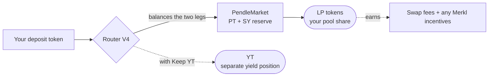

# Providing liquidity

Providing liquidity means depositing into a market's [AMM](/concepts/liquidity-and-amm) and receiving an **LP position** — a claim on a share of the pool's reserves that earns swap fees, plus any [Merkl incentives](/create/incentives) the pool happens to carry. This guide walks through doing it in OpenPendle: what you deposit and what you get back, where the return comes from, how to remove liquidity, how exiting at or after maturity behaves, and the specific risks you take on.

This is a guide, not a concept page. It assumes you already know what [PT](/concepts/principal-tokens), [YT](/concepts/yield-tokens), and [SY](/concepts/standardized-yield) are, and how a Pendle [AMM](/concepts/liquidity-and-amm) is put together. If any of that is unfamiliar, read those pages first — an LP position touches all of them at once.

::: danger Community pools are unreviewed — an LP position can lose you money
The pool you provide liquidity to is a **community pool**: permissionless, and reviewed by no one. **OpenPendle validates market provenance but cannot vouch for the assets or SY contracts underneath.** As an LP you are exposed to the underlying asset, to impermanent loss, and to PT-vs-SY price risk simultaneously — and if the underlying asset fails, the PT may not redeem at par. Experimental — use at your own risk. Not affiliated with Pendle Finance.
:::

## Before you start

To add or remove liquidity you need three things in place:

1. **A wallet connected** to OpenPendle. Reads are wallet-less, but liquidity operations are transactions, so you must connect an injected wallet on the right chain. See [Connecting a wallet](/guides/connecting-a-wallet).
2. **The market open**, with its provenance validated. Paste the `PendleMarket` address (not the PT, YT, or SY address) and let OpenPendle confirm a Pendle factory created it. See [Opening a pool](/guides/opening-a-pool).
3. **A deposit token** the pool accepts, and gas on that chain. The market must not have matured if you intend to *add* — removal stays open after maturity, but adding to a market that has stopped trading is not useful.

Everything below routes through Pendle's **Router V4** at `0x888888888889758F76e7103c6CbF23ABbF58F946`, the same entry point used for every trade, liquidity action, and exit. OpenPendle ships no contracts of its own and adds no fee of its own.

## What you deposit and what you receive

A Pendle AMM holds a reserve of two tokens: **PT** and **SY**. When you add liquidity you contribute to that reserve and receive **LP tokens** representing your pro-rata share of the pool. Your LP tokens are a claim on the pool's *current* reserves, not on a fixed basket of what you put in — as people trade, the PT/SY mix your share represents drifts (see [What an LP position holds](/concepts/liquidity-and-amm#what-an-lp-position-holds)).

You do not have to arrive holding both PT and SY. OpenPendle quotes a route through the Router that lets you add liquidity from a single token — the Router converts part of your input into the other reserve leg and deposits a balanced amount, all in one simulated transaction. In practice you will encounter these deposit modes:

| You deposit | What the Router does | What you receive |
| --- | --- | --- |
| A single accepted token (e.g. the underlying or SY) | Uses part to acquire the missing leg, deposits a balanced PT + SY amount | **LP tokens** only (unless you opt into *Keep YT* — see below) |
| PT and SY you already hold | Deposits both directly into the reserve | **LP tokens** |

Quotes update live as you type, and every route is **simulated against the live chain before you sign**. Token approvals default to the **exact amount**, so a single-token add on a token you have not used before normally prompts an approval for precisely the deposit amount first, then the add itself. Selecting Unlimited in transaction settings instead leaves a standing allowance and increases exposure until you revoke it.

::: info The "Keep YT" option
By default, a single-token add returns **only LP tokens**: the Router swaps part of your input into PT along the AMM curve and deposits a balanced amount, with no YT left over. If you instead tick **Keep YT** (off by default), OpenPendle uses a route that mints PT + YT from your SY, puts the PT into the pool, and **returns the YT to you** — the same by-product a [pool deploy](/create/deploying-a-market) hands the seeder. That YT is a separate [yield-exposure position](/concepts/yield-tokens) you can hold, sell, or redeem; it is *not* part of your LP tokens and does not come back automatically when you remove liquidity. Reach for *Keep YT* only when you deliberately want that yield leg alongside your LP.
:::

## Where the return comes from

An LP position has two on-chain income streams, plus a passive tailwind that is easy to overlook:

- **Swap fees.** Every swap through the market pays a fee, denominated in SY, that accrues to the pool and therefore to LPs pro-rata. The fee is set and enforced by Pendle's protocol parameters — OpenPendle takes none of it. Fee income scales with trading volume, so it is uneven: active repricings earn more than quiet stretches.
- **Merkl incentives, if any.** Community pools are **not** eligible for native PENDLE gauge emissions or vePENDLE voting — those are reserved for Pendle-team-listed markets. Any extra rewards on a community pool instead come from a [Merkl](https://merkl.angle.money/) campaign that the pool's creator or a third party chooses to fund. Merkl rewards are **claimed separately** through Merkl's distributor, using OpenPendle's **My positions** page or Merkl's interface; they are not guaranteed and can stop at any time — many community pools have none. See [Incentivizing with Merkl](/create/incentives).
- **The passive drift of the reserves.** The SY held in the pool is a yield-bearing wrapper, and the PT accretes toward par as time passes. Both lift the underlying value of the reserves your LP share represents, independent of trading fees.

::: warning Fee APR is one component, not the whole return
Your realized return is fees **plus** any Merkl rewards **plus** the change in the underlying value of the PT/SY reserves you end up holding — and that last term can be negative through impermanent loss. Any fee APR quoted anywhere is a single line item, not a promise of total return. Reason about the whole position.
:::

## Removing liquidity

You can remove liquidity through OpenPendle at any point in the market's life — removal is **not** gated on maturity. When you remove, you redeem some or all of your LP tokens and receive your pro-rata share of the pool's reserves *as they are at that moment*.

OpenPendle quotes the withdrawal the same way it quotes the add — live, and simulated before you sign. The output depends on the pool's current composition:

- **Before maturity**, the reserve is a mix of PT and SY, so a removal returns **both legs**. Depending on the route you choose, OpenPendle can hand you PT + SY directly, or convert to a single token in the same transaction (for example, redeeming the PT+YT back to SY and unwrapping, or swapping the PT leg out). Whatever route you pick, any impermanent loss present is **realized at the moment you withdraw** — that is when the paper divergence becomes a booked result.
- **After maturity**, the reserve is essentially all PT (which now equals the underlying 1:1), so a removal returns close to the underlying value your LP share represents. See the next section.

Removing does **not** return the YT you may have received when you added — that YT is a separate position you hold or dispose of on its own.

::: tip Removing partially is fine
You do not have to exit the whole position at once. Redeem a fraction of your LP tokens and the rest stays in the pool, still earning fees and still exposed. OpenPendle quotes whatever amount you enter.
:::

## Exiting at or after maturity

Maturity does not lock your capital in the pool. It changes what the position *is*, and it stops the fee stream — but you can still remove liquidity afterward, on your own schedule.

At the maturity timestamp the market stops trading. From that point:

| Token / position | State at and after maturity |
| --- | --- |
| **PT** (including the PT in the pool) | Redeemable **1:1 for the underlying**. |
| **YT** (the leg you may hold separately) | Worth **0** going forward; claim any accrued-but-unclaimed yield before it stops trading. |
| **The market (AMM)** | **Stops trading** — no more swaps, so **no further fee income** accrues to LPs. |

Because trading has stopped, the pool's reserve is by then essentially **all PT**. Removing liquidity after maturity therefore returns close to the underlying value your LP share represents — you remove to get the PT (and any residual SY), then redeem the PT 1:1 for the underlying, with **no swap, no slippage, and no dependence on pool liquidity**. There is no penalty for exiting after maturity rather than at the precise instant of it: the position has simply stopped changing.

::: tip No rush at maturity
A matured LP position is no longer earning fees and no longer moving in value, but it is not decaying either. Remove liquidity and redeem the PT whenever it is convenient — the underlying value waits for you. For the full end-of-life mechanics, see [Maturity & redemption](/concepts/maturity).
:::

## Risks of an LP position

Providing liquidity to a community pool concentrates several risks into one position. Understand each before you deposit.

**Impermanent loss.** The AMM rebalances the reserve as prices move, so an LP can end up worse off than simply holding the two deposited assets. For a PT/SY pair this is comparatively benign — the two legs track the same underlying, and PT's price is pinned to par at maturity, so the divergence is bounded and tends to resolve if you hold to maturity. It is **not** zero: if the market's [implied APY](/concepts/how-pendle-works) swings sharply, the pool rebalances and an LP who exits mid-swing can realize a loss. Exiting early forecloses the convergence that would otherwise close the gap. See [Impermanent loss for a PT / SY pair](/concepts/liquidity-and-amm#impermanent-loss-for-a-pt-sy-pair).

**PT exposure.** Your LP share is always partly PT, and near maturity it is *mostly* PT. PT is only worth par **if it redeems at par**, which depends entirely on the underlying asset behaving as expected through maturity. If the underlying is malicious, broken, or exotic and fails to hold value, the PT may not redeem 1:1 — and the convergence that makes a held-to-maturity LP position "safe" does not happen. You carry that underlying-asset risk for the whole time you are in the pool.

**The pool itself is unreviewed.** OpenPendle's provenance gate confirms that a Pendle factory created the market — nothing more. It does **not** review the asset, the SY contract, or the pool's parameters. A factory-valid market can still wrap something dangerous. Community pools are permissionless and unreviewed — anyone can create one, and interacting with them can lose you funds.

**Other standing risks.** No swap fees accrue after maturity; Merkl incentives, where they exist, are third-party-funded and can stop without notice; and every transaction depends on the RPC endpoint the app reads through — point it only at an endpoint you trust ([Browsing & networks](/guides/browsing#custom-rpc-endpoints)). OpenPendle's simulate-before-sign flow and exact-approval default reduce transaction-level surprises, but explicit unlimited approval increases standing exposure and neither mode can make an unsafe underlying safe.

::: danger You are exposed to the asset, the AMM, and PT price at once
An LP position stacks underlying-asset risk, impermanent-loss risk, and PT-vs-SY price risk into a single holding. **OpenPendle validates market provenance but cannot vouch for the assets or SY contracts underneath.** Read [Risks & disclosures](/reference/risks) before you deposit. Experimental — use at your own risk.
:::

## A worked example of the return components

::: info Example — illustrative numbers only
These figures are made up to show how the pieces of an LP return add up. They are **not** live, quoted, or guaranteed, and no real pool, asset, or APY is implied.

Suppose you add liquidity worth **10,000 units** of an underlying asset to a community PT/SY pool with **six months** to maturity, and you hold to maturity. Over that period, imagine:

| Return component | Illustrative contribution | Where it comes from |
| --- | --- | --- |
| Swap fees | +2.0% | Your pro-rata share of trading fees, in SY |
| SY-native yield on the pooled SY | +1.5% | The SY wrapper is yield-bearing |
| PT accretion toward par | +1.0% | PT converges to par by maturity |
| Merkl incentives | +0.5% | A Merkl campaign happened to be funded (often there is none: +0%) |
| Impermanent loss realized at exit | −0.4% | Implied APY moved, so the pool rebalanced away from a pure hold |
| **Illustrative net** | **≈ +4.6%** | Sum of the above over six months |

Read the shape, not the numbers. The return is a **sum of parts** — some positive, at least one that can be negative. Lower volume, no Merkl campaign, a sharp implied-APY swing, or a fault in the underlying can push the net far lower or negative. The convergence toward par only holds if the PT actually redeems at par, which depends entirely on the unreviewed asset underneath.
:::

## See also

- [Liquidity & the AMM](/concepts/liquidity-and-amm) — how the PT/SY pool is built, what an LP holds, and the full impermanent-loss picture.
- [Opening a pool](/guides/opening-a-pool) — load a market and check its provenance before you deposit.
- [Minting & redeeming](/guides/minting-redeeming) — deal with the YT leg you receive, or move between SY and PT+YT.
- [Deploying the market](/create/deploying-a-market) — creating a pool seeds liquidity and returns LP + YT to you.
- [Incentivizing with Merkl](/create/incentives) — why community pools use Merkl instead of native gauges, and how rewards reach LPs.
- [Maturity & redemption](/concepts/maturity) — what happens at expiry and how to exit afterward.
- [Risks & disclosures](/reference/risks) — the full risk surface before you transact.
