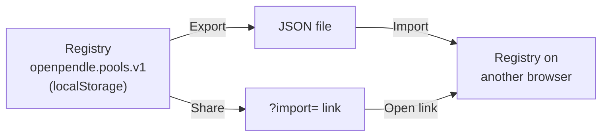

# Saved pools & privacy

OpenPendle has no accounts, so there is nowhere on a server for it to remember which markets you care about. Instead, when you **remember** a pool, its identity is written to a small list held in your own browser. That list — the **saved-pools registry** — is what powers the [`/pools`](https://openpendle.com/#/pools) page and the short preview on the home page. It never leaves your machine unless you deliberately export or share it.

This page covers how remembering and forgetting work (including the brief **Undo** window), where the registry lives, how to move it between browsers and devices with **export**, **import**, and a shareable **`?import=`** link, and the privacy model that makes all of this possible: the registry is client-side, with no OpenPendle account, backend storage, or tracking.

If `PT`, `YT`, and `SY` are new terms, start with [How Pendle works](/concepts/how-pendle-works); this guide assumes you already know them and focuses on the registry and privacy.

::: info Nothing here needs a wallet or an account
Remembering, forgetting, browsing your saved list, exporting, and importing are all local, read-only actions. They touch your browser's storage, not the chain and not any server. You only need a wallet to **transact** — see [Connecting a wallet](/guides/connecting-a-wallet).
:::

## What "saving" a pool means

A Pendle market — a "pool" — is an on-chain `PendleMarket` contract, identified by its address on exactly one chain. Saving a pool does **not** move funds, create an on-chain record, or register anything with Pendle. It simply records enough to find that market again: its address and the network it lives on. The next time you open OpenPendle, the market is one click away instead of a pasted address.

Because a market address is chain-specific, the registry stores each entry alongside its network. That is why the [`/pools`](https://openpendle.com/#/pools) page can group your saved markets **by network** — the chain is part of every saved entry, not a guess made at display time.

::: warning Saving is a bookmark, not an endorsement
Before OpenPendle lets you save or transact against a market, it verifies the market was created by a Pendle factory it recognizes. This is **validation of provenance, not endorsement** — it confirms a Pendle factory minted the market, not that the asset or SY underneath is sound. Community pools are permissionless and unreviewed; anyone can create one, and interacting with them can lose you funds. A saved pool is still an unreviewed pool. See [Community pools & incentives](/concepts/community-pools) and [Risks & disclosures](/reference/risks).
:::

## Remember and forget

**Remember this pool** adds the market to your registry. You will typically do this from a market you have opened — once its provenance is validated, remembering it is a single action, and the pool immediately appears on the [`/pools`](https://openpendle.com/#/pools) page and in the home-page preview.

**Forget** removes it again. Forgetting is reversible for a few seconds:

- When you forget a pool, a small **Undo** toast appears for roughly **four seconds**.
- Choosing **Undo** within that window **restores the entry exactly** — the same market, on the same network, as it was before.
- If you let the toast expire, the entry is gone from the registry. You can always re-add it later by opening the market again and choosing **Remember this pool**, since the pool still exists on-chain regardless of whether you have it saved.

::: tip The Undo toast is your safety net for accidental removals
Because forgetting is a local edit with no server round-trip, the ~4-second Undo is the intended way to reverse a mis-click. Once it expires there is no separate "trash" to recover from — but nothing is lost in any permanent sense, because a saved pool is only a pointer to a market that lives on-chain. Re-open the market and remember it again to bring it back.
:::

## Where your saved pools live

The registry is stored in your browser's **`localStorage`** under the key:

```
openpendle.pools.v1
```

That single key holds the whole list. A few properties follow from where it lives:

- **It is per-browser and per-origin.** The registry belongs to `openpendle.com` (or whatever host you run OpenPendle on) in the specific browser and profile you used. A different browser, a different device, or a private/incognito window starts with an empty list.
- **It survives reloads and revisits**, because `localStorage` persists until it is cleared.
- **Clearing site data removes it.** If you clear cookies and site data for the OpenPendle origin, `openpendle.pools.v1` goes with it and your saved list resets to empty. Export first if you want to keep it (see below).
- **It is one of several local keys OpenPendle uses**, alongside your active network (`openpendle.chain`), any per-chain RPC overrides (`openpendle.rpc.<chainId>`), and your theme. All of them are browser-local settings — see [Browsing & networks](/guides/browsing) for the rest.

::: info The `v1` suffix is a versioned schema marker
The key is `openpendle.pools.v1` rather than a bare name so the on-disk format can evolve without corrupting an older list. Treat the exact key as an implementation detail you may read for debugging or backup, but rely on **Export / Import** (below) for moving data — that path is stable and handles the format for you.
:::

## Moving the registry between devices

Because the registry is client-side, it does not automatically follow you to another browser or device. There is no sync server — by design. OpenPendle gives you three explicit ways to move it yourself, and each one only sends data where you tell it to.

| Method | What it produces | Good for |
| --- | --- | --- |
| **Export to JSON** | A JSON file (or blob) containing your saved pools | A durable backup; moving between machines you control |
| **Import** | Reads a JSON export back into the registry | Restoring a backup; loading a list someone sent you |
| **`?import=` share link** | A URL that encodes your pools in the link itself | Quickly handing a set of pools to another browser or person |

### Export to JSON

**Export** serializes your current saved-pools registry into JSON. Keep the file as a backup, move it to another machine, or hand it to someone else. Nothing is uploaded in the process — export produces data **for you** to save or send; the act of exporting does not transmit anything on its own.

### Import

**Import** takes a JSON export and loads those pools back into `openpendle.pools.v1` in the current browser. Use it to restore a backup on a fresh machine, to reconstruct your list after clearing site data, or to adopt a set of pools someone exported and sent you.

### The `?import=` share link

A **`?import=` link** encodes your saved pools directly in a URL. Opening that link in another browser loads the encoded pools into that browser's registry — a fast way to move a list without handling a file. It is the shareable form of the same data an export produces.

::: warning An imported list is still a list of unreviewed markets
Importing pools — from a file or an `?import=` link — copies **pointers to markets**, not any judgement about them. Every imported market is still subject to OpenPendle's provenance gate when you open it, and provenance is not safety: community pools are unreviewed and can lose you funds. Treat a list shared by someone else exactly as you would any address they sent you — verify each market yourself before you transact. A market also loads only when your **active network matches the chain it was created on**; see [Opening a pool](/guides/opening-a-pool). Never overstate what a shared list means — [OpenPendle validates provenance but cannot vouch for the assets or SY contracts underneath](/reference/risks).
:::



## The privacy model

Everything above rests on one architectural fact: **OpenPendle operates no user-data backend.** There is no user database, account, or server-side session. Explore's scheduled index job publishes only a public, chain-derived static snapshot. The saved-pool registry is a local browser data structure; it is not uploaded to that snapshot job, the RPC, ancillary public APIs, or Cloudflare Web Analytics.

Concretely:

- **Your saved pools are yours.** The registry lives only in `openpendle.pools.v1` in your browser. It is not mirrored anywhere. It moves only when **you** export or share it.
- **No accounts, no identity.** You never sign up, log in, or create a profile. There is nothing to link your saved pools, your wallet, or your activity to a server-side identity, because none exists.
- **No saved-pool telemetry.** Saved pools are not uploaded to OpenPendle or included in analytics. The interface uses Cloudflare Web Analytics for page-view and performance metrics; fonts remain self-hosted, and the Content-Security-Policy allowlists only the app code and Cloudflare's analytics script.

### Network requests the app makes

For all of the above to hold, the app has to be disciplined about what it talks to. Its outbound requests are limited to:

1. **The blockchain RPC endpoints you point it at.** Every read — pool state, quotes, balances, maturities — and every transaction goes to the RPC for your active network. These are keyless public defaults by default, and you can override them per chain; see [Browsing & networks](/guides/browsing).
2. **The header stats ticker.** For the small metrics ticker in the header only, OpenPendle fetches Pendle metrics from the **DefiLlama** and **CoinGecko** public APIs.
3. **Explore and PT/YT pool lookup.** Explore downloads a same-origin snapshot derived from factory events and uses Pendle's public market API for listed enrichment. Pendle's API also helps the token-actions page map a pasted PT/YT to a pool; where supported, keyless **Blockscout** log APIs provide a lookup fallback.
4. **Merkl rewards.** When a connected user opens **My positions**, OpenPendle sends the wallet address and chain ID to Merkl's public API to retrieve claimable rewards and proofs.
5. **Cloudflare Web Analytics.** Loading and navigating the interface sends page-view and performance metrics through Cloudflare's analytics beacon; saved-pool contents and wallet addresses are not intentionally included.

Saving, forgetting, exporting, and importing are **local operations** — they read and write `localStorage`. Your saved-pools registry is never transmitted to any of the services above as a side effect of saving; it is exposed only by the explicit **Export** and **`?import=` share** actions you choose to take.

::: info Illustrative walkthrough
Suppose you curate five community pools on your desktop over a week — each one saved with **Remember this pool** after opening it and passing the provenance gate. All five entries live in `openpendle.pools.v1` on that machine and nowhere else. To continue on your laptop, you **Export to JSON**, move the file across, and **Import** it there; the laptop's registry now holds the same five pools. Later you accidentally **Forget** one — the ~4-second **Undo** toast appears and you restore it exactly. At no point did the list leave your control: it moved only when you exported it, and OpenPendle's own servers were never involved because there are none. (Counts and workflow shown for illustration only.)
:::

::: tip Back up before you clear site data
Since the registry is browser-local, clearing cookies and site data for the OpenPendle origin erases `openpendle.pools.v1` along with your other preferences. If your saved list matters to you, **Export to JSON** first — that file is your portable, offline backup.
:::

## Good practices

- **Export periodically** if you maintain a meaningful list — treat the JSON as the canonical backup, since the live registry is only as durable as your browser's storage.
- **Re-verify shared pools.** An `?import=` link or a JSON file from someone else is a convenience, not a vote of confidence. Open each market and check it yourself; provenance validation is not the same as the asset being safe.
- **Match the network.** A saved market loads only on the chain it was created on. If a pool will not open, confirm your active network matches — see [Opening a pool](/guides/opening-a-pool).
- **Keep the registry lean.** There is no benefit to hoarding pools you no longer track; forget the ones you have exited, and rely on the Undo toast if you remove one by mistake.

::: info OpenPendle is a permissionless frontend
OpenPendle validates market provenance but cannot vouch for the assets or SY contracts underneath. Experimental — use at your own risk. Community pools are permissionless and unreviewed. Not affiliated with Pendle Finance, and it takes no fee of its own.
:::

## See also

- [Opening a pool](/guides/opening-a-pool) — the provenance gate, the trust panel, and matching the active network.
- [Browsing & networks](/guides/browsing) — the active network, per-chain RPC overrides, and the other browser-local settings.
- [Community pools & incentives](/concepts/community-pools) — what a permissionless, unreviewed market is, and why provenance is not endorsement.
- [How OpenPendle works](/reference/architecture) — the backend-free architecture and the full outbound-request model.
- [Risks & disclosures](/reference/risks) — the risks of transacting against unreviewed community pools.
