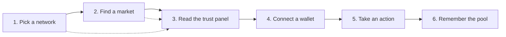

# Quickstart

This is the shortest path from opening [OpenPendle](https://openpendle.com) to holding a position in a Pendle V2 community pool. Six steps: pick a network, find a market, read its trust panel, connect a wallet, take an action, and remember the pool for later. Each step links to a full guide if you want the detail.

The whole flow is client-side. There is no account to create and no sign-up — OpenPendle reads straight from the chain over public RPC, so you can do steps 1 through 3 with no wallet connected at all.

::: tip This assumes you know PT and YT
Quickstart shows you *where to click*, not *what the tokens mean*. If "PT", "YT", or "SY" are new, read [How Pendle works](/concepts/how-pendle-works) first — it explains the split from first principles in a few minutes. In short: a yield-bearing asset is wrapped as [SY](/concepts/standardized-yield), which splits into a [Principal Token (PT)](/concepts/principal-tokens) that locks in a fixed yield to maturity and a [Yield Token (YT)](/concepts/yield-tokens) that captures the variable yield.
:::

::: warning Community pools are unreviewed
Everything below runs against **permissionless community pools** — markets anyone can create, that no one has vetted. OpenPendle checks a market's *provenance* (that a Pendle factory it recognizes created it); it does **not** and cannot vouch for the asset or the SY contract underneath. A provenance-valid market can still wrap a broken, malicious, or exotic asset. Experimental — use at your own risk, and read [Risks &amp; disclosures](/reference/risks) before you sign anything. Not affiliated with Pendle Finance.
:::

## The flow at a glance

Steps 1–3 need no wallet. You only connect at step 4, once you have decided a pool is worth transacting on.

## 1. Pick a network

Use the **network selector** in the header to choose which chain you are reading from. This is the single **active network** the entire app reads from and where any transaction will be sent. OpenPendle supports six:

| Network | Chain ID | Native token |
| --- | --- | --- |
| Ethereum | `1` | ETH |
| BNB Smart Chain | `56` | BNB |
| Monad | `143` | MON |
| Base | `8453` | ETH |
| Plasma | `9745` | XPL |
| Arbitrum | `42161` | ETH |

The choice is remembered locally (localStorage key `openpendle.chain`, default **Arbitrum**), so the app opens on the same network next time. A given market address exists on exactly one chain — make sure the active network matches the market you are about to open.

If public RPC for a chain rate-limits you, set your own endpoint in **RPC settings**; the override is stored only in your browser. See [Browsing &amp; networks](/guides/browsing).

## 2. Find a market

A Pendle **market** (or **pool**) is an on-chain `PendleMarket` contract. Its address is what you paste into OpenPendle — **not** the PT, YT, or SY address. There are two ways to reach one:

- **Paste an address.** If someone shared a market address (or a `?import=` link), paste it on the home page to load the pool live.
- **Open one you saved.** Pools you previously remembered appear in a short preview on the home page, and in full on the [Saved Pools](/guides/saved-pools) page grouped by network.

Because community pools are not listed anywhere central, most people arrive with an address from the pool's creator or their own research. Opening a market runs the **provenance gate** described next.

See [Opening a pool](/guides/opening-a-pool) for the full walkthrough.

## 3. Read the pool and its trust panel

Once a market loads, OpenPendle first runs its **provenance gate**: the market must trace back to a Pendle factory it recognizes, or you cannot save or transact against it. Because Pendle's factories are governance-mutable, the active factory is resolved live at runtime; the hardcoded set is used only for this provenance check.

Provenance is **validation, not endorsement.** It tells you a Pendle factory minted the market — nothing about whether the asset inside is safe.

The pool view then shows a **trust panel** surfacing what the market wraps and who controls it: the underlying asset, the SY contract, the maturity date, and the pool's current state. Read it before committing funds. Key things to check:

- **What is the underlying asset**, and do you understand its risk?
- **What SY contract** does it wrap, and who owns it?
- **When does it mature?** After maturity, PT redeems 1:1 for the underlying, YT is worth nothing, and the market stops trading — see [Maturity &amp; redemption](/concepts/maturity).
- **Implied APY** — the fixed yield implied by the current PT price.

For a field-by-field tour, see [Anatomy of a pool](/concepts/pool-anatomy) and [Community pools &amp; incentives](/concepts/community-pools).

## 4. Connect an injected wallet

Everything so far worked without a wallet. To transact, connect one.

OpenPendle is **injected-only**: it talks to a browser wallet directly, with **no WalletConnect** and no third-party relay. It works with MetaMask, Rabby, Brave, and any injected EIP-6963 provider.

- **Desktop** — use the wallet's browser extension, then connect.
- **Mobile** — open the site inside a wallet's **in-app dApp browser** (MetaMask, Rabby, …) or in **Brave mobile**. A normal mobile browser tab has no injected wallet and cannot connect; this is a deliberate trade-off, not a bug.

If your wallet is on a different chain than the active network, a **wrong-network banner** offers a one-click switch so your transaction lands on the right chain. Browsing still works either way. See [Connecting a wallet](/guides/connecting-a-wallet).

## 5. Take an action

With a wallet connected on the right chain, you can act on the market. The most common first step is buying **PT** for a fixed-yield position, but any of these work the same way:

- **Swap to PT** — buy the [Principal Token](/concepts/principal-tokens) for a fixed yield locked in at purchase; hold to maturity to redeem 1:1 for the underlying. See [Buying PT](/guides/buying-pt).
- **Swap to YT** — take [yield exposure](/concepts/yield-tokens); YT collects the underlying's yield until maturity. See [Buying YT](/guides/buying-yt).
- **Mint / Redeem** — split SY (or the underlying) into `PT + YT`, or recombine `PT + YT` back into SY, any time before maturity. See [Minting &amp; redeeming](/guides/minting-redeeming).
- **Add / remove liquidity** — provide an [LP](/concepts/liquidity-and-amm) position to earn swap fees (and any Merkl incentives), or withdraw it. See [Providing liquidity](/guides/providing-liquidity).

Every action behaves the same way under the hood:

1. **Quotes update live as you type** — you see the expected output before committing.
2. **Simulate before sign** — the transaction is simulated against the live chain first, so you see its predicted outcome before you approve it.
3. **Exact-amount approvals** — token approvals are scoped to exactly what you are spending. There are no unlimited allowances.

All trades, liquidity, and exits route through Pendle's **Router V4** at `0x888888888889758F76e7103c6CbF23ABbF58F946` (the same address on all six chains). OpenPendle adds no fee of its own; Pendle's own protocol fees still apply, enforced by Pendle's contracts.

::: danger You are signing a real transaction
Simulation shows the *expected* result; it is not a guarantee, and it cannot make an unsafe asset safe. Community pools are permissionless and unreviewed — interacting with them can lose you funds. Only sign after you have read the trust panel (step 3) and understand the asset. See [Risks &amp; disclosures](/reference/risks).
:::

## 6. Remember the pool

Once you have opened a market worth tracking, use **Remember this pool** to save it. This writes the pool to your browser's local storage (key `openpendle.pools.v1`) — entirely client-side, with no backend and no account. Nothing leaves your browser unless you choose to export or share.

Saved pools appear on the [Saved Pools](/guides/saved-pools) page, grouped by network, with a short preview on the home page. From there you can:

- **Forget** a pool — a roughly four-second **Undo** toast restores it exactly if you change your mind.
- **Export to JSON**, **Import**, or generate a shareable **`?import=` link** that encodes your registry to move it between browsers or devices.

See [Saved pools &amp; privacy](/guides/saved-pools) for the full registry model.

## After maturity

Community pools do not need special handling at expiry, but the actions change. At the maturity date, **PT** becomes redeemable 1:1 for the underlying, **YT** stops accruing and is worth nothing further, and the market stops trading. You can still **redeem PT** for the underlying and **exit LP** through OpenPendle afterward. See [Maturity &amp; redemption](/concepts/maturity).

## Next

- [How Pendle works](/concepts/how-pendle-works) — the PT / YT / SY split, from first principles.
- [Opening a pool](/guides/opening-a-pool) — the provenance gate and trust panel in full.
- [Buying PT](/guides/buying-pt) — the most common first action, step by step.
- [Saved pools &amp; privacy](/guides/saved-pools) — how the client-side registry works.
- [Risks &amp; disclosures](/reference/risks) — please read this before you transact.
