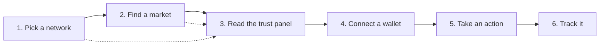

# Quickstart

This is the maintained guide to OpenPendle. Start with the goal that brought you here, or follow the six-step market flow: pick a network, find a market, read its trust panel, connect a wallet, take an action, and track it afterward.

There is no OpenPendle account or sign-up. Core market state comes from the chain over your selected RPC, while features such as Yield alerts, Looping discovery, and limit orders make their disclosed requests directly from the browser to public protocol APIs.

::: tip This assumes you know PT and YT
Quickstart shows you *where to click*, not *what the tokens mean*. If "PT", "YT", or "SY" are new, read [How Pendle works](/concepts/how-pendle-works) first — it explains the split from first principles in a few minutes. In short: a yield-bearing asset is wrapped as [SY](/concepts/standardized-yield), which splits into a [Principal Token (PT)](/concepts/principal-tokens) that locks in a fixed yield to maturity and a [Yield Token (YT)](/concepts/yield-tokens) that captures the variable yield.
:::

::: warning Community pools are unreviewed
Everything below runs against **permissionless community pools** — markets anyone can create, that no one has vetted. OpenPendle checks a market's *provenance* (that a Pendle factory it recognizes created it); it does **not** and cannot vouch for the asset or the SY contract underneath. A provenance-valid market can still wrap a broken, malicious, or exotic asset. Experimental — use at your own risk, and read [Risks &amp; disclosures](/reference/risks) before you sign anything. Not affiliated with Pendle Finance.
:::

## Choose your goal

| What you want to do | Where to start | What OpenPendle provides |
| --- | --- | --- |
| **Model a PT loop** | [Looping](https://openpendle.com/#/looping) | Matches Pendle PT collateral with Morpho markets, models leverage/APY/liquidation distance, and shows a human-readable entry and exit outline. **Transaction execution is currently disabled.** |
| **Spot fixed-yield moves** | [Yield alerts](https://openpendle.com/#/alerts) | Qualified 24-hour PT implied-APY changes across liquid pools. No wallet or notification subscription. |
| **Find a market** | [Explore](https://openpendle.com/#/explore) | Factory-indexed search across six networks, with listed and community provenance kept visible. |
| **Trade now or target an APY** | Open a market | Swap PT/YT through the AMM, or place a PT ↔ SY limit order where Pendle's live service supports it. |
| **Track positions and rewards** | [Positions](https://openpendle.com/#/positions) | Balances and supported claimable rewards across the pools saved in this browser. |
| **Launch a market** | [Create pool](https://openpendle.com/#/create) | Deploy a community market from an existing SY, or create a basic SY adapter first. |

Looping is listed first because it is the newest workflow, but its present boundary matters: the directory, calculator, and transaction outline are live; wallet approval, signatures, and transaction execution are not.

## The flow at a glance

Steps 1–3 need no wallet. You only connect at step 4, once you have decided a pool is worth transacting on.

## 1. Pick a network

Before connecting, use the **network selector** in the header to choose which chain you are reading from. After connecting, the same selector moves into the **Profile** dropdown. This is the single **active network** the app reads from and where any transaction will be sent. OpenPendle supports six:

| Network | Chain ID | Native token |
| --- | --- | --- |
| Ethereum | `1` | ETH |
| BNB Smart Chain | `56` | BNB |
| Monad | `143` | MON |
| Base | `8453` | ETH |
| Plasma | `9745` | XPL |
| Arbitrum | `42161` | ETH |

The preferred choice is remembered locally (`openpendle.chain`, default **Arbitrum**), so the app opens on the same network next time. Chain-explicit market/token links override it only for that tab. If a wallet is already connected, choosing a network also asks the wallet to switch; rejecting the request leaves read-only browsing available. A given market address exists on exactly one chain — make sure the active network matches the market you are about to open.

If a public RPC rate-limits you, set your own endpoint in **RPC settings**. Before connection it is a header control; after connection it lives in **Profile**. The override is stored only in your browser. See [Browsing &amp; networks](/guides/browsing).

## 2. Find a market

A Pendle **market** (or **pool**) is an on-chain `PendleMarket` contract. Its address opens the pool directly; a PT or YT instead opens Token actions and may resolve its pool, while an SY alone cannot identify one maturity. Useful entry points are:

- **Model Looping candidates.** The wallet-less [PT Looping](/guides/looping) directory joins live Pendle PTs to exact Morpho collateral markets and lets you compare leveraged estimates before selecting a pool.
- **Browse Explore.** Search and filter the [factory-indexed market directory](/guides/exploring-markets) across all supported networks, distinguish Pendle-listed from community results, then open a chain-explicit result.
- **Check Yield alerts.** The separate, wallet-less [Yield alerts](/guides/yield-alerts) page shows qualified 24-hour PT fixed-yield movers. It is not a push, Telegram, email, or X notification subscription.
- **Paste an address.** Paste a market, PT, or YT address into the home-page field. Market addresses open the pool; PT/YT addresses open the resolved token set. Search by name belongs in Explore.
- **Open one you saved.** Pools you previously remembered live on the [Saved Pools](/guides/saved-pools) page, grouped by network.

Explore starts from factory events and uses Pendle's public catalog only for listing and display enrichment. Its coverage notice shows which network scans are complete; a recent market or one on an incomplete network remains available through the direct-address flow. Whichever route you use, opening a market runs the **provenance gate** described next, and discovery is never an endorsement.

See [Opening a pool](/guides/opening-a-pool) for the full walkthrough.

## 3. Read the pool and its trust panel

Once a market loads, OpenPendle first runs its **provenance gate**: the market must trace back to a Pendle factory it recognizes, or you cannot save or transact against it. Because Pendle's factories are governance-mutable, the active factory is resolved live at runtime; the hardcoded set is used only for this provenance check.

Provenance is **validation, not endorsement.** It tells you a Pendle factory minted the market — nothing about whether the asset inside is safe.

The pool view then shows a **trust panel** surfacing what the market wraps and who controls it: the underlying asset, the SY contract, the maturity date, and the pool's current state. Read it before committing funds. Key things to check:

- **What is the underlying asset**, and do you understand its risk?
- **What SY contract** does it wrap, and who owns it?
- **When does it mature?** After maturity, PT redeems 1:1 for the underlying, YT is worth nothing, and the market stops trading — see [Maturity &amp; redemption](/concepts/maturity).
- **Implied APY** — the fixed yield implied by the current PT price.

For a field-by-field tour, see [Anatomy of a pool](/concepts/pool-anatomy) and [Community pools &amp; incentives](/concepts/community-pools).

## 4. Connect an injected wallet

Everything so far worked without a wallet. To transact, connect one.

OpenPendle is **injected-only**: it talks to a browser wallet directly, with **no WalletConnect** and no third-party relay. It works with MetaMask, Rabby, Brave, and any injected EIP-6963 provider.

- **Desktop** — use the wallet's browser extension, then connect.
- **Mobile** — open the site inside a wallet's **in-app dApp browser** (MetaMask, Rabby, …) or in **Brave mobile**. A normal mobile browser tab has no injected wallet and cannot connect; this is a deliberate trade-off, not a bug.

If your wallet is on a different chain than the active network, a **wrong-network banner** offers a one-click switch so your transaction lands on the right chain. Browsing still works either way. See [Connecting a wallet](/guides/connecting-a-wallet).

## 5. Take an action

With a wallet connected on the right chain, you can act on the market. The most common first step is buying **PT** for a fixed-yield position:

- **Swap to PT now** — buy the [Principal Token](/concepts/principal-tokens) immediately through the AMM for a fixed yield locked in at execution; hold to maturity to redeem 1:1 for the underlying. See [Buying PT](/guides/buying-pt).
- **Place a PT limit order** — on markets Pendle's live support service approves, sign a PT ↔ SY order for a target APY instead of taking the AMM quote immediately. Official listing alone is not enough, and placement does not reserve funds. See [PT limit orders](/guides/limit-orders).
- **Swap to YT** — take [yield exposure](/concepts/yield-tokens); YT collects the underlying's yield until maturity. See [Buying YT](/guides/buying-yt).
- **Mint / Redeem** — split SY (or the underlying) into `PT + YT`, or recombine `PT + YT` back into SY, any time before maturity. See [Minting &amp; redeeming](/guides/minting-redeeming).
- **Add / remove liquidity** — provide an [LP](/concepts/liquidity-and-amm) position to earn swap fees (and any Merkl incentives), or withdraw it. See [Providing liquidity](/guides/providing-liquidity).

The separate **Looping** page is still a research and planning surface. Its execution control is disabled and cannot open or close a position yet; see [PT looping](/guides/looping).

The immediate on-chain actions share the same safety path:

1. **Quotes update live as you type** — you see the expected output before committing.
2. **Simulate before sign** — the transaction is simulated against the live chain first, so you see its predicted outcome before you approve it.
3. **Exact approvals by default** — token approvals start scoped to what you are spending. Unlimited approval is available only as an explicit transaction-setting opt-in and leaves a standing allowance until revoked.

Immediate AMM trades, liquidity, and exits route through Pendle's **Router V4** at `0x888888888889758F76e7103c6CbF23ABbF58F946` (the same address on all six chains). A limit order follows a different path: OpenPendle validates its EIP-712 fields, signer, live fee root, and local/on-chain hash before publishing it to Pendle's hosted API for later filling through the **Limit Router**. OpenPendle adds no fee of its own; Pendle's own AMM and limit-order protocol fees still apply.

::: danger You are signing a real transaction or executable order
Simulation shows an on-chain transaction's *expected* result; strict field and signature checks show what a limit order authorizes. Neither is a guarantee of value or execution, and neither can make an unsafe asset safe. Community pools are permissionless and unreviewed — interacting with them can lose you funds. Only sign after you have read the trust panel (step 3) and understand the asset. See [Risks &amp; disclosures](/reference/risks).
:::

## 6. Track the pool and position

Once you have opened a market worth tracking, use **Remember this pool** to save it. This writes the pool to your browser's local storage (key `openpendle.pools.v1`) — entirely client-side, with no OpenPendle backend storage or account. The registry itself leaves your browser only when you choose to export or share it.

Saved pools appear on the [Saved Pools](/guides/saved-pools) page, grouped by network. The connected **Profile** dropdown links to Saved pools, Positions, and Yield alerts. From Saved pools you can:

- **Forget** a pool — a roughly four-second **Undo** toast restores it exactly if you change your mind.
- **Export to JSON**, **Import**, or generate a shareable **`?import=` link** that encodes your registry to move it between browsers or devices.

See [Saved pools &amp; privacy](/guides/saved-pools) for the full registry model.

The [Positions &amp; rewards](/guides/positions) page reads balances across saved pools for the connected wallet. It can also surface supported Pendle-native and Merkl rewards and groups claim actions by network. This is not universal wallet discovery: a pool must be saved before it is part of the scan.

## After maturity

Community pools do not need special handling at expiry, but the actions change. At the maturity date, **PT** becomes redeemable 1:1 for the underlying, **YT** stops accruing and is worth nothing further, and the market stops trading. You can still **redeem PT** for the underlying and **exit LP** through OpenPendle afterward. See [Maturity &amp; redemption](/concepts/maturity).

## Next

- [How Pendle works](/concepts/how-pendle-works) — the PT / YT / SY split, from first principles.
- [Opening a pool](/guides/opening-a-pool) — the provenance gate and trust panel in full.
- [Buying PT](/guides/buying-pt) — the most common first action, step by step.
- [PT looping](/guides/looping) — directory, leverage model, transaction outline, and current execution boundary.
- [Yield alerts](/guides/yield-alerts) — read-only 24-hour fixed-yield movers.
- [PT limit orders](/guides/limit-orders) — target-APY orders, support, and cancellation.
- [Positions &amp; rewards](/guides/positions) — balances and claims across saved pools.
- [Saved pools &amp; privacy](/guides/saved-pools) — how the client-side registry works.
- [Risks &amp; disclosures](/reference/risks) — please read this before you transact.
