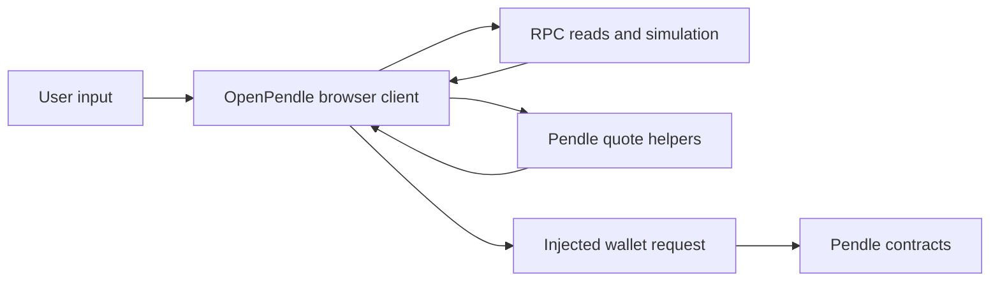

# What is OpenPendle

OpenPendle is a free, open-source, static interface to Pendle V2 markets. It indexes recognized market-factory events, reads market state from public RPCs, and exposes trading, liquidity, redemption, position, and market-creation workflows without an OpenPendle account or transaction relay.

OpenPendle takes no fee of its own, deploys no OpenPendle smart contracts, and is not affiliated with Pendle Finance.

::: warning Experimental interface
A market being available in OpenPendle is not an endorsement. OpenPendle validates market provenance but does not review the asset, SY, or market economics. See [Community pools](/concepts/community-pools) and [Risks & disclosures](/reference/risks).
:::

## Why it exists

Pendle's contracts let anyone create a compatible yield market. A frontend catalog is necessarily narrower than that on-chain universe: some markets are listed by Pendle, while others exist only in factory events or at a known address.

OpenPendle makes that distinction visible instead of turning it into an access boundary. You can search its factory-indexed directory or open a market directly, whether Pendle's current catalog lists it or not.

OpenPendle calls a factory-created market absent from Pendle's current catalog a **Community** market. That label describes discovery provenance, not who reviewed it, who created it, or whether it is safe.

## What it does

- **Explore markets.** Search recognized factory deployments across six networks and distinguish Pendle-listed results from Community results.
- **Open by address.** Paste a market, PT, or YT address. Markets open directly; PT and YT open Token actions and may resolve associated markets.
- **Model and manage PT loops.** Match Pendle PT collateral with Morpho markets, compare leverage and liquidation risk, and execute supported actions for exact reviewed markets when the release gates permit them.
- **Track fixed-yield changes.** Yield alerts surfaces qualified 24-hour changes in PT implied APY without requiring a wallet.
- **Trade PT and YT.** Use Pendle's AMM for immediate swaps.
- **Place supported PT limit orders.** Sign PT ↔ SY orders for a target APY when Pendle's live support service approves the market and direction.
- **Mint, redeem, and provide liquidity.** Use Pendle's deployed contracts before maturity, then redeem PT or exit LP after maturity.
- **Create a market.** Deploy a community market from an existing SY or create a supported SY through the guided flow.
- **Save pools and review positions.** Keep a browser-local pool registry, combine it with Pendle Official position discovery, manage supported loops, and claim supported rewards.

## Current feature boundaries

| Feature | Source and execution boundary |
| --- | --- |
| **Explore** | Static factory-event inventory plus Pendle catalog enrichment; opening a result performs live chain reads. |
| **Yield alerts** | Pendle-listed market histories filtered in the browser; read-only and not a notification service. |
| **Looping** | Broad comparison directory; entry and leverage increases require an exact reviewed market, enabled build flag, fresh same-origin runtime policy, and live preflight. Decreases, full exit, and recovery use separate controls. |
| **Immediate actions** | Quotes and calldata from Pendle's deployed contracts; simulated before the wallet request. |
| **PT limit orders** | Signed and validated locally, then published to Pendle's API when live support allows it. |
| **Positions and rewards** | Discovers Saved and Pendle Official pools, re-reads balances on-chain, and keeps supported loop management separate from standard PT/YT/LP holdings. |
| **Create** | Guided preparation for Pendle's deployment contracts; OpenPendle deploys no intermediary contract. |

Directory inclusion is not execution approval. Looping requests a wallet action only after the selected market matches the reviewed registry and all current release, policy, route, contract-state, liquidity, leverage, and simulation checks pass.

## Architecture and safety boundaries

OpenPendle is intentionally a thin client:

- **No request-time OpenPendle application backend.** Core reads go through the selected RPC. Explore uses a generated static factory snapshot, while feature-specific public APIs provide catalog metadata, alerts, limit orders, Morpho data, prices, token lookup, and rewards.
- **No custody.** OpenPendle does not hold keys or assets. Your wallet signs every transaction or executable order.
- **Provenance before action.** A market must trace to a recognized Pendle factory before it can be saved or used for an action. This verifies origin only.
- **Simulate before requesting a transaction signature.** Simulation checks the prepared call against current state. It cannot guarantee execution if state changes before the transaction is mined.
- **Exact approvals by default.** Unlimited approval is available only as an explicit setting and leaves a standing allowance until revoked.
- **Strict limit-order validation.** OpenPendle validates the support response, EIP-712 fields, signer, fee root, and hashes before publishing a signed order. Publication neither escrows funds nor guarantees a fill.
- **Injected wallets only.** Wallet connections use browser-injected EIP-6963 providers, with no WalletConnect relay.
- **Static and self-hostable.** Hash-based routes remove server rewrites at a domain root. IPFS DNSLink can serve the same shape; a raw `/ipfs/<CID>/` subpath requires a build configured with the matching Vite base.

The served frontend remains part of the trust surface. Open source makes the source auditable, but users should still verify wallet prompts and contract addresses. See [How OpenPendle works](/reference/architecture) for data flows, third-party requests, and security controls.

## How a market action flows

The browser prepares the action and the wallet broadcasts it. OpenPendle's public read RPC handles market reads, simulations, and receipt polling; it is not the signer. Limit orders branch after local validation to Pendle's hosted order API instead of being mined immediately.

## Data and privacy

Saved pools, preferred chain, theme, and RPC overrides stay in browser storage unless you export or share them. There is no OpenPendle user database.

Some features necessarily contact public services. For example, a rewards request can include the connected wallet address and chain, and publishing a limit order sends Pendle the maker address and signed order. Cloudflare Web Analytics receives page-view and performance data. The complete disclosure lives in [Architecture](/reference/architecture).

Browser-local does not mean all network activity is private. RPC operators can observe the addresses and calls sent to them, public feature APIs receive their documented parameters, and the hosting provider can observe ordinary web traffic. A custom RPC changes the chain-read provider but not the other feature services.

## What it is not

- It is not Pendle's official app, a curator, or an asset reviewer.
- It is not a custodian, wallet, transaction relayer, or guarantee of execution.
- It does not make an unsafe asset safe because its market came from a recognized factory.
- It does not execute arbitrary Pendle/Morpho pairings; only exact reviewed and currently enabled looping markets can reach a wallet action.

## Supported networks

OpenPendle currently supports Ethereum, BNB Smart Chain, Monad, Base, Plasma, and Arbitrum. Factory lineage and governance-controlled configuration differ by chain, so the app resolves active settings live where required. See [Networks & contracts](/reference/networks-and-contracts).

## See also

- [Quickstart](/introduction/quickstart)
- [Why OpenPendle](/introduction/why-openpendle)
- [Community pools & incentives](/concepts/community-pools)
- [How OpenPendle works](/reference/architecture)
