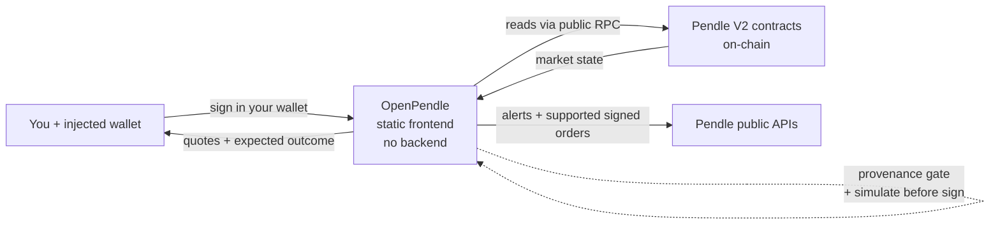

# What is OpenPendle

OpenPendle is a free, open-source, static web interface to Pendle V2's **permissionless market universe** — the yield markets anyone can create, whether or not Pendle's own app lists them. It indexes recognized factories' creation events for discovery, reads an opened market's state straight from the blockchain, and lets you trade, provide liquidity, redeem, or deploy a market of your own — with no curator and no OpenPendle server sitting in the on-chain transaction path.

It is a gift to Pendle's community. It takes no fee of its own, ships no smart contracts of its own, and is not affiliated with Pendle Finance.

::: warning Experimental — use at your own risk
Community pools are **permissionless and unreviewed**: anyone can create one, and interacting with them can lose you funds. OpenPendle verifies that a market came from a Pendle factory it recognizes, but it **cannot vouch for the assets or SY contracts underneath**. Read [Risks & disclosures](/reference/risks) before you transact.
:::

## The problem it solves

Pendle V2 is a permissionless protocol. **Anyone** can deploy a yield market for **any** compatible yield-bearing asset, with no whitelist and no approval — the contracts simply allow it. Pendle's official app surfaces a curated, team-listed subset of those markets. Everything beyond that subset — the long tail of community-created pools — is fully on-chain and fully tradeable, but has no first-class interface. To reach it you would otherwise be assembling raw calls to Pendle's router by hand.

OpenPendle is that missing interface. Explore the indexed factory-created universe — with per-network coverage shown — or paste any Pendle V2 market address on one of the six supported networks; OpenPendle renders the same pool actions whether the market is listed or community-created.

::: info A note on terms
A **community pool** (used interchangeably with **market**) is the on-chain `PendleMarket` contract created permissionlessly — no whitelist, no approval, and reviewed by no one. If Pendle V2's tokens (SY, PT, YT) are new to you, start with [How Pendle works](/concepts/how-pendle-works); this page assumes only that a market is an address you can point a tool at.
:::

## What OpenPendle does

At a high level, OpenPendle turns a raw market address into a usable app surface. Once a market clears the [provenance gate](#provenance-gate-validation-not-endorsement), you can:

- **Explore markets** — search every indexed factory-created market across all supported networks, and distinguish Pendle-listed results from unlisted community markets. See [Exploring markets](/guides/exploring-markets).
- **Model PT loops** — match Pendle PT collateral with Morpho markets, compare leverage and liquidation distance, and inspect a read-only entry and exit outline. Transaction execution is currently disabled. See [PT looping](/guides/looping).
- **Track fixed-yield moves** — use the separate, wallet-less [Yield alerts](/guides/yield-alerts) page to inspect qualified 24-hour PT implied-APY changes. It does not send notifications.
- **Mint and redeem** — split SY (or the underlying) into `PT` + `YT`, and redeem `PT` + `YT` back to SY at any time before maturity.
- **Swap into a fixed-yield position** — trade a token immediately through the AMM for [`PT`](/concepts/principal-tokens) to lock in a yield fixed at execution.
- **Place a PT limit order** — on the subset Pendle's live support service approves, sign a PT ↔ SY order for a target APY. Support is stricter than official listing, and funds are not reserved. See [PT limit orders](/guides/limit-orders).
- **Swap into a yield-exposure position** — trade a token for [`YT`](/concepts/yield-tokens) to take variable, long-yield exposure.
- **Provide or withdraw liquidity** — add to or remove from the pool's [AMM](/concepts/liquidity-and-amm) as an LP position.
- **Redeem at maturity** — after maturity, redeem `PT` for the underlying, and exit any LP position.
- **Create a market** — deploy a new community pool (and, optionally, the [SY](/concepts/standardized-yield) it wraps) in a single transaction. See [Create: overview](/create/overview).
- **Remember pools** — save markets to a local, client-side registry so you can find them again. See [Saved pools & privacy](/guides/saved-pools).
- **Review positions and rewards** — inspect PT, YT, LP, and SY balances across saved pools and claim supported rewards by network. See [Positions & rewards](/guides/positions).

On-chain quotes update live as you type, every on-chain transaction is simulated against the live chain before you sign, and token approvals default to the exact amount you are spending. Limit orders use a separate typed-data validation path before publication to Pendle's API.

## Core principles

These are the design commitments that define how OpenPendle behaves. Each one is a deliberate constraint, not a feature that might change on a whim.

### No OpenPendle request-time backend

OpenPendle operates no request-time application server, account database, or transaction relay. Core market state, balances, quotes, and simulations come directly from the chain through public RPC endpoints. Explore reads a static snapshot produced by a scheduled factory-event index job; Pendle's market API enriches it with listed status and display metadata rather than defining the inventory. The stock app also calls DefiLlama/CoinGecko for aggregate header metrics; Pendle's APIs for PT/YT pool resolution, Yield-alert histories, and limit-order support, books, generation, placement, and maker-order reads; where available Blockscout for pool lookup; Merkl when a connected user opens **My positions**; and Cloudflare Web Analytics for page-view and performance metrics. Merkl receives the wallet address and chain ID. Limit-order placement sends Pendle the maker address and full signed order. See [How OpenPendle works](/reference/architecture) for the complete data-flow disclosure.

### Provenance gate (validation, not endorsement)

Before you can save or transact against a market, OpenPendle checks that it was created by a Pendle factory it recognizes. Because Pendle's factories are governance-mutable, the currently active factory is resolved **live** at runtime; the hardcoded factory set is used only for this provenance check.

This is **validation, not endorsement**. It confirms the market is a genuine Pendle deployment and not a look-alike contract — it says nothing about whether the underlying asset or SY is safe. See [Community pools & incentives](/concepts/community-pools).

### Simulate on-chain transactions before sign

Every transaction is simulated against the live chain before you are asked to sign it, so you can see the expected outcome before committing funds. If a simulation fails, you find out before spending gas, not after.

### Validate limit orders before publication

For supported PT ↔ SY orders, OpenPendle checks Pendle's live support response and fee root, validates every EIP-712 field, recovers the EOA signer, and compares the local and Limit Router hashes before sending the signed order to Pendle's API. Official listing alone does not establish support, and publishing an order does not escrow or reserve its funds.

### Exact approvals by default

Token approvals default to the precise amount of the current action, limiting the allowance to that spend. Transaction settings also offer an explicit **Unlimited** mode, which leaves a maximum standing allowance until revoked and increases exposure to the approved contract.

### Injected-only wallets

OpenPendle connects directly to a browser wallet with **no WalletConnect and no third-party relay**. It works with MetaMask, Rabby, Brave, and any injected EIP-6963 provider. Browsing itself is wallet-less — reads go through RPC — so you can explore pools before connecting anything. See [Connecting a wallet](/guides/connecting-a-wallet).

### Six networks

OpenPendle supports six chains: **Ethereum, BNB Smart Chain, Monad, Base, Plasma, and Arbitrum**. The active network is a local choice that determines what the whole app reads and where a transaction is sent. See [Networks & contracts](/reference/networks-and-contracts).

### Self-hostable

OpenPendle is a static site that uses hash-based routing (URLs look like `openpendle.com/#/...`), so it runs on any static host or on IPFS with no server rewrite rules. Anyone can host their own copy. See [Self-hosting](/reference/self-hosting).

### Private by default

There are no OpenPendle accounts or server-side state. The pools you save and custom RPCs you set live only in your browser's local storage; the saved registry and settings are not uploaded and the registry leaves only when you explicitly export or share it. See [Saved pools & privacy](/guides/saved-pools).

### No fee of its own

OpenPendle adds nothing on top of an action. Pendle's own AMM and mutable limit-order protocol fees still apply — they are charged and enforced by Pendle's contracts — but OpenPendle takes no cut of its own.

## At a glance

| | |
| --- | --- |
| **What it is** | A static web frontend for the factory-created Pendle V2 market universe |
| **License** | Open source, GPL-3.0-or-later |
| **Cost** | Free; **no fee of its own** (Pendle's protocol fees still apply) |
| **Built by** | [ggmxbt](https://x.com/ggmxbt) — **not** affiliated with Pendle Finance |
| **Backend** | No OpenPendle request-time application server, account database, or transaction relay; Explore uses a generated static snapshot, feature-scoped calls go directly to public APIs, and Cloudflare provides page-view/performance analytics |
| **Data sources** | Factory-event snapshot for inventory; public RPC for live reads; Pendle APIs for enrichment, alerts, and limit orders; Morpho's API for Looping discovery; DefiLlama/CoinGecko for the ticker; Pendle/Blockscout for token lookup; Merkl for rewards on My positions |
| **Wallets** | Injected-only (MetaMask, Rabby, Brave, any EIP-6963) — no WalletConnect |
| **Networks** | Ethereum, BNB Smart Chain, Monad, Base, Plasma, Arbitrum |
| **Contracts** | Ships none of its own — calls Pendle's deployed contracts with hand-written ABIs |
| **Safety model** | Provenance gate; on-chain simulate-before-sign; strict limit-order field, signer, fee-root, and hash checks; exact approvals by default with explicit unlimited opt-in |
| **Hosting** | Static site with hash routing — self-hostable on any host or IPFS |
| **Privacy** | Saved pools and RPC overrides stay in your browser; feature APIs and Cloudflare receive the disclosed requests |

## What OpenPendle is **not**

Being usable in OpenPendle is not a stamp of approval on anything. Specifically:

- **It is not affiliated with, endorsed by, or operated by Pendle Finance.** It is an independent, community-built interface to Pendle's public contracts.
- **It is not a curator or reviewer.** It does not vet, rate, or filter the assets or SY contracts a pool wraps. A market loading here means it is a genuine Pendle deployment — nothing more.
- **It is not custodial.** It never holds your funds or your keys. Every transaction or order is signed in your own wallet, and publishing a limit order does not reserve or escrow its funds.
- **It ships no smart contracts of its own.** It calls Pendle's already-deployed contracts with hand-written ABIs; there is no OpenPendle contract in the path of your funds.

::: danger It does not make community pools safe
The provenance gate proves a market descends from a Pendle factory. It does **not** prove the wrapped asset is solvent, the SY is well-behaved, or the pool is worth your money. **Community pools are unreviewed, and interacting with them can lose you funds.** Do your own diligence on every asset and SY. See [Risks & disclosures](/reference/risks).
:::

## You → OpenPendle → the chain

OpenPendle sits between your wallet and Pendle's contracts as a thin, stateless client. Its catalog is a read-only static artifact; on-chain actions read through RPC, gate markets by provenance, simulate each transaction, and ask your wallet to sign. Yield alerts read Pendle's data API directly, while supported PT limit orders are validated locally and published to Pendle's hosted order API for later Limit Router execution. OpenPendle never holds your funds or routes them through a server or contract of its own.

Your keys stay in your wallet; OpenPendle prepares on-chain transactions and validates supported typed orders before asking you to authorize them.

## See also

- [Why OpenPendle](/introduction/why-openpendle) — the case for a permissionless, backend-free frontend.
- [Quickstart](/introduction/quickstart) — choose a goal and follow its safest path through OpenPendle.
- [How Pendle works](/concepts/how-pendle-works) — PT, YT, SY, and maturity from first principles.
- [Community pools & incentives](/concepts/community-pools) — what "permissionless and unreviewed" really means.
- [Yield alerts](/guides/yield-alerts) — the read-only fixed-yield-mover page.
- [PT looping](/guides/looping) — market matching, leverage modeling, and the current preview boundary.
- [PT limit orders](/guides/limit-orders) — support, signing, funds, fees, and cancellation.
- [Positions & rewards](/guides/positions) — balances and claims across saved pools.
- [How OpenPendle works](/reference/architecture) — the no-backend architecture and security model in detail.
- [Risks & disclosures](/reference/risks) — please read this before you transact.
