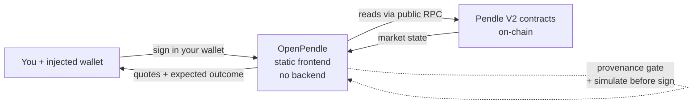

# What is OpenPendle

OpenPendle is a free, open-source, backend-free web interface to Pendle V2's **permissionless community pools** — the yield markets that anyone can create on Pendle, and that Pendle's own app does not list. It loads a market by its on-chain address, reads its state straight from the blockchain, and lets you trade, provide liquidity, redeem, or deploy a market of your own — with no listing process, no curator, and no server sitting between you and Pendle's contracts.

It is a gift to Pendle's community. It takes no fee of its own, ships no smart contracts of its own, and is not affiliated with Pendle Finance.

::: warning Experimental — use at your own risk
Community pools are **permissionless and unreviewed**: anyone can create one, and interacting with them can lose you funds. OpenPendle verifies that a market came from a Pendle factory it recognizes, but it **cannot vouch for the assets or SY contracts underneath**. Read [Risks & disclosures](/reference/risks) before you transact.
:::

## The problem it solves

Pendle V2 is a permissionless protocol. **Anyone** can deploy a yield market for **any** compatible yield-bearing asset, with no whitelist and no approval — the contracts simply allow it. Pendle's official app surfaces a curated, team-listed subset of those markets. Everything beyond that subset — the long tail of community-created pools — is fully on-chain and fully tradeable, but has no first-class interface. To reach it you would otherwise be assembling raw calls to Pendle's router by hand.

OpenPendle is that missing interface. Paste any Pendle V2 market address, on any of the six supported networks, and it renders the pool and its actions the same way Pendle's app renders a listed one — no gatekeeper in between.

::: info A note on terms
A **community pool** (used interchangeably with **market**) is the on-chain `PendleMarket` contract created permissionlessly — no whitelist, no approval, and reviewed by no one. If Pendle V2's tokens (SY, PT, YT) are new to you, start with [How Pendle works](/concepts/how-pendle-works); this page assumes only that a market is an address you can point a tool at.
:::

## What OpenPendle does

At a high level, OpenPendle turns a raw market address into a usable app surface. Once a market clears the [provenance gate](#provenance-gate-validation-not-endorsement), you can:

- **Mint and redeem** — split SY (or the underlying) into `PT` + `YT`, and redeem `PT` + `YT` back to SY at any time before maturity.
- **Swap into a fixed-yield position** — trade a token for [`PT`](/concepts/principal-tokens) to lock in a yield fixed at purchase.
- **Swap into a yield-exposure position** — trade a token for [`YT`](/concepts/yield-tokens) to take variable, long-yield exposure.
- **Provide or withdraw liquidity** — add to or remove from the pool's [AMM](/concepts/liquidity-and-amm) as an LP position.
- **Redeem at maturity** — after maturity, redeem `PT` for the underlying, and exit any LP position.
- **Create a market** — deploy a new community pool (and, optionally, the [SY](/concepts/standardized-yield) it wraps) in a single transaction. See [Create: overview](/create/overview).
- **Remember pools** — save markets to a local, client-side registry so you can find them again. See [Saved pools & privacy](/guides/saved-pools).

Quotes update live as you type, every action is simulated against the live chain before you sign, and token approvals are scoped to the exact amount you are spending.

## Core principles

These are the design commitments that define how OpenPendle behaves. Each one is a deliberate constraint, not a feature that might change on a whim.

### No backend, no indexer

There is no server, no database, no indexer, no accounts, no tracking, and no analytics. OpenPendle reads market state directly from the chain through public RPC endpoints. The only outbound requests it makes are the blockchain RPCs you point it at — plus, for the header stats ticker alone, Pendle metrics from the DefiLlama and CoinGecko public APIs. Nothing about your browsing or your positions is sent anywhere. See [How OpenPendle works](/reference/architecture).

### Provenance gate (validation, not endorsement)

Before you can save or transact against a market, OpenPendle checks that it was created by a Pendle factory it recognizes. Because Pendle's factories are governance-mutable, the currently active factory is resolved **live** at runtime; the hardcoded factory set is used only for this provenance check.

This is **validation, not endorsement**. It confirms the market is a genuine Pendle deployment and not a look-alike contract — it says nothing about whether the underlying asset or SY is safe. See [Community pools & incentives](/concepts/community-pools).

### Simulate before sign

Every transaction is simulated against the live chain before you are asked to sign it, so you can see the expected outcome before committing funds. If a simulation fails, you find out before spending gas, not after.

### Exact-amount approvals

Token approvals are scoped to the precise amount of the current action. OpenPendle never requests unlimited allowances, which limits what any contract can pull from your wallet to what that single transaction needs.

### Injected-only wallets

OpenPendle connects directly to a browser wallet with **no WalletConnect and no third-party relay**. It works with MetaMask, Rabby, Brave, and any injected EIP-6963 provider. Browsing itself is wallet-less — reads go through RPC — so you can explore pools before connecting anything. See [Connecting a wallet](/guides/connecting-a-wallet).

### Six networks

OpenPendle supports six chains: **Ethereum, BNB Smart Chain, Monad, Base, Plasma, and Arbitrum**. The active network is a local choice that determines what the whole app reads and where a transaction is sent. See [Networks & contracts](/reference/networks-and-contracts).

### Self-hostable

OpenPendle is a static site that uses hash-based routing (URLs look like `openpendle.com/#/...`), so it runs on any static host or on IPFS with no server rewrite rules. Anyone can host their own copy. See [Self-hosting](/reference/self-hosting).

### Private by default

There are no accounts and no server-side state. The pools you save and any custom RPCs you set live only in your browser's local storage; nothing leaves the browser unless you explicitly export or share it. See [Saved pools & privacy](/guides/saved-pools).

### No fee of its own

OpenPendle adds nothing on top of a trade. Pendle's own protocol fees still apply — they are charged and enforced by Pendle's contracts — but OpenPendle takes no cut of its own.

## At a glance

| | |
| --- | --- |
| **What it is** | A backend-free web frontend for Pendle V2 community pools |
| **License** | Open source, GPL-3.0-or-later |
| **Cost** | Free; **no fee of its own** (Pendle's protocol fees still apply) |
| **Built by** | [ggmxbt](https://x.com/ggmxbt) — **not** affiliated with Pendle Finance |
| **Backend** | None — no server, database, indexer, accounts, tracking, or analytics |
| **Data source** | Public RPC (reads); DefiLlama + CoinGecko for the header stats ticker only |
| **Wallets** | Injected-only (MetaMask, Rabby, Brave, any EIP-6963) — no WalletConnect |
| **Networks** | Ethereum, BNB Smart Chain, Monad, Base, Plasma, Arbitrum |
| **Contracts** | Ships none of its own — calls Pendle's deployed contracts with hand-written ABIs |
| **Safety model** | Provenance gate, simulate-before-sign, exact-amount approvals |
| **Hosting** | Static site with hash routing — self-hostable on any host or IPFS |
| **Privacy** | Saved pools and RPC overrides stay in your browser |

## What OpenPendle is **not**

Being usable in OpenPendle is not a stamp of approval on anything. Specifically:

- **It is not affiliated with, endorsed by, or operated by Pendle Finance.** It is an independent, community-built interface to Pendle's public contracts.
- **It is not a curator or reviewer.** It does not vet, rate, or filter the assets or SY contracts a pool wraps. A market loading here means it is a genuine Pendle deployment — nothing more.
- **It is not custodial.** It never holds your funds or your keys. Every transaction is signed in your own wallet, and OpenPendle can move nothing on your behalf.
- **It ships no smart contracts of its own.** It calls Pendle's already-deployed contracts with hand-written ABIs; there is no OpenPendle contract in the path of your funds.

::: danger It does not make community pools safe
The provenance gate proves a market descends from a Pendle factory. It does **not** prove the wrapped asset is solvent, the SY is well-behaved, or the pool is worth your money. **Community pools are unreviewed, and interacting with them can lose you funds.** Do your own diligence on every asset and SY. See [Risks & disclosures](/reference/risks).
:::

## You → OpenPendle → the chain

OpenPendle sits between your wallet and Pendle's on-chain contracts as a thin, stateless client. It reads from the chain over RPC, gates markets by provenance, simulates each transaction, and asks your wallet to sign — but it never holds your funds and never routes them through a server or a contract of its own.

Your keys stay in your wallet; OpenPendle only ever prepares transactions and shows you what they should do before you approve them.

## See also

- [Why OpenPendle](/introduction/why-openpendle) — the case for a permissionless, backend-free frontend.
- [Quickstart](/introduction/quickstart) — connect, open a pool, and make your first action.
- [How Pendle works](/concepts/how-pendle-works) — PT, YT, SY, and maturity from first principles.
- [Community pools & incentives](/concepts/community-pools) — what "permissionless and unreviewed" really means.
- [How OpenPendle works](/reference/architecture) — the no-backend architecture and security model in detail.
- [Risks & disclosures](/reference/risks) — please read this before you transact.
