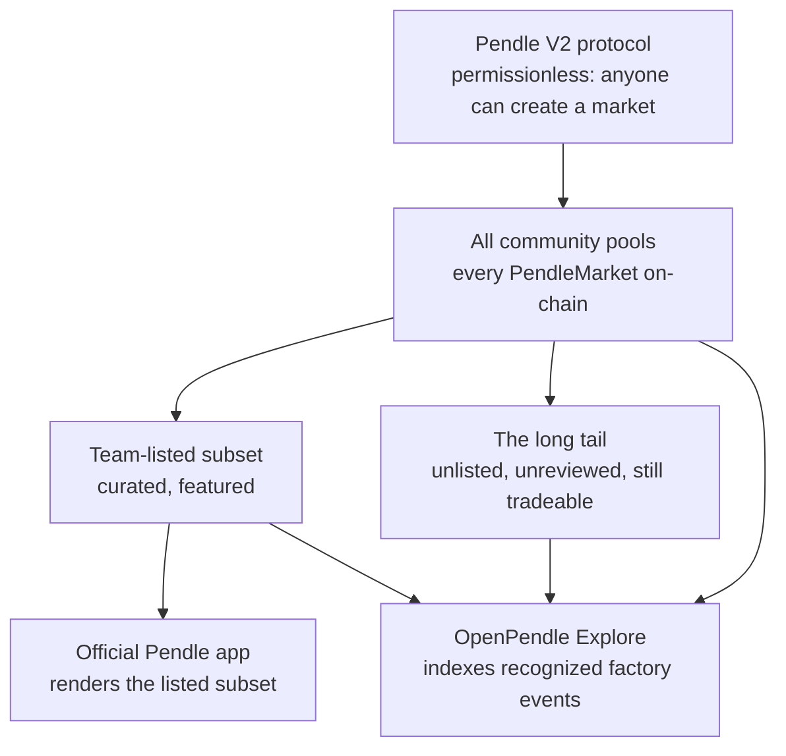

# Why OpenPendle

Pendle V2 is a permissionless protocol, but the way most people reach it is not. This page makes the case for OpenPendle: why a large, fully on-chain part of Pendle has no first-class interface, why a backend-free and self-hostable frontend is the right tool for that gap, and who benefits from it. If you want a plain description of what the app does, read [What is OpenPendle](/introduction/what-is-openpendle) first; this page is the argument for why it should exist at all.

::: warning Experimental — use at your own risk
Everything below is about reaching **permissionless community pools** — markets anyone can create, that no one has vetted. OpenPendle verifies a market's provenance; it **cannot** vouch for the asset or SY contract underneath, and a provenance-valid market can still wrap a broken, malicious, or exotic asset. Community pools are unreviewed, and interacting with them can lose you funds. Read [Risks & disclosures](/reference/risks) before you transact. Not affiliated with Pendle Finance.
:::

## The permissionless thesis

Pendle V2 lets **anyone** deploy a yield market for **any** compatible yield-bearing asset. There is no whitelist, no application, and no approval step — the factory contracts simply allow it. The right to create a market is baked into the protocol, not granted by a team. That is what "permissionless" means here, and it is not a slogan: the market-creation path is a public function on a deployed contract, callable by any address that pays the gas.

This produces a spectrum of markets, not a catalog. On one end sit the large, well-known assets a team chose to feature. On the other end sits a long tail: markets for newer assets, smaller assets, experimental wrappers, and everything a listing process has not gotten to — or has decided not to carry. Every one of these is equally real on-chain. The tokens mint, the AMM quotes, the router routes, and maturity settles, whether or not any particular app renders the market.

Pendle's own official app surfaces a **curated, team-listed subset** of that spectrum. Curation is a reasonable choice for a flagship app — it concentrates liquidity, reduces the surface a support team must stand behind, and spares most users the sharp edges of unreviewed assets. But curation is, by definition, exclusion. The markets outside the listed subset are not broken or lesser; they are simply not carried. They remain fully tradeable and completely unreachable through a purpose-built UI.

That is the gap. A market can be:

- **On-chain and live** — the `PendleMarket` contract exists, holds liquidity, and settles at maturity;
- **Fully permissionless** — created without anyone's approval;
- and yet **have no first-class interface** — nothing that renders its trust panel, quotes its swaps, or walks you through minting, providing liquidity, and redeeming.

To reach such a market without a dedicated frontend, you would be assembling raw calls to Pendle's router by hand, reading token addresses out of a block explorer, and computing your own expected outputs. That is a high bar, and it is a bar the listed markets do not impose. The asymmetry is the whole point: **the protocol is open to everyone, but the tooling has been open to a subset.**

OpenPendle exists to serve the whole on-chain spectrum, especially the tail. It indexes creation events from every recognized Pendle market-factory generation on its six supported networks, then renders a pool and its actions the same way whether Pendle lists it or not. You can still paste an address directly, including before a new market reaches the next snapshot. It does not compete with curation; it makes curation a visible label instead of an access boundary.

OpenPendle retains the distinction inside the shared directory: **Pendle-listed** is enrichment from Pendle's catalog, while **Community** means factory-created but absent from that catalog. Neither label is an OpenPendle endorsement.

## Official Pendle app vs OpenPendle

The two are not rivals; they answer different questions. The official app answers "what has the team curated for me?" OpenPendle answers "let me reach any market I can name, and judge it myself." The table below contrasts what each is **for** — not which is "better," because the honest answer is that most people should start with the curated app and reach for OpenPendle only when they have a specific, unlisted market in mind.

| | Official Pendle app | OpenPendle |
| --- | --- | --- |
| **Operated by** | Pendle Finance | [ggmxbt](https://x.com/ggmxbt) — independent, **not** affiliated with Pendle |
| **What it is for** | Discovering and using the **curated, team-listed** markets | Reaching **any** Pendle V2 market by address — the long tail curation leaves out |
| **Market coverage** | The listed subset | Any market that clears the [provenance gate](/reference/architecture), listed or not |
| **How you find a market** | Browse a curated list | Browse the factory-indexed universe, paste any address, or open your local saved-pools registry |
| **Curation / review** | Team-listed; a listing decision stands behind each market | **None by design** — no listing, no review; loadable ≠ endorsed |
| **Discovery / search** | Rich discovery of featured markets | Searchable factory-event directory with Pendle-listed vs community source filters |
| **Native PENDLE gauge emissions & vePENDLE voting** | Available on eligible team-listed markets | The same emissions remain visible on eligible listed markets; community pools are ineligible and use [Merkl](/create/incentives) for extra rewards |
| **Backend** | Conventional web stack | **No request-time OpenPendle application backend** — a scheduled job publishes a static catalog; no accounts, tracking, analytics, or transaction relay |
| **Data sources** | App's own infrastructure | Factory events for market inventory; Pendle API for listed enrichment; public RPC for core reads; scoped ticker, lookup, and rewards APIs |
| **Hosting** | Operated by the team | **Static + hash-routed** — self-hostable on any host or IPFS |
| **Fees added by the interface** | See Pendle's own terms | **None of its own** — Pendle's protocol fees still apply, enforced by Pendle's contracts |
| **Best when** | You want a vetted, featured market with the deepest liquidity | You have a specific unlisted market in mind and will do your own diligence |

Two rows deserve emphasis. First, **incentives**: community pools are not eligible for native `PENDLE` gauge emissions or vePENDLE voting — those are reserved for team-listed markets. A community pool's only route to extra rewards is a [Merkl](https://merkl.angle.money/) campaign its creator sets up. That is a real, structural difference in the economics of an unlisted pool, not a UI detail. See [Community pools & incentives](/concepts/community-pools) and [Incentivizing with Merkl](/create/incentives).

Second, **curation vs review**: the official app's listing is a signal — a team chose to carry that market. OpenPendle offers no such signal, on purpose. Its provenance gate confirms a market is a genuine Pendle deployment; it says nothing about whether the asset is safe. The absence of a listing is a feature of reach and a cost in assurance, and you should treat it that way.

## Why backend-free and self-hostable matter

A frontend for a permissionless protocol should be as hard to take away as the protocol itself. If the interface can be switched off, filtered, or quietly altered by whoever runs the server, then the protocol's permissionlessness stops one layer short of the user. OpenPendle's architecture is a direct answer to that problem. The mechanics are covered in [How OpenPendle works](/reference/architecture); here is *why* they are worth the constraints they impose.

### Censorship resistance

There is no server between you and Pendle's contracts, so there is no server that can decide which markets you may see or use. OpenPendle reads market state directly from the chain through public RPC endpoints, and it connects to your wallet directly — **injected-only, with no WalletConnect and no third-party relay**. The set of markets you can reach is determined by what exists on-chain and passes the provenance gate, not by an allow-list a host maintains.

Because the app is a static site with **hash-based routing** (URLs look like `openpendle.com/#/...`), it needs no server rewrite rules and runs anywhere static files can be served — including [IPFS](/reference/self-hosting). If any single deployment becomes unavailable, the same build can be hosted elsewhere by anyone, and it behaves identically. A frontend you can copy and rehost is far harder to censor than one that lives at exactly one address someone else controls.

The [Content-Security-Policy](/reference/architecture) reinforces this posture: `script-src 'self' 'wasm-unsafe-eval'` blocks JavaScript `eval()` and `Function`, permitting only WebAssembly (used for cryptography), and fonts are self-hosted so there are zero external font requests. Core reads and transactions use the blockchain RPC you choose. Explore downloads the generated factory snapshot, which also supplies the primary PT/YT-to-pool mapping, and uses Pendle's API for optional listing enrichment. Other ancillary public calls go to DefiLlama/CoinGecko for the ticker, Pendle/Blockscout for live lookup fallbacks, and Merkl on **My positions**; the Merkl lookup includes the connected wallet address and chain ID. None is an OpenPendle analytics or transaction service.

### Longevity

Backends rot. Servers need funding, credentials expire, databases need migration, and indexers drift out of sync with the chain. OpenPendle keeps its indexing boundary small and reproducible: a scheduled job scans factory events and publishes a static artifact, with no continuously running application server, database, or account system. Anyone can regenerate or mirror that artifact. If the job or an ancillary API disappears, discovery becomes stale or degraded, but the core market-by-address RPC path and transaction flow do not depend on it staying alive.

Self-hosting is what makes this concrete. Because anyone can host a copy, the interface's survival is not tied to a single operator's continued attention or ability to pay a bill. The build outlives its deployment. If you care about being able to exit a long-dated position years from now — after maturity, `PT` is still redeemable and an LP position can still be exited (see [Maturity & redemption](/concepts/maturity)) — an interface with no perishable backend is the safer bet for still being usable when you need it.

### Trust minimization

The less the interface can do, the less you have to trust it. OpenPendle is built so that the honest answer to "what could this frontend do to my funds?" is "almost nothing":

- **It ships no smart contracts of its own.** It calls Pendle's already-deployed contracts with hand-written ABIs. There is no OpenPendle contract in the path of your funds.
- **It is non-custodial.** It never holds your keys or your assets. Every transaction is signed in your own wallet, and the app can move nothing on your behalf.
- **Approvals are exact-amount by default.** The default limits the allowance to the current action. Users can explicitly opt into Unlimited in transaction settings, which leaves a standing allowance and increases exposure until it is revoked.
- **Every transaction is simulated before you sign.** You see the expected outcome against the live chain before committing gas, so a failing action is caught before it costs you.
- **It takes no fee of its own.** OpenPendle adds nothing on top of a trade; Pendle's own protocol fees still apply, charged and enforced by Pendle's contracts, not by this interface.
- **It is open source, GPL-3.0-or-later.** The exact code you run is public and auditable — a claim a closed frontend cannot make. Verify contract addresses independently against [`pendle-finance/pendle-core-v2-public`](/reference/networks-and-contracts).

Trust minimization is not the same as safety. It narrows what the *interface* can do to you; it does nothing about what the *asset or SY* underneath a community pool can do to you. Those are separate risks, and the second one is entirely on you to assess.

::: info The provenance gate validates; it does not endorse
Before you can save or transact against a market, OpenPendle checks that it was created by a Pendle factory it recognizes. Because Pendle's factories are governance-mutable, the active factory is resolved **live** at runtime; the hardcoded factory set is used only for this provenance check. This proves the market descends from a genuine Pendle factory and is not a look-alike contract. It proves **nothing** about whether the wrapped asset is solvent or the SY is well-behaved.
:::

## Who it is for

OpenPendle is a specialist tool for people who have a reason to step outside the curated set. It is deliberately not the easiest way to start with Pendle — the official app is. You are likely to want OpenPendle if you are one of the following:

- **Someone with a specific unlisted market in mind.** You already have a market address — from the pool's creator, a shared [`?import=` link](/guides/saved-pools), or your own research — and you want a real interface for it instead of raw router calls.
- **A pool creator.** You want to permissionlessly deploy a community pool (and, optionally, the [SY](/create/standardized-yield) it wraps) in a single transaction, then have a usable surface to trade, seed, and share it. See [Create: overview](/create/overview) and [Deploying the market](/create/deploying-a-market).
- **A liquidity provider chasing the tail.** You are comfortable diligencing an unreviewed asset and want to provide liquidity where the curated app does not reach — accepting that rewards, if any, come through [Merkl](/create/incentives) rather than native gauge emissions.
- **Someone who wants a censorship-resistant, self-hostable frontend.** You would rather run a copy of the interface yourself — on your own host or over IPFS — than depend on any single operator staying online. See [Self-hosting](/reference/self-hosting).
- **A privacy-conscious user.** You want an interface with no OpenPendle accounts, tracking, or analytics, where saved pools and RPC settings stay in your browser. You also understand the direct RPC and ancillary public-service requests disclosed in [How OpenPendle works](/reference/architecture), including Merkl receiving the wallet address and chain ID on **My positions**.

If you are new to Pendle, or you just want the deepest liquidity on a well-known asset, the curated app is the better starting point — and reading [How Pendle works](/concepts/how-pendle-works) first will make either interface far easier to use. OpenPendle assumes you can already tell a good market from a bad one.

## Loadable is not endorsed

This is the single most important thing to internalize about why OpenPendle works the way it does. The absence of a listing is the entire point of the tool — and it is also the entire risk.

A market loading in OpenPendle means one thing: it is a genuine Pendle V2 deployment that cleared the provenance gate. It does **not** mean anyone reviewed it, that the underlying asset is sound, that the SY behaves correctly, or that the pool is worth your money. There is no whitelist here, no curator, and no team standing behind any particular market — by design.

::: danger Loadable ≠ endorsed
OpenPendle validates market **provenance**, not the asset or SY beneath it. A provenance-valid market can still wrap a malicious, broken, or exotic asset and lose you everything you put in. **Community pools are permissionless and unreviewed — anyone can create one, and interacting with them can lose you funds.** Read the trust panel on every pool, do your own diligence on the asset and the SY, and never interact with a market unless you trust whoever created it and what it wraps. See [Risks & disclosures](/reference/risks) and [Community pools & incentives](/concepts/community-pools).
:::

The trade is explicit and worth stating plainly: OpenPendle buys you **reach** — any market, no gatekeeper — at the cost of **assurance** — no listing, no review, no safety net. That is the right trade for the long tail, but only if you carry the diligence the curated app would otherwise carry for you.

## Next

- [What is OpenPendle](/introduction/what-is-openpendle) — a plain description of what the app does and what it is not.
- [Quickstart](/introduction/quickstart) — from opening the app to your first transaction.
- [How Pendle works](/concepts/how-pendle-works) — PT, YT, SY, and maturity from first principles.
- [Community pools & incentives](/concepts/community-pools) — what "permissionless and unreviewed" really means, and how Merkl fits.
- [How OpenPendle works](/reference/architecture) — the no-backend architecture and security model in detail.
- [Self-hosting](/reference/self-hosting) — run your own copy on any static host or IPFS.
- [Risks & disclosures](/reference/risks) — please read this before you transact.
