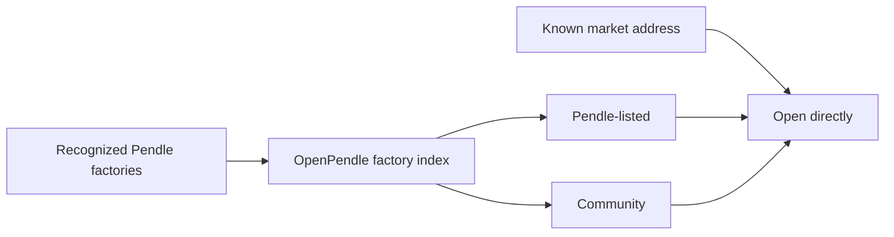

# Why OpenPendle

Pendle V2's market-creation contracts are permissionless: a compatible market can exist on-chain without appearing in Pendle's current catalog. OpenPendle exists so that catalog membership is a visible label, not the only way to reach a market.

If you want a feature overview, start with [What is OpenPendle](/introduction/what-is-openpendle). This page explains the product choices behind it.

::: warning Reach is not assurance
OpenPendle's broader market coverage does not add review or endorsement. Treat every unfamiliar asset and SY as untrusted until you have verified it. See [Community pools](/concepts/community-pools) and [Risks & disclosures](/reference/risks).
:::

## The access gap

A Pendle market can be live, liquid, and callable while absent from a frontend's catalog. Without a purpose-built interface, using it means finding the correct market and token addresses, reading contract state, constructing router calls, and calculating safe bounds yourself.

OpenPendle indexes creation events from recognized market factories on its supported networks. Pendle's catalog then enriches those records with listed status and display metadata. A direct address remains usable even before the next index snapshot.

This produces two discovery labels:

- **Pendle-listed** means the market appears in Pendle's current catalog.
- **Community** means OpenPendle found a recognized factory deployment that is absent from that catalog.

Neither label is an OpenPendle safety rating. Listing status, creator identity, protocol-incentive eligibility, and asset quality are separate facts.

## Pendle's catalog and OpenPendle's index

The two inventories answer different questions:

| | Pendle catalog | OpenPendle factory index |
| --- | --- | --- |
| Primary question | Which markets does Pendle currently publish through its catalog? | Which market deployments were emitted by recognized factories? |
| Discovery source | Pendle's service | Factory creation events, published as a static artifact |
| Direct address | Defined by Pendle's app behavior | Available even when the snapshot or catalog lacks the market |
| Label in OpenPendle | Pendle-listed | Community when absent from the current catalog |
| Safety meaning | A catalog fact, not an OpenPendle guarantee | A provenance fact, not an endorsement |

OpenPendle retains Pendle's catalog signal. Broader coverage is useful only if users can see when they have stepped outside it.

## Why a static client

OpenPendle keeps the request-time application layer small:

- Core market reads and transaction simulations use the selected RPC.
- Your wallet signs transactions directly; there is no OpenPendle transaction relay.
- Explore's inventory is a generated static artifact rather than an account-backed database.
- Saved pools and settings remain in browser storage.
- Hash-based routing removes server rewrites at a domain root. IPFS DNSLink can use that shape; a raw `/ipfs/<CID>/` subpath needs a matching Vite base.

Feature-specific services are still necessary. Pendle provides catalog, alert, and limit-order data; Morpho provides market discovery for Looping; price, token-lookup, reward, and analytics services receive the requests disclosed in [Architecture](/reference/architecture). If one of those services fails, its feature may degrade even while direct market reads remain available.

This produces graceful but incomplete degradation:

- a stale factory snapshot can miss new Explore results while direct addresses still work;
- a Pendle API outage can remove enrichment, alert history, or limit-order support;
- a Morpho API outage can block fresh Looping discovery and risk increases without removing registry-based management of an existing supported loop;
- an RPC outage can prevent live reads and simulation on that network;
- a wallet-provider problem can prevent signing while read-only pages remain usable.

The distinction is operationally useful: a partial feature failure is not necessarily a Pendle contract failure.

Static does not mean trustless. A malicious or modified frontend can still prepare harmful wallet requests. Open source and self-hosting make inspection and independent deployment possible, but users must still read wallet prompts and verify contract addresses.

Self-hosting also has a precise boundary. The current hash-routed build works from a domain root and through an equivalent IPFS DNSLink setup. Serving it directly beneath `/ipfs/<CID>/` requires the Vite base to match that subpath; hash routing alone does not fix asset URLs.

## Why validate provenance

Anyone can deploy a contract that resembles a market. Before OpenPendle lets you save or transact against an address, it checks the market against the chain-specific factory lineage bundled with the release. Protocol Status separately reads the deployment helper's active wiring.

This gate prevents a look-alike contract from entering the normal action flow. It does not inspect the SY's economics, owner, adapter, upgradeability, or underlying protocol. Provenance answers **where did this market come from?**, not **should I put money into it?**

## Why keep listed and Community markets together

A separate hidden workflow would make long-tail markets harder to compare and would obscure why one result is trusted differently from another. OpenPendle instead uses the same market view and action components while preserving provenance and catalog labels.

The practical trade-off is explicit:

| OpenPendle adds | OpenPendle does not add |
| --- | --- |
| Factory-indexed discovery and direct-address access | Asset review or listing assurance |
| A trust panel and provenance gate | A guarantee that an SY is safe |
| Simulated transaction preparation | A guarantee that state will not change before mining |
| Exact approvals by default | Protection from an approval the user deliberately expands |
| Self-hostable source | Proof that every hosted build matches that source |

These limits are intentional. A static frontend can reduce mutable server dependencies, publish its source, keep custody in the wallet, and disclose remaining services. The user still trusts the delivered build, browser, wallet, RPC, deployed contracts, and asset stack.

## Who it is for

OpenPendle is useful when you:

- already know an unlisted market or token address;
- need to compare Pendle-listed and Community markets in one directory;
- are creating or seeding a permissionless market;
- want browser-local saved pools and a narrow, self-hostable client;
- understand how to assess an asset, SY, and wallet request yourself.

If you are new to Pendle and simply want a well-known market, Pendle's official interface is usually the easier starting point. OpenPendle is designed for reach and inspection, not for replacing curation.

## Current feature boundary

Alerts and market discovery are read-only. Limit orders are available only where Pendle's live service supports the exact market and direction. Looping has a broader comparison directory, but only exact reviewed markets can open or adjust a loop when the base entry gates and live safety checks permit it. Mint Mode, which sends minted YT to the wallet and supplies only PT as collateral, has an additional independent build flag and runtime policy. Either entry plane can be paused without disabling full exit or recovery.

## Next

- [Quickstart](/introduction/quickstart)
- [Community pools & incentives](/concepts/community-pools)
- [How OpenPendle works](/reference/architecture)
- [Self-hosting](/reference/self-hosting)
