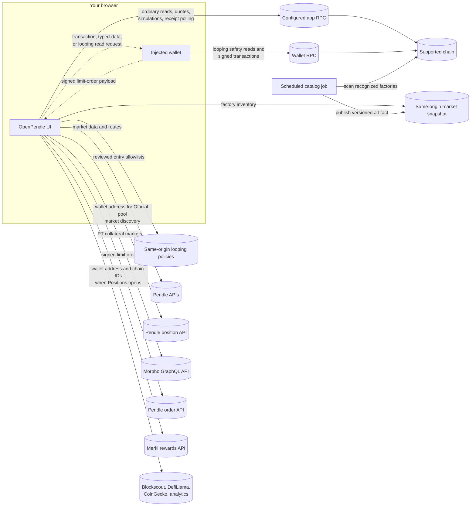
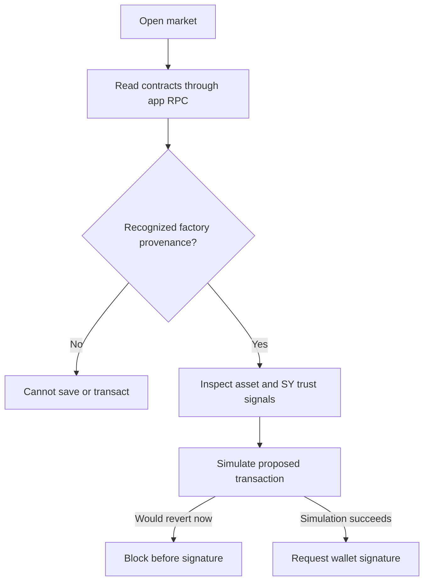

# How OpenPendle works

OpenPendle is a static, open-source (`GPL-3.0-or-later`) interface for Pendle V2 on six chains. It inventories markets created by recognized Pendle factories, labels the subset represented in Pendle's public catalog, and can load a recognized market directly by address.

OpenPendle ships **no OpenPendle-authored smart contracts** and adds no fee. Its Create tools can ask Pendle's factories and deployment helper to deploy Pendle SY and market contracts, but there is no OpenPendle router, proxy, custody contract, or fee hook in the path.

::: info The trust model in one sentence
The browser reads and simulates against the chain, checks market provenance, and defaults ERC-20 approvals to the exact action amount; those protections do not review the asset, SY, adapter, or owner underneath a market.
:::

## System boundaries

The production interface has:

- **No OpenPendle request-time application server, account system, or user database.** The deployed app is a static bundle.
- **No OpenPendle transaction relay or custody.** An injected wallet signs and submits transactions through the wallet's own provider.
- **A static discovery artifact.** A scheduled job scans recognized factory events and publishes a versioned market snapshot with coverage metadata.
- **Feature-scoped public API calls.** Pendle, Morpho, Merkl, DefiLlama, CoinGecko, and supported Blockscout services are contacted only for the features listed under [Outbound requests](#outbound-requests).
- **Cloudflare Web Analytics on the hosted build.** It receives page-view and performance data, not an intentionally attached wallet address or saved-pool registry.

The absence of an OpenPendle backend does not mean the browser is offline or private from every provider. RPC and ancillary services can observe the requests and normal network metadata sent to them.

## Reads, simulations, and writes use different paths

OpenPendle's configured RPC and the wallet provider have separate responsibilities:



Ordinary state, quotes, provenance reads, balances, and transaction simulations use the app's active-chain RPC transport. Looping is the exception: its pinned safety reads and unsigned simulations use the connected wallet's provider. Read calls are batched where appropriate through canonical Multicall3.

When an action is ready, OpenPendle hands the transaction request to the injected wallet. The wallet signs locally and broadcasts through the RPC/provider configured in that wallet, which may differ from OpenPendle's custom RPC. OpenPendle then uses its public client to follow confirmation. Selecting a network determines the target chain and asks a connected wallet to switch; an OpenPendle RPC override does **not** reconfigure the wallet's provider.

Limit-order placement is different: the wallet signs EIP-712 typed data, and the browser publishes the signed order to Pendle's hosted API. Placement is not an on-chain OpenPendle transaction and does not escrow funds.

### On-chain action lifecycle

The shared action flow normally proceeds in this order:

1. confirm the active OpenPendle chain and connected wallet chain;
2. check balances and required allowances;
3. request an exact approval when the existing allowance is insufficient, unless the user explicitly selected Unlimited;
4. wait for that approval to confirm;
5. simulate the final action from the connected account against the current chain state;
6. send the transaction request to the wallet; and
7. poll the app RPC for the receipt and surface confirmation or a recoverable error.

Native-value actions skip ERC-20 approval. A rejected wallet prompt leaves the action unsigned. A successful simulation does not bypass the wallet's own transaction preview or chain check.

Limit orders use a parallel lifecycle: support check, book/context load, field generation, local validation, EIP-712 signature, signature/hash validation, then publication. Approval and cancellation remain on-chain even though publication is off-chain.

## Contract surface

The main fixed entry points are Pendle's Router V4, Limit Router, common pool deployment helper, common SY factory, and PT/YT/LP oracle, plus canonical Multicall3. Their shared addresses and the configured per-chain lineage are listed under [Networks & contracts](/reference/networks-and-contracts).

Some facts are bundled with the release and some are read live:

| Source | Used for |
| --- | --- |
| **Bundled chain address book** | Chain-specific RouterStatic, PENDLE, wrapped-native token, governance addresses, and recognized factory lineage |
| **Live common-deploy reads** | The helper's active market factory, yield-contract factory, router, and SY factory shown on Protocol Status |
| **Live factory reads** | Mutable expiry, fee-cap, interest-fee, and treasury parameters |
| **Live market reads** | The specific market's tokens, state, fee configuration, ownership, adapter, and proxy signals |

The in-app [Protocol Status & Contracts](https://openpendle.com/#/status) page shows active helper wiring and mutable parameters. It is not a complete historical address registry; the bundled lineage remains necessary for catalog coverage and provenance checks.

### Source-of-truth order

When facts disagree, OpenPendle follows a narrow source hierarchy:

- **Specific market state** comes from the opened contracts on the active chain.
- **Mutable protocol parameters** come from the active factories and helper wiring read from that chain.
- **Recognized lineage and chain configuration** come from the audited address book shipped in that release.
- **Directory membership** comes from the generated factory-event snapshot and its coverage report.
- **Listed labels and display metadata** are enrichment from Pendle's public API.

An API label cannot override a failed on-chain provenance check. Conversely, a valid on-chain market can be absent from a stale or incomplete directory.

## Discovery: a static catalog plus live hydration

Explore first downloads `/catalog/factory-markets.v1.json`. A scheduled batch job builds it from `CreateNewMarket` events across the factory lineage configured for each chain. The artifact records indexed-through blocks and timestamps, completeness, errors, and quarantined logs. A failed refresh does not replace a last-known-complete snapshot with a partial one.

Factory events answer “which markets did a recognized factory create?” Pendle's public API answers a different question: “which of those markets is represented in Pendle's catalog, and what display metadata is available?” Pendle enrichment does not define the factory inventory.

A new market can be absent until the next successful refresh. Incomplete coverage is surfaced rather than treated as a complete empty set. Direct address loading and the market-page provenance check remain independent of the directory.

The snapshot also supplies the primary PT/YT-to-pool mapping through its indexed head. A pasted PT or YT can map to more than one market, so OpenPendle keeps all verified matches instead of silently choosing one. Pendle and supported Blockscout lookups provide bounded fallbacks beyond the current snapshot; a failed fallback does not manufacture a market.

Catalog freshness and live market freshness are separate. A stale card can still open into current on-chain state, while a recently created market may work by address before it has a card.

## Feature API paths

### Yield alerts

[Yield alerts](/guides/yield-alerts) is wallet-less and read-only. The browser requests Pendle's active market catalog and 25 hourly data points for each current-liquidity candidate. It applies the exact 24-hour window, $1 million all-hours AMM-liquidity gate, maturity exclusion, and significant-move rules locally. Failed histories are reported as partial coverage.

### PT looping

[PT looping](/guides/looping) joins the factory-indexed Pendle PT inventory to Morpho markets by exact chain and collateral address. The directory and scenario model remain wallet-less, but directory inclusion is not execution approval.

An executable action must match OpenPendle's reviewed market registry, including the Pendle market, PT, Morpho tuple, SY route tokens, and deployed contract policy. Every new entry or leverage increase additionally requires the base entry build flag and a fresh same-origin runtime policy covering the exact market. Mint Mode also requires its independent build flag and the matching entry or increase capability in a separate same-origin Mint policy. A Mint-policy failure pauses Mint without disabling Market Mode, reductions, exits, or recovery. Production currently leaves Mint execution disabled.

The connected wallet's selected-chain RPC supplies pinned safety reads and unsigned simulation; the wallet signs authorizations and broadcasts the final transaction.

Leverage decreases and full exit use the separately gated exit path. Recovery is not controlled by the entry policy. Reviewed identities remain in the position-management registry after maturity or a liquidity decline, so Positions can still prepare the post-expiry redemption and full debt repayment even when new entry is unavailable.

### PT limit orders

[PT limit orders](/guides/limit-orders) use Pendle's hosted service for support, books, generated fields, publication, and maker-order reads. OpenPendle currently supports PT ↔ SY only and requires the support response to match the exact chain, market, YT, SY, and direction.

Before an EOA signs, the browser validates the typed-data domain and fields, computes the order hash locally, compares it with the Limit Router, recovers the signer, and runs the router's signature check. Placement sends the signed order to Pendle. Funds remain in the wallet and can make the order unfillable if moved or no longer approved.

The service is a functional dependency for discovering support, viewing the book, generating fields, publishing, and reading maker orders. An unavailable or malformed response fails closed. It does not prevent ordinary AMM actions on the same market.

## Provenance is validation, not endorsement

Before a market can be saved or used for an on-chain market action, OpenPendle checks that a recognized Pendle market factory created it. The recognized chain-specific lineage is bundled with the release; active helper wiring and mutable protocol parameters are also read live where relevant.

The gate answers only: **did a recognized Pendle factory create this market?** It does not establish that the asset is solvent, the SY is correct, an adapter is safe, or an owner will behave honestly.



## Transaction safeguards and limits

- **Simulate before sign.** On-chain actions are simulated against the current chain state before the wallet prompt. This catches a call that would revert under that state. It does not prove asset semantics, guarantee the mined state will be unchanged, or eliminate smart-contract and front-running risk.
- **Exact approval by default.** ERC-20 approvals normally match the current action amount. Unlimited approval is an explicit setting and leaves a standing allowance until revoked.
- **Strict typed-order checks.** Limit orders follow their own validation path because signing and publication are off-chain. The current version accepts 65-byte EOA signatures; contract-wallet signatures are not enabled.

These safeguards make the requested action more legible. They do not make a market or its assets safe. See [Risks & disclosures](/reference/risks).

## Wallets, networks, and RPC settings

OpenPendle uses injected EIP-6963 wallets such as MetaMask, Rabby, and Brave. There is no WalletConnect session relay. On mobile, signing therefore requires a wallet dApp browser or another browser with an injected provider; wallet-less browsing still works in an ordinary tab.

The preferred chain is stored under `openpendle.chain` and defaults to Arbitrum. A chain-explicit market or token URL overrides that preference for its tab. Public read transports use keyless endpoints wrapped in a viem `fallback()` transport. A per-chain override under `openpendle.rpc.<chainId>` replaces those defaults for OpenPendle reads and simulations on that chain.

Chain-explicit URLs are important for sharing: identical hexadecimal addresses can exist on multiple networks. The app delays mounting an address route until its read client matches the URL's chain, avoiding an initial query against the recipient's previous preference. A selector click persists the preferred chain; a URL-scoped override does not silently rewrite that preference for other tabs.

An RPC can observe and influence the chain view it serves. A malicious or stale endpoint can misreport data or cause simulation failures. The injected wallet's provider separately controls transaction broadcast.

## Hosting and browser hardening

Hash-based routes live after `#`, so a static host does not need SPA rewrite rules. The default Vite build uses root-relative asset paths: it works unchanged at a domain root, including an IPFS deployment reached through DNSLink or an equivalent root-preserving gateway. Hosting under `/ipfs/<CID>/` or another subpath requires building with the matching Vite `base`; HashRouter alone does not solve asset paths. See [Self-hosting](/reference/self-hosting).

The hosted app's Content-Security-Policy uses:

```
script-src 'self' 'wasm-unsafe-eval' https://static.cloudflareinsights.com
```

It does not enable JavaScript `eval()` or the `Function` constructor. Fonts are bundled locally. `connect-src` permits HTTPS so the browser can reach supported APIs and user-selected HTTPS RPCs.

The `_headers` file is hosting configuration, not JavaScript. Cloudflare Pages applies it in production; another host must reproduce the same headers in its own configuration. Vite's development server does not apply the production CSP.

## Outbound requests

This is the canonical request disclosure for the stock build:

| Destination | Trigger | Data or purpose |
| --- | --- | --- |
| **Configured blockchain RPCs** | Browsing, ordinary quoting, provenance, simulation, receipt polling | Addresses, calldata, and chain reads required by the action |
| **Wallet-configured provider/RPC** | Looping safety reads and unsigned simulation; signing and sending on-chain transactions | Looping read/simulation calldata, the signed transaction, and normal wallet-provider metadata |
| **Same-origin catalog** | Explore, PT/YT resolution, Looping inventory | Static factory-market snapshot and coverage metadata |
| **Same-origin looping entry policy** | Before any new loop or leverage increase reaches sensitive wallet steps | Short-lived base allowlist for exact reviewed entry markets; fetched without cache |
| **Same-origin looping Mint policy** | Before a Mint entry or Mint leverage increase reaches sensitive wallet steps | Independent short-lived Mint entry/increase capabilities and exact market allowlists; fetched without cache |
| **Pendle market APIs** | Explore enrichment, bounded PT/YT lookup, and fresh Looping entry/exit routes | Market/token identifiers, amounts, reviewed adapter receiver, slippage, and optional metadata; no wallet signature |
| **Pendle position API** | A connected user opens Positions | Wallet address used to discover relevant Official-pool market IDs; balances are then read by RPC |
| **Pendle yield-data APIs** | Yield alerts | Active catalog and hourly APY/liquidity histories; no wallet required |
| **Morpho GraphQL API** | Looping | PT collateral addresses and public Morpho market/liquidity state; no wallet required |
| **Pendle limit-order API** | Support, book, generation, placement, maker history | Market context; maker reads include the wallet address; placement includes the complete signed order |
| **Supported Blockscout APIs** | A bounded lookup fallback is needed | Factory/event-topic queries for market discovery |
| **Merkl rewards API** | A connected user opens Positions | Wallet address and supported chain IDs used to retrieve wallet-wide rewards and proofs |
| **DefiLlama and CoinGecko** | Header ticker | Aggregate Pendle metrics |
| **Cloudflare Web Analytics** | Loading and navigating the hosted interface | Page-view and performance metrics |

Merkl results can include rewards unrelated to Pendle. Claiming sends a transaction through the wallet to Merkl's distributor. OpenPendle does not compute those rewards or custody them.

## Local data and privacy

The following values are stored in browser `localStorage`:

| Data | Key |
| --- | --- |
| Preferred chain | `openpendle.chain` |
| Per-chain RPC override | `openpendle.rpc.<chainId>` |
| Saved pools | `openpendle.pools.v1` |

Saved-pool export, import, and share links are explicit user actions. Opening a saved market or Positions can still cause ordinary RPC and feature requests for those addresses; storing the registry does not create an OpenPendle account or upload the registry itself.

Wallet state is stored separately by wagmi so the interface can reconnect an injected provider. OpenPendle does not turn that local connection state into an account profile. Clearing site data removes local preferences and saved pools and can also clear remembered connector state.

The browser address is naturally disclosed when it is part of an RPC call, wallet transaction, Official-position discovery, maker-order request, or Merkl lookup. “No accounts” means OpenPendle does not operate an identity database; it does not make public-chain activity anonymous.

## Where trust sits

You are trusting the static bundle you loaded, your wallet, the chain and contracts, the RPCs that provide your chain view, and the public services used by the feature you open. Pendle governance controls protocol contracts and mutable parameters; Pendle's hosted API is also part of the off-chain limit-order path.

You are **not** relying on an OpenPendle account database, transaction relay, custody layer, proprietary order book, or OpenPendle-authored smart contract. That narrower interface trust surface does not remove asset, SY, protocol, oracle, liquidity, API, wallet, or RPC risk.

::: danger OpenPendle has not reviewed or endorsed Community markets
Anyone can create one, and interacting with one can lose funds. OpenPendle is not affiliated with Pendle Finance and cannot vouch for the asset or SY underneath a market. Security reports: [x.com/ggmxbt](https://x.com/ggmxbt).
:::
