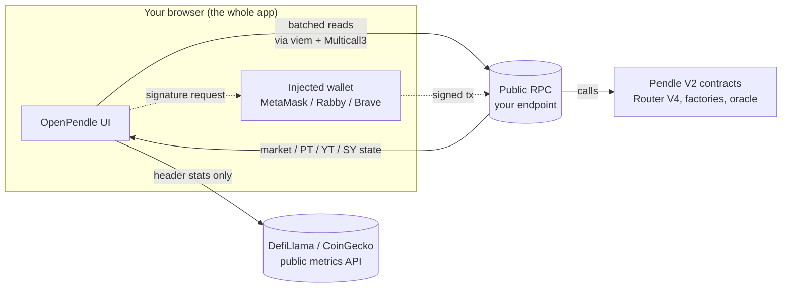
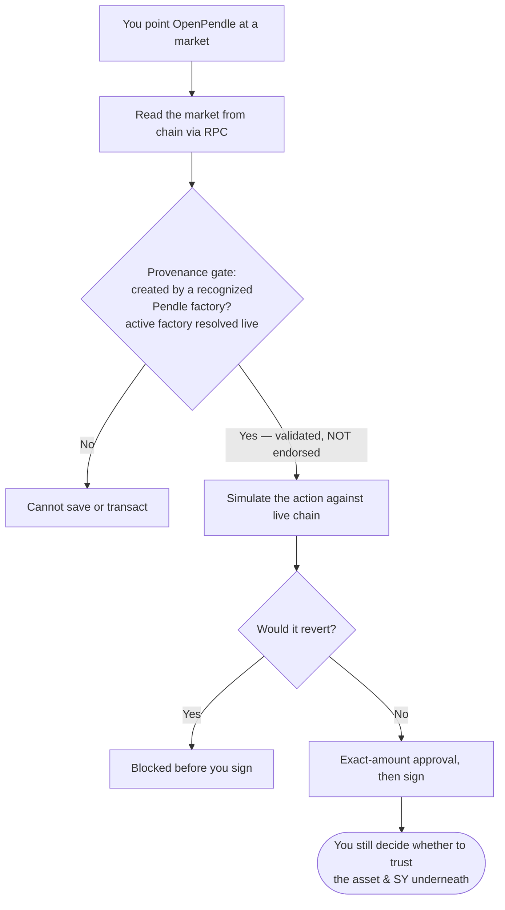

# How OpenPendle works

OpenPendle is a free, open-source (`GPL-3.0-or-later`) web interface to Pendle V2's permissionless [community pools](/concepts/community-pools) — the markets anyone can create that Pendle's official app does not list. This page is the architecture and trust-model deep-dive: what the interface is, what it deliberately is **not**, and every boundary it draws around your funds and your privacy.

The short version is a single design commitment: OpenPendle is a **thin, verifiable client** in front of contracts it does not own. It ships **no smart contracts of its own** and adds **no fee of its own** — it calls Pendle's already-deployed contracts with hand-written ABIs, and every Pendle protocol fee still applies. There is no backend to trust, no account to create, and nothing between your browser and the chain except the RPC endpoint you choose.

::: info The trust model in one sentence
OpenPendle reads and writes Pendle V2 directly from your browser, validates that a market genuinely came from a Pendle factory, simulates every transaction before you sign, and asks for exact-amount approvals — but it **validates provenance, not the asset or SY underneath**, and it is **not affiliated with, endorsed by, or operated by Pendle Finance**.
:::

## What OpenPendle is not

Most of OpenPendle's security properties are the direct consequence of things it refuses to have. It is easier to trust a system when there is less of it to trust.

- **No backend.** There is no server that holds your data or brokers your requests.
- **No database and no indexer.** Every number you see is read live from the chain, not from a cache OpenPendle maintains.
- **No accounts.** There is nothing to sign up for and no identity to link.
- **No tracking and no analytics.** The interface does not phone home, and there is no telemetry describing what you looked at or did.
- **No custody.** OpenPendle never holds funds. Your wallet signs; the transaction goes straight to Pendle's contracts.
- **No contracts of its own.** OpenPendle deploys nothing. It calls Pendle's deployed contracts using ABIs written by hand and checked into the [open-source repository](https://github.com/ggmatch-mod/open-pendle).

Because there is no backend, there is no privileged party that can quietly change what the app does, censor which markets you reach, or observe your activity from the inside. The trade-off is that everything runs in your browser, which is exactly what makes it self-hostable and censorship-resistant. See [Self-hosting](/reference/self-hosting) for running your own copy.

## Reads: straight from the chain

OpenPendle reads Pendle's state directly from public RPC using [viem](https://viem.sh) and batches those reads through **Multicall3** at `0xcA11bde05977b3631167028862bE2a173976CA11` — the same canonical Multicall3 address on all six supported networks. Batching many calls into one request is what lets a pool's full state (PT price, SY exchange rate, market reserves, your balances, oracle data) load in a single round-trip instead of dozens.

Nothing about reading requires a wallet. Browsing OpenPendle is **wallet-less**: you can open the app, switch networks, open a pool, and watch quotes update as you type without ever connecting. A connection is only needed to *sign* a transaction. See [Browsing & networks](/guides/browsing).

The set of contracts OpenPendle reads and writes is Pendle's own. The fixed entry points — identical on every chain — are:

| Contract | Address | Role |
| --- | --- | --- |
| Router V4 | `0x888888888889758F76e7103c6CbF23ABbF58F946` | All trades, liquidity, and exits |
| PendleCommonPoolDeployHelperV2 | `0x2Ed473F528E5B320f850d17ADfe0e558f0298aA9` | One-tx pool (+ optional SY) deploys |
| PendleCommonSYFactory | `0x466CeD3b33045Ea986B2f306C8D0aA8067961CF8` | Permissionless SY-template deploys |
| PendlePYLpOracle | `0x5542be50420E88dd7D5B4a3D488FA6ED82F6DAc2` | TWAP oracle for PT / YT / LP pricing |
| Multicall3 | `0xcA11bde05977b3631167028862bE2a173976CA11` | Batched reads |
| Pendle governance proxy | `0x2aD631F72fB16d91c4953A7f4260A97C2fE2f31e` | Default owner of wizard-deployed SYs |
| Pendle ProxyAdmin | `0xA28c08f165116587D4F3E708743B4dEe155c5E64` | Admin of Pendle's upgradeable SY proxies |

Other addresses — the PENDLE token, `RouterStatic`, treasury, governance multisig, wrapped native, and the market and yield-contract factories — are chain-specific and are resolved live rather than assumed. The full per-chain list lives on the in-app [Protocol Status & Contracts](https://openpendle.com/#/status) page, and every address is verifiable against `pendle-finance/pendle-core-v2-public`. The complete reference is on [Networks & contracts](/reference/networks-and-contracts).

## Data flow: browser → RPC → Pendle

The entire path from your keyboard to the chain is short and has no intermediary that OpenPendle controls.



Reads flow browser → RPC → Pendle and back. When you transact, the injected wallet signs locally and the signed transaction is sent to the same RPC, which submits it to Pendle's `Router V4`. The only path that leaves this loop is the header statistics ticker, covered below.

## Hosting: HashRouter, static, IPFS-ready

OpenPendle uses a **HashRouter**, so in-app URLs look like `openpendle.com/#/...` — the route lives in the fragment after the `#`. This is a deliberate hosting decision, not a cosmetic one. Because the server never sees the part after the `#`, every route resolves to the same single `index.html`, so the app runs on **any static host or IPFS with no server rewrite rules** and no SPA fallback configuration. A plain file server, an object store, or an IPFS gateway serves it unchanged.

This is what makes OpenPendle genuinely portable and hard to take down: the production build is a static bundle with no absolute paths and no server routes, so it pins cleanly to IPFS and works from any gateway. [Self-hosting](/reference/self-hosting) walks through building and pinning your own copy.

## The provenance gate: validation, not endorsement

Before you can **save** a market or **transact** against it, OpenPendle runs a **provenance gate**. It verifies that the market was created by a **Pendle factory it recognizes** — confirming the contract genuinely descends from Pendle's deployment machinery rather than being an impostor contract wearing a Pendle market's shape.

Two properties of this check matter enormously, and they are easy to conflate.

**First, it is resolved live.** Pendle's factories are **governance-mutable** — governance can change which factory is active. So OpenPendle never hardcodes the "active" factory for routing; it **resolves the current factory live at runtime**. The hardcoded factory set exists for one purpose only: provenance validation, checking a market against the known lineage of Pendle factories on that chain.

**Second, and most important: provenance is validation, not endorsement.** The gate answers exactly one question — *"did this market come from a Pendle factory?"* It does **not** answer "is this asset safe?", "is this SY honest?", or "is whoever deployed this trustworthy?" A market can pass the provenance gate cleanly and still be built on a malicious, broken, or exotic asset. OpenPendle vouches for *where a market came from*, and for nothing underneath it.



The factory lineage that OpenPendle validates against is chain-specific: Ethereum, BNB Smart Chain, and Arbitrum carry the full history (v1, V3, V4, V5, V6); Base and Plasma carry V5 and V6; Monad, which launched on the current generation, is V6 only. This lineage is documented in full on [Networks & contracts](/reference/networks-and-contracts), and the concept is explained from the market's point of view in [Community pools](/concepts/community-pools).

## Transaction safety: simulate-before-sign and exact-amount approvals

The protections OpenPendle offers on the *act of transacting* are two-fold.

**Simulate-before-sign.** Every transaction is simulated against the **live chain** before you are asked to sign. A call that would revert on-chain is caught first, so you do not spend gas discovering that an action was impossible. Quotes for trades, mints, redemptions, and liquidity actions update live as you type, and the same simulation backs the final signature.

**Exact-amount approvals.** When an action needs an ERC-20 allowance, OpenPendle requests approval for the **exact amount** that action requires — never an unlimited allowance left standing on your wallet after the fact. If a deploy or seed needs a specific token amount, you approve that amount; if the seed asset is native ETH (an SY that lists `address(0)` among its inputs), it is sent as `msg.value` with no approval at all.

::: warning These protect the transaction, not the asset
Simulate-before-sign and exact-amount approvals make the *mechanics* of interacting honest and legible — they catch reverts and cap allowances. They do **not** make an unreviewed asset safe. Community pools are permissionless and unreviewed — anyone can create one, and interacting with them can lose you funds. OpenPendle validates market provenance but cannot vouch for the assets or SY contracts underneath. Read [Risks & disclosures](/reference/risks) before you transact.
:::

## Wallets: injected-only, no relay

OpenPendle connects **only** to an injected browser wallet. There is **no WalletConnect and no third-party relay** — nothing sits between the interface and your wallet. It works with MetaMask, Rabby, Brave, and any injected **EIP-6963** provider, discovered directly in the page.

The practical consequences:

- **Desktop:** use the wallet's browser extension.
- **Mobile:** open the site inside a wallet's in-app dApp browser (MetaMask, Rabby, …) or in Brave mobile. A normal mobile browser tab has **no injected wallet** and cannot connect — this is a limitation of injected-only design, and the trade for having no relay to trust.
- **Browsing stays wallet-less.** Reads go through RPC, so you can explore fully without connecting. When your wallet's chain differs from the app's active network, a wrong-network banner offers a one-click switch; browsing continues to work regardless.

Because there is no relay, there is no third party that can observe your sessions, drop your transactions, or interpose itself between you and your wallet. See [Connecting a wallet](/guides/connecting-a-wallet) for the step-by-step.

## Networks and RPC: defaults, fallback, and per-chain override

OpenPendle supports six networks: Ethereum (`1`), BNB Smart Chain (`56`), Monad (`143`), Base (`8453`), Plasma (`9745`), and Arbitrum (`42161`).

The **active network** is a UI and `localStorage` choice — the key `openpendle.chain`, defaulting to Arbitrum — that determines what the whole app reads and where a transaction is sent. Switching networks is a client-side selection; nothing on a server changes.

RPC is designed to keep working without your intervention while staying fully in your control:

- **Keyless public defaults per chain.** Each network ships with public RPC endpoints that require no API key.
- **Automatic fallback.** The defaults are wrapped in a **viem `fallback()` transport**, so a rate-limited or unreachable endpoint automatically rolls over to a backup — you should rarely notice an outage.
- **Per-chain override, stored locally.** You can override the endpoint for any single chain in **RPC settings**. The override is written to `localStorage` under `openpendle.rpc.<chainId>`, **replaces the defaults for that chain**, stays entirely on your device, and saving reloads the app so the new endpoint takes effect everywhere.

::: tip Your RPC endpoint sees your reads
Whatever RPC you point OpenPendle at can see the read requests your browser makes to it. The public defaults are keyless conveniences; if you would rather a specific provider (or your own node) serve your traffic, set a per-chain override. It is stored only in your browser and never transmitted anywhere except to the endpoint itself.
:::

Full RPC and network details are on [Networks & contracts](/reference/networks-and-contracts).

## Content-Security-Policy and self-hosted assets

OpenPendle ships a strict **Content-Security-Policy**. The script directive is:

```
script-src 'self' 'wasm-unsafe-eval'
```

- `'self'` restricts executable script to the app's own origin — no remote script can be pulled in or run.
- `'wasm-unsafe-eval'` permits **WebAssembly** instantiation (used for cryptography) **without** enabling JavaScript `eval()` or the `Function` constructor. The dynamic-string code paths that malicious script typically abuses are blocked; WASM, which cannot be used the same way, is allowed for the crypto it needs.

**Fonts are self-hosted.** They are bundled with the app, so there are **zero external font requests** — no font CDN sees your visits, and the app renders correctly offline or from an air-gapped mirror.

## The only outbound requests

Given all of the above, the complete list of things that leave your browser is short and worth stating exactly:

| Outbound call | When | Why |
| --- | --- | --- |
| **Blockchain RPC** | Reading state; submitting a signed transaction | The endpoint(s) you point at — defaults or your override |
| **DefiLlama / CoinGecko public APIs** | Only for the header stats ticker | Pendle metrics shown in the header |

That is the entire surface. There is no analytics beacon, no error-reporting endpoint, no font or script CDN, and no wallet relay. Reads and transactions go to **the RPC you chose**; the header statistics ticker fetches Pendle metrics from **DefiLlama and CoinGecko** public APIs and nothing else.

::: info Everything else is local
Your active network (`openpendle.chain`), any RPC overrides (`openpendle.rpc.<chainId>`), and your saved pools (`openpendle.pools.v1`) all live in your browser's `localStorage`. Nothing leaves the browser unless you explicitly export or share it. See [Saved pools & privacy](/guides/saved-pools).
:::

## Ships no contracts; hand-written ABIs

OpenPendle deploys nothing on-chain. Every interaction — reading a market, minting, redeeming, swapping, adding or removing liquidity, deploying a pool — is a call into **Pendle's own deployed contracts**, encoded against **hand-written ABIs** checked into the repository. There is no OpenPendle proxy, no OpenPendle router, and no OpenPendle fee-taking hook in the path; because it ships no contracts, it takes **no fee of its own**, though Pendle's own protocol fees still apply.

This is also why the interface is straightforward to audit and self-host: the ABIs are readable in source, the addresses are Pendle's public deployments, and you can cross-check every one against `pendle-finance/pendle-core-v2-public` or a block explorer. See [Self-hosting](/reference/self-hosting) to build and serve your own copy.

## Where trust actually sits

Pulling the pieces together, here is the honest accounting of what you are and are not trusting when you use OpenPendle.

| You are trusting | You are **not** relying on OpenPendle for |
| --- | --- |
| Pendle V2's deployed contracts (Router, factories, oracle) | Any judgment about whether an asset or SY is safe |
| The RPC endpoint you point at | A backend, database, or indexer (there are none) |
| Your own wallet and its signing | A WalletConnect or third-party relay (there is none) |
| The static bundle you loaded (verifiable, self-hostable) | Endorsement of any market — provenance is not approval |
| Pendle's governance over its factories and SY proxies | Analytics or tracking of your activity (there is none) |

The provenance gate, simulate-before-sign, exact-amount approvals, injected-only wallets, the strict CSP, and self-hosted fonts all harden the *interface and the act of transacting*. None of them can make an unreviewed asset trustworthy. That gap — between "this transaction will do what the interface says" and "this asset is worth interacting with" — is exactly where a community pool's risk lives, and only you can close it.

::: danger Not affiliated with Pendle; community pools are unreviewed
OpenPendle is **not affiliated with, endorsed by, or operated by Pendle Finance**. It is experimental — use at your own risk. Community pools are permissionless and unreviewed — **anyone can create one, and interacting with them can lose you funds.** OpenPendle validates market provenance but **cannot vouch for the assets or SY contracts underneath.** Never interact with a market unless you trust whoever created it and everything beneath it — the asset, the SY, its adapter, and its owner. Security contact: [x.com/ggmxbt](https://x.com/ggmxbt) (see `/.well-known/security.txt`).
:::

## See also

- [Networks & contracts](/reference/networks-and-contracts) — the six chains, the shared addresses, the per-chain factory lineage, and RPC details.
- [Risks & disclosures](/reference/risks) — the full risk surface; read it before you transact.
- [Self-hosting](/reference/self-hosting) — build, pin to IPFS, and run your own verifiable copy.
- [Community pools & incentives](/concepts/community-pools) — what "permissionless and unreviewed" means for the markets OpenPendle reaches.
- [Saved pools & privacy](/guides/saved-pools) — how the client-side registry works and what stays in your browser.
- [Connecting a wallet](/guides/connecting-a-wallet) — injected-only wallets on desktop and mobile.
