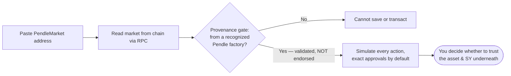

# Risks &amp; disclosures

This page mirrors the [About](https://openpendle.com/#/about) page inside the app and collects, in one place, everything you should understand before you save or transact against a pool. Read it in full. OpenPendle is a thin, honest window onto Pendle V2's permissionless markets — but a clear window onto a risky room is still a window onto a risky room, and most of the risk lives on the other side of the glass, in assets and contracts this interface neither wrote nor reviews.

::: danger Experimental — use at your own risk
OpenPendle is novel, unaudited software that talks to a permissionless protocol. **Community pools are unreviewed and can be created by anyone; interacting with them can lose you funds.** OpenPendle is **not affiliated with, endorsed by, or operated by Pendle Finance**. It validates a market's provenance but **cannot vouch for the assets or SY contracts underneath**. Nothing here is financial advice, and the software comes with no warranty of any kind.
:::

## The one thing to internalize

There is a gap between two very different statements, and almost every way you can be harmed lives inside it:

- **"This transaction will do what the interface says."** OpenPendle works hard to make this true — it simulates before you sign, defaults approvals to the exact amount, and gates markets by provenance.
- **"This asset is worth interacting with."** OpenPendle says **nothing** about this. It does not, and cannot, tell you whether the underlying asset is solvent, whether the [SY](/concepts/standardized-yield) wrapping it is honest, or whether the person who deployed the pool meant you well.

Everything below is an expansion of that gap. Only you can close it, and you close it by doing diligence on the asset and the SY — never by trusting that a pool loaded cleanly.

## What community pools are

A **community pool** (used interchangeably with **market**) is the on-chain `PendleMarket` contract that someone created permissionlessly on Pendle V2 — no whitelist, no approval, and reviewed by no one, including Pendle. Pendle V2 is a permissionless protocol: anyone with a wallet and seed capital can deploy a market for any compatible yield-bearing asset. Pendle's official app surfaces a curated, team-listed subset of those markets; everything beyond that subset is the long tail OpenPendle exists to reach.

OpenPendle loads any such market by its address and reads its state straight from the chain. There is no OpenPendle listing process or curator; Explore inventories recognized factories' creation events and separately labels markets that also appear in Pendle's public catalog. **Factory-indexed, Pendle-listed, community, and loadable are discovery states — none is an endorsement.** The [Community pools &amp; incentives](/concepts/community-pools) concept page covers what "permissionless and unreviewed" really means, and why native PENDLE gauge emissions and vePENDLE voting are reserved for team-listed markets while community pools rely on [Merkl](https://merkl.angle.money/) campaigns — if anyone funds one — for extra rewards.

::: warning Community pools are unreviewed
Community pools are permissionless and unreviewed — **anyone can create one, and interacting with them can lose you funds.** No one checked the asset. No one checked the SY. No one checked the person who deployed it. "Permissionless" is a statement about access, not about safety.
:::

## What OpenPendle checks — and what it cannot

OpenPendle's safeguards protect the *mechanics of transacting*. They do not, and cannot, vet the *quality of what you transact with*. Holding those two ideas apart is the whole of using this interface safely.

### What it checks

- **Provenance gate.** Before you can save a market or transact against it, OpenPendle verifies that the market was created by a **Pendle factory it recognizes**. Because Pendle's factories are governance-mutable, the currently active factory is resolved **live** at runtime; the hardcoded factory set is used only for this provenance validation. The check confirms the market genuinely descends from Pendle's deployment machinery — that it is a real Pendle market and not a look-alike contract wearing a Pendle market's shape.
- **Simulate before sign.** Every on-chain transaction is simulated against the live chain before you are asked to sign it, so a call that would revert is caught before you spend gas — and you see the expected outcome before committing funds.
- **Exact approvals by default; unlimited by explicit opt-in.** The default scopes an approval to the amount the current action needs. Transaction settings also offer **Unlimited**, which leaves a maximum standing allowance until you revoke it. Unlimited approval may reduce repeat approval transactions, but increases what the approved contract could pull and is particularly risky for an untrusted SY.
- **Strict limit-order validation.** For PT ↔ SY limit orders, OpenPendle requires a matching live support configuration and fee root, validates every generated EIP-712 field and domain value, compares local and on-chain order hashes, recovers the signer, and checks the signature through Pendle's Limit Router before publishing it. The first version supports EOAs only.

### What it cannot do

- **It cannot vouch for the underlying asset or the SY contract a pool wraps.** A factory-valid market can still wrap a malicious, broken, or exotic asset. Provenance answers "did this come from a Pendle factory?" — never "is this asset safe?", "is this SY honest?", or "is whoever deployed this trustworthy?"
- **It cannot guarantee a limit order will fill or remain fillable.** Placement reserves no funds. Execution depends on Pendle's off-chain order service, takers, your balance and allowance, mutable fees, and live on-chain state.

That last point deserves emphasis, because it is where people get hurt.

::: danger Provenance is validation, not endorsement
The provenance gate proves a market descends from a Pendle factory. It does **not** prove the wrapped asset is solvent, the SY is well-behaved, or the pool is worth your money. A market can pass the gate cleanly and be built on an [SY](/concepts/standardized-yield) that is upgradeable, points at an unknown adapter, or is owned by a stranger — and if the asset beneath it is malicious, broken, or simply fails, the [PT](/concepts/principal-tokens) may **not** redeem at par and an [LP](/concepts/liquidity-and-amm) position can lose value. **Never interact with a community pool unless you trust whoever created it and everything beneath it — the asset, the SY, its adapter, and its owner.**
:::

The relationship between the two is easiest to see as a flow: the gate decides only whether you *may* proceed; whether you *should* is a judgment it hands entirely back to you.

For the full picture of where a community pool's risk concentrates — upgradeability, adapters, and the SY owner — read [Standardized Yield (SY)](/concepts/standardized-yield); almost every way a pool can harm you traces back to the SY and the asset it wraps.

## Where the risk actually lives

It helps to separate the risks OpenPendle can shrink from the risks it structurally cannot. The interface is honest about which is which.

| Risk | Who bears it | Can OpenPendle reduce it? |
| --- | --- | --- |
| A transaction reverts or behaves unexpectedly | You | **Yes** — simulate-before-sign catches it first |
| A contract pulls more tokens than intended | You | **Partly** — exact approvals are the default; explicit unlimited approval increases standing exposure until revoked |
| Interacting with a fake, look-alike "Pendle" market | You | **Yes** — the provenance gate blocks it |
| The underlying asset is malicious, broken, or exotic | You | **No** — outside OpenPendle's knowledge |
| The SY is upgradeable, adapter-driven, or stranger-owned | You | **No** — a per-market detail you must inspect |
| `PT` fails to redeem at par because the asset failed | You | **No** — a property of the asset, not the interface |
| Ordinary [AMM](/concepts/liquidity-and-amm) / impermanent-loss and PT-vs-SY exposure on an LP position | You | **No** — inherent to providing liquidity |
| A signed limit order remains active after you move funds or place overlapping orders | You | **Partly** — OpenPendle shows order state, but placement does not reserve or escrow tokens |
| A limit-order cancellation races a fill before the cancellation is mined | You | **No** — both compete against live on-chain state |
| Pendle's hosted limit-order API is unavailable, changes behavior, or omits a market | You | **Partly** — OpenPendle fails closed on invalid or unavailable support and order data, but cannot provide the service independently |
| Smart-contract risk in Pendle V2 itself | You | **No** — OpenPendle ships no contracts of its own |

Read the trust panel on each pool, inspect the asset and SY directly, and **never interact with one unless you trust whoever created it and the assets underneath.** The provenance gate has not, and will not, do that for you.

## Fees

OpenPendle charges **nothing** and adds **no fee of its own**. It is a gift to Pendle's community, and there is no OpenPendle cut layered on top of any action.

Pendle's own protocol fees still apply, exactly as they would through any other interface — the AMM swap-fee cap, the YT interest fee, and so on. Those are charged and enforced by **Pendle's contracts**, not by this interface, and OpenPendle takes none of them. You can read the live, per-chain fee parameters on the app's [Protocol Status &amp; Contracts](https://openpendle.com/#/status) page, which resolves them from the chain in real time; the fixed entry-point addresses are also documented under [Networks &amp; contracts](/reference/networks-and-contracts).

Pendle's Limit Router has its own **mutable annualized fee parameter**, represented by the live fee root OpenPendle checks before signing. The actual fill fee depends on direction and time remaining until market maturity, and declines toward maturity. It is separate from the AMM's swap-fee path and can change, so do not assume an AMM quote and a limit order have identical fee treatment. Publishing a signed order is gasless, but an ERC-20 approval and an on-chain cancellation each require a transaction and network gas. A fill can also race a cancellation until that cancellation is mined.

::: info No fee of its own — what that does *not* mean
"No fee of its own" is a statement about OpenPendle, not about the cost of transacting. You still pay network gas, you still pay Pendle's AMM or limit-order protocol fees where they apply, and the price you get on any immediate swap is whatever the [AMM](/concepts/liquidity-and-amm) quotes at that moment. OpenPendle simply adds nothing of its own on top.
:::

## Your data &amp; privacy

OpenPendle operates no request-time application server, user database, account system, or transaction relay. A scheduled batch indexer publishes a public static factory-market snapshot for Explore; it contains chain-derived market data, not user data. Core market state, balances, quotes, and simulations are still read directly from the chain through public RPC endpoints. Ancillary public services, including Cloudflare Web Analytics for page-view and performance metrics, are contacted for the specific purposes disclosed below and are not in the transaction-signing path.

What stays local, and where:

| What | Where it lives | Leaves your browser? |
| --- | --- | --- |
| Saved pools | `localStorage` key `openpendle.pools.v1` | **Only** if you export or share |
| Active network choice | `localStorage` key `openpendle.chain` (default Arbitrum) | No |
| Custom RPC overrides | `localStorage` key `openpendle.rpc.<chainId>` | No |

The pools you remember live only in your browser's local storage, and any custom RPC you set stays local too. Outbound requests are limited to:

- the **blockchain RPCs you point at** (keyless public defaults per chain, wrapped in a fallback transport, overridable per chain in RPC settings);
- **DefiLlama and CoinGecko** for aggregate metrics in the header ticker;
- the same-origin factory-market snapshot for Explore, Pendle's public market API for listing enrichment and PT/YT pool lookup, and where supported keyless **Blockscout** log APIs as a lookup fallback;
- Pendle's active-market and hourly-history APIs when you open **Yield alerts**. That page is wallet-less, but its current browser-side fanout sends the requested market histories directly to Pendle;
- Morpho's public market API when you open **Looping**. The current Looping page uses that data for research and does not publish a signed transaction;
- Pendle's hosted limit-order API when a market page checks support or loads the book, and when you retrieve or place orders. Maker-order reads include the wallet address; placement includes the market and token context, maker, amount, APY, expiry, nonce, and signed order;
- **Merkl** when a connected user opens **My positions**. That reward lookup sends the wallet address and chain ID to Merkl so it can return claimable amounts and proofs; and
- **Cloudflare Web Analytics** when the stock interface loads and is navigated, for page-view and performance metrics. The beacon is not intentionally sent wallet addresses or saved-pool contents.

Moving your saved pools between browsers or devices is explicit and under your control — Export to JSON, Import, or a shareable `?import=` link that encodes your registry. The saved-pool registry itself is never sent to the RPC or ancillary APIs as a side effect of saving; it leaves only through an Export or share action you choose. See [Saved pools &amp; privacy](/guides/saved-pools) for the full registry behavior.

::: info A privacy caveat worth stating
Reads still go to whatever RPC endpoint you are pointed at, and that endpoint can see the requests your browser makes to it — the addresses you look up, roughly when, and from your IP. The ancillary services above can likewise see normal request metadata. Merkl receives the connected wallet address and chain ID; Pendle receives the maker address and signed payload when you place a limit order. That is a property of making direct requests to public services, not the Cloudflare analytics beacon. If that matters to you, override the RPC per chain with an endpoint you trust and avoid the relevant ancillary features, or run and modify your own copy. See [Self-hosting](/reference/self-hosting).
:::

Two hardening choices reduce the interface's own attack surface, and are worth knowing about:

- **Content-Security-Policy.** The policy blocks JavaScript `eval()` and `Function`, permits WebAssembly used for crypto, and allowlists Cloudflare Web Analytics as the only remote script.
- **Self-hosted fonts.** Fonts are bundled with the app; there are **zero** external font requests.

Wallet connections are **injected-only** — a direct connection to a browser wallet with **no WalletConnect and no third-party relay** — so there is no external wallet service in the path either. See [Connecting a wallet](/guides/connecting-a-wallet).

## Open source &amp; attribution

OpenPendle is released under **GPL-3.0-or-later**. It calls Pendle's already-deployed contracts with hand-written ABIs and **ships no smart contracts of its own** — there is no OpenPendle contract in the path of your funds. Because it is a static site with hash-based routing, anyone can build and host their own copy; hosting your own is the strongest guarantee that the interface cannot be changed out from under you. See [Self-hosting](/reference/self-hosting).

- **License:** GPL-3.0-or-later
- **Source:** [github.com/ggmatch-mod/open-pendle](https://github.com/ggmatch-mod/open-pendle)
- **Built by:** [ggmxbt](https://x.com/ggmxbt) — **not** affiliated with, endorsed by, or operated by Pendle Finance

Verify Pendle's own contracts against the canonical [`pendle-finance/pendle-core-v2-public`](https://github.com/pendle-finance/pendle-core-v2-public) repository, and cross-check the live per-chain set on the app's [Protocol Status &amp; Contracts](https://openpendle.com/#/status) page.

## Reporting a security issue

If you find a vulnerability in OpenPendle, please report it responsibly rather than disclosing it publicly first.

- **Contact:** [ggmxbt on X](https://x.com/ggmxbt).
- **Machine-readable details:** [`/.well-known/security.txt`](https://openpendle.com/.well-known/security.txt).

To scope your report: OpenPendle ships **no contracts of its own**, so a report here concerns the **interface** — the frontend, its build, its CSP, its request behavior, or its handling of transactions and approvals. Vulnerabilities in **Pendle V2's contracts** belong to Pendle Finance and its own disclosure channels, not here; OpenPendle only calls those contracts.

## See also

- [Community pools &amp; incentives](/concepts/community-pools) — what "permissionless and unreviewed" really means, in depth.
- [Standardized Yield (SY)](/concepts/standardized-yield) — where a community pool's real risk concentrates: upgradeability, adapters, and the owner.
- [How OpenPendle works](/reference/architecture) — the no-backend architecture, CSP, and security model in detail.
- [Networks &amp; contracts](/reference/networks-and-contracts) — the fixed entry points and where to read live per-chain data.
- [Saved pools &amp; privacy](/guides/saved-pools) — how the local registry behaves and what stays in your browser.
- [Self-hosting](/reference/self-hosting) — run your own copy so the interface can't change under you.
