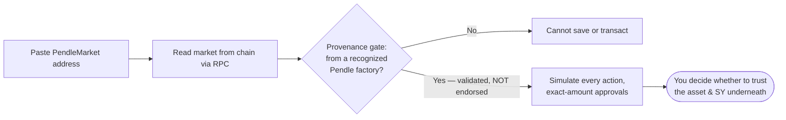

# Risks &amp; disclosures

This page mirrors the [About](https://openpendle.com/#/about) page inside the app and collects, in one place, everything you should understand before you save or transact against a pool. Read it in full. OpenPendle is a thin, honest window onto Pendle V2's permissionless markets — but a clear window onto a risky room is still a window onto a risky room, and most of the risk lives on the other side of the glass, in assets and contracts this interface neither wrote nor reviews.

::: danger Experimental — use at your own risk
OpenPendle is novel, unaudited software that talks to a permissionless protocol. **Community pools are unreviewed and can be created by anyone; interacting with them can lose you funds.** OpenPendle is **not affiliated with, endorsed by, or operated by Pendle Finance**. It validates a market's provenance but **cannot vouch for the assets or SY contracts underneath**. Nothing here is financial advice, and the software comes with no warranty of any kind.
:::

## The one thing to internalize

There is a gap between two very different statements, and almost every way you can be harmed lives inside it:

- **"This transaction will do what the interface says."** OpenPendle works hard to make this true — it simulates before you sign, scopes approvals to the exact amount, and gates markets by provenance.
- **"This asset is worth interacting with."** OpenPendle says **nothing** about this. It does not, and cannot, tell you whether the underlying asset is solvent, whether the [SY](/concepts/standardized-yield) wrapping it is honest, or whether the person who deployed the pool meant you well.

Everything below is an expansion of that gap. Only you can close it, and you close it by doing diligence on the asset and the SY — never by trusting that a pool loaded cleanly.

## What community pools are

A **community pool** (used interchangeably with **market**) is the on-chain `PendleMarket` contract that someone created permissionlessly on Pendle V2 — no whitelist, no approval, and reviewed by no one, including Pendle. Pendle V2 is a permissionless protocol: anyone with a wallet and seed capital can deploy a market for any compatible yield-bearing asset. Pendle's official app surfaces a curated, team-listed subset of those markets; everything beyond that subset is the long tail OpenPendle exists to reach.

OpenPendle loads any such market by its address and reads its state straight from the chain. There is no listing process and no curator here, by design. **A market being loadable is not an endorsement of it.** The [Community pools &amp; incentives](/concepts/community-pools) concept page covers what "permissionless and unreviewed" really means, and why native PENDLE gauge emissions and vePENDLE voting are reserved for team-listed markets while community pools rely on [Merkl](https://merkl.angle.money/) campaigns — if anyone funds one — for extra rewards.

::: warning Community pools are unreviewed
Community pools are permissionless and unreviewed — **anyone can create one, and interacting with them can lose you funds.** No one checked the asset. No one checked the SY. No one checked the person who deployed it. "Permissionless" is a statement about access, not about safety.
:::

## What OpenPendle checks — and what it cannot

OpenPendle's safeguards protect the *mechanics of transacting*. They do not, and cannot, vet the *quality of what you transact with*. Holding those two ideas apart is the whole of using this interface safely.

### What it checks

- **Provenance gate.** Before you can save a market or transact against it, OpenPendle verifies that the market was created by a **Pendle factory it recognizes**. Because Pendle's factories are governance-mutable, the currently active factory is resolved **live** at runtime; the hardcoded factory set is used only for this provenance validation. The check confirms the market genuinely descends from Pendle's deployment machinery — that it is a real Pendle market and not a look-alike contract wearing a Pendle market's shape.
- **Simulate before sign.** Every transaction is simulated against the live chain before you are asked to sign it, so a call that would revert is caught before you spend gas — and you see the expected outcome before committing funds.
- **Exact-amount approvals.** Token approvals are scoped to the precise amount the current action needs. OpenPendle never requests unlimited allowances, which limits what any contract can pull from your wallet to what that single transaction requires.

### What it cannot do

- **It cannot vouch for the underlying asset or the SY contract a pool wraps.** A factory-valid market can still wrap a malicious, broken, or exotic asset. Provenance answers "did this come from a Pendle factory?" — never "is this asset safe?", "is this SY honest?", or "is whoever deployed this trustworthy?"

That last point deserves emphasis, because it is where people get hurt.

::: danger Provenance is validation, not endorsement
The provenance gate proves a market descends from a Pendle factory. It does **not** prove the wrapped asset is solvent, the SY is well-behaved, or the pool is worth your money. A market can pass the gate cleanly and be built on an [SY](/concepts/standardized-yield) that is upgradeable, points at an unknown adapter, or is owned by a stranger — and if the asset beneath it is malicious, broken, or simply fails, the [PT](/concepts/principal-tokens) may **not** redeem at par and an [LP](/concepts/liquidity-and-amm) position can lose value. **Never interact with a community pool unless you trust whoever created it and everything beneath it — the asset, the SY, its adapter, and its owner.**
:::

The relationship between the two is easiest to see as a flow: the gate decides only whether you *may* proceed; whether you *should* is a judgment it hands entirely back to you.

For the full picture of where a community pool's risk concentrates — upgradeability, adapters, and the SY owner — read [Standardized Yield (SY)](/concepts/standardized-yield); almost every way a pool can harm you traces back to the SY and the asset it wraps.

## Where the risk actually lives

It helps to separate the risks OpenPendle can shrink from the risks it structurally cannot. The interface is honest about which is which.

| Risk | Who bears it | Can OpenPendle reduce it? |
| --- | --- | --- |
| A transaction reverts or behaves unexpectedly | You | **Yes** — simulate-before-sign catches it first |
| A contract pulls more tokens than intended | You | **Yes** — exact-amount approvals, no unlimited allowances |
| Interacting with a fake, look-alike "Pendle" market | You | **Yes** — the provenance gate blocks it |
| The underlying asset is malicious, broken, or exotic | You | **No** — outside OpenPendle's knowledge |
| The SY is upgradeable, adapter-driven, or stranger-owned | You | **No** — a per-market detail you must inspect |
| `PT` fails to redeem at par because the asset failed | You | **No** — a property of the asset, not the interface |
| Ordinary [AMM](/concepts/liquidity-and-amm) / impermanent-loss and PT-vs-SY exposure on an LP position | You | **No** — inherent to providing liquidity |
| Smart-contract risk in Pendle V2 itself | You | **No** — OpenPendle ships no contracts of its own |

Read the trust panel on each pool, inspect the asset and SY directly, and **never interact with one unless you trust whoever created it and the assets underneath.** The provenance gate has not, and will not, do that for you.

## Fees

OpenPendle charges **nothing** and adds **no fee of its own**. It is a gift to Pendle's community, and there is no OpenPendle cut layered on top of any action.

Pendle's own protocol fees still apply, exactly as they would through any other interface — the swap-fee cap, the YT interest fee, and so on. Those are charged and enforced by **Pendle's contracts**, not by this interface, and OpenPendle takes none of them. You can read the live, per-chain fee parameters on the app's [Protocol Status &amp; Contracts](https://openpendle.com/#/status) page, which resolves them from the chain in real time; the fixed entry-point addresses are also documented under [Networks &amp; contracts](/reference/networks-and-contracts).

::: info No fee of its own — what that does *not* mean
"No fee of its own" is a statement about OpenPendle, not about the cost of transacting. You still pay network gas, you still pay Pendle's protocol fees where they apply, and the price you get on any swap is whatever the [AMM](/concepts/liquidity-and-amm) quotes at that moment. OpenPendle simply adds nothing of its own on top.
:::

## Your data &amp; privacy

There is no backend, no database, no indexer, no accounts, no tracking, and no analytics. OpenPendle reads market state directly from the chain through public RPC endpoints; nothing about your browsing or your positions is sent to any server, because there is no server to send it to.

What stays local, and where:

| What | Where it lives | Leaves your browser? |
| --- | --- | --- |
| Saved pools | `localStorage` key `openpendle.pools.v1` | **Only** if you export or share |
| Active network choice | `localStorage` key `openpendle.chain` (default Arbitrum) | No |
| Custom RPC overrides | `localStorage` key `openpendle.rpc.<chainId>` | No |

The pools you remember live only in your browser's local storage, and any custom RPC you set stays local too. The **only** outbound requests are:

- the **blockchain RPCs you point at** (keyless public defaults per chain, wrapped in a fallback transport, overridable per chain in RPC settings); and
- for the **header stats ticker only**, Pendle metrics from the DefiLlama and CoinGecko public APIs.

Moving your saved pools between browsers or devices is explicit and under your control — Export to JSON, Import, or a shareable `?import=` link that encodes your registry. Nothing leaves the browser unless you take one of those actions. See [Saved pools &amp; privacy](/guides/saved-pools) for the full registry behavior.

::: info A privacy caveat worth stating
Reads still go to whatever RPC endpoint you are pointed at, and that endpoint can see the requests your browser makes to it — the addresses you look up, roughly when, and from your IP. That is a property of using any public RPC, not something unique to OpenPendle. If that matters to you, override the RPC per chain with an endpoint you trust, or run your own node. See [Self-hosting](/reference/self-hosting) for running the whole interface yourself.
:::

Two hardening choices reduce the interface's own attack surface, and are worth knowing about:

- **Content-Security-Policy.** `script-src 'self' 'wasm-unsafe-eval'` blocks JavaScript `eval()` and `Function`, while permitting WebAssembly (used for crypto). No remote script can be pulled or run.
- **Self-hosted fonts.** Fonts are bundled with the app; there are **zero** external font requests.

Wallet connections are **injected-only** — a direct connection to a browser wallet with **no WalletConnect and no third-party relay** — so there is no external wallet service in the path either. See [Connecting a wallet](/guides/connecting-a-wallet).

## Open source &amp; attribution

OpenPendle is released under **GPL-3.0-or-later**. It calls Pendle's already-deployed contracts with hand-written ABIs and **ships no smart contracts of its own** — there is no OpenPendle contract in the path of your funds. Because it is a static site with hash-based routing, anyone can build and host their own copy; hosting your own is the strongest guarantee that the interface cannot be changed out from under you. See [Self-hosting](/reference/self-hosting).

- **License:** GPL-3.0-or-later
- **Source:** [github.com/ggmatch-mod/open-pendle](https://github.com/ggmatch-mod/open-pendle)
- **Built by:** [ggmxbt](https://x.com/ggmxbt) — **not** affiliated with, endorsed by, or operated by Pendle Finance

Verify Pendle's own contracts against the canonical [`pendle-finance/pendle-core-v2-public`](https://github.com/pendle-finance/pendle-core-v2-public) repository, and cross-check the live per-chain set on the app's [Protocol Status &amp; Contracts](https://openpendle.com/#/status) page.

## Reporting a security issue

If you find a vulnerability in OpenPendle, please report it responsibly rather than disclosing it publicly first.

- **Contact:** [ggmxbt on X](https://x.com/ggmxbt).
- **Machine-readable details:** [`/.well-known/security.txt`](https://openpendle.com/.well-known/security.txt).

To scope your report: OpenPendle ships **no contracts of its own**, so a report here concerns the **interface** — the frontend, its build, its CSP, its request behavior, or its handling of transactions and approvals. Vulnerabilities in **Pendle V2's contracts** belong to Pendle Finance and its own disclosure channels, not here; OpenPendle only calls those contracts.

## See also

- [Community pools &amp; incentives](/concepts/community-pools) — what "permissionless and unreviewed" really means, in depth.
- [Standardized Yield (SY)](/concepts/standardized-yield) — where a community pool's real risk concentrates: upgradeability, adapters, and the owner.
- [How OpenPendle works](/reference/architecture) — the no-backend architecture, CSP, and security model in detail.
- [Networks &amp; contracts](/reference/networks-and-contracts) — the fixed entry points and where to read live per-chain data.
- [Saved pools &amp; privacy](/guides/saved-pools) — how the local registry behaves and what stays in your browser.
- [Self-hosting](/reference/self-hosting) — run your own copy so the interface can't change under you.
