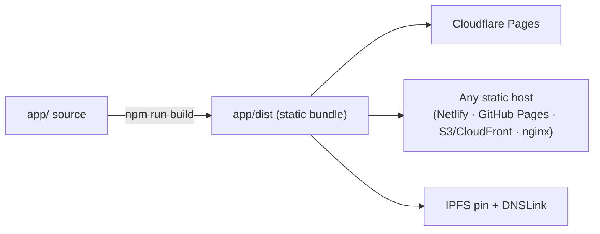

# Self-hosting

OpenPendle is a static single-page app with **hash-based routing** and no OpenPendle request-time application server, user database, or account system. Every build is a plain folder of files — including a versioned factory-market snapshot — that any web server, static host, or content-addressed network can serve as-is. There is no OpenPendle runtime or server process to keep alive behind the interface. The stock build includes Cloudflare Web Analytics, which self-hosters can remove. A separate scheduled job can regenerate the public catalog artifact; the browser still makes the public RPC and ancillary API requests documented below.

Running your own copy is also the strongest guarantee OpenPendle can offer. The hosted site at [openpendle.com](https://openpendle.com) is a convenience, not a dependency. Because the code is open-source under the [GPL-3.0-or-later](#license-and-what-openpendle-ships) license and the build is fully self-contained, you can clone it, read every line, build it yourself, and serve it from infrastructure you control — so the interface cannot be changed out from under you, taken down, or made to depend on any party but the chain and the RPC you point at.

::: info OpenPendle validates provenance, not the assets underneath
Self-hosting gives you a trustworthy copy of the *interface*. It does not make the pools you interact with safe. Community pools are permissionless and unreviewed — anyone can create one, and interacting with them can lose you funds. OpenPendle validates that a market was created by a Pendle factory it recognizes, but it cannot vouch for the assets or SY contracts underneath. Not affiliated with Pendle Finance. Experimental — use at your own risk. See [Risks & disclosures](/reference/risks).
:::

## Why self-host

There is no functional feature you unlock by self-hosting — the hosted app and a local build run identical code. What you gain is **independence and verifiability**:

- **Censorship resistance.** A copy you serve cannot be taken offline by anyone but you. If you host it on [IPFS](#ipfs-with-dnslink), it cannot be taken offline at all as long as the pin survives.
- **Provenance you can verify.** You build from source you have read, so you know the bytes your browser runs match the repository — not a modified bundle served to you.
- **No new request-time backend.** OpenPendle adds no application server or transaction relay to trust (see [How OpenPendle works](/reference/architecture)). Self-hosting removes even the hosted deployment from your trust surface. Core use still relies on the chain, your RPC, and your wallet; Explore also relies on the static snapshot included in your build, while ancillary features use the public data services listed below.
- **It runs anywhere.** Because routing is hash-based and the build is a static folder, "anywhere" genuinely means anywhere — a managed static host, a spare box, or a content-addressed pin.

The reason "anywhere" holds is the router. OpenPendle uses a **HashRouter**, so every route lives after the `#` in the URL (`openpendle.com/#/status`, `openpendle.com/#/about`, and so on). The server only ever serves one file — `index.html` — and the app resolves the route client-side from the fragment. A server never sees the part of the URL after `#`, so it never needs to know your routes, and you never need to configure SPA rewrite (history-fallback) rules. That single property is what lets the same unmodified `dist` folder work on a static host and on IPFS with no per-host configuration.

## Prerequisites

| Requirement | Detail |
| --- | --- |
| **Node.js 22** | Pinned via a committed `.node-version` file (contents: `22`) at both the repo root and in `app/`. Use Node 22 to match CI and the hosted build. |
| **A package manager** | `npm` ships with Node and is what the commands below assume. `pnpm` or `yarn` work too if you prefer. |
| **Git** | To clone the repository. You can also download a source tarball from GitHub if you would rather not use Git. |

That is the entire app build toolchain. There is no database to provision, no environment file to populate with secrets, and no API keys to obtain. Core market-by-address reads and transactions use public RPC; the bundled ancillary integrations are also keyless. A normal build includes the repository's current catalog snapshot. Running your own refresh job is optional and only needed if you want Explore to stay current independently of upstream releases.

## Clone, install, develop, build

The app lives in the **`app/`** folder of the repository. All build commands run from there.

```sh
# 1. Clone the repository
git clone https://github.com/ggmatch-mod/open-pendle.git
cd open-pendle/app

# 2. Install dependencies
npm install

# 3. Run a local dev server with hot reload
npm run dev

# 4. Produce a production build → app/dist
npm run build
```

What each step does:

- **`npm install`** — installs the dependencies listed in `app/package.json`. OpenPendle's runtime dependencies are a small, auditable set (React, `wagmi`/`viem` for chain access, RainbowKit for the injected-wallet connector, React Query, and React Router).
- **`npm run dev`** — starts the Vite dev server for local development with hot module reload. Use this while editing; it is not a production artifact.
- **`npm run build`** — runs `tsc -b && vite build`: type-checks the project, then emits the optimized production bundle to **`app/dist`**. This folder is the entire deployable — self-contained, static, and ready to serve.
- **`npm run preview`** *(optional)* — serves the built `app/dist` locally so you can sanity-check the production bundle before you deploy it.

::: tip The production build is just a folder
`app/dist` is a plain static bundle: `index.html`, hashed JS/CSS, self-hosted font files, icons, and `/catalog/factory-markets.v1.json`. There is nothing else to run alongside it — no Node process and no server code. If you can serve a folder of files over HTTP, you can host OpenPendle. Without a scheduled refresh, Explore remains usable but its bundled snapshot gradually becomes stale.
:::

### Refreshing the factory-market snapshot

The repository includes the snapshot used by ordinary builds, so this is optional. If you want your fork's directory to stay current independently, run the same deterministic catalog job before building:

```sh
cd open-pendle/app
npm run index:factory-markets
npm run check:factory-markets
npm run build
```

`index:factory-markets` scans the recognized factory lineage and writes `app/public/catalog/factory-markets.v1.json`; `check:factory-markets` validates the artifact without making network requests. For reliable full-history coverage, configure one archive/log-capable RPC URL per supported chain: `ETHEREUM_RPC_URL`, `BSC_RPC_URL`, `MONAD_RPC_URL`, `BASE_RPC_URL`, `PLASMA_RPC_URL`, and `ARBITRUM_RPC_URL`. An Etherscan-compatible indexed endpoint can be supplied as `<NETWORK>_LOG_API_URL`; this is particularly useful as `BSC_LOG_API_URL` and `MONAD_LOG_API_URL`, where public RPC history is tightly range-limited. The URL may already contain its `chainid` and `apikey` query parameters. Treat provider URLs containing credentials as secrets and configure them in your scheduler rather than committing them.

For the stock six-network job, the current free-first setup for the two public-endpoint gaps is:

- `BSC_RPC_URL=https://bsc-mainnet.nodereal.io/v1/<NODEREAL_API_KEY>` using a [NodeReal MegaNode](https://docs.nodereal.io/docs/pricing-plan) key. Its BSC `eth_getLogs` endpoint supports bounded historical ranges, which the generator scans adaptively.
- `MONAD_LOG_API_URL=https://api.etherscan.io/v2/api?chainid=143&apikey=<ETHERSCAN_API_KEY>` using an [Etherscan V2](https://docs.etherscan.io/getting-started) key. The generator supplies and validates `page`/`offset` itself, so do not rely on an endpoint's default page size.

These complete the initial backfill while the bundled public RPCs continue to handle ordinary current-state reads. A paid all-chain Etherscan plan can replace the BSC RPC with a `BSC_LOG_API_URL` using `chainid=56`, but it is not required when the NodeReal endpoint is available.

The upstream workflow runs daily. A self-host can use the same cadence, run less often, or publish a pinned snapshot and accept that newly created markets will require direct address loading until the next refresh. The publishing workflow refuses to replace a complete artifact with a partial scan. It keeps the last-known-complete snapshot instead, and the UI uses each chain's indexed block timestamp to warn once that retained artifact is stale. When running the generator manually, inspect its coverage and errors rather than publishing a partial result as complete.

### A note on asset paths and subpaths

By default the build references its assets from the site root (for example `/assets/…`), which is exactly right when you serve OpenPendle at the root of a domain or an IPFS gateway path that preserves it. If you intend to host it under a **sub-path** of a domain (for example `example.com/openpendle/`), set Vite's [`base`](https://vite.dev/config/shared-options.html#base) option to that sub-path before building so the asset URLs resolve. Serving at a domain root — the common case, and what [Cloudflare Pages](#cloudflare-pages) and [IPFS + DNSLink](#ipfs-with-dnslink) give you — needs no change.

## Deploy options

Everything below serves the **same** `app/dist` folder. The routing is hash-based, so **no host needs SPA rewrite rules**. Pick whichever fits your infrastructure.



### Cloudflare Pages

Cloudflare Pages is what the hosted [openpendle.com](https://openpendle.com) runs on. Point a Pages project at the repository and use these settings:

| Setting | Value |
| --- | --- |
| **Framework preset** | **None** |
| **Root directory** | **`app`** |
| **Build command** | **`npm run build`** |
| **Build output directory** | **`dist`** |
| **Node version** | Picked up from the committed `.node-version` (22) |

The root directory is `app` because the app is in the `app/` subfolder; the output directory is `dist` **relative to that root** (i.e. `app/dist`). Preset **None** is correct — OpenPendle is a plain static build and needs no framework-specific handling. Because routing is hash-based, you do **not** add any `_redirects` or history-fallback rule.

### Any static host

For Netlify, GitHub Pages, Amazon S3 + CloudFront, nginx, Caddy, or any other static host: **build locally and serve `app/dist`**. That is the whole deployment.

```sh
cd open-pendle/app
npm run build
# then upload / point the host at ./dist
```

Because the app resolves routes from the URL fragment, **no rewrite rules are required** — you do not need the usual "rewrite all paths to `/index.html`" SPA fallback, and a deep link like `…/#/status` resolves purely in the browser. A minimal nginx server block is just a static root:

```nginx
server {
    listen 80;
    server_name openpendle.example;
    root /var/www/openpendle/dist;   # your copy of app/dist
    index index.html;
    # No try_files rewrite needed — routing is hash-based.
}
```

::: tip Serve over HTTPS
A browser wallet injects its provider into pages served over a secure context. Host your copy over **HTTPS** (any static host and Cloudflare Pages give you this automatically) so wallet connection works; see [Connecting a wallet](/guides/connecting-a-wallet).
:::

### IPFS with DNSLink

Because the build uses no server routes and can be served from a domain root, `app/dist` pins to **IPFS** cleanly and loads from any gateway. This is the most censorship-resistant option: a content-addressed pin cannot be altered without changing its hash, and it stays reachable as long as the pin survives.

1. **Build**, then add the folder to IPFS to get a CID:

   ```sh
   cd open-pendle/app
   npm run build
   ipfs add -r dist
   ```

2. **Pin** the resulting CID (on your own node, or with a pinning service) so it stays available.
3. **Point a [DNSLink](https://docs.ipfs.tech/concepts/dnslink/) record** at the CID for a stable, human-readable name that you can update to new builds over time:

   ```
   _dnslink.openpendle.example.  TXT  "dnslink=/ipfs/<your-CID>"
   ```

A DNSLink name lets people reach your copy through any DNSLink-aware gateway while you retain the ability to publish new CIDs behind the same name. Nothing about IPFS hosting changes what the app does — it still reads the chain through the RPCs you point at.

## Why it is safe to self-host

Self-hosting does not weaken any of OpenPendle's safety properties, because those properties are enforced by the code you are building, not by the hosted deployment. A copy you build from source keeps all of them:

| Property | What it means for a self-hosted copy |
| --- | --- |
| **Strict Content-Security-Policy** | The app blocks JavaScript `eval()` and `Function()`, permits WebAssembly used for cryptography, and allowlists Cloudflare Web Analytics as its only remote script. Self-hosters can remove the beacon and its CSP source if they do not want analytics. |
| **Self-hosted fonts** | Fonts ship inside the bundle. There are **zero** external font requests — nothing is fetched from a font CDN, so a font provider cannot see or gate your users. |
| **Injected-only wallets** | OpenPendle talks directly to a browser wallet's injected EIP-6963 provider. There is **no WalletConnect and no third-party relay** in the connection path. See [Connecting a wallet](/guides/connecting-a-wallet). |
| **No OpenPendle request-time backend to trust** | There is no OpenPendle application server, user database, account system, or transaction relay. The stock static build includes Cloudflare Web Analytics. Core state is read from the chain via public RPC that **you** configure; the directory is a replaceable static artifact. |

The outbound requests a stock self-hosted copy makes are:

- **The blockchain RPCs you point it at** — keyless public defaults per chain (wrapped in a `viem` `fallback()` transport that rolls over to a backup automatically), or your own overrides. RPC overrides are stored locally under `openpendle.rpc.<chainId>` and never leave the browser. See [Networks & contracts](/reference/networks-and-contracts).
- **The header stats ticker** — aggregate Pendle metrics from **DefiLlama** and **CoinGecko** public APIs.
- **Explore and PT/YT pool resolution** — Explore downloads the same-origin factory-market snapshot and asks Pendle's public market API for listed enrichment. The snapshot provides the canonical PT/YT-to-pool mapping through its indexed head; Pendle and keyless **Blockscout** APIs provide live enrichment and bounded lookup fallbacks.
- **Merkl rewards** — when a connected user opens **My positions**, the app sends the wallet address and each supported chain ID to Merkl's public rewards API to retrieve claimable amounts and proofs.

None of those services sits between the wallet and a signed transaction. If you want a copy that makes no ancillary third-party API calls, you can keep the same-origin factory snapshot while disabling Pendle enrichment, the ticker, PT/YT pool resolution, and Merkl rewards in your fork; core market-by-address reads and Pendle transactions can remain RPC-only.

Two additional behaviors are inherent to the code and survive self-hosting unchanged: every transaction is **simulated against the live chain before you sign**, and token approvals **default to the exact amount**. Users may explicitly select Unlimited in transaction settings; that preference is stored locally and leaves a standing allowance until revoked, increasing exposure. None of this depends on where the interface is served from. The [provenance gate](/concepts/community-pools) — which verifies a market was created by a recognized Pendle factory before you can save or transact against it — likewise runs entirely client-side, resolving the active factory live at runtime and using the hardcoded factory set only for that validation.

::: warning Safe interface, unreviewed pools
Everything above is about the safety of the **interface**. It does not review the pools themselves. Community pools are permissionless and unreviewed; provenance validation confirms *who created* a market, not that its asset or SY is sound. A trustworthy self-hosted build interacting with a malicious pool can still lose you funds. Read [Risks & disclosures](/reference/risks) before transacting.
:::

## License and what OpenPendle ships

OpenPendle is licensed **GPL-3.0-or-later** (see the `LICENSE` file and `app/package.json` in the repository). You are free to run, study, modify, and redistribute it under that license's terms; derivative works you distribute must carry the same license.

Just as importantly, OpenPendle **ships no smart contracts of its own**. It is a frontend only — it calls **Pendle's** already-deployed contracts with hand-written ABIs and adds nothing on-chain. There are no OpenPendle contracts to audit, deploy, or trust; the on-chain trust surface is Pendle's, not OpenPendle's. Nothing about self-hosting changes this. OpenPendle also **takes no fee of its own** (Pendle's own protocol fees still apply) — it is a gift to Pendle's community.

Security reports go to [x.com/ggmxbt](https://x.com/ggmxbt); see `/.well-known/security.txt` in the app.

## The documentation site is a separate project

The site you are reading is **not** part of the app build. It is an independent **VitePress** project in the repository's **`docs-site/`** folder, with its own dependencies and its own scripts. Building the app does not build the docs, and vice versa. To work on the documentation:

```sh
cd open-pendle/docs-site
npm install
npm run docs:dev      # local docs dev server
npm run docs:build    # static docs build → docs-site/.vitepress/dist
```

Like the app, the docs site is deliberately kept **fully static and self-contained** — local search, no external services — to match OpenPendle's self-hostable posture. It is deployed as its own separate static project (the hosted docs build with root `docs-site`, build command `npm run docs:build`, and output `.vitepress/dist`), independent of the app deployment described above.

## See also

- [How OpenPendle works](/reference/architecture) — the backend-free architecture, HashRouter, CSP, and provenance gate you are self-hosting.
- [Networks & contracts](/reference/networks-and-contracts) — the six networks, the active-network setting, RPC defaults, and per-chain overrides your copy reads from.
- [Risks & disclosures](/reference/risks) — why a safe interface does not make an unreviewed pool safe.
- [Connecting a wallet](/guides/connecting-a-wallet) — injected-only wallet connection, and why HTTPS matters for a self-hosted copy.
- [Community pools & incentives](/concepts/community-pools) — the provenance validation your copy performs, and what "permissionless and unreviewed" means.
- [Protocol Status & Contracts](https://openpendle.com/#/status) — the live per-chain contract list, to verify against `pendle-finance/pendle-core-v2-public`.
